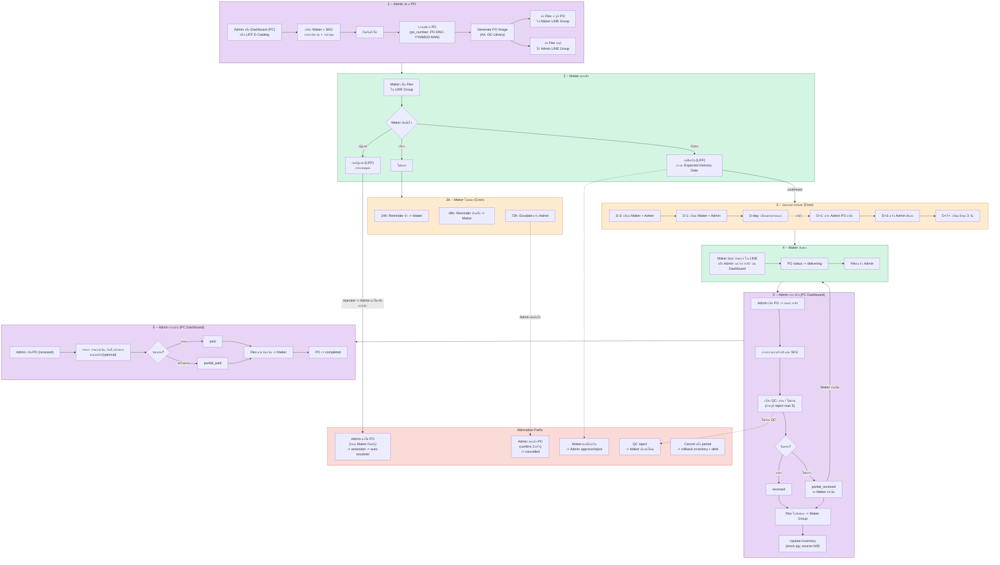
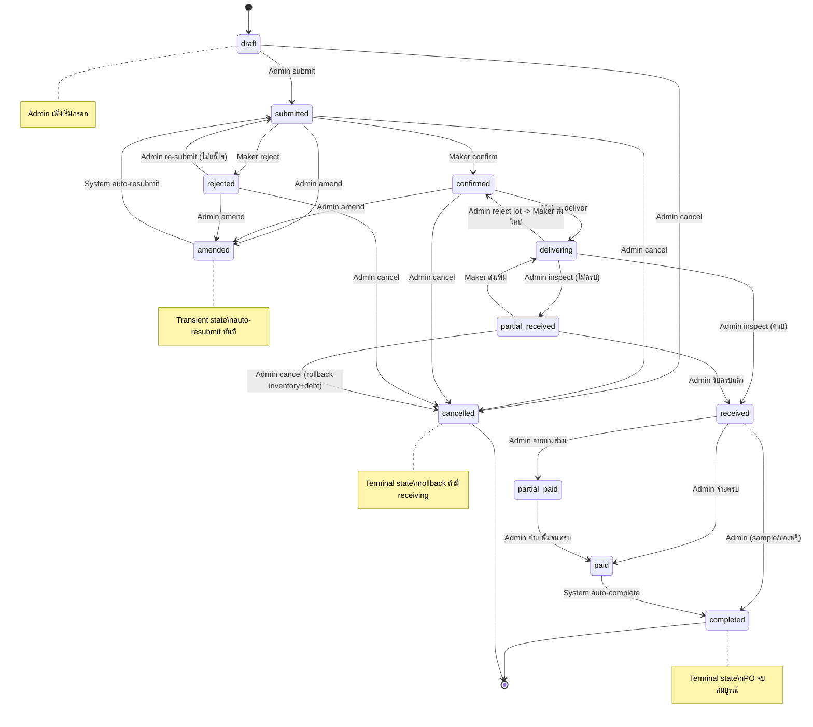
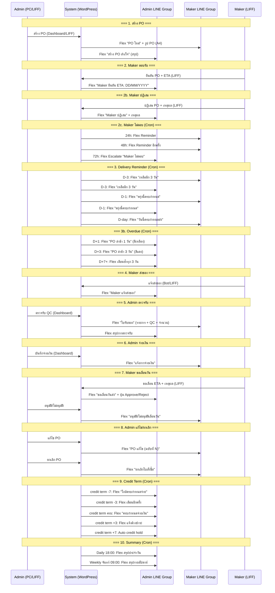

# B2F Workflow Diagrams -- DINOCO System

Version: 1.0 | Date: 2026-03-31 | Source: B2F-FEATURE-SPEC.md + Snippet 6 (FSM)

---

## 1. B2F Full Loop Flow (Main Workflow)

แสดง flow ทั้งหมดตั้งแต่ Admin สร้าง PO จนถึง completed รวม alternative paths ทุกเส้นทาง

### คำอธิบาย

B2F Full Loop Flow แสดงการทำงานตลอด lifecycle ของ Purchase Order:

1. **Admin สร้าง PO** -- ทำได้ทั้งบน PC (Admin Dashboard) และ LIFF (E-Catalog) ระบบ generate PO image (A4) แล้วส่ง Flex พร้อมรูปไปทั้ง Maker group และ Admin group
2. **Maker ตอบรับ** -- ยืนยัน (กรอก ETA ผ่าน LIFF), ปฏิเสธ (กรอกเหตุผล), หรือเงียบ (ระบบเตือนอัตโนมัติ 24h/48h/72h escalate)
3. **ติดตามการจัดส่ง** -- Cron เตือนตามกำหนด D-3, D-1, D-day แล้วแจ้ง overdue D+1, D+3, D+7+
4. **Maker ส่งของ** -- แจ้งผ่าน LINE Bot หรือ Admin กดบน Dashboard
5. **Admin ตรวจรับ** -- QC ต่อ SKU, partial delivery support, auto-update inventory
6. **Admin จ่ายเงิน** -- รองรับ partial payment, Flex แจ้ง Maker ทุกครั้ง

Alternative paths: แก้ไข PO (amended), ยกเลิก (cancelled), ขอเลื่อนวัน, QC reject, rollback หลัง partial cancel

---

## 2. FSM (Finite State Machine) Diagram

12 สถานะ + transitions + ระบุ actor (admin/maker/system) ทุกเส้น

### ตาราง Transition Rules

| From | To | Actor | เงื่อนไข |
|------|----|-------|---------|
| `draft` | `submitted` | Admin | Admin กดยืนยัน PO |
| `draft` | `cancelled` | Admin | Admin ยกเลิกก่อนส่ง |
| `submitted` | `confirmed` | Maker | Maker ยืนยัน + กรอก ETA |
| `submitted` | `rejected` | Maker | Maker ปฏิเสธ + เหตุผล |
| `submitted` | `amended` | Admin | Admin แก้ไข PO |
| `submitted` | `cancelled` | Admin | Admin ยกเลิก |
| `confirmed` | `delivering` | Maker | Maker แจ้งส่งของ |
| `confirmed` | `amended` | Admin | Admin แก้ไขหลัง confirm |
| `confirmed` | `cancelled` | Admin | Admin ยกเลิก |
| `amended` | `submitted` | System | Auto-resubmit ทันที (transient state) |
| `rejected` | `amended` | Admin | Admin แก้ไขแล้วส่งใหม่ |
| `rejected` | `cancelled` | Admin | Admin ยกเลิกหลังถูกปฏิเสธ |
| `rejected` | `submitted` | Admin | Admin re-submit โดยไม่แก้ไข |
| `delivering` | `received` | Admin | ตรวจรับครบ |
| `delivering` | `partial_received` | Admin | ตรวจรับไม่ครบ |
| `delivering` | `confirmed` | Admin | Reject ทั้ง lot -> Maker ส่งใหม่ |
| `partial_received` | `delivering` | Maker | Maker ส่งเพิ่ม |
| `partial_received` | `received` | Admin | รับครบแล้ว |
| `partial_received` | `cancelled` | Admin | Cancel + rollback inventory & debt |
| `received` | `paid` | Admin | จ่ายเงินครบ |
| `received` | `partial_paid` | Admin | จ่ายบางส่วน |
| `received` | `completed` | Admin | Sample/ของฟรี (is_sample=true) |
| `partial_paid` | `paid` | Admin | จ่ายเพิ่มจนครบ |
| `paid` | `completed` | System | Auto-complete |

**Terminal States:** `completed`, `cancelled`

---

## 3. Notification Flow

แสดงว่าใครได้รับ Flex message เมื่อไหร่ แยกตาม Maker Group vs Admin Group

### Notification Matrix

| Event | Trigger | Maker Group | Admin Group |
|-------|---------|:-----------:|:-----------:|
| สร้าง PO | Admin submit | Flex + รูป PO | Flex สรุป |
| Maker ยืนยัน | Maker confirm | -- | Flex (ETA) |
| Maker ปฏิเสธ | Maker reject | -- | Flex (เหตุผล) |
| Maker ไม่ตอบ 24h | Cron 09:30 | Flex Reminder | -- |
| Maker ไม่ตอบ 48h | Cron 09:30 | Flex Reminder | -- |
| Maker ไม่ตอบ 72h | Cron 09:30 | -- | Flex Escalate |
| เตือนจัดส่ง D-3 | Cron 08:30 | Flex เตือน | Flex เตือน |
| เตือนจัดส่ง D-1 | Cron 08:30 | Flex เตือน | Flex เตือน |
| เตือนจัดส่ง D-day | Cron 08:30 | Flex เตือน | -- |
| PO ล่าช้า D+1 | Cron 09:00 | -- | Flex (สีเหลือง) |
| PO ล่าช้า D+3 | Cron 09:00 | -- | Flex (สีแดง) |
| PO ล่าช้า D+7+ | Cron 09:00 | -- | Flex ซ้ำทุก 3 วัน |
| Maker แจ้งส่งของ | Maker action | -- | Flex |
| Maker ขอเลื่อนวัน | Maker action | -- | Flex + ปุ่ม approve/reject |
| Admin อนุมัติ/ปฏิเสธเลื่อน | Admin action | Flex ผลการพิจารณา | -- |
| Admin ตรวจรับ | Admin action | Flex ใบรับของ | Flex สรุป |
| Admin จ่ายเงิน | Admin action | Flex แจ้งจ่ายเงิน | -- |
| Admin แก้ไข PO | Admin action | Flex PO ฉบับแก้ไข | -- |
| Admin ยกเลิก PO | Admin action | Flex ยกเลิก | -- |
| Credit term ใกล้ครบ | Cron (Weekly) | -- | Flex เตือนจ่ายเงิน |
| Credit term เลย + hold | Cron (Weekly) | -- | Flex auto hold |
| สรุปประจำวัน | Cron 18:00 | -- | Flex Daily Summary |
| สรุปรายสัปดาห์ | Cron จันทร์ 09:00 | -- | Flex Weekly Summary |

---

## 4. Cron Jobs Schedule

แสดง cron ทั้งหมดของระบบ B2F พร้อมเวลา, ความถี่, และรายละเอียด

```mermaid
gantt
    title B2F Cron Jobs -- Daily Schedule (Asia/Bangkok)
    dateFormat HH:mm
    axisFormat %H:%M

    section Daily
    b2f_delivery_reminder (D-3, D-1, D-day)     :active, 08:30, 15m
    b2f_overdue_check (D+1, D+3, D+7+)          :crit, 09:00, 15m
    b2f_maker_noresponse (24h, 48h, 72h esc)     :09:30, 15m
    b2f_daily_summary                            :18:00, 15m

    section Weekly (จันทร์)
    b2f_payment_due_check (credit term)          :09:00, 15m
    b2f_weekly_summary                           :09:00, 15m

    section Monthly (วันที่ 1)
    b2f_monthly_summary + Maker performance      :09:00, 30m
```

### ตาราง Cron Schedule (รายละเอียด)

| เวลา | ความถี่ | Job Name | รายละเอียด | Query Filter | ส่งถึง |
|------|---------|----------|-----------|--------------|--------|
| **08:30** | Daily | `b2f_delivery_reminder` | เตือน PO ใกล้ ETA: D-3, D-1, D-day | `po_status IN (confirmed, delivering)` AND `po_expected_date` ใกล้ถึง | Maker + Admin |
| **09:00** | Daily | `b2f_overdue_check` | แจ้ง PO เลย ETA: D+1 (เหลือง), D+3 (แดง), D+7+ (ซ้ำทุก 3 วัน) | `po_status IN (confirmed, delivering)` AND `po_expected_date < today` | Admin |
| **09:30** | Daily | `b2f_maker_noresponse` | เตือน Maker ที่ไม่ตอบ: 24h reminder, 48h reminder, 72h escalate Admin | `po_status = submitted` AND `post_date` เกิน threshold | 24h/48h: Maker, 72h: Admin |
| **18:00** | Daily | `b2f_daily_summary` | สรุปประจำวัน: PO ใหม่, delivery วันนี้, overdue, payments | ทุก PO ที่ active | Admin |
| **09:00** | Weekly (จันทร์) | `b2f_payment_due_check` | ตรวจ PO ที่รับของแล้วยังไม่จ่ายเงิน, ใกล้/เลย credit term | `po_status IN (received, partial_paid)` AND credit term calculation | Admin |
| **09:00** | Weekly (จันทร์) | `b2f_weekly_summary` | สรุปรายสัปดาห์: PO ใหม่/ปิด, outstanding payments, Maker performance | Aggregate ทั้งสัปดาห์ | Admin |
| **09:00** | Monthly (วันที่ 1) | `b2f_monthly_summary` | สรุปรายเดือน: ยอดสั่งซื้อ, ต้นทุนรวม, Maker performance rating, overdue % | Aggregate ทั้งเดือน | Admin |

### Credit Term Reminder Timeline

| วัน | ระดับ | Action |
|-----|-------|--------|
| credit term **-7** วัน | Friendly | Flex เตือน Admin "ใกล้ครบกำหนดจ่ายเงิน Maker XXX" |
| credit term **-3** วัน | Official | Flex เตือนอีกครั้ง |
| credit term **ครบกำหนด** | Final | Flex "ครบกำหนดจ่ายเงิน" |
| credit term **+3** วัน | Overdue | Flex แจ้งค้างชำระ |
| credit term **+7** วัน | **Auto Hold** | `maker_credit_hold = true`, `reason = auto` -- block สร้าง PO ใหม่ |

### หมายเหตุเกี่ยวกับ Cron

- แยกเวลา cron (08:30, 09:00, 09:30) เพื่อกระจาย DB load ไม่ให้ spike พร้อมกัน
- แนะนำใช้ real system crontab (`wp-cron.php`) แทน WP pseudo-cron เพราะ reminder ต้อง reliable
- ทุก cron query filter เฉพาะ status + date range ที่เกี่ยวข้อง ไม่ scan ทุก PO
- ใช้ `po_last_reminder_sent` ป้องกันส่ง reminder ซ้ำในวันเดียวกัน
- Timezone: `Asia/Bangkok` (hardcoded ทั้งระบบ)

---

## สรุป Architecture ที่เกี่ยวข้อง

### ช่องทางทำงานแต่ละ Role

| Role | ช่องทาง | ทำอะไรได้ |
|------|---------|----------|
| **Admin** | PC Dashboard (shortcode tabs) | สร้าง PO, ตรวจรับ, จ่ายเงิน, แก้ไข/ยกเลิก, ดู credit |
| **Admin** | LIFF (E-Catalog) | สร้าง PO |
| **Admin** | LINE Bot (Admin Group) | สั่งโรงงาน, ดู PO, สรุปโรงงาน |
| **Maker** | LINE Bot (Maker Group) | @mention ดู PO, พิมพ์ "ส่งของ" |
| **Maker** | LIFF (Signed URL + JWT) | ยืนยัน/ปฏิเสธ PO, กรอก ETA, ขอเลื่อนวัน |
| **System** | Cron Jobs | Delivery reminder, overdue check, no-response escalate, summaries, credit check |

### Snippet Map

| Snippet | DB_ID | หน้าที่ |
|---------|-------|--------|
| Snippet 0 | 1160 | CPT & ACF Registration (5 CPTs + helpers) |
| Snippet 1 | 1163 | Core Utilities & Flex Builders (LINE push + 13 Flex templates) |
| Snippet 2 | 1165 | REST API (19+ endpoints `/b2f/v1/`) |
| Snippet 3 | 1164 | Webhook Handler & Bot Commands (Maker + Admin B2F commands) |
| Snippet 4 | 1167 | Maker LIFF Pages (`[b2f_maker_liff]` route `/b2f-maker/`) |
| Snippet 5 | 1166 | Admin Dashboard Tabs (Orders + Makers + Credit tabs) |
| Snippet 6 | 1161 | Order State Machine (`B2F_Order_FSM` class) |
| Snippet 7 | 1162 | Credit Transaction Manager (atomic `b2f_payable_add/subtract()`) |
