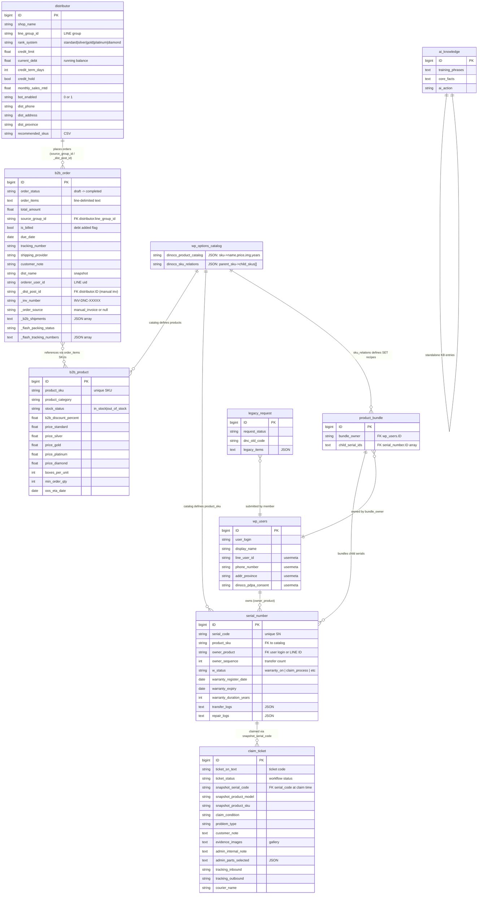

# DINOCO System Data Model

> Auto-generated: 2026-03-27 | Covers all 8 CPTs, wp_options shared state, and debt lifecycle

---

## 1. Entity-Relationship Diagram



---

## 2. Data Lifecycle per CPT

### 2.1 serial_number (Product Warranty Registration)

| Phase | Details |
|-------|---------|
| **Created by** | Admin via Inventory Dashboard (`gen_batch` action) or Legacy Migration |
| **Trigger** | Admin generates batch of SNs for a product SKU, or legacy import |
| **Initial state** | `w_status = warranty_available`, no owner, no expiry |
| **Activation** | Member scans QR / enters SN on Dashboard Header form. Sets `owner_product`, `warranty_register_date`, `warranty_expiry`, `w_status = warranty_on` |
| **Status transitions** | `warranty_available` -> `warranty_on` -> `claim_process` -> `repaired` / `refurbished` / `modified` / `void`. Also: `warranty_pending`, `old_warranty`, `stolen` |
| **Transfer** | Transfer Warranty page changes `owner_product`, increments `owner_sequence`, appends to `transfer_logs` |
| **Read by** | Member Dashboard (Assets List), Admin Inventory search, Admin Dashboard KPIs, Claim System (snapshot), AI module |
| **Deletion** | Never deleted. Terminal states: `void`, `stolen` |

### 2.2 claim_ticket (Warranty Claim / Service)

| Phase | Details |
|-------|---------|
| **Created by** | Member via Claim System page |
| **Trigger** | Member selects a registered SN, describes problem, uploads evidence photos |
| **Initial state** | `ticket_status = Awaiting Customer Shipment` (or `Registered in System` for walk-in) |
| **Data snapshot** | `snapshot_serial_code`, `snapshot_product_model`, `snapshot_product_sku` frozen at claim time |
| **Status workflow** | `Registered in System` -> `Awaiting Customer Shipment` -> `In Transit to Company` -> `Received at Company` -> `Under Maintenance` -> `Maintenance Completed` -> `Repaired Item Dispatched`. Alt paths: `Replacement Approved` -> `Replacement Shipped`, or `Replacement Rejected` |
| **Admin actions** | Admin updates status, adds internal notes, selects replacement parts, enters tracking codes (Service Center & Claims page) |
| **Read by** | Member Dashboard (claim status card), Admin Claims dashboard, Admin Dashboard (KPI: open claims), AI module |
| **Deletion** | Never deleted. Completed claims remain as service history |

### 2.3 b2b_order (B2B Orders + Manual Invoices)

| Phase | Details |
|-------|---------|
| **Created by** | Distributor via LIFF E-Catalog (`/place-order` API), or Admin via Manual Invoice System |
| **Trigger** | Distributor submits cart from LIFF, or Admin creates manual invoice for a distributor |
| **Initial state** | `order_status = draft` (LIFF), or `awaiting_payment` (manual invoice with `_order_source = manual_invoice`) |
| **Status workflow** | `draft` -> `checking_stock` -> `awaiting_confirm` -> `awaiting_payment` -> `paid` -> `packed` -> `shipped` -> `completed`. Branch: `backorder`, `cancel_requested` -> `cancelled`, `change_requested`, `claim_opened` -> `claim_resolved` |
| **Billing** | When admin confirms bill (`is_billed = true`), `current_debt` on distributor increases by `total_amount` |
| **Payment** | Slip via LINE (auto-verified by Slip2Go), LIFF upload, or admin manual entry. Reduces `current_debt`. Sets `_inv_paid_amount`, appends to `_inv_partial_payments` |
| **Shipping** | Flash Express (auto), self-ship, rider, self-pickup. Creates `_b2b_shipments` entries, sets Flash tracking meta |
| **Printing** | Invoice image generated (GD), picking list / label printed via RPi. `print_status` tracks queue state |
| **Read by** | Distributor (LIFF order history, ticket view), Admin Dashboard (order pipeline), Cron jobs (dunning, summary, delivery check) |
| **Deletion** | Never hard-deleted. `cancelled` is terminal. Audit log preserved in `_b2b_audit_log` |

### 2.4 distributor (B2B Distributor / Shop)

| Phase | Details |
|-------|---------|
| **Created by** | Admin via B2B Admin Control Panel |
| **Trigger** | Admin registers a new distributor shop |
| **Initial state** | `rank_system = standard`, `current_debt = 0`, `bot_enabled = 1`, `credit_hold = false` |
| **Changes over time** | `current_debt` changes with every invoice/payment/cancel (see Section 4). `rank_system` updated monthly by cron. `credit_hold` set by dunning cron when overdue. `monthly_sales_mtd` reset monthly |
| **Read by** | All B2B endpoints (auth, catalog pricing, order creation), Admin Control Panel, Cron jobs, Invoice system, Slip payment handler |
| **Deletion** | Never deleted. Can be effectively disabled by setting `bot_enabled = 0` |

### 2.5 b2b_product (B2B Product Catalog)

| Phase | Details |
|-------|---------|
| **Created by** | Admin via Inventory Dashboard (auto-created when saving product to `dinoco_product_catalog`), or B2B Admin Control Panel |
| **Trigger** | Admin adds/edits product in Global Inventory. If no matching `b2b_product` exists, one is auto-created with the same SKU |
| **Changes** | Pricing updated per rank tier. `stock_status` toggled by admin or OOS cron. `b2b_discount_percent` set via Discount Mapping page |
| **Read by** | LIFF Catalog API (pricing + stock), Place Order API (server-side price verification), Invoice Image Generator, Admin stock LIFF |
| **Deletion** | Rarely deleted. Products can be set to `out_of_stock` instead |

### 2.6 product_bundle (Product Bundle / SET)

| Phase | Details |
|-------|---------|
| **Created by** | System automatically when member registers a SET product (Dashboard Assets List) |
| **Trigger** | Member registers a parent SKU that has children in `dinoco_sku_relations`. System creates individual `serial_number` posts for each child, then wraps them in a `product_bundle` post |
| **Data** | `bundle_owner` = user ID, child references point to `serial_number` post IDs |
| **Read by** | Member Dashboard (shows bundle as grouped card), Transfer Warranty (transfers all children together) |
| **Deletion** | Never deleted |

### 2.7 legacy_request (Legacy System Migration)

| Phase | Details |
|-------|---------|
| **Created by** | Member via Legacy Migration form, or Admin via Legacy Migration Requests page |
| **Trigger** | Member has old DINOCO product with legacy code, requests migration to new warranty system |
| **Status workflow** | `pending` -> `approved` / `rejected`. On approval, system creates `serial_number` posts from legacy items |
| **Read by** | Admin Legacy Migration dashboard, Admin Dashboard (pending count) |
| **Deletion** | Never deleted |

### 2.8 ai_knowledge (AI Knowledge Base)

| Phase | Details |
|-------|---------|
| **Created by** | Admin via KB Trainer Bot page |
| **Trigger** | Admin creates Q&A pairs or fact entries for the AI chatbot |
| **Data** | `training_phrases` (example questions), `core_facts` (answers), `ai_action` (optional function call) |
| **Read by** | AI Control Module (Gemini function calling retrieves KB entries at inference time) |
| **Deletion** | Admin can delete outdated entries |

---

## 3. Shared Data Dependencies

### 3.1 dinoco_product_catalog (wp_options)

```
wp_options key: 'dinoco_product_catalog'
Format: { "SKU-001": { "name": "...", "sub": "...", "img": "url", "price": "1,290", "years": 2 }, ... }
```

| Consumer | Usage |
|----------|-------|
| **Global Inventory Database** | CRUD operations on catalog. Source of truth for product definitions |
| **B2B LIFF Catalog API** | Reads catalog for product names, images, base prices. Merges with `b2b_product` for rank-specific pricing |
| **B2B Place Order** | Server-side price lookup (never trusts client prices) |
| **B2B Invoice Image Generator** | Product names + prices for invoice rendering |
| **Member Dashboard** | Product names + images for registered serial display |
| **Legacy Migration** | SKU validation during migration |
| **Admin Dashboard** | Top products KPI enrichment |

### 3.2 dinoco_sku_relations (wp_options)

```
wp_options key: 'dinoco_sku_relations'
Format: { "SET-PARENT-SKU": ["CHILD-SKU-1", "CHILD-SKU-2", ...], ... }
```

| Consumer | Usage |
|----------|-------|
| **Global Inventory Database** | Manage parent-child SKU relationships |
| **B2B Admin Control Panel** | Save SET product children |
| **B2B LIFF Catalog API** | Show child products inside SET items, resolve children for box count calculation |
| **B2B Invoice Image Generator** | Expand SET items into child lines on invoice |
| **Member Dashboard** | Expand SET registration into individual child `serial_number` posts |
| **Legacy Migration** | Expand SET SKUs during legacy import |
| **B2B Core Utilities** | `b2b_calculate_total_boxes()` resolves SET -> children for shipping box count |

### 3.3 current_debt (distributor post meta)

```
Field: 'current_debt' on distributor CPT
Type: float (running balance in Baht)
```

| Modifier | Operation | Section Reference |
|----------|-----------|-------------------|
| **B2B Webhook: bill_confirm** | `+total_amount` | Snippet 2, line ~700 |
| **Manual Invoice: issue** | `+total_amount` | Manual Invoice, line ~1217 |
| **Slip payment (LINE)** | `-slip_amount` | Snippet 2, line ~2230 |
| **Manual Invoice: record payment** | `-payment_amount` | Manual Invoice, line ~1290 |
| **B2B Webhook: cancel approved** | `b2b_recalculate_debt()` (if `is_billed`) | Snippet 2, line ~787 |
| **B2B Webhook: cancel (admin direct)** | `b2b_recalculate_debt()` (if `is_billed`) | Snippet 2, line ~3055 |
| **Manual Invoice: cancel bill** | `-total_amount` (via `b2b_recalculate_debt` or direct) | Manual Invoice, line ~548 |
| **Manual Invoice: edit issued bill** | `+/- delta` (new_total - old_total) | Manual Invoice, line ~1141 |
| **B2B Webhook: claim refund** | `b2b_recalculate_debt()` | Snippet 2, line ~1652 |
| **Cron: dunning** | Read-only (checks for overdue, sets `credit_hold`) | Snippet 7 |
| **Cron: daily summary** | Read-only (aggregates outstanding debt) | Snippet 7 |

See full trace in Section 4 below.

### 3.4 is_billed (b2b_order post meta)

```
Field: 'is_billed' on b2b_order CPT
Type: boolean — whether this order's total has been added to distributor debt
```

This flag is the guard that prevents double-counting debt. Every debt reversal checks `is_billed` before subtracting.

| State | Meaning |
|-------|---------|
| `false` (default) | Order total NOT in distributor debt |
| `true` | Order total HAS BEEN added to distributor debt |
| `false` (after payment/cancel) | Debt was reversed, flag reset |

---

## 4. Debt Calculation Flow (current_debt)

### 4.1 Invoice Issued (debt increases)

```
Trigger: Admin confirms bill (B2B flow) or issues manual invoice
Guard:   credit_limit check — reject if (current_debt + total) > credit_limit

Steps:
  1. Read current_debt from distributor (with FOR UPDATE lock in B2B webhook)
  2. current_debt += total_amount
  3. Set is_billed = true on the order
  4. Set due_date = today + credit_term_days
  5. Audit log: 'invoice_issued'

Code paths:
  - B2B Webhook (Snippet 2): uses START TRANSACTION + FOR UPDATE (race-safe)
  - Manual Invoice System: uses direct get_field/update_field (single-threaded admin)
```

### 4.2 Slip Payment (debt decreases)

```
Trigger: Customer sends bank slip in LINE group chat
         OR uploads slip via LIFF ticket view
         OR admin records manual payment

Steps:
  1. Slip2Go API verifies the slip (QR code validation)
  2. Check for duplicate slip (trans_ref + md5 dedup key)
  3. Read current_debt from distributor
  4. current_debt -= verified_amount
  5. If current_debt <= 0, auto-mark ALL awaiting_payment orders as paid
  6. If amount matches a specific order (+/- 2%), auto-match to that order
  7. If amount does not match, send Flex card asking customer to select which bills to pay
  8. Update _inv_paid_amount on matched orders
  9. If _inv_paid_amount >= total_amount, mark order as 'paid' and set is_billed = false
  10. Audit log: 'invoice_paid' or 'partial_payment'

Code paths:
  - B2B Webhook (Snippet 2): slip handler, b2b_auto_mark_paid_after_slip()
  - Manual Invoice System: REST endpoint /record-payment
```

### 4.3 Order Cancelled (debt decreases, conditional)

```
Trigger: Admin approves cancel request, or admin directly cancels

Guard: Only reverses debt if is_billed = true AND total > 0

Steps:
  1. Check is_billed flag on the order
  2. If billed: current_debt -= total_amount
  3. Set is_billed = false
  4. Set order_status = 'cancelled'
  5. Cancel print job if queued
  6. Audit log: 'debt_reversed'

Code paths:
  - B2B Webhook (Snippet 2): postback action=approve_cancel, action=admin_cancel
  - Manual Invoice System: cancel_bill action
```

### 4.4 Edit Issued Invoice (debt adjusted by delta)

```
Trigger: Admin edits an already-issued invoice (changes total_amount)

Steps:
  1. Calculate delta = new_total - old_total
  2. If is_billed = true AND abs(delta) > 0.01:
     current_debt += delta  (positive = increase, negative = decrease)
  3. Update total_amount on the order
  4. Audit log: 'debt_adjusted'

Code path:
  - Manual Invoice System: edit-invoice endpoint
```

### 4.5 Claim Refund (debt decreases)

```
Trigger: Admin approves refund on a claim_opened order

Steps:
  1. Read total_amount from the order
  2. current_debt -= total_amount
  3. Set is_billed = false
  4. Set order_status = 'claim_resolved'
  5. Set claim_resolution = 'refund'

Code path:
  - B2B Webhook (Snippet 2): postback action=approve_refund
```

### 4.6 Debt Reconciliation Summary

```
current_debt = SUM(total_amount) for all orders WHERE:
  - source_group_id matches distributor's line_group_id
    OR _dist_post_id matches distributor's post ID
  - is_billed = true
  - order_status IN ('awaiting_payment')

The system has a b2b_recalculate_debt() function in Snippet 1 (Core Utilities)
that recalculates current_debt by summing all billed + awaiting_payment orders.
It is called via function_exists() guard from Manual Invoice cancel/payment flows.
Primary debt tracking still uses direct increment/decrement at each mutation point;
b2b_recalculate_debt() serves as a reconciliation safety net.
```

### 4.7 Concurrency Protection

| Context | Strategy |
|---------|----------|
| B2B Webhook (high-concurrency slip handler) | `START TRANSACTION` + `SELECT ... FOR UPDATE` on distributor's `current_debt` row |
| Manual Invoice (admin-only, low concurrency) | Direct `get_field` / `update_field` without transaction |
| All state-changing actions | Advisory locks via `set_transient('b2b_lock_' . $ticket_id, 1, 10)` |

---

## 5. Key Indexes and Query Patterns

### Most Common Meta Queries

| Query Pattern | Tables | Frequency |
|---------------|--------|-----------|
| Find distributor by `line_group_id` | `wp_postmeta` WHERE `meta_key = 'line_group_id'` | Every LINE webhook event |
| Find orders by `source_group_id` | `wp_postmeta` WHERE `meta_key = 'source_group_id'` | Every order list, slip match |
| Find serial by `serial_code` | `wp_postmeta` WHERE `meta_key = 'serial_code'` | Registration, claim, search |
| Find product by `product_sku` | `wp_postmeta` WHERE `meta_key = 'product_sku'` | Catalog, inventory, order |
| Filter orders by `order_status` | `wp_postmeta` WHERE `meta_key = 'order_status'` | Dashboard, cron jobs, history |
| Find user by `line_user_id` | `wp_usermeta` WHERE `meta_key = 'line_user_id'` | LINE Login callback |

### Recommended Indexes

```sql
-- High-frequency lookups on wp_postmeta
ALTER TABLE wp_postmeta ADD INDEX idx_meta_lookup (meta_key(40), meta_value(40));

-- User LINE ID lookup
ALTER TABLE wp_usermeta ADD INDEX idx_umeta_line (meta_key(20), meta_value(40));
```

---

## 6. Data Flow Diagram (Cross-System)

```
                        LINE Login
                            |
                            v
                      wp_users (member)
                       /          \
                      v            v
              serial_number    claim_ticket
              (warranty reg)   (service claim)
                    |               |
                    |    snapshot_serial_code
                    |               |
                    +-------+-------+
                            |
                    dinoco_product_catalog (wp_options)
                    dinoco_sku_relations   (wp_options)
                            |
              +-------------+-------------+
              |                           |
              v                           v
         b2b_product                 product_bundle
         (B2B pricing)               (SET grouping)
              |
              v
         b2b_order  <------>  distributor
         (order/invoice)      (shop + debt)
              |                     |
              |    current_debt     |
              +----  is_billed  ----+
              |
              v
         Flash Express / Shipping / Print
```
