# DINOCO System Diagrams -- Complete Reference

> Generated: 2026-03-27 | Based on: SYSTEM-ARCHITECTURE.md V.30.2 + actual code analysis

---

## Table of Contents

1. [System Architecture Overview](#1-system-architecture-overview)
2. [B2B Order State Machine](#2-b2b-order-state-machine)
3. [Slip Payment Flow](#3-slip-payment-flow)
4. [Shipping Flow](#4-shipping-flow)
5. [Warranty Lifecycle](#5-warranty-lifecycle)
6. [Claim Ticket Lifecycle](#6-claim-ticket-lifecycle)
7. [Invoice Lifecycle (Manual)](#7-invoice-lifecycle-manual)
8. [Bot Toggle Logic](#8-bot-toggle-logic)
9. [Authentication Flows](#9-authentication-flows)
10. [Data Flow Between Files](#10-data-flow-between-files)
11. [Cron Job Dependencies](#11-cron-job-dependencies)
12. [LINE Message Flow](#12-line-message-flow)

---

## 1. System Architecture Overview

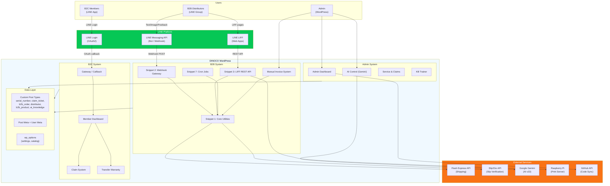

---

## 2. B2B Order State Machine

Every status transition with the actor/trigger that causes it.

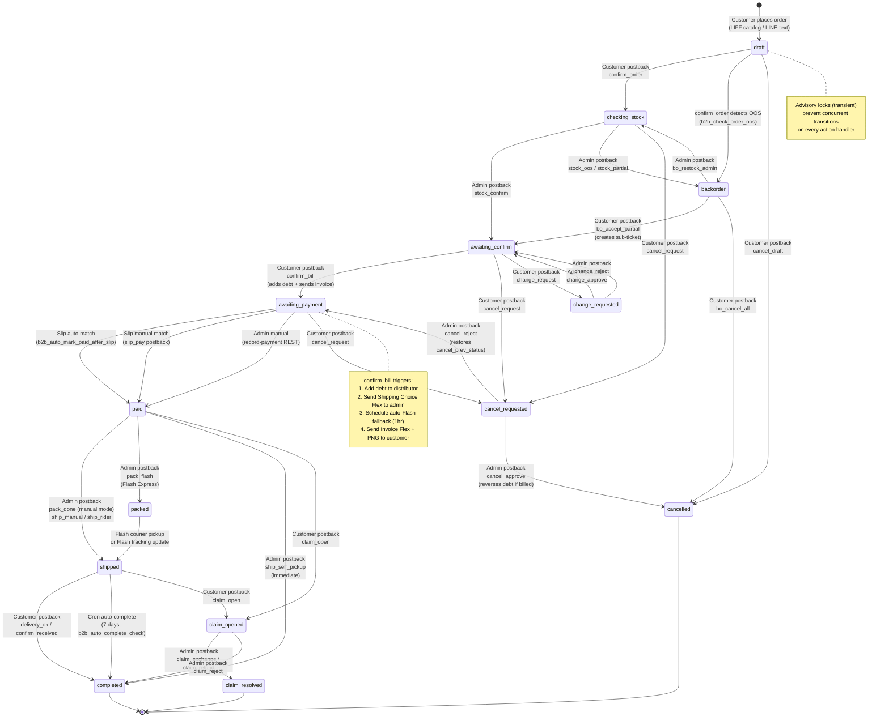

---

## 3. Slip Payment Flow

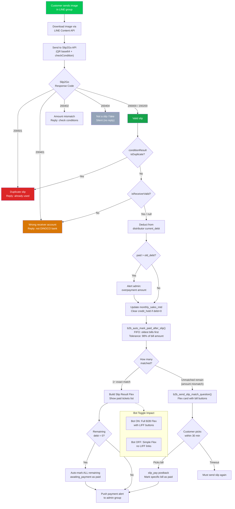

---

## 4. Shipping Flow

All 4 methods showing sub-steps and what status transitions occur.

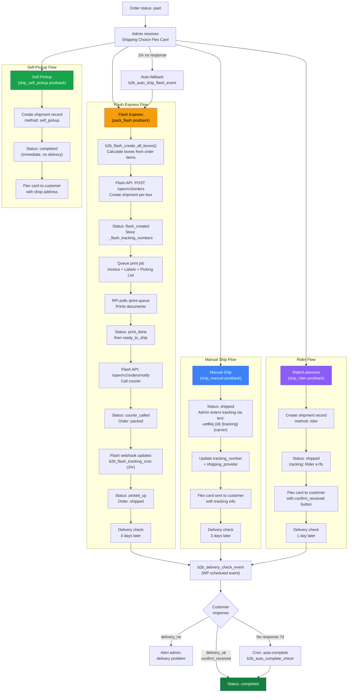

---

## 5. Warranty Lifecycle

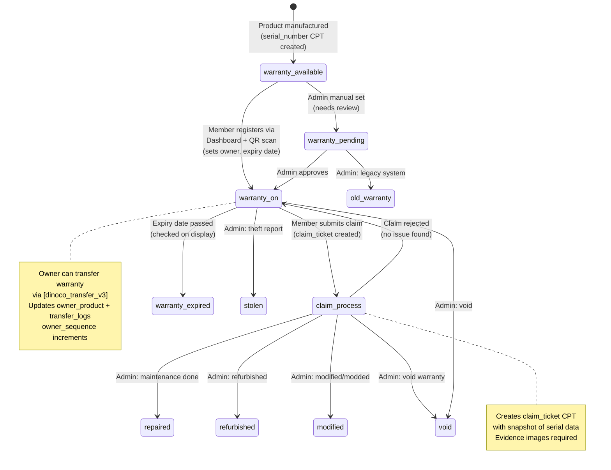

---

## 6. Claim Ticket Lifecycle

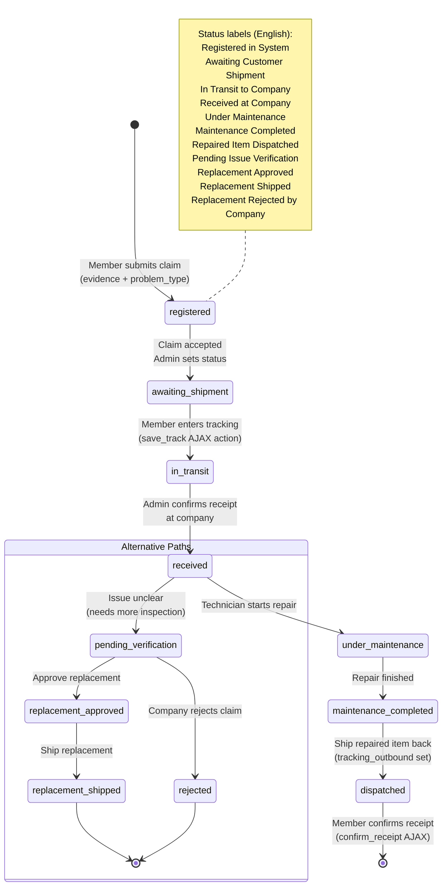

---

## 7. Invoice Lifecycle (Manual)

Manual Invoice System (`[Admin System] DINOCO Manual Invoice System`) operates independently from B2B orders but uses the same `b2b_order` CPT with `_order_source = manual_invoice`.

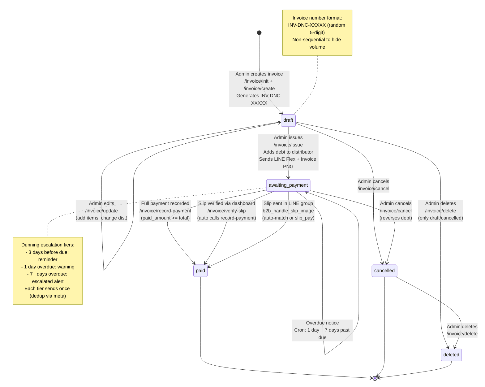

---

## 8. Bot Toggle Logic

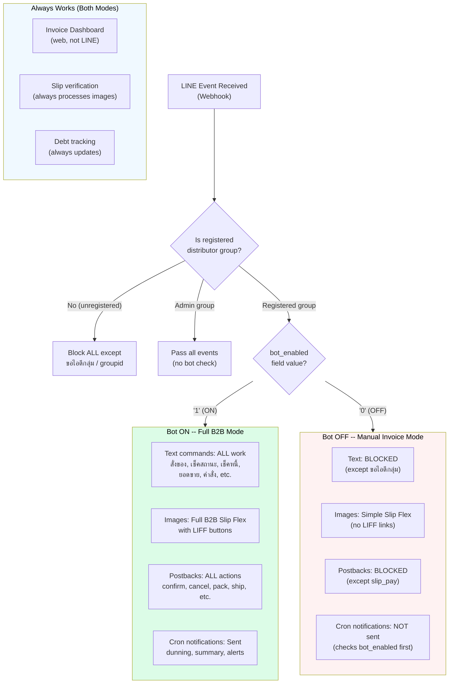

---

## 9. Authentication Flows

### 9a. LINE Login (B2C Members)

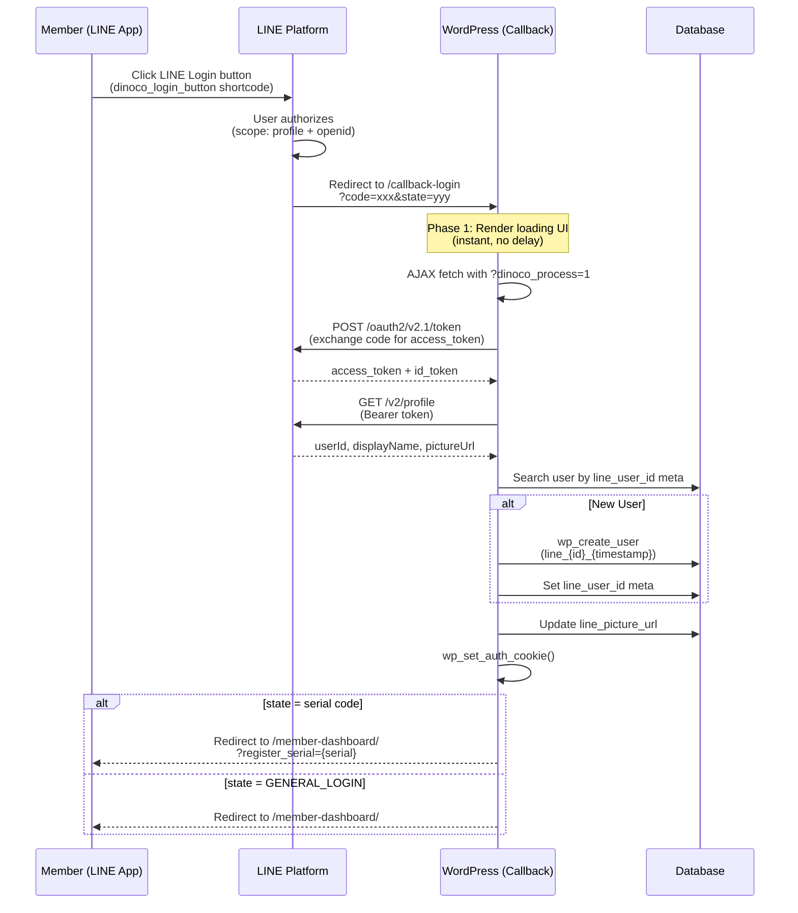

### 9b. LIFF Authentication (B2B)

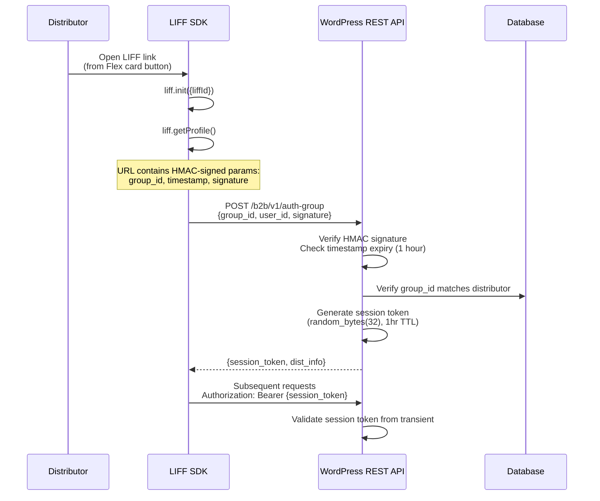

### 9c. Admin & Print Auth

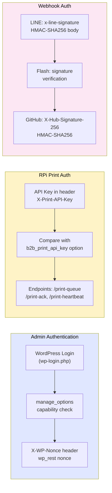

---

## 10. Data Flow Between Files

How the 34 code files communicate through WordPress hooks, REST, and shared data.

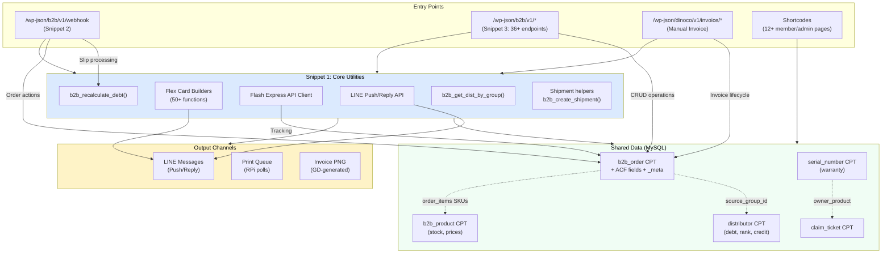

---

## 11. Cron Job Dependencies

```mermaid
flowchart TB
    subgraph DAILY["Daily Jobs"]
        D1["06:00 b2b_oos_expiry_check<br/>Clear expired OOS markers<br/>on b2b_product"]
        D2["09:00 b2b_dunning_cron_event<br/>Payment reminders (3-day)<br/>+ Overdue notices (1d/7d)<br/>+ Credit hold escalation"]
        D3["10:00 b2b_bo_overdue_check<br/>Backorder overdue alerts"]
        D4["11:00 b2b_auto_complete_check<br/>Auto-complete shipped orders<br/>older than 7 days"]
        D5["15:00 b2b_shipping_overdue_cron<br/>Shipping delay alerts<br/>for paid-but-not-shipped"]
        D6["17:30 b2b_daily_summary_cron<br/>Revenue summary to admin<br/>+ Slip queue cleanup"]
    end

    subgraph WEEKLY["Weekly Jobs"]
        W1["Sunday 17:30<br/>b2b_weekly_report_event<br/>Weekly summary report"]
    end

    subgraph MONTHLY["Monthly Jobs"]
        M1["1st of month<br/>b2b_rank_update_event<br/>Recalculate distributor ranks<br/>based on monthly_sales_mtd"]
    end

    subgraph FREQUENT["Frequent Jobs"]
        F1["Every 1 min<br/>b2b_flex_retry_cron<br/>Retry failed Flex pushes<br/>(from _pending_flex meta)"]
        F2["Every 5 min<br/>b2b_rpi_heartbeat_check<br/>RPi printer status check"]
        F3["Every 2 hrs<br/>b2b_flash_tracking_cron<br/>Sync Flash tracking status<br/>for all active shipments"]
    end

    subgraph ON_DEMAND["On-Demand (Scheduled per event)"]
        E1["b2b_auto_ship_flash_event<br/>1hr after bill confirm<br/>Auto-fallback to Flash"]
        E2["b2b_delivery_check_event<br/>1-3 days after ship<br/>Ask customer for confirmation"]
        E3["b2b_flash_courier_retry<br/>Retry failed Flash<br/>courier call (notify)"]
    end

    D1 -->|"Restocks products"| D3
    D2 -->|"Dunning affects"| DISTRIBUTOR_DEBT["distributor.current_debt<br/>distributor.credit_hold"]
    D4 -->|"Completes orders"| ORDER_STATUS["b2b_order.order_status"]
    M1 -->|"Updates rank"| RANK["distributor.rank_system<br/>Affects pricing"]

    F1 -->|"Retries"| LINE_PUSH["LINE Push API"]
    F3 -->|"Updates"| FLASH_STATUS["_flash_pno_statuses<br/>_flash_tracking_events"]

    E1 -->|"Creates Flash shipment"| FLASH_API["Flash Express API"]
    E2 -->|"Sends Flex"| LINE_PUSH

    %% Webhook as cron trigger
    WH_TRIGGER["LINE Webhook events<br/>trigger spawn_cron()"] -.->|"Ensures WP cron fires"| DAILY
    WH_TRIGGER -.-> FREQUENT

    style DAILY fill:#dbeafe,color:#000
    style FREQUENT fill:#fef3c7,color:#000
    style ON_DEMAND fill:#fce7f3,color:#000
```

---

## 12. LINE Message Flow

From webhook event to customer-facing Flex card.

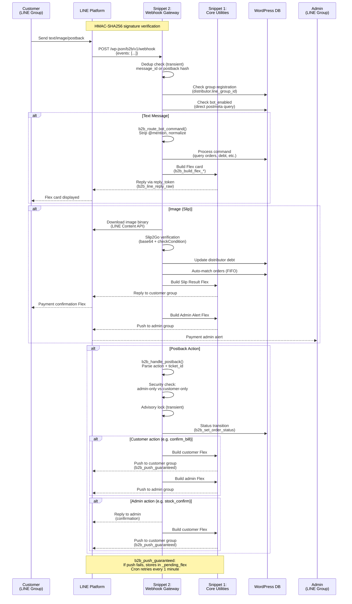

---

## Appendix: Status Color Legend

| System | Status | Color | Hex |
|--------|--------|-------|-----|
| B2B Order | draft | Gray | `#475569` |
| B2B Order | checking_stock | Gray | `#475569` |
| B2B Order | awaiting_confirm | Blue | `#2563eb` |
| B2B Order | awaiting_payment | Orange | `#ea580c` |
| B2B Order | paid | Green | `#16a34a` |
| B2B Order | packed | Purple | `#7b1fa2` |
| B2B Order | shipped | Blue | `#2563eb` |
| B2B Order | completed | Green | `#15803d` |
| B2B Order | backorder | Amber | `#d97706` |
| B2B Order | cancel_requested | Red | `#dc2626` |
| B2B Order | cancelled | Red | `#dc2626` |
| B2B Order | change_requested | Blue | `#2563eb` |
| B2B Order | claim_opened | Orange | `#ea580c` |
| B2B Order | claim_resolved | Green | `#16a34a` |
| Flash | flash_created | -- | `#475569` |
| Flash | print_queued | -- | `#475569` |
| Flash | ready_to_ship | -- | `#16a34a` |
| Flash | courier_called | -- | `#f59e0b` |
| Flash | picked_up | -- | `#f59e0b` |
