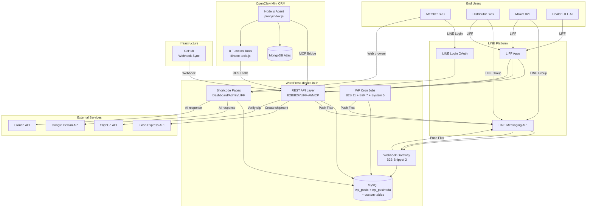
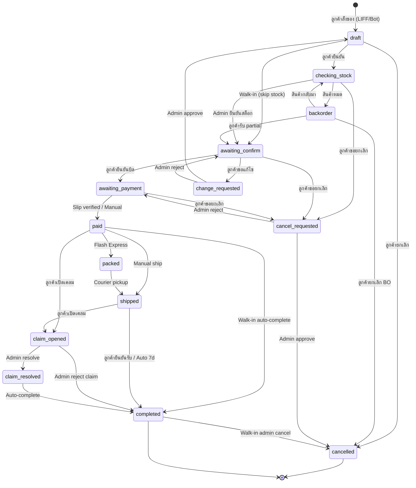
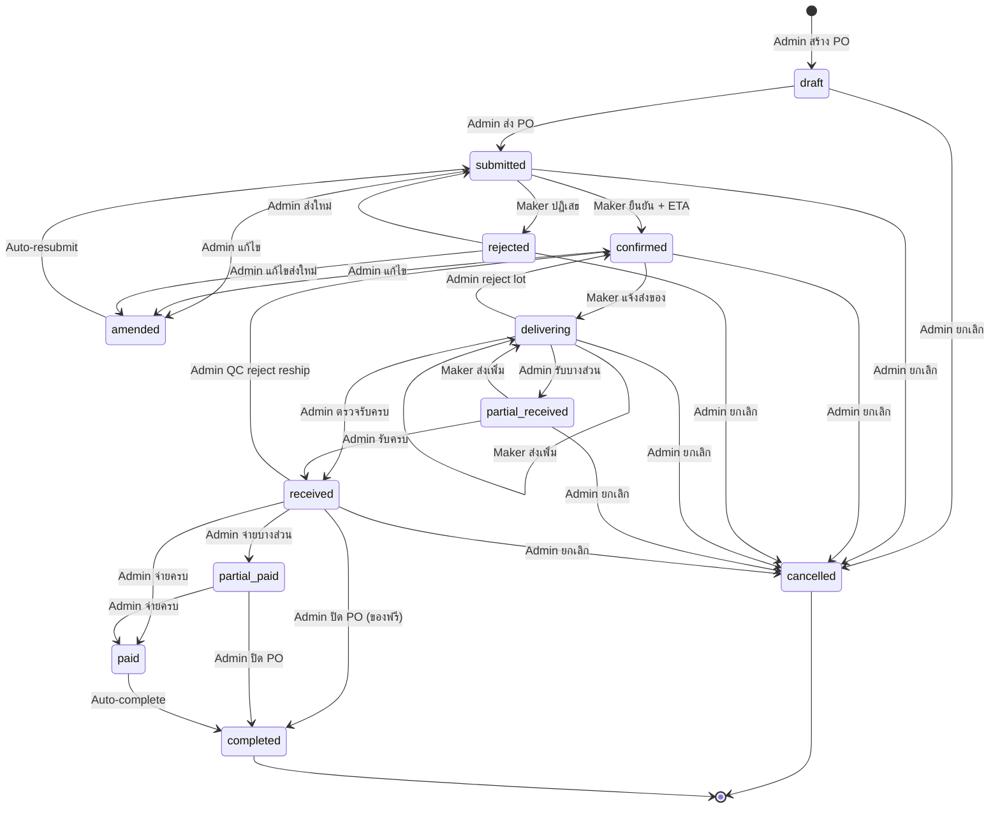
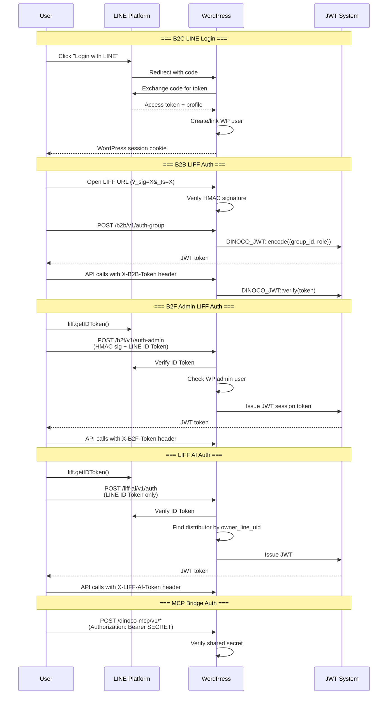
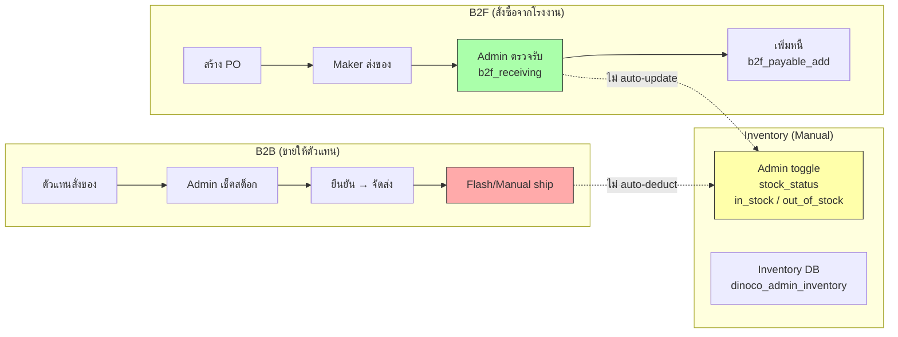
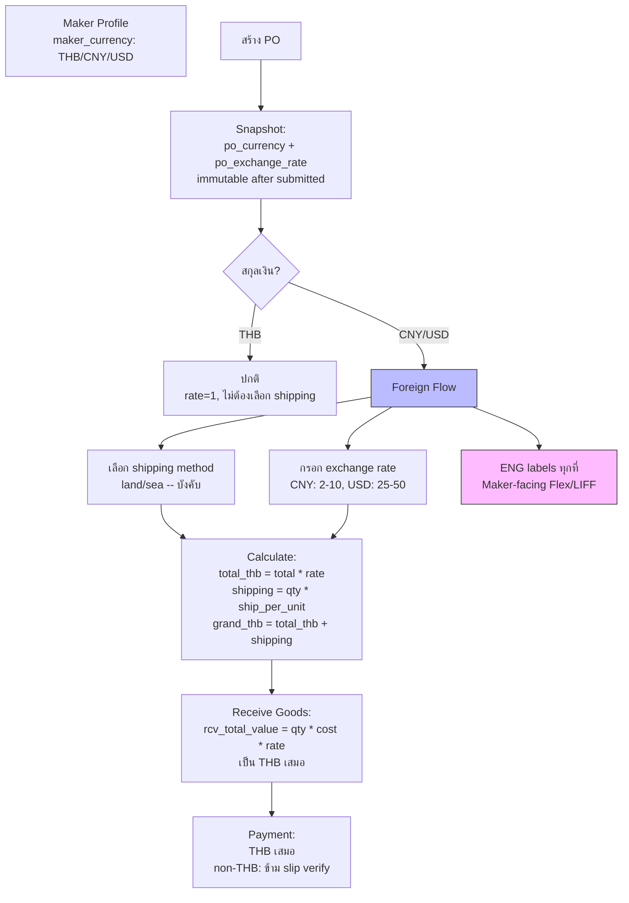
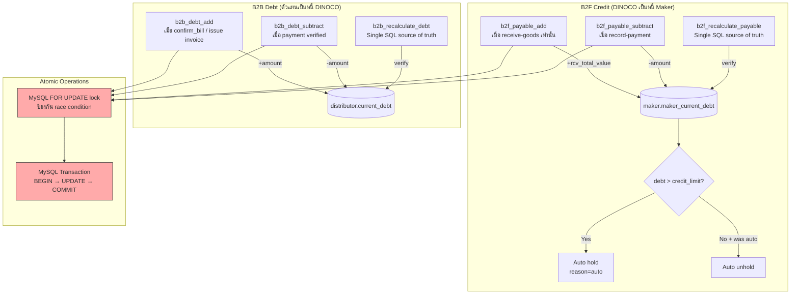
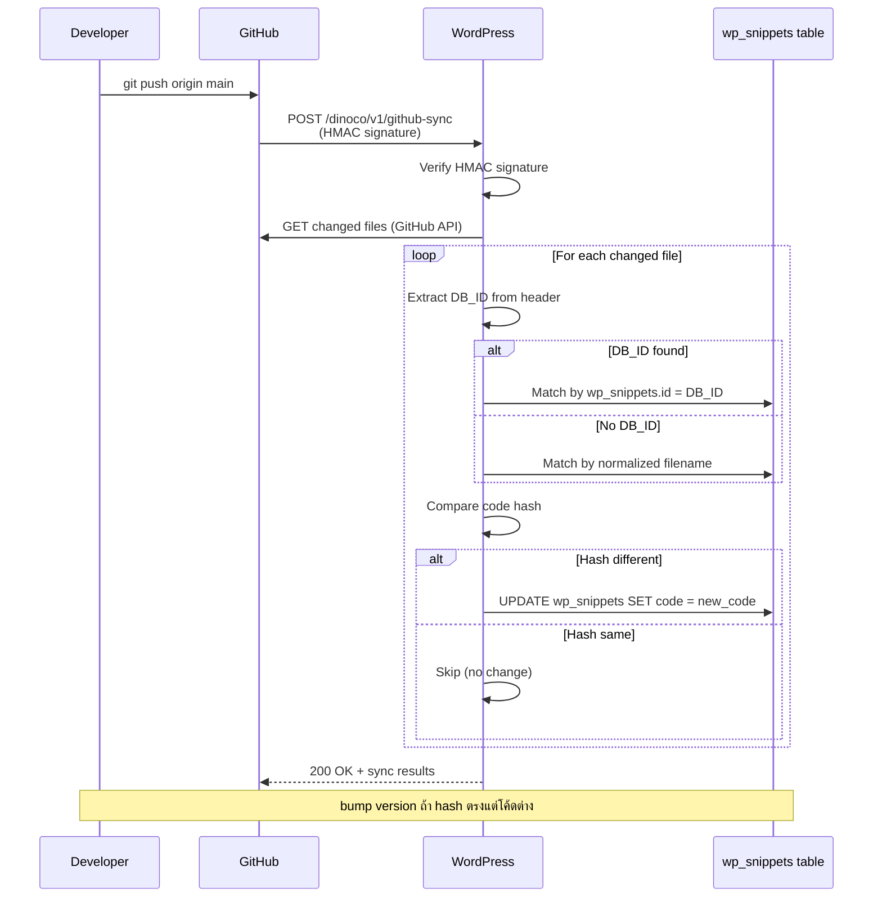

# DINOCO System Diagrams

> Updated: 2026-04-04 | Based on deep code review
> Mermaid format -- render with any Mermaid-compatible viewer

---

## 1. Overall System Architecture



---

## 2. B2B Order Flow



---

## 3. B2F PO Flow



---

## 4. Payment Flow (B2B + B2F)

```mermaid
graph TB
    subgraph "B2B Payment (Distributor -> DINOCO)"
        D1[ตัวแทนโอนเงิน]
        D2[ส่งรูปสลิปในกลุ่ม LINE]
        D3[Bot download รูป]
        D4{Slip2Go Verify}
        D5[Match ยอด ±2%]
        D6[b2b_debt_subtract]
        D7[Status: paid]
        D8[ส่ง Flex ใบเสร็จ]
        D9[แจ้ง Admin]
        DF[สลิปไม่ผ่าน → แจ้งลูกค้า]

        D1 --> D2 --> D3 --> D4
        D4 -->|ผ่าน| D5 --> D6 --> D7 --> D8 --> D9
        D4 -->|ไม่ผ่าน| DF
    end

    subgraph "B2F Payment (DINOCO -> Maker)"
        F1[Admin กดบันทึกจ่ายเงิน]
        F2[กรอกจำนวน + วิธี + สลิป]
        F3{สกุลเงิน?}
        F4[Slip2Go Verify]
        F5[Admin Approved ข้ามverify]
        F6[b2f_payable_subtract]
        F7[สร้าง b2f_payment record]
        F8[อัพเดท po_paid_amount]
        F9{จ่ายครบ?}
        F10[paid → completed]
        F11[partial_paid]

        F1 --> F2 --> F3
        F3 -->|THB| F4 --> F6
        F3 -->|CNY/USD| F5 --> F6
        F6 --> F7 --> F8 --> F9
        F9 -->|ครบ| F10
        F9 -->|ไม่ครบ| F11
    end
```



---

## 5. LINE Bot Routing

```mermaid
graph TB
    LINE[LINE Webhook POST<br>/b2b/v1/webhook]
    PARSE[Parse Event<br>B2B Snippet 2]

    PARSE -->|Check group_id| ROUTE{Group Routing}

    ROUTE -->|match distributor.group_id| B2B_HANDLER[B2B Handler<br>Snippet 2]
    ROUTE -->|match b2f_maker.maker_line_group_id| B2F_HANDLER[B2F Handler<br>Snippet 3]
    ROUTE -->|match B2B_ADMIN_GROUP_ID| ADMIN_HANDLER[Admin Handler<br>Snippet 2 + 3]
    ROUTE -->|DM 1:1| DM_HANDLER[DM Handler<br>Snippet 2]

    B2B_HANDLER --> B2B_CMD{Command?}
    B2B_CMD -->|@mention / text| B2B_FLEX[Customer Flex Menu]
    B2B_CMD -->|postback| B2B_ACTION[Order Actions]
    B2B_CMD -->|image| B2B_SLIP[Slip Verify]

    B2F_HANDLER --> B2F_CMD{Command?}
    B2F_CMD -->|@mention / text| B2F_FLEX[Maker Flex Menu<br>ENG if non-THB]
    B2F_CMD -->|ส่งของ/Deliver| B2F_DELIVER[LIFF Deliver]
    B2F_CMD -->|image| B2F_SLIP[Slip Match PO]

    ADMIN_HANDLER --> ADMIN_CMD{Command?}
    ADMIN_CMD -->|@mention| ADMIN_FLEX[Carousel 3 หน้า<br>B2B + B2F + Utilities]
    ADMIN_CMD -->|B2B keywords| B2B_ADMIN[B2B Admin Actions]
    ADMIN_CMD -->|B2F keywords| B2F_ADMIN[B2F Admin Actions]

    style ROUTE fill:#f9f,stroke:#333
    style B2F_FLEX fill:#bbf,stroke:#333
```

---

## 6. Authentication Flows



---

## 7. Data Flow (Inventory-Related)



**Note:** เส้นประ (-.->)  หมายถึง connection ที่ยังไม่ได้ implement. ระบบ inventory ปัจจุบันเป็น manual toggle ไม่มี auto stock quantity tracking.

---

## 8. B2F Multi-Currency Flow



---

## 9. Debt/Credit System



---

## 10. GitHub Sync Flow


