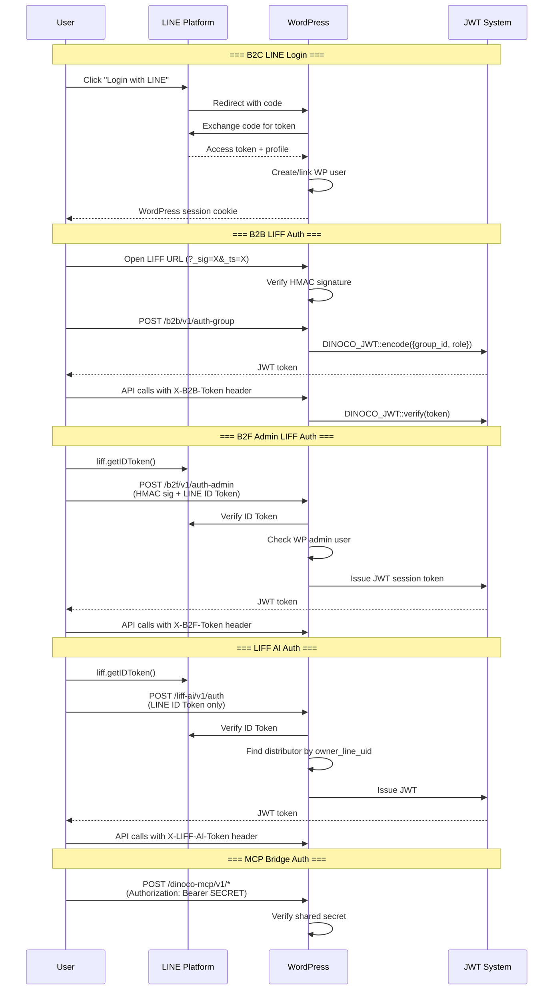
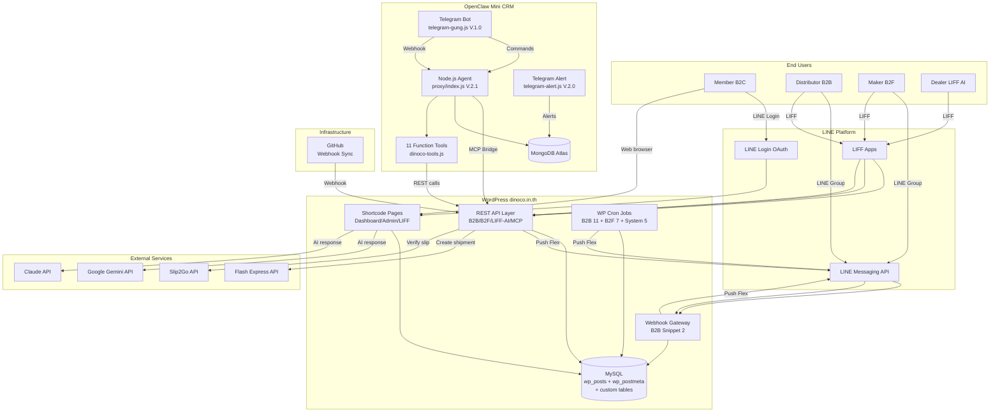
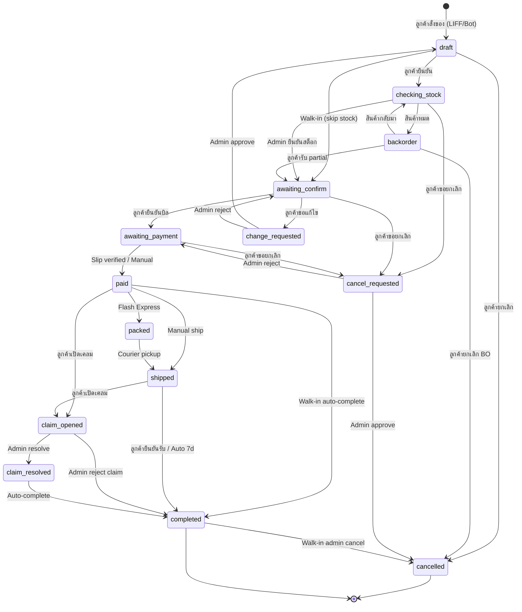
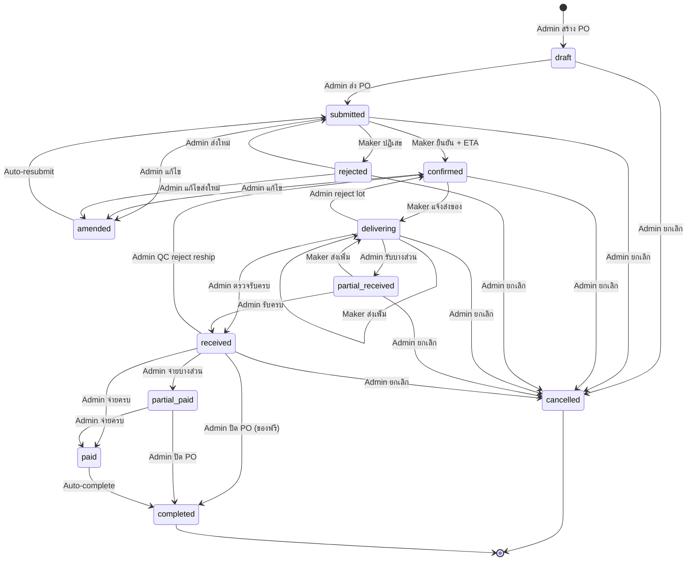
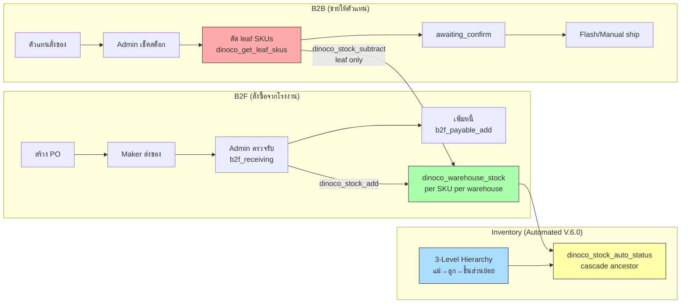
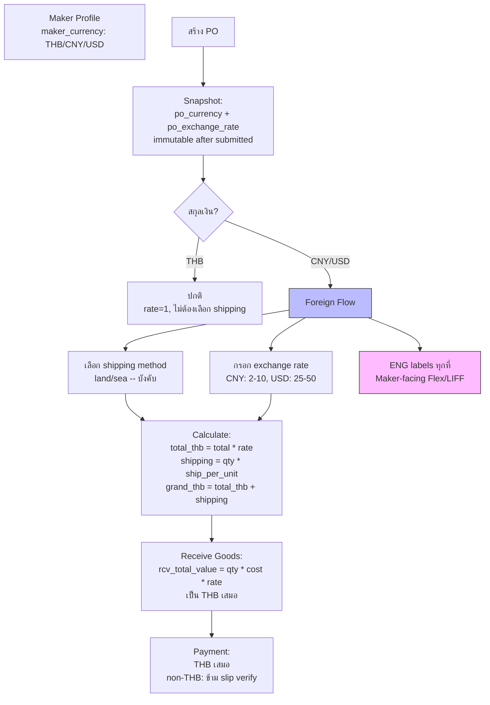
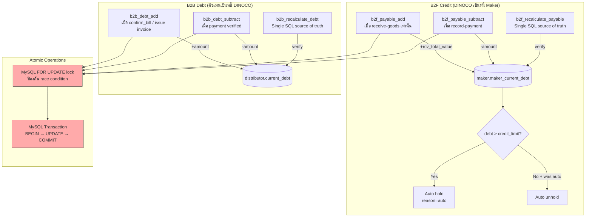
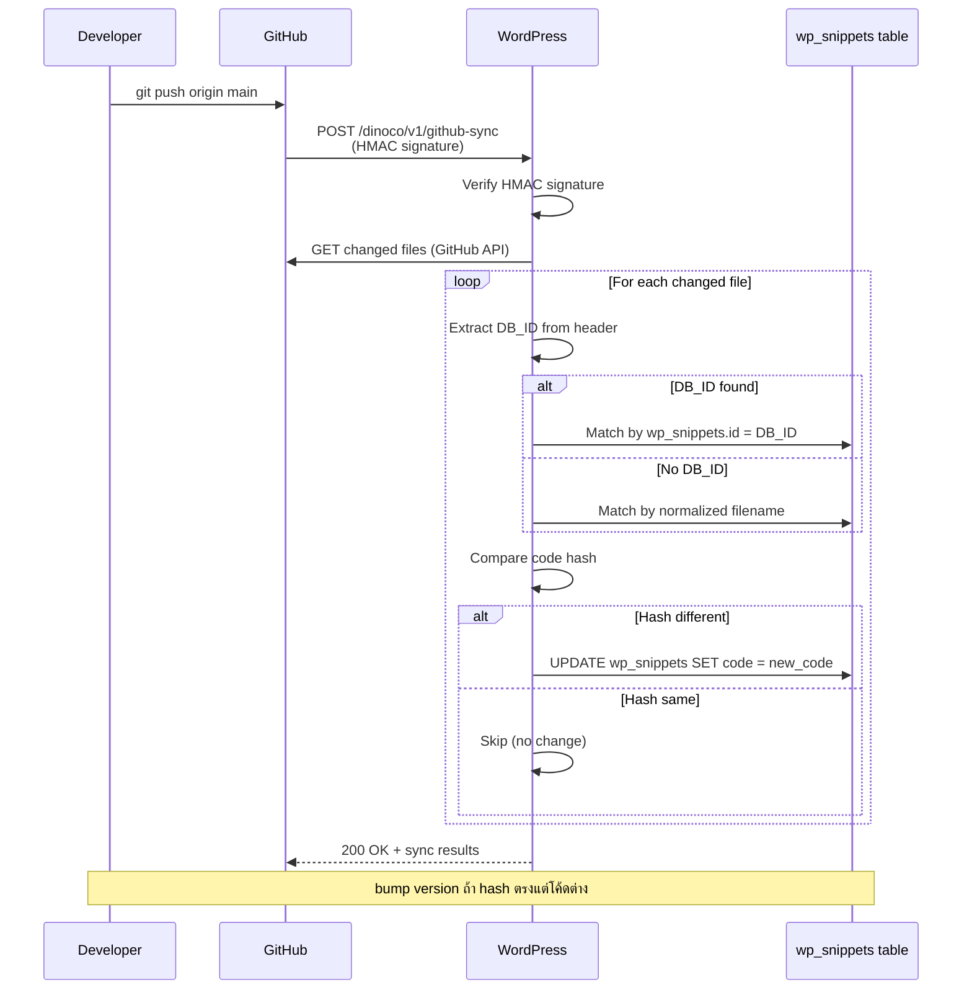

# DINOCO System Reference -- Complete Wiki

> Last updated: 2026-04-09 | Version: V.41.0 | 40+ files, ~55,000 lines
> Consolidated from: SYSTEM-ARCHITECTURE.md, DATA-MODEL.md, SYSTEM-DIAGRAMS.md, USER-JOURNEYS.md

---

## Table of Contents

1. [Technology Stack + Server Architecture](#1-technology-stack--server-architecture)
2. [Module Map (All Snippets)](#2-module-map--all-snippets)
3. [REST API Endpoints (Complete)](#3-rest-api-endpoints--complete)
4. [Authentication Flows](#4-authentication-flows)
5. [Data Model](#5-data-model)
6. [FSM Statuses (B2B + B2F)](#6-fsm-statuses-b2b--b2f)
7. [System Diagrams (Mermaid)](#7-system-diagrams-mermaid)
8. [User Journeys by Role](#8-user-journeys-by-role)
9. [LIFF URL Map (Complete)](#9-liff-url-map--complete)
10. [Integration Points + Required Constants + Kill Switches](#10-integration-points--required-constants--kill-switches)
11. [Deployment + Cross-Module Dependencies](#11-deployment--cross-module-dependencies)

---

## 1. Technology Stack + Server Architecture

### 1.1 Technology Stack

| Layer | Technology | Details |
|-------|-----------|---------|
| **CMS / Backend** | WordPress 6.x | PHP 8.x, Code Snippets plugin (wp_snippets table) |
| **Database** | MySQL (MariaDB) | InnoDB, ACF fields stored in wp_postmeta |
| **Frontend** | Vanilla HTML/CSS/JS | Inline in PHP files, no build step, no framework |
| **Mobile UI** | LINE LIFF (LINE Front-end Framework) | SPA-like pages inside LINE app |
| **Authentication** | LINE Login OAuth2 | Creates/links WP users |
| **AI (WordPress)** | Google Gemini API + Claude API | Function calling (v22.0), AI Provider Abstraction Layer |
| **AI (Chatbot)** | OpenClaw Mini CRM | Node.js + Express, Gemini Flash + Claude Sonnet, MongoDB Atlas |
| **Messaging** | LINE Messaging API | Flex Messages, Push/Reply, Rich Menu |
| **Shipping** | Flash Express API | Create order, print label, track, notify courier |
| **Payment Verify** | Slip2Go API | Bank slip OCR verification |
| **PDF** | PHP GD Library | Invoice/PO images as PNG (A4 format) |
| **Deployment** | GitHub Webhook Sync | Push to main -> auto-sync to WordPress wp_snippets |
| **Timezone** | Asia/Bangkok (ICT) | Hardcoded throughout |
| **Language** | Thai (UI), English (technical) | B2F foreign makers use ENG labels |

### 1.2 Server Architecture

```
                    +-------------------+
                    |   LINE Platform   |
                    | (Messaging API)   |
                    +--------+----------+
                             |
                    Webhook POST /b2b/v1/webhook
                             |
                    +--------v----------+
                    |   WordPress       |
                    |   (dinoco.in.th)  |
                    |                   |
                    |  Code Snippets    |
                    |  (40+ modules)    |
                    |                   |
                    |  REST API:        |
                    |  /b2b/v1/*        |
                    |  /b2f/v1/*        |
                    |  /liff-ai/v1/*    |
                    |  /dinoco-mcp/v1/* |
                    |  /dinoco/v1/*     |
                    |  /dinoco-inv/v1/* |
                    +---+------+-------+
                        |      |
              +---------+      +----------+
              |                           |
    +---------v--------+       +----------v---------+
    | Flash Express    |       | OpenClaw Mini CRM  |
    | (Shipping API)   |       | (Node.js Agent)    |
    +------------------+       |                    |
                               | Gemini + Claude    |
    +------------------+       | MongoDB Atlas      |
    | Slip2Go          |       +--------------------+
    | (Payment Verify) |
    +------------------+       +--------------------+
                               | GitHub             |
    +------------------+       | (Webhook Sync)     |
    | Google Gemini    |       +--------------------+
    | (AI Control)     |
    +------------------+
```

---

## 2. Module Map -- All Snippets

### 2.1 [System] -- Member-Facing (B2C)

| File | Version | DB_ID | Shortcode | Description |
|------|---------|-------|-----------|-------------|
| [System] DINOCO Gateway | V.30.2 | 9 | `[dinoco_login_button]` | LINE Login card UI |
| [System] LINE Callback | V.30.3 | 10 | `[dinoco_gateway]` | OAuth callback + warranty registration + login_error UI |
| [System] Member Dashboard Main | V.30.2 | 11 | `[dinoco_dashboard]` | Main controller, routing, rate limiting |
| [System] author profile line | V.30.3 | 12 | -- | LINE profile picture (WP default avatar fallback) |
| [System] Dinoco Custom Header | V.30.2 | 13 | -- | Hide admin bar for non-admin users |
| [System] Transfer Warranty Page | V.30.2 | 15 | `[dinoco_transfer_sys]` / `[dinoco_transfer_v3]` | Warranty ownership transfer |
| [System] DINOCO Claim System | V.30.2 | 16 | `[dinoco_claim_page]` | Claim submission + PDF generation |
| [System] DINOCO Global App Menu | V.31.1 | 17 | -- | Bottom navigation bar (native app style) |
| [System] DINOCO Edit Profile | V.34.3 | 18 | `[dinoco_edit_profile]` | User profile edit (Facebook-style view/edit toggle) |
| [System] Legacy Migration Logic | V.30.2 | 19 | `[dinoco_legacy_migration]` | Legacy warranty migration (admin-ajax) |
| [System] Dashboard - Header & Forms | V.30.3 | 28 | `[dinoco_dashboard_header]` | Sidebar, profile card, PDPA, registration forms |
| [System] Dashboard - Assets List | V.30.2 | 29 | `[dinoco_dashboard_assets]` | Assets list with bundle support |
| [System] DINOCO MCP Bridge | V.2.2 | 1050 | -- | REST API Bridge for OpenClaw (32 endpoints, per-lead storage) |

### 2.2 [Admin System] -- Admin/Management

| File | Version | DB_ID | Shortcode | Description |
|------|---------|-------|-----------|-------------|
| [Admin System] DINOCO Admin Dashboard | V.32.1 | 21 | `[dinoco_admin_dashboard]` | Command Center: KPIs, charts, pipeline, AI Inbox |
| [Admin System] DINOCO Global Inventory Database | V.39.1 | 22 | `[dinoco_admin_inventory]` | Inventory Command Center, 3-level hierarchy UI, catalog filter bar + type cards + context-aware modal |
| [Admin System] DINOCO Legacy Migration Requests | V.30.2 | 23 | `[dinoco_admin_legacy]` | Admin legacy migration manager |
| [Admin System] DINOCO User Management | V.30.2 | 25 | `[dinoco_admin_users]` | CRM + full analytics |
| [Admin System] DINOCO Manual Transfer Tool | V.30.2 | 26 | `[dinoco_admin_transfer]` | Force transfer warranty ownership |
| [Admin System] DINOCO Service Center & Claims | V.30.3 | 27 | `[dinoco_admin_claims]` | Claims management + auto-close 3 statuses (30d) |
| [Admin System] AI Control Module | V.30.2 | 35 | `[dinoco_admin_ai_control]` | AI Command Center (Gemini v22.0 function calling) |
| [Admin System] KB Trainer Bot v2.0 | V.30.3 | 62 | -- | Knowledge Base trainer (Gemini, limit 200 entries) |
| [Admin System] DINOCO Manual Invoice System | V.33.1 | 598 | `[dinoco_manual_invoice]` | Manual billing for B2B distributors |
| [Admin System] AI Provider Abstraction | V.1.2 | 1040 | -- | Multi-AI provider (Claude/Gemini/OpenAI) |
| [Admin System] DINOCO Moto Manager | V.1.0 | 1157 | `[dinoco_admin_moto]` | Motorcycle brands & models CRUD |
| [Admin System] DINOCO Admin Finance Dashboard | V.3.16 | 1158 | `[dinoco_admin_finance]` | Finance overview (debt, revenue, risk AI) |
| [Admin System] DINOCO Brand Voice Pool | V.2.5 | 1159 | `[dinoco_brand_voice]` | Social listening + brand sentiment analysis |

### 2.3 [AdminSystem-System] -- Infrastructure

| File | Version | DB_ID | Shortcode | Description |
|------|---------|-------|-----------|-------------|
| [AdminSystem-System] GitHub Webhook Sync | V.34.1 | 265 | `[dinoco_sync_dashboard]` | GitHub -> WordPress auto-deploy |

### 2.4 [B2B] -- Distributor System (15 Snippets)

| File | Version | DB_ID | Description |
|------|---------|-------|-------------|
| Snippet 1: Core Utilities & LINE Flex Builders | V.32.5 | 72 | LINE push, Flex templates, HMAC URL, bank helpers |
| Snippet 2: LINE Webhook Gateway & Order Creator | V.34.0 | 51 | Webhook endpoint, order lifecycle, walk-in auto-complete, leaf-only stock deduct |
| Snippet 3: LIFF E-Catalog REST API | V.41.0 | 52 | REST API (auth, catalog, orders, slip, flash, manual shipment webhook + label/status/test/reprint) |
| Snippet 4: LIFF E-Catalog Frontend | V.32.0 | 53 | LIFF SPA for distributors (catalog, cart, history, SET detail view) |
| Snippet 5: Admin Dashboard | V.32.0 | 54 | `[b2b_admin_dashboard]` -- Admin order management + Flash, leaf-only cancel restore |
| Snippet 6: Admin Discount Mapping | V.31.1 | 55 | `[b2b_discount_mapping]` -- SKU pricing + rank tiers |
| Snippet 7: Cron Jobs - Dunning + Summary + Rank | V.30.5 | 56 | 9 cron jobs (dunning, summary, rank, flash, shipping) |
| Snippet 8: Distributor Ticket View | V.30.4 | 57 | `/b2b-ticket/` -- Order detail page (admin/customer split) |
| Snippet 9: Admin Control Panel | V.33.2 | 58 | `[b2b_admin_control]` -- Distributors, products, settings, Flash |
| Snippet 10: Invoice Image Generator | V.30.4 | 61 | A4 invoice PNG (GD Library) |
| Snippet 11: Customer LIFF Pages | V.30.2 | 64 | `[b2b_commands]`, `[b2b_orders]`, `[b2b_account]` |
| Snippet 12: Admin Dashboard LIFF | V.31.2 | 65 | `[b2b_dashboard]`, `[b2b_stock_manager]`, `[b2b_tracking_entry]` |
| Snippet 13: Debt Transaction Manager | V.2.0 | 1036 | Atomic debt operations (MySQL transactions, FOR UPDATE) |
| Snippet 14: Order State Machine | V.1.5 | 1038 | B2B_Order_FSM class (14 statuses) |
| Snippet 15: Custom Tables & JWT Session | V.6.0 | 1039 | Product catalog table, JWT, DINOCO_MotoDB class, 3-level SKU hierarchy helpers |

### 2.5 [B2F] -- Factory Purchasing System (12 Snippets)

| File | Version | DB_ID | Description |
|------|---------|-------|-------------|
| Snippet 0: CPT & ACF Registration | V.3.2 | 1160 | 5 CPTs + ACF fields + helpers + group cache + poi_parent_sku/name |
| Snippet 1: Core Utilities & Flex Builders | V.6.1 | 1163 | LINE push, 22 Flex templates, LIFF URL (HMAC), i18n 3-lang, b2f_group_items_by_set() hierarchy helper |
| Snippet 2: REST API | V.8.7 | 1165 | 20+ endpoints `/b2f/v1/*` + auth-admin JWT + hierarchy parent tracking |
| Snippet 3: Webhook Handler & Bot Commands | V.3.0 | 1164 | Maker/Admin bot commands (via B2B webhook routing) |
| Snippet 4: Maker LIFF Pages | V.4.0 | 1167 | `[b2f_maker_liff]` -- LANG system (ENG for non-THB) |
| Snippet 5: Admin Dashboard Tabs | V.3.3 | 1166 | `[b2f_admin_orders_tab]`, `[b2f_admin_makers_tab]`, `[b2f_admin_credit_tab]` |
| Snippet 6: Order State Machine | V.1.5 | 1161 | B2F_Order_FSM class (12 statuses) |
| Snippet 7: Credit Transaction Manager | V.1.4 | 1162 | Atomic payable ops (DINOCO owes Maker) |
| Snippet 8: Admin LIFF E-Catalog | V.3.0 | 1168 | LIFF ordering page (auth via JWT, no WP login) |
| Snippet 9: PO Ticket View | V.3.3 | 1169 | PO detail page (status timeline, items, receiving, payment) |
| Snippet 10: PO Image Generator | V.2.5 | 1170 | A4 PO PNG (GD Library), ENG template for CNY/USD |
| Snippet 11: Cron Jobs & Reminders | V.2.1 | 1171 | 7 cron jobs (delivery, overdue, payment, no-response, summary) |

### 2.6 [LIFF AI] -- AI Command Center (2 Snippets)

| File | Version | DB_ID | Description |
|------|---------|-------|-------------|
| Snippet 1: REST API | V.1.4 | 1173 | Auth (LINE ID Token + JWT), Lead/Claim endpoints, Agent proxy |
| Snippet 2: Frontend | V.3.1 | 1174 | `[liff_ai_page]` -- SPA pages (dashboard, leads, claims, agent) |

### 2.7 OpenClaw Mini CRM (Chatbot Agent)

| File | Location | Version | Description |
|------|----------|---------|-------------|
| index.js | `proxy/` | V.2.2 | Main Express server + Telegram webhook + `/api/regression/*` (10 endpoints) + `runRegressionTurn()` helper V.1.5 (multi-turn context persistence) + Auto-lead + `/api/claims/:id/status` |
| ai-chat.js | `proxy/modules/` | V.8.1 | AI providers + claudeSupervisor + PII masking + Claude review guard |
| dinoco-tools.js | `proxy/modules/` | -- | 11 function-calling tools |
| shared.js | `proxy/modules/` | V.5.4 | Prompt templates + config + product knowledge rules + CONFIRM_SELECTION/LIST_MANY_OPTIONS image rules |
| claim-flow.js | `proxy/modules/` | -- | Claim workflow automation |
| lead-pipeline.js | `proxy/modules/` | V.2.0 | Lead management (20 statuses incl. closed_won, waiting_decision, waiting_stock) + 5 Flex builders + notifyDealerDirect |
| dinoco-cache.js | `proxy/modules/` | -- | Redis/memory cache layer |
| platform-response.js | `proxy/modules/` | -- | Multi-platform response builder |
| telegram-alert.js | `proxy/modules/` | V.2.0 | Telegram alert system (sendTelegramAlert/Reply/Photo, escapeMarkdown, MongoDB logging) |
| telegram-gung.js | `proxy/modules/` | V.1.0 | น้องกุ้ง Telegram Bot Command Center (command parser + router + 20+ handlers + cron) |
| auth.js | `proxy/middleware/` | -- | Authentication middleware |

---

## 3. REST API Endpoints -- Complete

### 3.1 B2B (`/wp-json/b2b/v1/`)

| Method | Endpoint | Auth | Description |
|--------|----------|------|-------------|
| POST | `/webhook` | LINE Signature | LINE webhook gateway |
| POST | `/auth-group` | Public | Distributor auth + JWT token |
| GET | `/catalog` | JWT | Product catalog + distributor prices |
| POST | `/place-order` | JWT | Create order |
| GET | `/distributor-info` | JWT | Shop info |
| GET | `/order-history` | JWT | Order list (paginated) |
| GET | `/order-detail` | JWT | Single order detail |
| POST | `/confirm-order` | Admin | Confirm stock |
| POST | `/flash-create` | Admin | Create Flash Express shipment |
| POST | `/flash-label` | Admin | Get Flash label |
| POST | `/flash-ready-to-ship` | Admin | Notify courier pickup |
| POST | `/flash-cancel` | Admin | Cancel Flash order |
| POST | `/flash-cancel-notify` | Admin | Cancel + notify |
| POST | `/flash-switch-manual` | Admin | Switch to manual shipping |
| POST | `/daily-summary` | Admin | Trigger daily summary |
| POST | `/update-status` | Admin | Change order status |
| POST | `/delete-ticket` | Admin | Delete order |
| POST | `/recalculate-total` | Admin | Recalculate order total |
| POST | `/create-shipment` | Admin | Manual shipment |
| POST | `/confirm-delivery` | Admin | Confirm delivery |
| POST | `/verify-member` | Admin | Verify LINE member |
| GET | `/discount-mapping` | Admin | Get/update discount data |
| GET | `/invoice-image` | Admin | Generate invoice PNG |
| GET | `/debug-flash/{id}` | Admin | Debug Flash tracking |
| POST | `/manual-flash-label` | Admin | Get Flash label for manual shipment |
| GET | `/manual-flash-status` | Admin | Check Flash status for manual shipment PNO |
| POST | `/manual-flash-test` | Admin | Test Flash API connectivity |
| POST | `/manual-reprint` | Admin | Reprint manual shipment label via RPi |
| POST | `/slip-upload` | JWT | Upload payment slip |
| POST | `/bo-notify` | Admin | Backorder notification |
| GET | `/invoice-gen` | Admin | Generate invoice link |

### 3.2 B2F (`/wp-json/b2f/v1/`)

| Method | Endpoint | Auth | Description |
|--------|----------|------|-------------|
| GET | `/makers` | Admin | List all makers |
| POST | `/maker` | Admin | Create/update maker |
| POST | `/maker/delete` | Admin | Delete maker |
| POST | `/maker/toggle-bot` | Admin | Toggle maker bot on/off |
| GET | `/maker-products/{id}` | Admin | Maker products list |
| POST | `/maker-product` | Admin | Create/update product |
| POST | `/maker-product/delete` | Admin | Delete product |
| POST | `/create-po` | Admin | Create Purchase Order |
| GET | `/po-detail/{id}` | Admin | PO detail (admin) |
| GET | `/po-detail/jwt` | JWT | PO detail (maker via JWT) |
| POST | `/po-update` | Admin | Update PO |
| POST | `/po-cancel` | Admin | Cancel PO (concurrent lock) |
| POST | `/maker-confirm` | JWT | Maker confirm PO |
| POST | `/maker-reject` | JWT | Maker reject PO |
| POST | `/maker-reschedule` | JWT | Maker request reschedule |
| GET | `/maker-po-list` | JWT | Maker PO list |
| POST | `/maker-deliver` | JWT | Maker report delivery (concurrent lock) |
| POST | `/approve-reschedule` | Admin | Approve reschedule |
| POST | `/receive-goods` | Admin | Record goods received |
| POST | `/record-payment` | Admin | Record payment |
| POST | `/reject-lot` | Admin | Reject lot |
| POST | `/reject-resolve` | Admin | Resolve rejected lot |
| POST | `/po-complete` | Admin | Complete PO |
| GET | `/dashboard-stats` | Admin | Dashboard statistics |
| GET | `/po-history` | Admin | PO history (paginated) |
| POST | `/auth-admin` | HMAC+LINE | Admin LIFF auth -> JWT |
| GET | `/po-image` | Admin | Generate PO image PNG |
| GET | `/settings` | Admin | B2F settings (shipping dest) |

### 3.3 LIFF AI (`/wp-json/liff-ai/v1/`)

| Method | Endpoint | Auth | Description |
|--------|----------|------|-------------|
| POST | `/auth` | LINE ID Token | Auth -> JWT |
| GET | `/dashboard` | JWT | Admin dashboard stats |
| GET | `/dealer-dashboard` | JWT | Dealer dashboard |
| GET | `/leads` | JWT | Lead list |
| GET | `/lead/{id}` | JWT | Lead detail |
| POST | `/lead/{id}/accept` | JWT | Accept lead |
| POST | `/lead/{id}/note` | JWT | Add lead note |
| POST | `/lead/{id}/status` | JWT | Update lead status |
| GET | `/claims` | JWT | Claim list |
| GET | `/claim/{id}` | JWT | Claim detail |
| POST | `/claim/{id}/status` | JWT | Update claim status |
| POST | `/agent-ask` | JWT | AI agent proxy |

### 3.4 MCP Bridge (`/wp-json/dinoco-mcp/v1/`) -- 32 endpoints

**Core:** product-lookup, dealer-lookup, warranty-check, kb-search, kb-export, catalog-full, distributor-notify, distributor-list, kb-suggest, brand-voice-submit

**Claims:** claim-manual-create, claim-manual-update, claim-manual-status, claim-manual-list, claim-status

**Leads (P1):** lead-create, lead-update, lead-list, lead-get/{id}, lead-followup-schedule

**Phase 2:** warranty-registered, member-motorcycle, member-assets, customer-link, dealer-sla-report, distributor-get/{id}, product-compatibility

**Phase 3:** kb-updated, inventory-changed, moto-catalog, dashboard-inject-metrics, lead-attribution

### 3.5 Manual Invoice (`/wp-json/dinoco-inv/v1/`)

invoice/list, invoice/get, invoice/init, invoice/create, invoice/update, invoice/issue, invoice/record-payment, invoice/verify-slip, invoice/verify-slip-combined, invoice/upload-slip, invoice/cancel, invoice/delete, invoice/send-reminder, invoice/send-overdue-notice, invoice/resend-line, invoice/pending-summary, invoice/send-summary, invoice/distributor-detail

### 3.6 Inventory / Stock Management (`/wp-json/dinoco-stock/v1/`)

Namespace สำหรับ Inventory Command Center (ใน `[Admin System] DINOCO Global Inventory Database`):

| Method | Endpoint | Auth | Description |
|--------|----------|------|-------------|
| POST | `/image-proxy` | Admin | **V.42.10** Server-side fetch รูป + base64 encode → แก้ CORS taint ใน Auto-Split generateLabeledImage (https only, 10MB limit, image/* check) |
| POST | `/god-mode/verify` | Admin | **V.42.17** Verify god PIN → issue JWT 30 min (scope=god_cost). Rate limit 5 failures/5min/user. Used for Margin Analysis access |
| GET | `/margin-analysis?sku=X` | Admin + `X-Dinoco-God` JWT | **V.42.17** Per-SKU cost + tier margin breakdown. Requires god token in header. Rate limit 30 req/min/user. Uses `dinoco_get_wac_for_skus()` batch + `b2b_compute_dealer_price()` for tier fallback |
| GET | `/stock/list` | Admin | List products with stock + filter (status/search/warehouse_id/type_filter) |
| POST | `/stock/adjust` | Admin | Manual stock adjust (+leaf guard DD-2) |
| GET | `/stock/transactions` | Admin | Transaction history |
| GET/POST | `/stock/settings` | Admin | Threshold config |
| POST | `/stock/hold` | Admin | Manual hold/unhold |
| POST | `/stock/initialize` | Admin | Mark `dinoco_inv_initialized=true` |
| POST | `/stock/transfer` | Admin | Transfer between warehouses |
| GET | `/dip-stock/start` | Admin | Start physical count session |
| GET | `/dip-stock/current` | Admin | Current session |
| POST | `/dip-stock/count` | Admin | Record count |
| POST | `/dip-stock/approve` | Admin | Approve + apply variance |
| POST | `/dip-stock/force-close` | Admin | Force close session |
| GET | `/dip-stock/history` | Admin | Past sessions |
| GET | `/warehouses`, `/warehouse` | Admin | Multi-warehouse CRUD |
| GET | `/valuation` | Admin | WAC inventory valuation |
| GET | `/forecast` | Admin | Stock forecasting |
| POST | `/product/pricing` | Admin | Product tier pricing (dual-write catalog) |
| POST | `/product/upload-image` | Admin | Upload product image |

### 3.7 Infrastructure (`/wp-json/dinoco/v1/`)

github-sync (webhook), github-sync-manual, sync-status

---

## 4. Authentication Flows

### 4.1 LINE Login (B2C Members)
1. User clicks "Login with LINE" -> redirect to LINE Login
2. LINE redirects back with `code` -> `[System] LINE Callback` exchanges for access token
3. WordPress user created/linked via `line_user_id` user meta
4. Session = WordPress login cookie

### 4.2 HMAC Signed URLs (B2B LIFF)
1. Server generates LIFF URL with `_sig` (HMAC-SHA256) + `_ts` (timestamp)
2. LIFF page verifies signature on load -> rejects if expired or invalid
3. Functions: `b2b_liff_url()`, `b2f_liff_url()`

### 4.3 JWT Tokens (B2B/B2F/LIFF AI)
1. Client authenticates (LINE ID Token or HMAC sig)
2. Server issues JWT via `DINOCO_JWT::encode()` (B2B Snippet 15)
3. Client sends `X-B2B-Token` / `X-B2F-Token` / `X-LIFF-AI-Token` header
4. Server verifies JWT on each request

### 4.4 WordPress Admin
- `current_user_can('manage_options')` for admin endpoints
- `wp_create_nonce('wp_rest')` for REST API from admin pages

### 4.5 MCP Bridge (Chatbot -> WordPress)
- Shared secret key (`DINOCO_MCP_SECRET`) in Authorization header
- HMAC signature verification

### 4.6 Authentication Sequence Diagram



---

## 5. Data Model

### 5.1 Custom Post Types (CPTs)

#### B2C / Core CPTs (Registered by ACF/WordPress)

| CPT Slug | Label | Registered In | Purpose |
|----------|-------|---------------|---------|
| `warranty_registration` | Warranty Registration | ACF (WP Admin) | Product registration records |
| `claim_ticket` | Claim Ticket | ACF (WP Admin) | Warranty claim tickets |
| `warranty_claim` | Warranty Claim | ACF (WP Admin) | Used by LIFF AI module |
| `brand_voice` | Brand Voice | [Admin System] Brand Voice Pool | Social listening entries |
| `knowledge_base` | Knowledge Base | ACF (WP Admin) | AI KB entries |

#### B2B CPTs (Registered by ACF/Code)

| CPT Slug | Label | Registered In | Purpose |
|----------|-------|---------------|---------|
| `distributor` | Distributor | ACF (WP Admin) | Distributor/dealer profiles |
| `b2b_product` | B2B Product | ACF / B2B Snippet 6 | Product catalog with pricing tiers |
| `b2b_order` | B2B Order | ACF (WP Admin) | Orders from distributors |

#### B2F CPTs (Registered by B2F Snippet 0, DB_ID: 1160)

| CPT Slug | Label | Registered In | Purpose |
|----------|-------|---------------|---------|
| `b2f_maker` | B2F Maker | Snippet 0 | Factory/manufacturer profiles |
| `b2f_maker_product` | B2F Maker Product | Snippet 0 | Products that a maker produces |
| `b2f_order` | B2F Order | Snippet 0 | Purchase Orders to makers |
| `b2f_receiving` | B2F Receiving | Snippet 0 | Goods receiving records |
| `b2f_payment` | B2F Payment | Snippet 0 | Payment records to makers |

### 5.2 ACF Field Groups -- Complete Reference

#### `b2f_maker` Fields (Group: group_b2f_maker)

| Field Name | Type | Required | Description |
|------------|------|----------|-------------|
| `maker_name` | text | Yes | ชื่อโรงงาน |
| `maker_contact` | text | No | ผู้ติดต่อ |
| `maker_phone` | text | No | เบอร์โทร |
| `maker_email` | email | No | อีเมล |
| `maker_address` | textarea | No | ที่อยู่ |
| `maker_line_group_id` | text | No | LINE Group ID (unique, validated by `b2f_validate_group_id()`) |
| `maker_tax_id` | text | No | เลขผู้เสียภาษี |
| `maker_bank_name` | text | No | ชื่อธนาคาร |
| `maker_bank_account` | text | No | เลขบัญชี |
| `maker_bank_holder` | text | No | ชื่อบัญชี |
| `maker_bank_code` | select | No | รหัสธนาคาร (002/004/006/011/014/025/030/069/073) |
| `maker_status` | select | No | active / inactive |
| `maker_notes` | textarea | No | หมายเหตุ |
| `maker_credit_limit` | number | No | วงเงินเครดิต (default: 0) |
| `maker_current_debt` | number | No | ค้างจ่ายปัจจุบัน (readonly, managed by Snippet 7) |
| `maker_credit_term_days` | number | No | เครดิต (วัน) (default: 30) |
| `maker_credit_hold` | true_false | No | ระงับเครดิต |
| `maker_credit_hold_reason` | select | No | auto / manual |
| `maker_currency` | select | No | THB / CNY / USD (default: THB) |
| `maker_bot_enabled` | true_false | No | เปิด/ปิด Bot (default: 1) |

#### `b2f_maker_product` Fields (Group: group_b2f_maker_product)

| Field Name | Type | Required | Description |
|------------|------|----------|-------------|
| `mp_maker_id` | post_object (b2f_maker) | Yes | Maker ที่ผลิต |
| `mp_product_sku` | text | Yes | SKU |
| `mp_product_name` | text | No | ชื่อสินค้า |
| `mp_unit_cost` | number | Yes | ราคาทุน/หน่วย (in maker currency) |
| `mp_moq` | number | No | MOQ (default: 1) |
| `mp_lead_time_days` | number | No | Lead ผลิต (วัน) (default: 7) |
| `mp_lead_land` | number | No | Lead ส่งทางรถ (วัน) (default: 7) |
| `mp_lead_sea` | number | No | Lead ส่งทางเรือ (วัน) (default: 14) |
| `mp_last_order_date` | date_picker | No | สั่งล่าสุด |
| `mp_notes` | textarea | No | หมายเหตุ |
| `mp_shipping_land` | number | No | ค่าส่งทางรถ (THB/ชิ้น) |
| `mp_shipping_sea` | number | No | ค่าส่งทางเรือ (THB/ชิ้น) |
| `mp_status` | select | No | active / discontinued |

#### `b2f_order` Fields (Group: group_b2f_order)

| Field Name | Type | Required | Description |
|------------|------|----------|-------------|
| `po_number` | text | No | PO Number (readonly, auto-generated) |
| `po_maker_id` | post_object (b2f_maker) | Yes | Maker |
| `po_status` | select | No | draft/submitted/confirmed/amended/rejected/delivering/received/partial_received/paid/partial_paid/completed/cancelled |
| `po_items` | **repeater** | Yes | รายการสินค้า (min: 1) |
| -- `poi_sku` | text | Yes | SKU |
| -- `poi_product_name` | text | No | ชื่อสินค้า |
| -- `poi_qty_ordered` | number | Yes | จำนวนสั่ง |
| -- `poi_unit_cost` | number | Yes | ราคาทุน/หน่วย |
| -- `poi_qty_shipped` | number | No | ส่งแล้ว |
| -- `poi_qty_received` | number | No | รับแล้ว |
| -- `poi_qty_rejected` | number | No | Reject |
| -- `poi_shipping_per_unit` | number | No | ค่าส่ง/ชิ้น (THB) |
| `po_deliveries` | **repeater** | No | ประวัติจัดส่ง |
| -- `dlv_number` | text | No | เลขรอบส่ง |
| -- `dlv_date` | text | No | วันที่แจ้งส่ง |
| -- `dlv_items` | textarea | No | รายการ JSON |
| -- `dlv_note` | textarea | No | หมายเหตุ |
| -- `dlv_is_complete` | true_false | No | ส่งครบ? |
| `po_currency` | text | No | สกุลเงิน (THB/CNY/USD) -- immutable after submitted |
| `po_exchange_rate` | number | No | อัตราแลกเปลี่ยน -> THB (snapshot ตอนสร้าง) |
| `po_shipping_method` | select | No | land / sea (required for non-THB) |
| `po_total_amount` | number | No | ยอดรวม (in maker currency, readonly) |
| `po_total_amount_thb` | number | No | ยอดรวม (THB) |
| `po_shipping_total` | number | No | ค่าส่งรวม (THB) |
| `po_grand_total_thb` | number | No | ต้นทุนรวม (THB) = total_thb + shipping_total |
| `po_item_count` | number | No | จำนวนรายการ (readonly) |
| `po_requested_date` | date_picker | No | ต้องการรับภายใน |
| `po_expected_date` | date_picker | No | วันส่ง (Maker กำหนด) |
| `po_actual_date` | date_picker | No | วันส่งจริง |
| `po_admin_note` | textarea | No | หมายเหตุ Admin |
| `po_maker_note` | textarea | No | หมายเหตุ Maker |
| `po_amendment_count` | number | No | ครั้งที่แก้ไข |
| `po_version` | number | No | Version (default: 1) |
| `po_created_by` | text | No | สร้างโดย |
| `po_paid_amount` | number | No | จ่ายแล้ว (THB) |
| `po_payment_status` | select | No | unpaid / partial / paid |
| `po_cancelled_reason` | textarea | No | เหตุผลยกเลิก (populated by po-cancel endpoint) |
| `po_cancelled_by` | text | No | ยกเลิกโดย (user display name, set on cancel) |
| `po_cancelled_date` | date_picker | No | วันที่ยกเลิก (auto-set on cancel, Asia/Bangkok) |
| `po_rejected_reason` | textarea | No | เหตุผลปฏิเสธ |
| `po_parent_po_id` | number | No | Parent PO (for replacements) |
| `po_is_replacement` | true_false | No | Is Replacement PO |

#### `b2f_receiving` Fields (Group: group_b2f_receiving)

| Field Name | Type | Required | Description |
|------------|------|----------|-------------|
| `rcv_po_id` | post_object (b2f_order) | Yes | PO ที่รับของ |
| `rcv_number` | text | No | เลขใบรับ (readonly, auto-generated) |
| `rcv_date` | date_picker | Yes | วันที่รับ |
| `rcv_items` | **repeater** | Yes | รายการรับ (min: 1) |
| -- `rcvi_sku` | text | No | SKU |
| -- `rcvi_qty_received` | number | No | จำนวนรับ |
| -- `rcvi_qty_rejected` | number | No | จำนวน Reject |
| -- `rcvi_qc_status` | select | No | passed / failed / partial |
| -- `rcvi_reject_reason` | textarea | No | เหตุผล Reject |
| -- `rcvi_reject_photos` | gallery | No | รูป Reject (max: 5) |
| `rcv_total_value` | number | No | มูลค่ารับ (THB, readonly) -- used for credit calculation |
| `rcv_admin_note` | textarea | No | หมายเหตุ |
| `rcv_inspected_by` | text | No | ผู้ตรวจรับ |
| `rcv_inspected_by_id` | number | No | User ID ผู้ตรวจ |
| `rcv_has_reject` | true_false | No | Has Reject items |
| `rcv_reject_resolved` | true_false | No | Reject resolved |
| `rcv_reject_action` | text | No | Reject action taken |
| `rcv_reject_note` | textarea | No | Reject resolution note |
| `rcv_replacement_po_id` | number | No | Replacement PO created |

#### `b2f_payment` Fields (Group: group_b2f_payment)

| Field Name | Type | Required | Description |
|------------|------|----------|-------------|
| `pmt_po_id` | post_object (b2f_order) | Yes | PO ที่จ่ายเงิน |
| `pmt_maker_id` | post_object (b2f_maker) | Yes | Maker ที่รับเงิน |
| `pmt_amount` | number | Yes | จำนวนเงิน (THB) |
| `pmt_date` | date_picker | Yes | วันที่จ่าย |
| `pmt_method` | select | No | transfer / cheque / cash |
| `pmt_reference` | text | No | เลขอ้างอิง |
| `pmt_slip_image` | image | No | หลักฐานการจ่าย |
| `pmt_note` | textarea | No | หมายเหตุ |
| `pmt_slip_status` | select | No | pending / verified / rejected / error |
| `pmt_slip_verify_result` | textarea | No | ผล Verify JSON |
| `pmt_slip_trans_ref` | text | No | Transaction reference |

#### `distributor` Fields (Registered via ACF Admin)

| Field Name | Type | Description |
|------------|------|-------------|
| `shop_name` | text | ชื่อร้าน |
| `owner_name` | text | ชื่อเจ้าของ |
| `owner_phone` | text | เบอร์โทร |
| `owner_line_uid` | text | LINE User ID ของเจ้าของ (used by LIFF AI auth) |
| `group_id` | text | LINE Group ID |
| `dist_address` | text | ที่อยู่ |
| `dist_district` | text | อำเภอ |
| `dist_province` | text | จังหวัด |
| `dist_postcode` | text | รหัสไปรษณีย์ |
| `current_debt` | number | หนี้ปัจจุบัน (managed by Snippet 13) |
| `credit_limit` | number | วงเงินเครดิต |
| `credit_term_days` | number | เครดิต (วัน) |
| `credit_hold` | true_false | ระงับเครดิต |
| `rank` | select | Standard / Silver / Gold / Platinum / Diamond |
| `is_walkin` | true_false | Walk-in distributor toggle |
| `recommended_skus` | text | SKUs แนะนำ (comma-separated) |

#### `b2b_product` Fields

| Field Name | Type | Description |
|------------|------|-------------|
| `product_sku` | text | SKU |
| `product_category` | text | Category |
| `stock_status` | select | in_stock / out_of_stock |
| `oos_eta_date` | date_picker | ETA for out-of-stock |
| `oos_duration_hours` | number | OOS duration |
| `oos_timestamp` | number | Timestamp when OOS |
| `b2b_discount_percent` | number | Default discount % |
| `price_standard` | number | Standard tier price |
| `price_silver` | number | Silver tier discount % (0-100) |
| `price_gold` | number | Gold tier discount % (0-100) |
| `price_platinum` | number | Platinum tier discount % (0-100) |
| `price_diamond` | number | Diamond tier discount % (0-100) |
| `unit_of_measure` | text | Unit (ชิ้น, กล่อง, etc.) |
| `min_order_qty` | number | Minimum order quantity |
| `boxes_per_unit` | number | Boxes per unit (สินค้าใหญ่ เช่น SET กันล้ม = 4 กล่อง) |
| `units_per_box` | number | Units per box (สินค้าเล็ก เช่น กระเป๋า 6L = 20 ชิ้น/กล่อง, default 1) |

#### `b2b_order` Fields

| Field Name | Type | Description |
|------------|------|-------------|
| `order_status` | select | 14 statuses (see FSM section) |
| `source_group_id` | text | LINE Group ID of ordering distributor |
| `order_items` | repeater | Ordered items (sku, qty, price, etc.) |
| `customer_note` | textarea | Customer notes |
| `_order_source` | meta | manual_invoice / line_bot / liff_catalog |
| `_b2b_is_walkin` | meta | Walk-in order stamp (1) |
| `is_billed` | true_false | Has been billed (invoice issued) |
| `tracking_number` | text | Shipping tracking number |
| `delivery_confirmed` | true_false | Delivery confirmed |

#### `claim_ticket` Fields

| Field Name | Type | Description |
|------------|------|-------------|
| `ticket_status` | select | 11 statuses (see Claim System) |
| `claim_type` | select | repair / parts |
| `product_info` | group | Product details |
| `claim_photos` | gallery | Evidence photos |
| `warranty_serial` | text | Warranty serial number |

#### `brand_voice` Fields

| Field Name | Type | Description |
|------------|------|-------------|
| `bv_platform` | select | facebook / instagram / tiktok / etc. |
| `bv_post_url` | url | Original post URL |
| `bv_post_content` | textarea | Post content |
| `bv_comment_text` | textarea | Comment text |
| `bv_sentiment` | select | positive / negative / neutral / mixed |
| `bv_brand_mentioned` | text | Brand name |
| `bv_ai_analysis` | textarea | AI analysis result |

### 5.3 Custom MySQL Tables

#### `dinoco_products` (B2B Snippet 15)

Product catalog stored in custom table (separate from b2b_product CPT) — source of truth for pricing, stock, hierarchy classification.

| Column | Type | Description |
|--------|------|-------------|
| `id` | INT AUTO_INCREMENT | Primary key |
| `sku` | VARCHAR | Product SKU |
| `name` | VARCHAR | Product name |
| `category` | VARCHAR | Category |
| `base_price` | DECIMAL | Base price (retail) |
| `price_silver` / `price_gold` / `price_platinum` / `price_diamond` | DECIMAL | Tier discount % (0-100) |
| `b2b_discount_percent` | DECIMAL | Standard tier discount % |
| `image_url` | TEXT | Product image |
| `boxes_per_unit` | INT DEFAULT 1 | Boxes per unit (สินค้าใหญ่) |
| `units_per_box` | INT DEFAULT 1 | Units per box (สินค้าเล็กแพ็ครวม) |
| `stock_qty` | INT | Stock quantity (leaf SKUs only — DD-2) |
| `stock_status` | VARCHAR | in_stock / low_stock / out_of_stock |
| `oos_timestamp` / `oos_duration_hours` / `oos_eta_date` | — | Out-of-stock tracking |
| `b2b_visible` | TINYINT(1) DEFAULT 1 | Show in B2B catalog (ตัวแทน) |
| `compatible_models` | TEXT | JSON array of compatible moto models |
| `is_active` | TINYINT(1) | Soft delete |
| `ui_role_override` | VARCHAR(20) DEFAULT `'auto'` | **V.42.14** Manual UI classification override (`auto` / `set` / `child` / `grandchild` / `single`). Admin เลือกเองใน Edit Product modal เพื่อ override leaf-based auto classification. UI layer only — ไม่กระทบ stock / orders / DD-2 |

#### `dinoco_moto_brands` (B2B Snippet 15, DINOCO_MotoDB class)

| Column | Type | Description |
|--------|------|-------------|
| `id` | INT AUTO_INCREMENT | Primary key |
| `brand_name` | VARCHAR(100) | Brand name |
| `brand_aliases` | TEXT | Comma-separated aliases |
| `logo_url` | TEXT | Brand logo URL |
| `is_active` | TINYINT(1) | Active status |

#### `dinoco_moto_models` (B2B Snippet 15, DINOCO_MotoDB class)

| Column | Type | Description |
|--------|------|-------------|
| `id` | INT AUTO_INCREMENT | Primary key |
| `brand_id` | INT | FK to dinoco_moto_brands |
| `model_name` | VARCHAR(200) | Model name |
| `model_aliases` | TEXT | Comma-separated aliases |
| `image_url` | TEXT | Model image URL |
| `cc` | INT | Engine displacement |
| `year_start` | INT | Production start year |
| `year_end` | INT | Production end year |
| `is_active` | TINYINT(1) | Active status |

### 5.4 wp_options (Shared State)

#### B2B Settings

| Option Key | Type | Description |
|------------|------|-------------|
| `b2b_warehouse_address` | array | Warehouse name, address, phone |
| `b2b_manual_shipments_{YYYY_MM}` | array | Manual Flash shipment records (monthly, includes separate address fields + sender_key). Status updated by webhook + `b2b_manual_flash_poll_cron`. Helper: `b2b_manual_shipment_months()` lists months with data. |
| `b2b_sku_relations` | array | Parent-child-grandchild SKU relationships (3-level flat format: `{ parent: [children], child: [grandchildren] }`) |
| `dinoco_sku_relations` | array | SKU relations for legacy migration |

#### SKU Hierarchy Helper Functions (Snippet 15 PART 1.35, V.7.1)

7 helper functions สำหรับ 3-level product hierarchy (แม่ → ลูก → ชิ้นส่วนย่อย):

| Function | Parameters | Returns | Description |
|----------|------------|---------|-------------|
| `dinoco_get_leaf_skus` | `($sku, $relations?, $depth?, $visited?)` | `array` of SKU strings (dedup) | Resolve leaf nodes recursive (max depth 3), ป้องกัน circular ref. **V.7.1**: `$visited` เป็น value-copy (ไม่ใช่ reference) + `array_unique` output → DD-3 shared child ผ่านหลาย path คืนค่าถูก |
| `dinoco_is_leaf_sku` | `($sku, $relations?)` | `bool` | Check ว่า SKU ไม่มี children (เป็นสินค้าชิ้นเดี่ยว) |
| `dinoco_get_ancestor_skus` | `($sku, $relations?)` | `array` of SKU strings | หา parent ทุกระดับขึ้นไป (ใช้ cascade stock status) |
| `dinoco_compute_hierarchy_stock` | `($sku, $relations?, $depth?, $visited?, $stock_map?)` | `int` | คำนวณ stock recursive: leaf = stock จริง, parent = MIN(children computed). **V.7.1**: value-copy visited → shared child DD-3 คำนวณ MIN ถูก (เดิม = 0 ผิด) |
| `dinoco_is_top_level_set` | `($sku, $relations?)` | `bool` | เป็น parent แต่ไม่เป็น child ของใคร (top-level set) |
| `dinoco_validate_sku_hierarchy` | `($parent_sku, $child_sku, $relations?)` | `bool` | Validate ไม่มี circular ref + depth ไม่เกิน 3 ระดับ |
| `dinoco_get_sku_tree` | `($sku, $relations?, $depth?, $visited?)` | `array` (nested tree) | สร้าง hierarchy tree สำหรับ UI. **V.7.1**: value-copy visited → shared child render ถูก |

#### Atomic Stock Functions (Snippet 15 V.7.1)

| Function | Signature | Behavior |
|----------|-----------|----------|
| `dinoco_stock_add` | `($sku, $qty, $type, $ref_type, $ref_id, $reason, $batch_id, $warehouse_id, $unit_cost_thb)` | **V.7.1 H2**: ถ้า `!dinoco_is_leaf_sku($sku)` → return `WP_Error('not_leaf')` + log CRITICAL. caller ต้อง expand leaf ก่อน |
| `dinoco_stock_subtract` | `($sku, $qty, $type, $ref_type, $ref_id, $reason, $batch_id, $warehouse_id, $allow_negative=false)` | **V.7.1 C3**: param `$allow_negative` — walk-in order ส่ง `true` ให้ stock ติดลบได้ตาม DD-5. honor ทั้ง `dinoco_products.stock_qty` + `dinoco_warehouse_stock`. **H2**: leaf guard เหมือน add |
| `dinoco_get_wac_for_skus` | `($skus)` → `array` sku → `{wac, source, total_received}` | **V.7.2 [V.42.17]**: Batch WAC lookup — 1 SQL query ผ่าน `dinoco_stock_transactions WHERE type='b2f_receive'`. Fallback ไป `b2f_maker_product` × exchange rate. Per-SKU transient cache 1 ชม (`dnc_wac_{md5}`). Maker rate cache 10 นาที. ใช้แทน `dinoco_get_inventory_valuation()` ที่หนักเกินสำหรับ Margin Analysis |
| `dinoco_invalidate_wac_cache` | `($skus)` | Invalidate per-SKU WAC cache. Auto-hook `b2f_receive_completed` action — ถ้า B2F receive fire event นี้จะ clear cache ให้ |

**Stock Logic (V.7.1):**
- **Stock Deduct** (B2B order): `dinoco_get_leaf_skus()` resolve ลง leaf → ตัดเฉพาะ leaf SKUs. Snippet 2 V.34.2 detect `_b2b_is_walkin` → ส่ง `allow_negative=true`
- **Stock Restore** (cancel): เหมือนกัน — restore เฉพาะ leaf SKUs + `_stock_returned` guard
- **Stock Status**: `dinoco_stock_auto_status()` cascade ขึ้น ancestor ทุกระดับ
- **Reserved Qty**: `dinoco_get_reserved_qty()` match ทั้ง leaf + ancestor orders
- **Inventory Valuation**: ใช้ `dinoco_compute_hierarchy_stock()` แทน raw stock
- **Dip Stock**: snapshot เฉพาะ leaf SKUs (filter ด้วย `dinoco_is_leaf_sku()`)
- **Hierarchy Migration (H1)**: `save_sku_relation` ใน Admin Inventory V.42.4 — ถ้า parent เคยมี `stock_qty > 0` แล้วกลายเป็น non-leaf → ต้องส่ง POST flag `confirm_stock_migrate=1` → โอน stock ไปที่ leaf แรก + audit trail (`hierarchy_migrate_out/in` transaction types)

#### Admin UI Classification (Frontend `computeProductTypes`, V.42.12-42.14)

แยกจาก backend hierarchy — นี่คือ **UI layer** ที่ classify สินค้าให้แสดง badge ถูกต้อง:

| Type | Condition (leaf-based V.42.13) | Badge Color | Label |
|------|-------------------------------|-------------|-------|
| `set` | ไม่มี parent + มี children | 🟣 purple `#ede9fe/#6d28d9` | "ชุดหลัก" |
| `child` | มี parent + มี children ของตัวเอง (intermediate/sub-SET) | 🔵 blue `#dbeafe/#1e40af` | "ชิ้นส่วน" |
| `grandchild` | มี parent + เป็น leaf (แยกขายเป็นอะไหล่ได้) | 🟢 green `#d1fae5/#065f46` | "ชิ้นส่วนย่อย" |
| `single` | ไม่มี parent + ไม่มี children | ⚪ gray (ไม่แสดง badge) | "เดี่ยว" |

**V.42.13 Leaf-based fix**: เปลี่ยนจาก depth-based (เดิม `grandchild` = depth 3 เท่านั้น) → leaf-based (leaf + มี parent = `grandchild` เสมอ). แก้บัค `SET → [L, R]` 2 ชั้น ที่เดิม classify L/R ผิดเป็น `child`

**V.42.14 Hybrid Override**: `ui_role_override` column override leaf-based default
- ถ้า `override !== 'auto' && override !== autoType` → ใช้ override + `is_override=true`
- Badge แสดง icon ✋ indicator เมื่อ override
- `_productTypeMap[sku]` เก็บทั้ง `type` (final) และ `auto_type` (ต้นฉบับ)
- UI: radio chips ใน Edit Product modal (อัตโนมัติ / ชุดหลัก / ชิ้นส่วน / ชิ้นส่วนย่อย / เดี่ยว) + hint "อัตโนมัติ: {label}"

**Context fields ใน `_productTypeMap[sku]`:**
- `parent_sku`, `parent_name`, `parent_count` (จำนวน shared parents — DD-3)
- `grandparent_sku`, `grandparent_name` (nullable — null ถ้า 2-level flat)
- `direct_children_count` (สำหรับ set) + `grandchildren_total` (นับรวม grandchildren ใต้ทุก child)
- `grandchildren_count` (สำหรับ child — ถ้ามี sub-grandchildren = sub-SET)
- `auto_type`, `is_override` (V.42.14)

**Shared child (DD-3)** — `childToParents[sku]` เก็บเป็น array รองรับหลาย parent, badge แสดง `+N ชุด` indicator

#### B2F Settings

| Option Key | Type | Description |
|------------|------|-------------|
| `b2f_shipping_dest_land` | string | ที่อยู่ปลายทางทางรถ |
| `b2f_shipping_dest_sea` | string | ที่อยู่ปลายทางทางเรือ |

#### System

| Option Key | Type | Description |
|------------|------|-------------|
| `dinoco_sync_log` | array | Last sync status/timestamps |
| `dinoco_moto_brands_version` | string | Custom table schema version |

#### Transients (Cache)

| Transient Key Pattern | TTL | Description |
|-----------------------|-----|-------------|
| `b2f_maker_group_{group_id}` | 1 hour | Cached maker lookup by group_id |
| `b2f_maker_group_{group_id}_neg` | 5 min | Negative cache (group not found) |
| `dinoco_limit_{user_id}_{action}` | 2 sec | Rate limiting |
| `b2b_flash_courier_retry_{tid}` | varies | Flash retry state |
| `manual_flash_status_{pno}` | 7 days | Cached manual shipment status from Flash webhook + `b2b_manual_flash_poll_cron` (Snippet 3 V.41.0) |

### 5.4.5 MongoDB Collections (OpenClaw)

| Collection | Description |
|-----------|-------------|
| `conversations` | Chat history per user per platform |
| `leads` | Lead records (from AI chat + manual) |
| `training_logs` | AI training dashboard logs |
| `dealers` | Dealer/distributor records (imported from WP, CRUD via dashboard API). Feature flag: `USE_MONGODB_DEALERS=true` |
| `telegram_alerts` | Telegram alert records (message_id <-> sourceId mapping) |
| `telegram_command_log` | Telegram command audit trail (who, what, when) |

### 5.5 User Meta

| Meta Key | Description |
|----------|-------------|
| `line_user_id` | LINE User ID (from OAuth) |
| `line_picture_url` | LINE profile picture URL |
| `line_display_name` | LINE display name |
| `linked_distributor_id` | Distributor CPT post ID (for LIFF AI dealer auth) |
| `dinoco_phone` | Phone number |
| `dinoco_province` | Province |
| `pdpa_accepted` | PDPA consent timestamp |

### 5.6 Inventory-Related Fields

#### ที่มีอยู่แล้วในระบบ

| Location | Field | Type | Description |
|----------|-------|------|-------------|
| `b2b_product` CPT | `stock_status` | select (in_stock / out_of_stock) | สถานะสต็อก (manual toggle) |
| `b2b_product` CPT | `oos_eta_date` | date | ETA เมื่อสินค้าหมด |
| `b2b_product` CPT | `oos_duration_hours` | number | ระยะเวลา OOS |
| `b2b_product` CPT | `oos_timestamp` | number | Timestamp เมื่อตั้ง OOS |
| MCP Bridge | `inventory-changed` | REST endpoint | Phase 3 webhook for inventory changes |
| Admin Inventory DB | `[dinoco_admin_inventory]` | shortcode | Inventory Command Center (manual) |
| B2F receiving | `rcv_items.rcvi_qty_received` | repeater | จำนวนรับเข้าคลัง (ไม่ auto-update stock) |

#### Automated Inventory (V.6.0)

- **stock_qty** -- `dinoco_warehouse_stock.stock_qty` per SKU per warehouse (Snippet 15)
- **Auto stock deduction** -- ตัดตอน `checking_stock → awaiting_confirm` ผ่าน `dinoco_stock_subtract()` leaf SKUs only (Snippet 2 V.34.0)
- **Auto stock addition** -- B2F receive-goods → `dinoco_stock_add()` (Snippet 2)
- **3-Level hierarchy** -- แม่→ลูก→ชิ้นส่วนย่อย, Parent stock = MIN(children computed) recursive
- **Stock status** -- `dinoco_stock_auto_status()` compute in_stock/low_stock/out_of_stock + cascade ancestor
- **Dip Stock** -- Physical count sessions, snapshot เฉพาะ leaf SKUs
- **Valuation** -- WAC per SKU, inventory valuation with hierarchy-aware stock

> **สรุป:** ระบบ inventory เป็น automated quantity tracking (V.6.0) รองรับ 3-level SKU hierarchy, multi-warehouse, stock forecasting, และ physical count (Dip Stock)

### 5.7 Relationships Diagram (Text)

```
warranty_registration (B2C)
    └── claim_ticket (1:N) -- ลูกค้าแจ้งเคลม

distributor (B2B)
    ├── b2b_order (1:N) -- via source_group_id
    │   └── b2b_order.order_items (repeater) -- สินค้าในออเดอร์
    └── current_debt -- managed by Snippet 13

b2b_product -- สินค้า B2B
    └── stock_status (in_stock / out_of_stock)

b2f_maker (B2F)
    ├── b2f_maker_product (1:N) -- via mp_maker_id
    ├── b2f_order (1:N) -- via po_maker_id
    │   ├── b2f_order.po_items (repeater) -- สินค้าใน PO
    │   ├── b2f_order.po_deliveries (repeater) -- ประวัติจัดส่ง
    │   ├── b2f_receiving (1:N) -- via rcv_po_id
    │   │   └── rcv_items (repeater) -- รายการรับ + QC
    │   └── b2f_payment (1:N) -- via pmt_po_id
    └── maker_current_debt -- managed by Snippet 7

brand_voice -- Social listening entries
knowledge_base -- AI KB articles

dinoco_moto_brands → dinoco_moto_models (1:N) -- Motorcycle catalog
```

---

## 6. FSM Statuses (B2B + B2F)

### 6.1 B2B Order Statuses (FSM V.1.5)

| Status | Label (TH) | Next Possible |
|--------|-----------|---------------|
| draft | แบบร่าง | checking_stock, awaiting_confirm (walk-in), cancelled |
| checking_stock | ตรวจสต็อก | awaiting_confirm, backorder, cancel_requested |
| backorder | ของหมด | checking_stock, awaiting_confirm, cancelled |
| awaiting_confirm | รอยืนยันบิล | awaiting_payment, cancel_requested, change_requested |
| awaiting_payment | รอชำระ | paid, cancel_requested |
| paid | จ่ายแล้ว | packed, shipped, completed, claim_opened |
| packed | แพ็คแล้ว | shipped, cancel_requested |
| shipped | จัดส่งแล้ว | completed, claim_opened |
| cancel_requested | ขอยกเลิก | cancelled, awaiting_payment, awaiting_confirm, checking_stock |
| change_requested | ขอแก้ไข | draft, awaiting_confirm |
| claim_opened | เปิดเคลม | claim_resolved, completed, shipped |
| claim_resolved | เคลมเสร็จ | completed |
| completed | เสร็จสิ้น | cancelled (walk-in only, admin) |
| cancelled | ยกเลิก | (terminal) |

> **V.1.5 Note:** `cancel_requested` now goes through FSM properly (V.39.2 REST API). All cancel request transitions are validated by `B2B_Order_FSM::can_transition()` instead of ad-hoc status checks.

### 6.2 B2F Order Statuses (FSM V.1.5)

| Status | Label (TH) | Next Possible |
|--------|-----------|---------------|
| draft | แบบร่าง | submitted, cancelled |
| submitted | ส่งแล้ว | confirmed, rejected, amended, cancelled |
| confirmed | ยืนยันแล้ว | delivering, amended, cancelled |
| amended | แก้ไขแล้ว | submitted (auto-resubmit) |
| rejected | ปฏิเสธ | amended, submitted, cancelled |
| delivering | กำลังส่ง | delivering, received, partial_received, confirmed, cancelled |
| partial_received | รับบางส่วน | delivering, received, confirmed, cancelled |
| received | รับครบแล้ว | confirmed, paid, partial_paid, completed, cancelled |
| partial_paid | จ่ายบางส่วน | paid, completed, cancelled |
| paid | จ่ายแล้ว | completed, cancelled |
| completed | เสร็จสิ้น | (terminal) |
| cancelled | ยกเลิก | (terminal) |

---

## 7. System Diagrams (Mermaid)

### 7.1 Overall System Architecture



### 7.2 B2B Order Flow



### 7.3 B2F PO Flow



### 7.4 Payment Flow (B2B + B2F)

```mermaid
graph TB
    subgraph "B2B Payment (Distributor -> DINOCO)"
        D1[ตัวแทนโอนเงิน]
        D2[ส่งรูปสลิปในกลุ่ม LINE]
        D3[Bot download รูป]
        D4{Slip2Go Verify}
        D5[Match ยอด ±2%]
        D6[b2b_debt_subtract]
        D7[Status: paid]
        D8[ส่ง Flex ใบเสร็จ]
        D9[แจ้ง Admin]
        DF[สลิปไม่ผ่าน → แจ้งลูกค้า]

        D1 --> D2 --> D3 --> D4
        D4 -->|ผ่าน| D5 --> D6 --> D7 --> D8 --> D9
        D4 -->|ไม่ผ่าน| DF
    end

    subgraph "B2F Payment (DINOCO -> Maker)"
        F1[Admin กดบันทึกจ่ายเงิน]
        F2[กรอกจำนวน + วิธี + สลิป]
        F3{สกุลเงิน?}
        F4[Slip2Go Verify]
        F5[Admin Approved ข้ามverify]
        F6[b2f_payable_subtract]
        F7[สร้าง b2f_payment record]
        F8[อัพเดท po_paid_amount]
        F9{จ่ายครบ?}
        F10[paid → completed]
        F11[partial_paid]

        F1 --> F2 --> F3
        F3 -->|THB| F4 --> F6
        F3 -->|CNY/USD| F5 --> F6
        F6 --> F7 --> F8 --> F9
        F9 -->|ครบ| F10
        F9 -->|ไม่ครบ| F11
    end
```



### 7.5 LINE Bot Routing

```mermaid
graph TB
    LINE[LINE Webhook POST<br>/b2b/v1/webhook]
    PARSE[Parse Event<br>B2B Snippet 2]

    PARSE -->|Check group_id| ROUTE{Group Routing}

    ROUTE -->|match distributor.group_id| B2B_HANDLER[B2B Handler<br>Snippet 2]
    ROUTE -->|match b2f_maker.maker_line_group_id| B2F_HANDLER[B2F Handler<br>Snippet 3]
    ROUTE -->|match B2B_ADMIN_GROUP_ID| ADMIN_HANDLER[Admin Handler<br>Snippet 2 + 3]
    ROUTE -->|DM 1:1| DM_HANDLER[DM Handler<br>Snippet 2]

    B2B_HANDLER --> B2B_CMD{Command?}
    B2B_CMD -->|@mention / text| B2B_FLEX[Customer Flex Menu]
    B2B_CMD -->|postback| B2B_ACTION[Order Actions]
    B2B_CMD -->|image| B2B_SLIP[Slip Verify]

    B2F_HANDLER --> B2F_CMD{Command?}
    B2F_CMD -->|@mention / text| B2F_FLEX[Maker Flex Menu<br>ENG if non-THB]
    B2F_CMD -->|ส่งของ/Deliver| B2F_DELIVER[LIFF Deliver]
    B2F_CMD -->|image| B2F_SLIP[Slip Match PO]

    ADMIN_HANDLER --> ADMIN_CMD{Command?}
    ADMIN_CMD -->|@mention| ADMIN_FLEX[Carousel 3 หน้า<br>B2B + B2F + Utilities]
    ADMIN_CMD -->|B2B keywords| B2B_ADMIN[B2B Admin Actions]
    ADMIN_CMD -->|B2F keywords| B2F_ADMIN[B2F Admin Actions]

    style ROUTE fill:#f9f,stroke:#333
    style B2F_FLEX fill:#bbf,stroke:#333
```

### 7.6 Authentication Flows (Sequence)


### 7.7 Data Flow (Inventory-Related)



**Note (V.6.0):** Stock deduction ตัดเฉพาะ leaf SKUs (ชิ้นส่วนย่อยสุด). Parent stock = MIN(children computed stock) recursive. `dinoco_stock_auto_status()` cascade ขึ้น ancestor ทุกระดับ. ระบบรองรับ 3-level hierarchy: แม่ → ลูก → ชิ้นส่วนย่อย.

### 7.8 B2F Multi-Currency Flow



### 7.9 Debt/Credit System



### 7.10 GitHub Sync Flow



---

## 8. User Journeys by Role

### 8.1 Member (B2C End User)

#### ช่องทางเข้า
- QR Code สแกนจากสินค้า -> เปิดเว็บ dinoco.in.th
- LINE Official Account -> Rich Menu -> เว็บไซต์
- Direct link -> dinoco.in.th/dashboard/

#### สิ่งที่ทำได้

| Action | Entry Point | Shortcode/Page | Description |
|--------|------------|----------------|-------------|
| Login | `/login/` | `[dinoco_login_button]` | LINE Login OAuth |
| ลงทะเบียนประกัน | `/warranty/` | `[dinoco_gateway]` | Serial + รุ่นมอเตอร์ไซค์ + รูป |
| ดู Dashboard | `/dashboard/` | `[dinoco_dashboard]` | Main controller page |
| ดู Profile | `/dashboard/` sidebar | `[dinoco_dashboard_header]` | Profile card + PDPA |
| แก้ไข Profile | `/edit-profile/` | `[dinoco_edit_profile]` | Facebook-style view/edit |
| ดูสินค้าประกัน | `/dashboard/` | `[dinoco_dashboard_assets]` | Assets list + bundle |
| แจ้งเคลม | `/claim/` | `[dinoco_claim_page]` | เลือกสินค้า + อธิบายปัญหา + รูป |
| โอนสินค้า | `/transfer/` | `[dinoco_transfer_sys]` | กรอกเบอร์ผู้รับ |
| Legacy Migration | `/legacy/` | `[dinoco_legacy_migration]` | ย้ายข้อมูลจากระบบเก่า |

#### ข้อจำกัด
- ต้อง Login ผ่าน LINE เท่านั้น (ไม่มี email/password)
- ต้องยอมรับ PDPA ก่อนใช้งาน
- Rate limit: 1 action ต่อ 2 วินาที
- ดูได้เฉพาะสินค้าของตัวเอง

#### Global App Menu (Bottom Nav)
- Home (Dashboard)
- สินค้าของฉัน (Assets)
- แจ้งเคลม (Claim)
- โปรไฟล์ (Profile)

### 8.2 Admin (DINOCO Staff)

#### ช่องทางเข้า
- WordPress Admin Panel -> Code Snippets shortcode pages
- LINE Admin Group -> Bot commands
- LIFF Apps (B2B Dashboard LIFF, B2F Catalog LIFF, AI Center LIFF)

#### WordPress Dashboard Pages

| Page | Shortcode | Description |
|------|-----------|-------------|
| Admin Dashboard | `[dinoco_admin_dashboard]` | Command Center -- KPIs, pipeline, charts |
| User Management | `[dinoco_admin_users]` | CRM + analytics |
| Service Center | `[dinoco_admin_claims]` | Claims management |
| Inventory | `[dinoco_admin_inventory]` | Global Inventory Database |
| Legacy Requests | `[dinoco_admin_legacy]` | Legacy migration approvals |
| Transfer Tool | `[dinoco_admin_transfer]` | Force transfer warranty |
| AI Control | `[dinoco_admin_ai_control]` | AI Command Center (Gemini) |
| KB Trainer | (WP Admin menu) | Knowledge Base trainer bot |
| Moto Manager | `[dinoco_admin_moto]` | Motorcycle brands/models CRUD |
| Finance Dashboard | `[dinoco_admin_finance]` | Debt, revenue, AI Risk |
| Brand Voice | `[dinoco_brand_voice]` | Social listening |
| Manual Invoice | `[dinoco_manual_invoice]` | Manual billing system |
| GitHub Sync | `[dinoco_sync_dashboard]` | Deploy status |

#### Admin Dashboard Sidebar Tabs

**B2B Section:**

| Tab | Shortcode | Description |
|-----|-----------|-------------|
| B2B Dashboard | `[b2b_admin_dashboard]` | Order management + Flash |
| B2B Control Panel | `[b2b_admin_control]` | Distributors, products, settings |
| Discount Mapping | `[b2b_discount_mapping]` | SKU pricing + rank tiers |

**B2F Section:**

| Tab | Shortcode | Description |
|-----|-----------|-------------|
| B2F Orders | `[b2f_admin_orders_tab]` | PO management |
| B2F Makers | `[b2f_admin_makers_tab]` | Maker/product management |
| B2F Credit | `[b2f_admin_credit_tab]` | Credit/payment tracking |

#### LIFF Pages (Admin)

| LIFF Page | URL Path | Description |
|-----------|----------|-------------|
| B2B Admin Dashboard | `/b2b-catalog/?view=dashboard` | Mobile admin dashboard |
| B2B Stock Manager | `/b2b-catalog/?view=stock` | Stock management LIFF |
| B2B Tracking Entry | `/b2b-catalog/?view=tracking` | Manual tracking entry |
| B2F E-Catalog | `/b2f-catalog/` | Order from factory LIFF (JWT auth) |
| AI Center | `/ai-center/` | Lead/claim management (4 tabs) |

#### ข้อจำกัด
- ต้องมี `manage_options` capability (WordPress admin)
- B2F admin LIFF: ต้อง auth ผ่าน LINE ID Token + HMAC + WP admin check

### 8.3 Distributor (B2B Dealer)

#### ช่องทางเข้า
- LINE Group ที่มี DINOCO Bot -> Bot commands
- LIFF Apps เปิดจาก Flex Cards
- Direct link `/b2b-catalog/` (ต้องมี signed URL)

#### สิ่งที่ทำได้

| Action | Channel | Description |
|--------|---------|-------------|
| สั่งของ | LIFF Catalog | เลือกสินค้า + จำนวน -> สร้าง order |
| ดูออเดอร์ | LIFF / Bot | ประวัติ orders + status |
| ยืนยันบิล | Flex Postback | กดปุ่มยืนยันใน Flex card |
| จ่ายเงิน | ส่งรูปสลิปในกลุ่ม | Bot auto-verify |
| ยืนยันรับของ | Flex Postback | กดปุ่มยืนยันรับ |
| ยกเลิก order | Flex Postback | กดปุ่มยกเลิก (ก่อน shipped) |
| ดูยอดหนี้ | Bot command | พิมพ์ "ดูหนี้" |
| ดูข้อมูลร้าน | LIFF Account | ข้อมูลร้าน + rank |

#### LIFF Pages (Distributor)

| Page | URL Pattern | Description |
|------|-------------|-------------|
| Command Center | `/b2b-catalog/?view=commands` | Menu: สั่งของ, ออเดอร์, เคลม, จ่ายเงิน |
| Catalog | `/b2b-catalog/` | Product catalog + cart |
| Order History | `/b2b-catalog/?view=history` | Order list + filter |
| Ticket View | `/b2b-ticket/?ticket_id=X&_ts=X&_sig=X` | Order detail + actions |
| Account | `/b2b-catalog/?view=account` | Shop info + rank + debt |

#### ข้อจำกัด
- ต้องอยู่ในกลุ่ม LINE ที่ register กับระบบ
- Auth ผ่าน HMAC signed URL (ไม่ต้อง LINE Login)
- ดูได้เฉพาะ orders ของร้านตัวเอง
- ราคาแสดงตาม rank tier ของร้าน
- Credit limit: ถ้าหนี้เกิน -> hold (สั่งของไม่ได้)

### 8.4 Maker (B2F Factory)

#### ช่องทางเข้า
- LINE Group ที่มี DINOCO Bot -> Bot commands
- LIFF Apps เปิดจาก Flex Cards

#### สิ่งที่ทำได้

| Action | Channel | Description |
|--------|---------|-------------|
| ดู PO | LIFF List / Bot | รายการ PO ทั้งหมด |
| ยืนยัน PO | LIFF Confirm | กรอก ETA + confirm |
| ปฏิเสธ PO | LIFF Confirm | กรอกเหตุผล + reject |
| ขอเลื่อนส่ง | LIFF Reschedule | เลือกวันใหม่ + เหตุผล |
| แจ้งส่งของ | LIFF Deliver / Bot | เลือก PO + จำนวนที่ส่ง |
| ส่งสลิป | ส่งรูปในกลุ่ม | Bot auto-match payment |

#### LIFF Pages (Maker)

| Page | URL Pattern | Description |
|------|-------------|-------------|
| Confirm | `/b2f-maker/?page=confirm&po_id=X` | ยืนยัน/ปฏิเสธ PO |
| Detail | `/b2f-maker/?page=detail&po_id=X` | PO detail + timeline |
| Reschedule | `/b2f-maker/?page=reschedule&po_id=X` | ขอเลื่อนส่ง |
| PO List | `/b2f-maker/?page=list` | รายการ PO ทั้งหมด |
| Deliver | `/b2f-maker/?page=deliver` | แจ้งส่งของ |

#### LANG System
- THB makers: ภาษาไทย
- CNY/USD makers: ภาษาอังกฤษ (ENG)
- `_isEng` flag set จาก API response
- `L(th, en)` helper switch ทุก UI string
- Dates, currency symbols, labels ทั้งหมด switch ตาม lang

#### ข้อจำกัด
- ต้องอยู่ในกลุ่ม LINE ที่ register เป็น Maker
- Auth ผ่าน HMAC signed URL + JWT
- ดูได้เฉพาะ PO ของ Maker ตัวเอง
- Bot toggle: Admin ปิด bot ของ Maker ได้ (`maker_bot_enabled`)
- group_id ต้อง unique ข้าม distributor (validated by `b2f_validate_group_id()`)

### 8.5 AI Chatbot (OpenClaw)

#### ช่องทางเข้า
- LINE Official Account (DM กับ bot)
- Facebook Page (Messenger)
- Instagram (DM)

#### สิ่งที่ทำได้

| Action | Tool Used | Description |
|--------|-----------|-------------|
| ถามข้อมูลสินค้า | get_product | ค้นหา + แสดงข้อมูล + รูป |
| ถามร้านค้าใกล้ | get_dealer | ค้นหาตัวแทนตามพื้นที่ |
| เช็คประกัน | check_warranty | ดู status ประกัน |
| ถามคำถามทั่วไป | search_kb | ค้นหาจาก Knowledge Base |
| แจ้งเคลม | create_claim | สร้าง claim จาก chat |
| แจ้งความสนใจ | create_lead | สร้าง lead record |
| ขอคุยกับคน | escalate_to_admin | ส่งต่อ admin |
| ดูรุ่นมอเตอร์ไซค์ | get_moto_catalog | Catalog รุ่นรถ |
| เช็คสต็อกสินค้า | check_stock_status | เช็คสถานะสต็อก (in_stock/low_stock/out_of_stock) |
| เช็คสถานะเคลม | dinoco_claim_status | ดูสถานะเคลมจาก ticket ID |
| สร้างเคลมจากแชท | dinoco_create_claim | เปิดเคลมจริงเข้า WP (platform auto-detect) |

#### ข้อจำกัด
- ไม่มี message cap (context ใช้ 6-10 messages ล่าสุด)
- Temperature 0.3 (tools), 0.2 (Claude), 0.4 (claim questions)
- Anti-hallucination V.4.0: 3 layers (prompt, tool boundary, supervisor) + intent pre-check + context-aware supervisor
- Product data ต้องมาจาก function calling เท่านั้น (ไม่ generate)
- Prompt injection protection: 14 patterns
- PII masking ใน conversation history (ป้องกัน Gemini SAFETY block)
- Claude review text guard: ดัก review text ไม่ให้หลุดไปหาลูกค้า (V.8.1)
- Product knowledge rules: ห้ามเอ่ย H2C, วัสดุตรงสินค้า, DINOCO Edition NX500 = สีเงินเท่านั้น, Side Rack ไม่ใช่มือจับ

### 8.6 Dealer (LIFF AI)

#### ช่องทางเข้า
- LIFF link `/ai-center/` เปิดจาก LINE

#### สิ่งที่ทำได้

| Action | Tab | Description |
|--------|-----|-------------|
| ดู Dashboard | Dashboard | Lead stats, claim summary |
| ดู Leads | Leads | รายการ leads ที่ assign ให้ |
| Accept Lead | Lead Detail | รับ lead เข้าดูแล |
| Add Note | Lead Detail | เพิ่มหมายเหตุ |
| Update Status | Lead Detail | เปลี่ยนสถานะ lead |

#### Auth Flow
1. เปิด LIFF -> LINE SDK `liff.getIDToken()`
2. POST `/liff-ai/v1/auth` with id_token
3. Server verify LINE ID Token -> ค้นหา distributor CPT (`owner_line_uid`)
4. หรือ WP user meta (`linked_distributor_id`)
5. Issue JWT -> ใช้ `X-LIFF-AI-Token` header

#### ข้อจำกัด
- ต้องมี `owner_line_uid` บน distributor CPT หรือ WP user meta
- Bottom nav: 2 tabs (Dashboard, Leads)
- Lead data อยู่ใน MongoDB (ผ่าน Agent proxy)
- Claim data อยู่ใน WordPress

---

## 9. LIFF URL Map -- Complete

### 9.1 B2B LIFF (via B2B Snippet 4, `/b2b-catalog/`)

| View | URL Parameter | Shortcode |
|------|--------------|-----------|
| Catalog (default) | -- | `[b2b_commands]` page routing |
| Commands | `?view=commands` | Customer command center |
| History | `?view=history` | Order history |
| Account | `?view=account` | Account info |
| Stock Manager | `?view=stock` | (Admin) Stock management |
| Dashboard | `?view=dashboard` | (Admin) LIFF dashboard |
| Tracking | `?view=tracking` | (Admin) Tracking entry |

### 9.2 B2B Ticket View (`/b2b-ticket/`)

| Parameter | Description |
|-----------|-------------|
| `ticket_id` | Order post ID |
| `_ts` | Timestamp |
| `_sig` | HMAC signature |
| `token` | JWT token (fallback) |

### 9.3 B2F Maker LIFF (`/b2f-maker/`)

| Page | URL Parameter | Description |
|------|--------------|-------------|
| Confirm | `?page=confirm&po_id=X` | Confirm/reject PO |
| Detail | `?page=detail&po_id=X` | PO detail view |
| Reschedule | `?page=reschedule&po_id=X` | Reschedule request |
| List | `?page=list` | All POs |
| Deliver | `?page=deliver` | Delivery report |

### 9.4 B2F Admin Catalog LIFF (`/b2f-catalog/`)
- Standalone ordering page
- Auth: POST `/b2f/v1/auth-admin` (HMAC + LINE ID Token)

### 9.5 B2F PO Ticket View (`/b2f-ticket/`)
- PO detail with timeline, items, receiving, payment
- Admin-only view

### 9.6 LIFF AI Center (`/ai-center/`)

| Page | Description |
|------|-------------|
| Dashboard | Admin: 4 tabs overview |
| Dealer Dashboard | Dealer-specific stats |
| Lead Detail | Lead info + actions |
| Claim List | Claim overview |
| Claim Detail | Claim info + photos + status |
| Agent Chat | AI Agent (Phase 3 placeholder) |

---

## 10. Integration Points + Required Constants + Kill Switches

### 10.1 Integration Points

| From | To | Protocol | Purpose |
|------|----|----------|---------|
| LINE Platform | WordPress (B2B Snippet 2) | Webhook POST | Chat messages, postbacks |
| WordPress | LINE Platform | REST API (Push) | Flex messages, notifications |
| WordPress | Flash Express | REST API | Create shipment, labels, tracking |
| WordPress | Slip2Go | REST API | Bank slip verification |
| WordPress | Google Gemini | REST API | AI responses, KB training |
| WordPress | Claude API | REST API | AI Provider Abstraction |
| OpenClaw Agent | WordPress MCP Bridge | REST API | Product lookup, claims, leads |
| OpenClaw Agent | MongoDB Atlas | MongoDB Driver | Chat history, leads, analytics |
| OpenClaw Agent | LINE/Facebook/IG | Webhook | Multi-platform chatbot |
| OpenClaw Dashboard | MongoDB dealers | Internal API | Dealer CRUD (8 endpoints) + import from WP |
| OpenClaw Agent | LINE Push API | REST API | Direct Flex card to dealer (notifyDealerDirect) |
| OpenClaw Agent | Telegram Bot API | Webhook POST | น้องกุ้ง Command Center (admin alerts + commands) |
| Telegram Bot | OpenClaw Agent | Webhook POST | Boss commands (claim/lead/KB/stats) |
| GitHub | WordPress (Sync Engine) | Webhook POST | Auto-deploy code changes |
| WordPress | GD Library (local) | PHP function | Invoice/PO image generation |

### 10.2 Required Constants (wp-config.php)

#### Core

| Constant | Description |
|----------|-------------|
| `DINOCO_LINE_CHANNEL_ID` | LINE OAuth app ID |
| `DINOCO_LINE_CHANNEL_SECRET` | LINE Channel Secret (for ID Token verification) |
| `DINOCO_LINE_REDIRECT_URI` | OAuth callback URL |

#### B2B

| Constant | Description |
|----------|-------------|
| `B2B_LINE_ACCESS_TOKEN` | LINE Bot token (shared B2B+B2F) |
| `B2B_ADMIN_GROUP_ID` | Admin LINE group for alerts |
| `B2B_LIFF_ID` | LIFF app ID (shared B2B+B2F) |
| `B2B_SLIP2GO_SECRET_KEY` | Slip2Go API key (shared B2B+B2F) |
| `B2B_BANK_*` | Default bank info (BANK_NAME, BANK_ACCOUNT, BANK_HOLDER, BANK_CODE, etc.) |
| `B2B_WALKIN_BANK_*` | Walk-in bank info override (optional, fallback to B2B_BANK_*) |

#### B2F

| Constant | Description |
|----------|-------------|
| `B2F_LIFF_ID` | Auto-fallback to `B2B_LIFF_ID` |
| `B2F_DISABLED` | Kill switch -- set `true` to disable all B2F |

#### GitHub Sync

| Constant | Description |
|----------|-------------|
| `DINOCO_GITHUB_TOKEN` | GitHub PAT |
| `DINOCO_GITHUB_REPO` | GitHub repo (owner/repo) |
| `DINOCO_GITHUB_WEBHOOK_SECRET` | Webhook HMAC secret |

#### AI

| Constant | Description |
|----------|-------------|
| `DINOCO_AI_PROVIDER` | 'claude' (default) / 'gemini' / 'openai' |
| `DINOCO_CLAUDE_KEY` | Anthropic API key |
| `DINOCO_GEMINI_KEY` | Google Gemini API key |
| `DINOCO_OPENAI_KEY` | OpenAI API key |

#### LIFF AI

| Constant | Description |
|----------|-------------|
| `LIFF_AI_SECRET_KEY` | Auth secret |
| `LIFF_AI_JWT_SECRET` | JWT secret (auto-generated) |
| `LIFF_AI_AGENT_URL` | Agent URL (default http://agent:3000) |
| `LIFF_AI_AGENT_KEY` | Agent API key |

#### Telegram Bot (OpenClaw .env)

| Env Variable | Description |
|-------------|-------------|
| `TELEGRAM_BOT_TOKEN` | Telegram Bot API token (@dinoco_alert_bot) |
| `TELEGRAM_CHAT_ID` | Boss chat_id (security: only this chat_id can send commands) |
| `TELEGRAM_WEBHOOK_SECRET` | Webhook URL secret path segment |
| `BASE_URL` | Server base URL for webhook registration |

#### Dealer Management & LINE (OpenClaw .env)

| Env Variable | Description |
|-------------|-------------|
| `USE_MONGODB_DEALERS` | Feature flag: `true` = use MongoDB dealers collection instead of WP |
| `LINE_CHANNEL_ACCESS_TOKEN` | LINE Bot token for direct Flex push (same as WP B2B_LINE_ACCESS_TOKEN) |
| `MONGODB_URI` | MongoDB connection string (hostname `mongodb` in Docker compose) |

#### MCP Bridge

| Constant | Description |
|----------|-------------|
| `DINOCO_MCP_SECRET` | Shared secret for chatbot auth |

### 10.3 Kill Switches

| Switch | Scope | Effect |
|--------|-------|--------|
| `define('B2F_DISABLED', true)` | All B2F snippets (0-11) | Disables entire B2F system |
| `define('DISABLE_WP_CRON', true)` | WordPress Cron | Use external cron trigger instead |
| Unset `TELEGRAM_BOT_TOKEN` | Telegram Bot (OpenClaw) | Disables น้องกุ้ง + alerts (graceful -- no crash) |

---

## 11. Deployment + Cross-Module Dependencies

### 11.1 GitHub Webhook Sync (V.34.1)

1. Developer pushes to `main` branch
2. GitHub sends webhook POST to `/wp-json/dinoco/v1/github-sync`
3. Webhook handler verifies HMAC signature
4. For each changed file:
   a. Extract `DB_ID` from file header (first 1000 chars)
   b. Match to `wp_snippets.id` column
   c. If no DB_ID, fallback to normalized filename matching
   d. Compare code hash -- if different, update `wp_snippets.code`
5. Manual sync available via `/wp-json/dinoco/v1/github-sync-manual` or `[dinoco_sync_dashboard]`
6. **Important:** Must bump version number to force sync when hash matches

### 11.2 File Naming Convention

- `[System] *` -- B2C member features
- `[Admin System] *` -- Admin features
- `[B2B] Snippet N: *` -- B2B distributor modules
- `[B2F] Snippet N: *` -- B2F factory modules
- `[LIFF AI] Snippet N: *` -- AI Command Center
- `[AdminSystem-System] *` -- Infrastructure

### 11.3 DB_ID Header Format

```php
/**
 * ...
 * DB_ID: 1160
 * ...
 */
```

### 11.4 B2B Load Order (Critical)

1. Snippet 15 (Custom Tables + JWT) -- DINOCO_JWT class
2. Snippet 14 (FSM) -- B2B_Order_FSM class
3. Snippet 13 (Debt Manager) -- b2b_debt_add/subtract
4. Snippet 1 (Core Utilities) -- LINE push, Flex builders, helpers
5. Snippet 2 (Webhook) -- relies on all above
6. Snippet 3 (REST API) -- relies on 1, 13, 14, 15
7. Snippet 5 (Dashboard) -- relies on 1, 13, 14
8. Snippet 7 (Cron) -- relies on 1

### 11.5 B2F Load Order (Critical)

1. B2F Snippet 0 (CPT + ACF) -- must load first (priority: 5)
2. B2F Snippet 6 (FSM) -- B2F_Order_FSM class
3. B2F Snippet 7 (Credit Manager) -- b2f_payable_add/subtract
4. B2F Snippet 1 (Core Utilities) -- depends on Snippet 0 + B2B Snippet 15 (JWT)
5. B2F Snippet 2 (REST API) -- depends on 0, 1, 6, 7
6. B2F Snippet 3 (Webhook) -- called from B2B Snippet 2 via function_exists()
7. B2F Snippet 5 (Dashboard) -- depends on 0, 2, 6, 7

### 11.6 Shared Resources

- `B2B_LINE_ACCESS_TOKEN` -- used by both B2B and B2F for LINE push
- `B2B_LIFF_ID` -- shared LIFF app (routing by group_id)
- `B2B_SLIP2GO_SECRET_KEY` -- shared slip verification
- `DINOCO_JWT` class -- shared JWT implementation
- `b2b_log()` function -- shared logging
