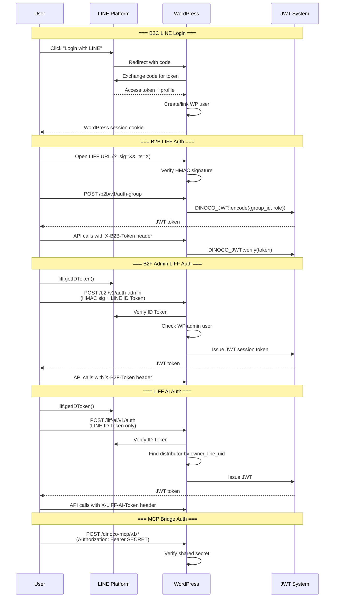
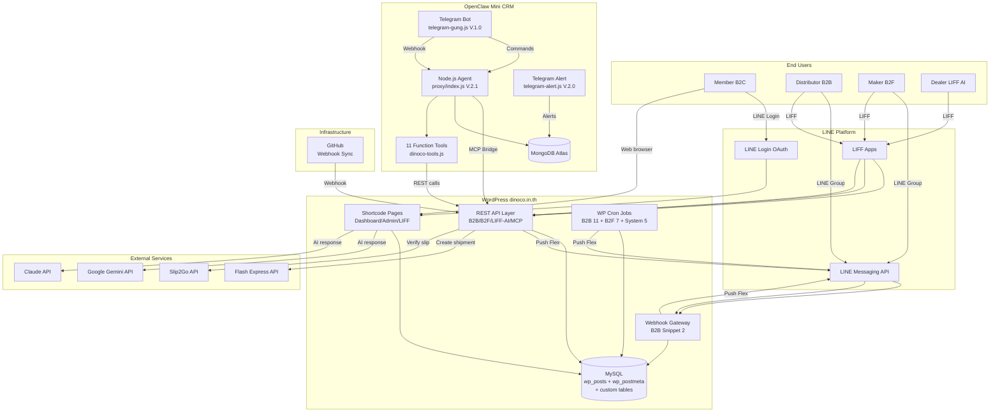
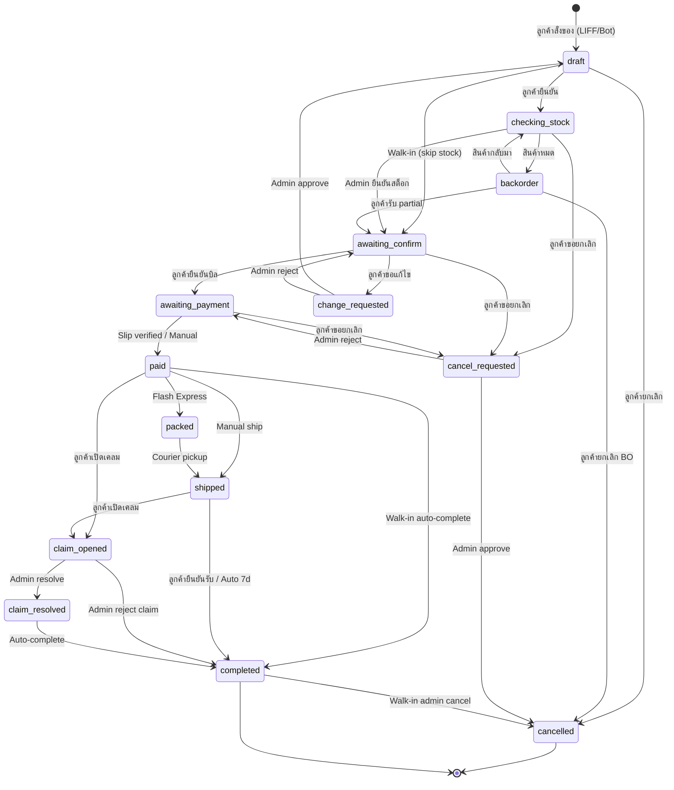
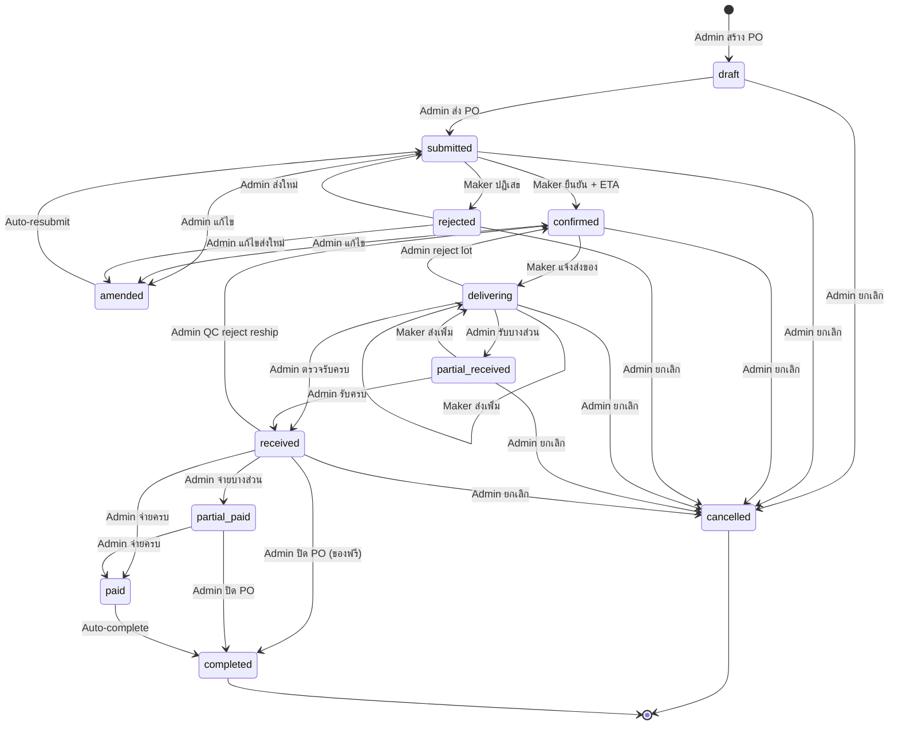
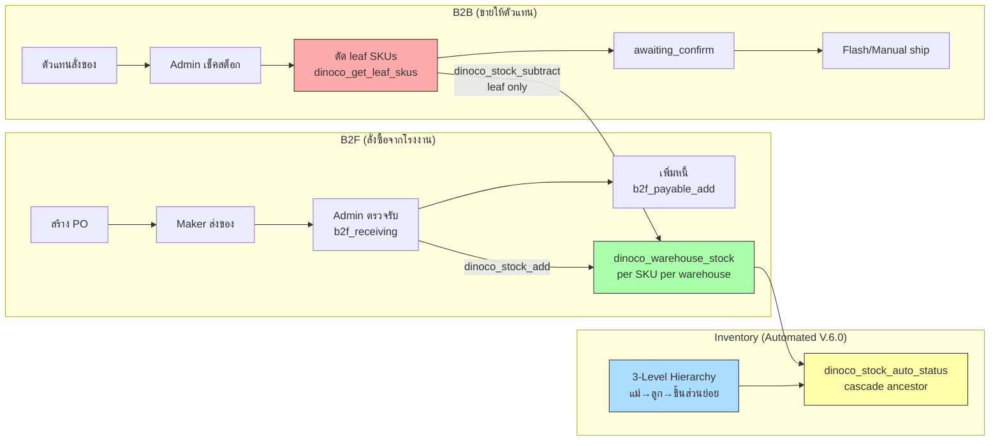
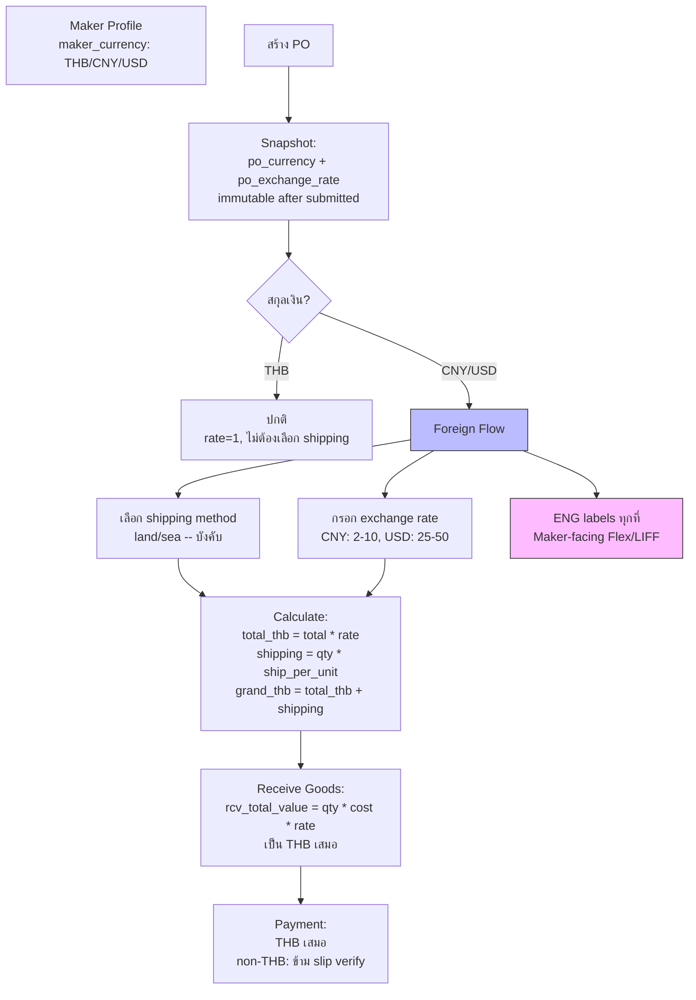
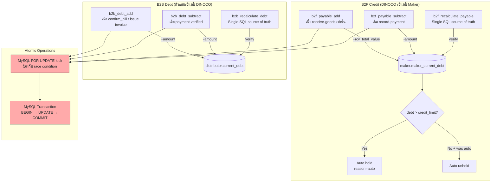
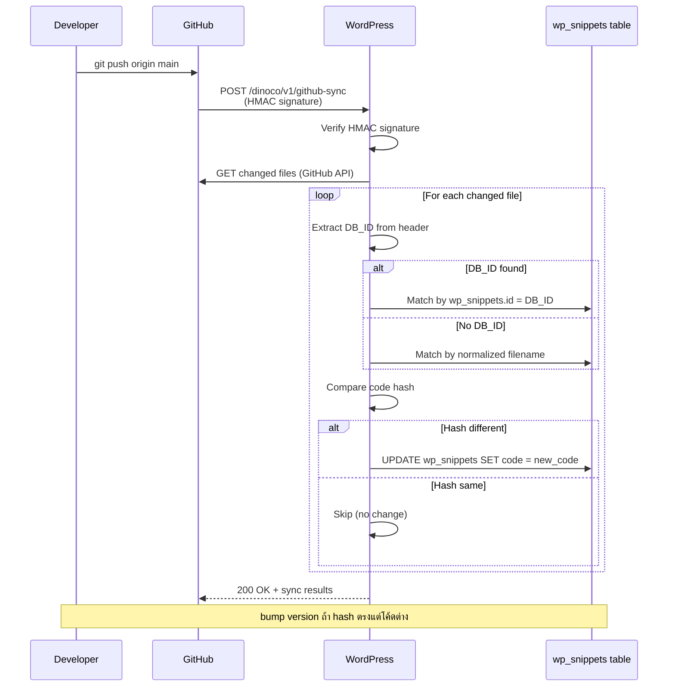

# DINOCO System Reference -- Complete Wiki

> Last updated: 2026-04-16 | Version: V.41.2 | 40+ files, ~55,000 lines
> Consolidated from: SYSTEM-ARCHITECTURE.md, DATA-MODEL.md, SYSTEM-DIAGRAMS.md, USER-JOURNEYS.md

---

## Table of Contents

1. [Technology Stack + Server Architecture](#1-technology-stack--server-architecture)
2. [Module Map (All Snippets)](#2-module-map--all-snippets)
3. [REST API Endpoints (Complete)](#3-rest-api-endpoints--complete)
4. [Authentication Flows](#4-authentication-flows)
5. [Data Model](#5-data-model)
6. [FSM Statuses (B2B + B2F)](#6-fsm-statuses-b2b--b2f)
7. [System Diagrams (Mermaid)](#7-system-diagrams-mermaid)
8. [User Journeys by Role](#8-user-journeys-by-role)
9. [LIFF URL Map (Complete)](#9-liff-url-map--complete)
10. [Integration Points + Required Constants + Kill Switches](#10-integration-points--required-constants--kill-switches)
11. [Deployment + Cross-Module Dependencies](#11-deployment--cross-module-dependencies)

---

## 1. Technology Stack + Server Architecture

### 1.1 Technology Stack

| Layer | Technology | Details |
|-------|-----------|---------|
| **CMS / Backend** | WordPress 6.x | PHP 8.x, Code Snippets plugin (wp_snippets table) |
| **Database** | MySQL (MariaDB) | InnoDB, ACF fields stored in wp_postmeta |
| **Frontend** | Vanilla HTML/CSS/JS | Inline in PHP files, no build step, no framework |
| **Mobile UI** | LINE LIFF (LINE Front-end Framework) | SPA-like pages inside LINE app |
| **Authentication** | LINE Login OAuth2 | Creates/links WP users |
| **AI (WordPress)** | Google Gemini API + Claude API | Function calling (v22.0), AI Provider Abstraction Layer |
| **AI (Chatbot)** | OpenClaw Mini CRM | Node.js + Express, Gemini Flash + Claude Sonnet, MongoDB Atlas |
| **Messaging** | LINE Messaging API | Flex Messages, Push/Reply, Rich Menu |
| **Shipping** | Flash Express API | Create order, print label, track, notify courier. V.42 Flash Shipping Metadata: per-PNO weight/dims + auto vehicle routing (bike/truck) + subParcel Pattern B + DLQ + retry classifier + warehouseNo Method 2 routing |
| **Payment Verify** | Slip2Go API (PULL only) | Bank slip OCR verification — WP calls Slip2Go on-demand (no webhook registered) |
| **PDF** | PHP GD Library | Invoice/PO images as PNG (A4 format) |
| **Deployment** | GitHub Webhook Sync | Push to main -> auto-sync to WordPress wp_snippets |
| **Timezone** | Asia/Bangkok (ICT) | Hardcoded throughout |
| **Language** | Thai (UI), English (technical) | B2F foreign makers use ENG labels |

### 1.2 Server Architecture

```text
                    +-------------------+
                    |   LINE Platform   |
                    | (Messaging API)   |
                    +--------+----------+
                             |
                    Webhook POST /b2b/v1/webhook
                             |
                    +--------v----------+
                    |   WordPress       |
                    |   (dinoco.in.th)  |
                    |                   |
                    |  Code Snippets    |
                    |  (40+ modules)    |
                    |                   |
                    |  REST API:        |
                    |  /b2b/v1/*        |
                    |  /b2f/v1/*        |
                    |  /liff-ai/v1/*    |
                    |  /dinoco-mcp/v1/* |
                    |  /dinoco/v1/*     |
                    |  /dinoco-inv/v1/* |
                    +---+------+-------+
                        |      |
              +---------+      +----------+
              |                           |
    +---------v--------+       +----------v---------+
    | Flash Express    |       | OpenClaw Mini CRM  |
    | (Shipping API)   |       | (Node.js Agent)    |
    +------------------+       |                    |
                               | Gemini + Claude    |
    +------------------+       | MongoDB Atlas      |
    | Slip2Go          |       +--------------------+
    | (Payment Verify) |
    +------------------+       +--------------------+
                               | GitHub             |
    +------------------+       | (Webhook Sync)     |
    | Google Gemini    |       +--------------------+
    | (AI Control)     |
    +------------------+
```

---

## 2. Module Map -- All Snippets

### 2.1 [System] -- Member-Facing (B2C)

| File | Version | DB_ID | Shortcode | Description |
|------|---------|-------|-----------|-------------|
| [System] DINOCO Gateway | V.30.2 | 9 | `[dinoco_login_button]` | LINE Login card UI |
| [System] LINE Callback | V.30.3 | 10 | `[dinoco_gateway]` | OAuth callback + warranty registration + login_error UI |
| [System] Member Dashboard Main | V.32.1 | 11 | `[dinoco_dashboard]` | Main controller, routing, rate limiting. **Sprint 32 (2026-05-14)**: hosts inline claim payment + claim history sections (anchors `#claim-card-{id}` for deep-link from LINE Flex `?action=pay&claim_id=X&charge_id=Y`). Sprint 33 closed 5 BLOCKERs + 7 SHOULD-FIX from dual UX audit. |
| [System] author profile line | V.30.3 | 12 | -- | LINE profile picture (WP default avatar fallback) |
| [System] Dinoco Custom Header | V.30.2 | 13 | -- | Hide admin bar for non-admin users |
| [System] Transfer Warranty Page | V.30.2 | 15 | `[dinoco_transfer_sys]` / `[dinoco_transfer_v3]` | Warranty ownership transfer |
| [System] DINOCO Claim System | V.30.2 | 16 | `[dinoco_claim_page]` | Claim submission + PDF generation |
| [System] DINOCO Global App Menu | V.31.1 | 17 | -- | Bottom navigation bar (native app style) |
| [System] DINOCO Edit Profile | V.35.0 | 18 | `[dinoco_edit_profile]` | User profile edit (Facebook-style view/edit toggle). **Sprint 35 A2 (2026-05-14)**: NEW "🔔 การแจ้งเตือน" section — notification settings relocated from Home (Member Dashboard Main) → centralized here per boss UX directive (single source of truth — no duplication). |
| [System] Legacy Migration Logic | V.30.2 | 19 | `[dinoco_legacy_migration]` | Legacy warranty migration (admin-ajax) |
| [System] Dashboard - Header & Forms | V.31.18 | 28 | `[dinoco_dashboard_header]` | Sidebar, profile card, PDPA, registration forms. **Sprint 34-36 (2026-05-14)**: Member Card text "DINOCO THAILAND" → logo image (V.31.8) → 11-round iteration arc. V.31.10 removed 3-button row → V.31.12 restored 2 cards (แจ้งเคลม + โอนสิทธิ์) after boss "เมนูสำคัญหายไป". V.31.13 — 3-col action row + logo wordmark pivot + notif accordion removed (moved to Edit Profile V.35.0). V.31.14 Direction A consolidation (ux-ui-expert audit) → boss reverted via V.31.15 (restore 3-card menu + shrink logo 50% + Royal Warranty always-show). V.31.16 logo `!important` cascade fix + notif fully removed from Home. **V.32.0 FULL REDESIGN rolled back via `ac2b0da`** (over-deletion — 241+/362- lines lost primary affordances). V.31.17 enlarge logo to match "PASSPORT" subtitle. **V.31.18 (current)**: logo 2x scale per boss "ยาวขึ้นอีก 1 เท่า สูงตามไซล์". |
| [System] Dashboard - Assets List | V.32.2 | 29 | `[dinoco_dashboard_assets]` | Assets list with bundle support. **Sprint 32 (2026-05-14)**: claimed-state cards render inline payment section when `?action=pay&claim_id=X&charge_id=Y` matches — replaces standalone `/claim-pay/` LIFF. **Sprint 33**: dual UX audit fixes. **V.32.2 (2026-05-14, current)**: legacy plastic-card migration CTA redesign — amber warning card via Design Tokens V.1.3. NEW helper `dinoco_dashboard_get_pending_charge_for_claim($claim_id)` reads `wp_dinoco_claim_charges` to surface unpaid charge per claim. Royal Warranty Upgrade card always-visible (per V.31.15 boss directive). |
| [System] DINOCO MCP Bridge | V.2.2 | 1050 | -- | REST API Bridge for OpenClaw (32 endpoints, per-lead storage) |
| [System] DINOCO GDPR Data Requests | V.1.0 | pending | -- | **NEW (Phase 5, 2026-04-17)** — Thai PDPA compliance stubs. 3 endpoints `/wp-json/dinoco-gdpr/v1/{my-data-export,my-data-delete,my-data-status}`. Flag `dinoco_gdpr_enabled` default OFF → returns 503. Schema `wp_dinoco_gdpr_requests` (id, user_id, type, status, created_at, processed_at, notes) lazy-install via `dbDelta` on first use. Data scope: wp_users + wp_usermeta + distributor CPT + warranties + claims + B2B orders + LINE messages (via agent:3000). Full impl + admin review UI deferred to Phase 6. |
| [System] DINOCO LIFF Asset Loader | V.1.0 | pending | -- | **NEW (Phase 6, 2026-04-17)** — Manifest-based Vite build enqueue helper. `dinoco_liff_enqueue($entry_name)` reads `dist/liff/manifest.json` and enqueues the hashed JS + CSS assets. **Scaffold only** — no active call yet (inline rendering in Snippet 4 intact as fallback). Future: Snippet 4 migration will call `dinoco_liff_enqueue('b2b-catalog')` + drop inline blocks. Goal: address PERF-H6 (155KB inline → <10KB shell). |
| [System] DINOCO SN REST API | V.0.46 | 1196 | -- | **NEW (v2.13 Phase 1, 2026-05-04)** — Production S/N Management REST namespace `/dinoco-sn/v1/*` (29+ endpoints). Phase 0-3 coverage: batches CRUD + receive (bulk D4 contract) + lookup (PII-stripped, 60s cache) + sc-lookup (warehouse cap) + activate + audit + void/swap/recall/reissue (4-eyes tier matrix) + LTV + fraud queue + geo heatmap + stolen registry + demand forecast. Idempotency-Key wrapper includes `actor_user_id` (Round 30+ pattern). Phase 3 audit + R3-R12 rounds closed 50+ findings. **V.0.46 (2026-05-13)**: Phase 7 P3 RD-2 CLV Cohort. |
| [System] DINOCO Warranty Activation LIFF | V.0.1 | 1197 | `[dinoco_warranty_activate]` | **NEW (v2.13 Phase 1, 2026-05-04)** — Customer-facing LIFF route `/warranty/activate?sn=...`. 5 UX states (landing/form/already_registered/not_yet_shipped/error). D11 fix: LINE OAuth + WP session reuse (NO new JWT). Atomic activate handler: SELECT FOR UPDATE + flip status=registered + create warranty_registration CPT + mirror serial_code ACF backward compat. |
| [System] DINOCO SN Quick Lookup | V.0.2 | 1198 | `[dinoco_sc_quick_lookup]` | **NEW (v2.13 Phase 3 W8.5, 2026-05-04)** — Mobile-first read-only verify shortcode for Service Center walk-in lookup. Permission: `dinoco_sn_warehouse` OR `manage_options`. 48px touch targets, USB barcode scanner support, status-aware action hints. Wires to `/sc-lookup/{sn}` (warehouse cap) instead of admin-only `/sn/{sn}`. |
| [System] DINOCO Stolen Plate Public Verify | V.0.1 | 1199 | `[dinoco_stolen_check]` | **NEW (v2.13 Phase 3 W11 F#14, 2026-05-05)** — Public-facing verify shortcode for police/insurance/dealer to check plate before second-hand resale. Wires to `/dinoco-sn/v1/stolen/verify/{sn}` (boolean only — no PII oracle leak, 5-min cache, 30/min/IP rate limit). REG-082 alignment: uses "มีรายงานในระบบ" never "ถูกแจ้งหาย" (anti social-engineering). Self-contained CSS+JS scoped `.dnc-sn-stolen-*`. |
| [System] DINOCO Claim Payment LIFF | V.0.11 **DEPRECATED** | 1212 | `[dinoco_claim_pay]` | **DEPRECATED (Sprint 32, 2026-05-14)** — Standalone `/claim-pay/?claim_id=X&charge_id=Y` LIFF page collapsed into Member Dashboard. Now serves redirect-only behavior: incoming Flex deep-links 301 → `/dashboard/?action=pay&claim_id=X&charge_id=Y#claim-card-{id}` (Sprint 33 closed 5 BLOCKERs from dual UX audit). Standalone slip-upload + Slip2Go verify logic still hot for legacy LINE Flex payloads pre-2026-05-14. Removal pending 60-day customer cache TTL. |
| [Admin System] DINOCO Claim Charges Schema | V.0.1 | (Phase 2.5) | -- | **NEW (Claim Lifecycle Sprint 13-22, 2026-05-13/14)** — `wp_dinoco_claim_charges` schema (charge FSM: pending → notified → slip_uploaded → verified → paid → refund_requested → refunded / cancelled). Atomic helper `dinoco_claim_charge_*`. Idempotency-Key wrappers on create + refund. Audit log `wp_dinoco_claim_charge_audit`. Sprint 13-22 closed 8 CRIT + 14 HIGH from code-reviewer agents across 10 sprints. |
| [Admin System] DINOCO Claim Flash Dispatcher | V.0.4 | 1213 | -- | **NEW (Claim Lifecycle Phase 3.1-3.3, Sprint 23-27, 2026-05-13/14)** — Flash shipping integration for claim replacement parts. Routes through `b2b_flash_dispatch_create_all()` (V.42 hardening reuse). **Phase 3.3 (Sprint 28, 2026-05-14)**: Service Center admin UI section + RPi print queue enqueue. Multi-shipment grouping (Phase 4 Batch B, Sprint 30). Pickup-at-warehouse opt-in. |
| [Admin System] DINOCO Claim Lifecycle Notifier | V.0.9 | -- | -- | **NEW (Phase 3.6, Sprint 28, 2026-05-14)** — Customer-facing notifications for claim status changes. **Phase 4 Batch A (Sprint 29, 2026-05-14)**: notif-log filter dashboard. Hooks fire on charge FSM transitions + flash dispatch + refund issued. LINE push via shared `b2b_line_push` helper. |

### 2.2 [Admin System] -- Admin/Management

| File | Version | DB_ID | Shortcode | Description |
|------|---------|-------|-----------|-------------|
| [Admin System] DINOCO Admin Dashboard | V.32.1 | 21 | `[dinoco_admin_dashboard]` | Command Center: KPIs, charts, pipeline, AI Inbox |
| [Admin System] DINOCO Global Inventory Database | V.43.6 | 22 | `[dinoco_admin_inventory]` | Inventory Command Center, 3-level hierarchy UI, catalog filter bar + type cards + context-aware modal, leaf-based classification + DD-3 shared child duplicate DOM rows + V.42.26 _renderParent tagging (cross-expand fix) + V.42.27 stock-grandchild-of subtree scope + V.43.0 anchor scroll/expanded state/pagination scroll + V.43.2 direct leaves JS + V.43.3 group-aware pagination + V.43.4 direct leaves PHP $sorted + V.43.5 search descendant expansion + V.43.6 DD-3 parent_skus array indexing |
| [Admin System] DINOCO Legacy Migration Requests | V.30.2 | 23 | `[dinoco_admin_legacy]` | Admin legacy migration manager |
| [Admin System] DINOCO User Management | V.30.2 | 25 | `[dinoco_admin_users]` | CRM + full analytics |
| [Admin System] DINOCO Manual Transfer Tool | V.30.2 | 26 | `[dinoco_admin_transfer]` | Force transfer warranty ownership |
| [Admin System] DINOCO Service Center & Claims | V.31.7 | 27 | `[dinoco_admin_claims]` | Claims management + auto-close 3 statuses (30d). **Sprint 17+23+28 (2026-05-13/14)**: charge-create modal trigger (Sprint 17 Phase 2.6) + Flash shipping UI (Phase 3.3, Sprint 28) + Phase 4 Batch A CSV export + Phase 4 Batch B refund audit dashboard + multi-shipment grouping + pickup-at-warehouse opt-in. |
| [Admin System] AI Control Module | V.30.2 | 35 | `[dinoco_admin_ai_control]` | AI Command Center (Gemini v22.0 function calling) |
| [Admin System] KB Trainer Bot v2.0 | V.30.3 | 62 | -- | Knowledge Base trainer (Gemini, limit 200 entries) |
| [Admin System] DINOCO Manual Invoice System | V.34.10 | 598 | `[dinoco_manual_invoice]` | Manual billing for B2B distributors |
| [Admin System] AI Provider Abstraction | V.1.2 | 1040 | -- | Multi-AI provider (Claude/Gemini/OpenAI) |
| [Admin System] DINOCO Moto Manager | V.1.0 | 1157 | `[dinoco_admin_moto]` | Motorcycle brands & models CRUD |
| [Admin System] DINOCO Admin Finance Dashboard | V.3.16 | 1158 | `[dinoco_admin_finance]` | Finance overview (debt, revenue, risk AI) |
| [Admin System] DINOCO Brand Voice Pool | V.2.5 | 1159 | `[dinoco_brand_voice]` | Social listening + brand sentiment analysis |
| [Admin System] B2F Migration Audit | V.3.3 | pending | `[b2f_migration_audit]` | **Option F Hybrid Shadow-Write audit** — 13 REST endpoints `/wp-json/dinoco-b2f-audit/v1/` (drift/stale/parity/dry-run/feature-flags/activate-schema/backfill/junction-snapshot/observations + **V.3.2 Option F**: maker-products-with-source/junction-bulk-delete/autosync-blacklist GET+POST) + 6 dashboard sections. **Phase 3 ACTIVE** since 2026-04-16 — reads flipped to junction. Rate limit 20/hr read, 5/hr destructive. **V.3.3 (housekeeping H-1)**: docs clarify backfill orphan INSERT `ON DUPLICATE KEY UPDATE` semantics — `status`+`deleted_at` preserved across re-runs (honors admin soft-delete). |
| [Admin System] Product Catalog Export Tool | V.1.2 | pending | -- | 1-click ZIP bundle (5 CSVs incl. migration-audit-report) for offline analysis |
| [Admin System] DINOCO Modal Helpers | V.1.0 | pending | -- | **NEW (Phase 5, 2026-04-17)** — shared `window.dinocoModal.{confirm,alert,prompt}({})` API replacing native blocking dialogs. Scoped `.dnc-modal-*` CSS + ESC/focus-trap/backdrop-click/native-fallback. 6 destructive admin sites migrated (BO confirm/reject/cancel-item/split-bo + B2F rejectLot + Phase 4 LIVE). 67 sites remaining for Phase 6 bulk migration. |
| [Admin System] DINOCO Observability | V.1.0 | pending | -- | **NEW (Phase 5, 2026-04-17)** — Sentry + correlation ID + structured logs. 5 functions (`is_enabled`, `init_sentry`, `capture`, `get_request_id`, `rest_post_dispatch` correlation filter). 3 wp_option flags default=0: `dinoco_obs_sentry_enabled`, `dinoco_obs_correlation_enabled`, `dinoco_obs_structured_log`. Defensive `class_exists('\Sentry\Client')` — zero behavior change if SDK missing. Activate via `composer require sentry/sentry` + flag flip. |
| [Admin System] DINOCO Production SN Manager | V.0.59 | 1195 | `[dinoco_admin_production_sn]` | **NEW (v2.13 Phase 0-3, 2026-05-04..05)** — Foundation snippet for Production S/N Management System. Schema lazy-install on `admin_init` (15 tables incl. sn_pool split hot/cold + audit + 11 supporting). 9 admin tabs (Batches/รับเพลท/Pool/จัดการ/Audit/VIP/Fraud/Geo/Stolen) embedded in Inventory DB tab 8 via `do_shortcode`. Module Registry self-registration (section=inventory, order=25). 5 feature flags default OFF (`dinoco_sn_system_enabled` master). 3 capabilities (`dinoco_sn_warehouse` / `dinoco_sn_approver` / `dinoco_sn_view_pii`). Hierarchy resolver `dinoco_sn_required_plates_for_sku()` + DD-3 array_unique. **V.0.17**: Flex template builders. **V.0.18 (Phase 2 W7)**: 6 Member Dashboard read-only helpers. 9 cron jobs heartbeat-tracked. **R3-R12 audit hardening**: HMAC URL signing + canonical idempotency hash + unified lock key `dnc_sn_{md5(sn)}` + cron heartbeat in `finally` + obs_capture signature fix (54 sites) + per-user LTV transient invalidation. **V.0.59 (2026-05-13)**: QW-7 Smart Service Reminder Flex builder + cron 02:25 ICT (dark navy header, NO promo_code — pure educational push). |
| [Admin System] DINOCO Public API Gateway | V.0.1 | pending | -- | **NEW (v2.13 Phase 4 W12 F#15, 2026-05-04)** — External partner API namespace `/dinoco-sn-api/v1/*` (3 public endpoints: verify/claim-status/stolen-check, all PII-stripped). Token format `pk_<32hex>` + `sk_<48hex>` secret stored as `wp_hash_password`. HMAC-SHA256 signing (X-API-Key + X-API-Sig + X-API-Timestamp). Admin CRUD namespace `/dinoco-sn/v1/api-tokens/*`. 4 partner types (dealer/insurance/government/other). 4 scopes (verify/claim_status/stolen_check/full). 90-day cleanup cron `dinoco_sn_pubapi_log_cleanup_cron`. |

### 2.3 [AdminSystem-System] -- Infrastructure

| File | Version | DB_ID | Shortcode | Description |
|------|---------|-------|-----------|-------------|
| [AdminSystem-System] GitHub Webhook Sync | V.34.1 | 265 | `[dinoco_sync_dashboard]` | GitHub -> WordPress auto-deploy |

### 2.4 [B2B] -- Distributor System (15 Snippets)

| File | Version | DB_ID | Description |
|------|---------|-------|-------------|
| Snippet 1: Core Utilities & LINE Flex Builders | V.34.25 | 72 | LINE push, Flex templates, HMAC URL, bank helpers + **V.34.25 (2026-04-29)**: code-reviewer CRIT — G2 + BUG-2 dead-code conflict (json_decode→mutate→re-encode roundtrip in G2 retry sync + DLQ PII mask). **V.34.24**: Flash V.42 deep audit — BUG-2 CRITICAL subParcel JSON encoding (was PHP nested array → sign() cast "Array" → Flash hash mismatch on every multi-box) + BUG-1 omit insureDeclareValue when not insured + ISSUE-5 V.41 returnXXX 7 fields (walk-in tickets ตีกลับโกดัง) + ISSUE-6 V.41 articleCategory 99→6. **V.34.23**: G4 async snapshot defer (wp_schedule_single_event closes Round 4-8 HIGH-2). **V.34.22**: B5 audit trace fields (original_out_trade_no + g2_attempts + g2_outcome). **V.34.21**: G2 1003 outTradeNo recovery (mchPno query first, regenerate -r{n} suffix fallback). Earlier: V.34.20 AI accuracy metrics, V.33.7 b2b_rate_limit GET_LOCK |
| Snippet 2: LINE Webhook Gateway & Order Creator | V.34.34 | 51 | Webhook endpoint, order lifecycle + **V.34.4 C2 FIX**: BO system gate ใน `confirm_order` ก่อน OOS check — route ไป `pending_stock_review` + snapshot + notify admin + opaque customer reply (ถ้า `b2b_flag_bo_system=ON`). **V.34.34 (2026-05-12)**: confirm_bill guards — reject `all_backorder` status ("ออเดอร์นี้รอสินค้า BO เข้าก่อนครับ") + reject `partial_fulfilled` ที่ `fulfilled_qty=0 && fulfilled_val<=0` (กัน customer กด "ยืนยันบิล" ที่ยอด ฿0 หลัง all-BO มาก่อน split). |
| Snippet 3: LIFF E-Catalog REST API | V.41.4 | 52 | REST API + **V.41.4 C1 FIX**: `do_action('b2b_place_order_post_process')` หลังสร้าง order (Snippet 16 listens). **V.41.3 H4**: cancel grace period 5 นาที + tighter rate limit 2/hr/10/day. **V.41.2**: manual-flash-create warehouse/registered split |
| Snippet 4: LIFF E-Catalog Frontend | V.32.4 | 53 | LIFF SPA for distributors (catalog, cart, history, SET detail view) + **V.32.2-V.32.4 UX overhaul**: qty stepper SET Detail (1-999) + back button ← กลับ + cart bar 64px green CTA z-index 600 + main SET stepper + cart thumbnails + sub-item stepper toggle + 🗑️ red remove |
| Snippet 5: Admin Dashboard | V.33.2 | 54 | `[b2b_admin_dashboard]` -- Admin order management + Flash, leaf-only cancel restore + **V.33.2 (2026-04-29)**: G1 admin "Flash Create" REST routed via `b2b_flash_dispatch_create_all()` (V.42 GET_LOCK + walk-in guard + idempotency) instead of bypassing dispatcher |
| Snippet 6: Admin Discount Mapping | V.31.1 | 55 | `[b2b_discount_mapping]` -- SKU pricing + rank tiers |
| Snippet 7: Cron Jobs - Dunning + Summary + Rank | V.30.5 | 56 | 9 cron jobs (dunning, summary, rank, flash, shipping) |
| Snippet 8: Distributor Ticket View | V.30.4 | 57 | `/b2b-ticket/` -- Order detail page (admin/customer split) |
| Snippet 9: Admin Control Panel | V.34.0 | 58 | `[b2b_admin_control]` -- Distributors, products, settings, Flash + **V.34.0 (2026-04-29)**: G1 flash-test/run-step routes through dispatcher (consistency with production V.42 path) |
| Snippet 10: Invoice Image Generator | V.30.8 | 61 | A4 invoice PNG (GD Library) — V.30.7 push observability, V.30.8 admin notice scoped + dismissible |
| Snippet 11: Customer LIFF Pages | V.30.6 | 64 | `[b2b_commands]`, `[b2b_orders]`, `[b2b_account]` + **V.30.6 (2026-05-12)**: `all_backorder` status visibility — labels + colors + bg + step_map maps + embed `[b2b_bo_customer_order_detail]` shortcode trigger เมื่อ status in {pending_stock_review, partial_fulfilled, all_backorder} |
| Snippet 12: Admin Dashboard LIFF | V.31.2 | 65 | `[b2b_dashboard]`, `[b2b_stock_manager]`, `[b2b_tracking_entry]` |
| Snippet 13: Debt Transaction Manager | V.2.0 | 1036 | Atomic debt operations (MySQL transactions, FOR UPDATE) |
| Snippet 14: Order State Machine | V.1.9 | 1038 | B2B_Order_FSM class + **V.1.6**: `pending_stock_review` + `partial_fulfilled` states (BO system) — 16 statuses. **V.1.9 (2026-05-12)**: NEW state `all_backorder` (BO V.4.0) — admin split qty_fulfill=0 ทุก SKU = รอ BO ทั้งหมด → ยังไม่ออกบิล. 5 transitions: pending_stock_review → all_backorder (admin) / all_backorder → {awaiting_confirm, partial_fulfilled, cancelled, cancel_requested (customer), pending_stock_review undo}. confirm_bill blocked at FSM (ไม่มี → awaiting_payment) = defense in depth. |
| Snippet 15: Custom Tables & JWT Session | V.7.5 | 1039 | Product catalog table, JWT, DINOCO_MotoDB class, 3-level SKU hierarchy helpers + **V.7.5 polish**: M1 header doc drift fix (ลบ "FOR UPDATE race safety" — idempotent unlock ไม่ต้อง lock) + H1 static cache caveat. **V.7.4 Phase 0 Hotfix**: `dinoco_stock_auto_status()` cascade auto-unlock manual_hold (whitelist reason + 72h buffer + flag `dinoco_auto_unlock_enabled`) |
| Snippet 16: Backorder System | V.4.0 | pending | **Opaque Accept + Admin Split BO** (FEATURE-SPEC-B2B-BACKORDER-2026-04-16). 14 REST endpoints + 5 Flex + 6 cron + 4 shortcodes. Master flag `b2b_flag_bo_system` default OFF. **V.4.0 (2026-05-12, บอส principle #6313)**: NEW `all_backorder` flow — admin split qty_fulfill=0 → state `all_backorder` (ไม่ใช่ partial_fulfilled). NEW `b2b_build_flex_all_backorder_customer()` (amber header + ไม่มีปุ่มบิล + "ยกเลิก BO" button). NEW `b2b_bo_notify_customer_all_backorder()` push helper. NEW postback `bo_cancel_all_customer` (ownership+status guard). bo-fulfill auto-promote (`$prev_status==='all_backorder'` → awaiting_confirm + clear marker). `[b2b_bo_customer_order_detail]` shortcode ได้ all_backorder branch. บอส principle: "ลูกค้ารอของ ยังไม่วางบิล + ยกเลิกได้ถ้าของยังไม่มา". **V.3.25** (2026-05-11): 13-commit emergency BO loop stabilization — FULL REDESIGN 7 Flex builders (admin stock_review with images + customer split view) + V.34.32-34.34 Snippet 2 fixes. **V.2.9 (2026-04-29)**: PERF /bo-pending-review cache priming (90%+ DB roundtrip elimination). **V.2.8**: G3 BO secondary fallback removed. **V.1.6 gap fixes** (4 CRIT + 6 HIGH + 2 MEDIUM): C1 place-order hook + C2 confirm_order BO gate + C3 Split BO deep-link + H1 badge + H2-H6 endpoints + M3/M6/M7 fixes. ~3800 LOC. |

### 2.5 [B2F] -- Factory Purchasing System (13 Snippets)

| File | Version | DB_ID | Description |
|------|---------|-------|-------------|
| Snippet 0: CPT & ACF Registration | V.3.5 | 1160 | 5 CPTs + ACF + poi_parent_sku/name + poi_parent_breakdown (DD-3 JSON) + **V.3.4**: poi_parent_path (slash-separated hierarchy chain) + **V.3.5 (V.7.0)**: 4 new po_items sub-fields (poi_order_mode select, poi_intent_notes textarea 200 chars, poi_source_sku, poi_production_mode_snapshot) + postmeta `_b2f_order_intent_summary` (show_in_rest=false, auth_callback=manage_options) |
| Snippet 0.5: Maker Product Dual-Write | V.1.2 | pending | **NEW (Phase 2)** — `save_post_b2f_maker_product` hook flag-gated dual-write to junction. ACTIVE when `b2f_flag_shadow_write=true` (enabled 2026-04-16). CPT save → write junction mirror + observation entry. **V.1.2 (V.7.0 CRIT-4 race fix)**: Check `b2f_phase4_migration_in_progress` wp_option at start of dual-write → skip + enqueue retry via `wp_schedule_single_event` (handler `b2f_replay_queued_dual_write`, max 6 retries). INSERT includes 4 new junction columns (production_mode inferred, confirmation_status='confirmed', admin_display_mode inferred, missing_leaves_count). ON DUPLICATE KEY UPDATE **EXCLUDES** new columns (preserve admin choice). Fire `do_action('b2f_junction_updated', $maker_id)` after UPSERT. |
| Snippet 1: Core Utilities & Flex Builders | V.7.0 | 1163 | 22 Flex templates + b2f_group_items_by_set (DD-3) + b2f_get_item_breakdown + b2f_compute_manufacturing_summary + **V.6.5**: flag helpers (b2f_is_flag_enabled, b2f_get_all_flags, b2f_log_flag_change) + **V.6.6**: b2f_group_items_by_path (3-level TOP→CHILD→leaves) + b2f_flex_po_items_list auto-switch + **V.7.0 (Order Intent)**: 8 helpers (b2f_get_production_mode, b2f_infer_legacy_order_mode, b2f_validate_source_sku_in_ancestors, b2f_junction_update_classification atomic+FOR UPDATE, b2f_order_mode_label 3-lang, b2f_flex_intent_summary, b2f_audit_check_mysql_version, b2f_infer_production_mode_from_relations) + 8 error code constants + 3 new flag whitelist + central cache hook `b2f_junction_updated` listener + b2f_flex_po_items_list($items, $currency, $show_mode_badge) mode badge rendering |
| Snippet 2: REST API | V.10.5 | 1165 | 20+ endpoints + DD-7 breakdown + `catalog_map` LIFF filter + batch SKU lookup + **V.10.0 (Phase 3 cut-over)**: maker-products + CRUD reads `wp_dinoco_product_makers` junction when `b2f_flag_read_from_junction=true` (CPT fallback) via `b2f_read_maker_products_from_junction()` + **V.10.1**: code review fixes (1 CRITICAL + 3 HIGH + 4 MEDIUM + 3 LOW) + SET `compatible_models` respect direct value + **V.10.2**: virtual SET inject walks ALL parents (intermediate sub-SETs) + **V.10.3**: DD-7 track `parent_path` per breakdown + `poi_parent_path` + po-detail return parent_path + **V.10.4**: `virtual_reason` field (shared_parts_assembled / intermediate_sub_set) + **V.10.5 (housekeeping M-3)**: docs-only — `poi_parent_path` top-level = probe-only (authoritative path per DD-3 occurrence lives in `breakdown[]`) + **V.11.0 (V.7.0 Order Intent)**: Enriched `GET /maker-products/{id}` (production_mode, confirmation_status, admin_display_mode, missing_leaves[] per product + maker_profile.stats) flag-gated `b2f_flag_v11_explicit_mode` + `POST /create-po` 7-rule validator (enum strict + full_set/sub_unit/single_leaf cross-check + source_sku ancestor validation + intent_notes sanitize 200 chars + DD-3 composite merge key (sku + order_mode + source_sku composite)) + NEW `POST /po-undo-submit` (30s DB-clock window + dual auth + FOR UPDATE + GET_LOCK + FSM draft→cancelled) + `b2f_format_po_detail()` PII callback gate (non-admin strips `poi_intent_notes`+`poi_production_mode_snapshot`+`order_intent_summary`) + transient cache `b2f_maker_products_v11_{maker_id}` 10min TTL + `X-B2F-API-Version: 11.0` response header via `rest_post_dispatch` filter |
| Snippet 3: Webhook Handler & Bot Commands | V.3.0 | 1164 | Maker/Admin bot commands (via B2B webhook routing) |
| Snippet 4: Maker LIFF Pages | V.4.3 | 1167 | `[b2f_maker_liff]` -- LANG system + hierarchy SET grouping + **V.4.3 (V.7.0)**: Mode badge per item (🟣 ชุดเต็ม / 🟠 แยกชุด / ⚪ ชิ้นเดี่ยว) in confirm/reject/deliver screens + PO list compact badge. `modeBadgeHtml(item)` 3-lang helper (THB/USD/CNY based on po_currency). Defensively ignores `poi_intent_notes` (never rendered — PII admin-only) |
| Snippet 5: Admin Dashboard Tabs | V.6.6 | 1166 | `[b2f_admin_orders_tab]`, `[b2f_admin_makers_tab]` + accordion tree view + Primary/Secondary lock (DD-3) + shared badge + jumpToPrimary + resolveSetName 4-level fallback + **V.6.0: Product Picker refactor — filter chips (ทั้งหมด/ชุด SET/เดี่ยว/ลูกชิ้นส่วน/ชิ้นส่วนย่อย) + count badges + hide empty + type badges + accordion row type badges — labels ตรงกับ Inventory V.43.6 + Snippet 8 V.5.4 (source of truth = /dinoco-stock/v1/stock/list)** + **V.6.1**: respect `ui_role_override` (badge-only) + **V.6.2**: defensively filter `p.is_virtual !== true` ในทุก maker-products call + **V.6.3 (Option F Hybrid Admin Control)**: source badge (📦 CPT / ✨ Auto) + filter chips + checkbox + bulk-delete + blacklist viewer (endpoints `maker-products-with-source`, `junction-bulk-delete`, `autosync-blacklist`) + **V.6.4 (Auto flat list fix)**: filter="auto" → `renderAutoFlatList()` flat rows (checkbox visible per Auto junction entry) — แก้บัค V.6.3 SET accordion header ไม่ match `.b2f-sku-row` → checkbox ไม่ถูก insert → Auto orphan SETs ลบไม่ได้ + **V.6.5 (per-SET delete on accordion header)**: 1-click UX — SET header ได้ `data-sku` + `applySourceMeta` decorate: source badge + 🗑️ "ลบ SET" button (red pill, right-aligned) สำหรับ Auto-synced SETs → `deleteAutoSet(sku)` → confirm + single-SKU `junction-bulk-delete` (add_to_blacklist=true) + toast + reload. `toggleSet(setId, headerEl, ev)` walk target 3 levels ignore click จาก `.b2f-auto-set-delete` (กัน accordion toggle). V.6.4 flat-list ยังคงไว้เป็น alternative. Expose `deleteAutoSet` + `_version='V.6.5'` + **V.6.6 (view mode toggle 🧩 รายชิ้น default vs 📦 ตาม SET)**: แก้ pain point Maker tab โชว์ parts ซ้ำใต้หลาย SET accordion (DD-3 shared จริง แต่รำคาญตา — เช่น HTP register 4 SKUs ใช้ใน 9 SETs → 20+ rows ซ้ำ). Flat default render 1 row per Maker SKU + badge "🔗 ใช้ใน N SET" (productSetMembership). `currentSetSku=null` → primary editable เสมอ. Sort type (set→single→child→grandchild) → SKU alphabetical. `_viewMode` persist ใน localStorage `b2f_makers_view_mode`. Accordion (📦) toggle ยังเก็บไว้ option. Applies ทุก maker tab. Expose `setViewMode(mode)` + `_version='V.6.6'` + **V.7.1 (V.7.0 Order Intent)**: Admin Makers tab confirmation UI — `_classificationMap` from V.11.0 API + unconfirmed banner with count + "ยืนยันทั้งหมด" bulk button + per-SKU mode badge (🟣/🟠/⚪/cross-factory) + confirmation warning + per-row "ยืนยัน" pill button. Functions `confirmSku()` + `confirmAllUnconfirmed()` via audit API. Orders tab: `_modeFilter` + `setModeFilter()` + `renderModeSummaryBadge()` per PO card. Expose `window.B2F_Orders.setModeFilter` + `window.B2F_Makers.confirmSku/confirmAllUnconfirmed` + `_version='V.7.1'` |
| Snippet 6: Order State Machine | V.1.5 | 1161 | B2F_Order_FSM class (12 statuses) |
| Snippet 7: Credit Transaction Manager | V.1.4 | 1162 | Atomic payable ops (DINOCO owes Maker) |
| Snippet 8: Admin LIFF E-Catalog | V.6.6 | 1168 | LIFF ordering + SET Detail View + Model Filter (V.5.3 inherit descendants + V.5.4 fallback ผ่าน catalogMap เมื่อ leaf ไม่อยู่ใน maker list) + type tabs (mutually exclusive) + count badges + hide empty + labels ตรงกับ Inventory "ชุด SET"/"เดี่ยว"/"ลูกชิ้นส่วน"/"ชิ้นส่วนย่อย" + shared badge + cart manufacturing summary (DD-3) + **V.5.5: removed window._b2fcat debug namespace (production cleanup)** + **V.5.7 Virtual SET display** (amber badge "ประกอบจากชิ้นส่วน" + is_virtual badge) + **V.5.10 Product Picker align Inventory V.43.6** + **V.6.0-V.6.4 UX overhaul**: qty stepper SET Detail (1-999) + back button redesign (← กลับ 44×44 dark) + cart bar black bg + green CTA z-index 600 + main SET stepper + cart thumbnails 56×56 + sub-item stepper toggle (`+ สั่งแยก` default) + 🗑️ red remove button + **V.6.5**: toggle "รวมชุดประกอบจากชิ้นส่วน" (default OFF) ซ่อน virtual top-level SETs + **V.6.6 (housekeeping M-2)**: virtual toggle localStorage scoped per-maker (`b2f_show_virtual_sets_{makerId}`) + **V.7.0 (Order Intent System)**: 3 card variants (🟣 ชุดเต็ม set_assembled / 🟠 แยกชุด sub_unit / ⚪ ชิ้นเดี่ยว single) + 🟠 DINOCO ประกอบ cross_factory_assembly (hidden default). Maker banner with stats (hide if unconfirmed=0). SET Detail mode toggle (ครบชุด vs แยก) z=500 overlay. **Dual-section cart** (🟣 full_set vs 🟠+⚪ parts). **Cart localStorage persistence** `b2f_cart_v7_{maker_id}` schema v7 (persists across reloads, clears on submit success). Submit Review Gate 3-bucket accordion (no mixed-mode warn). Mode badge = read-only (no override chip). Feature flag `b2f_flag_order_intent` gates ALL V.7.0 UI (OFF = V.6.6 fallback). XSS-safe intent_notes render via `textContent`. Submit payload `POST /create-po` with `{sku, qty, order_mode, source_sku, intent_notes}` per item. Post-submit toast "ยกเลิกได้ 30 วิ" → calls `POST /po-undo-submit`. `_version='V.7.0'` |
| Snippet 9: PO Ticket View | V.3.6 | 1169 | PO detail + hierarchy SET grouping + view toggle (ตามชุด/ยอดรวมผลิต) (DD-3) + **V.3.6 (V.7.0)**: Intent Summary Box top (🟣🟠⚪ 3-bucket breakdown from `_b2f_order_intent_summary` postmeta) + Mode column per item (Thai label via `b2f_order_mode_label()`) + intent_notes display admin-only (XSS-safe `textContent`) + legacy PO fallback "—" + CSS `.b2f-mode-badge` classes |
| Snippet 10: PO Image Generator | V.3.0 | 1170 | A4 PO PNG + hierarchy SET header rows + **V.2.7**: 3-level hierarchy rows (purple SET + blue CHILD + leaf rows) via `b2f_group_items_by_path` + **V.3.0 (V.7.0)**: GD mode badge per item (colored rectangle + 7pt label) + 3-lang labels via `b2f_order_mode_label($mode, $currency)` (THB/USD/CNY) + Intent Summary header box on page 0 (light blue bordered box with 3-bucket breakdown). NO intent_notes in image (PII protection) |
| Snippet 11: Cron Jobs & Reminders | V.2.2 | 1171 | 7 cron เดิม + **V.2.2**: `b2f_diff_cron_hourly` (hourly CPT vs junction drift log — registered hook name; earlier docs said `b2f_junction_diff_cron` which was never registered) + `b2f_observations_ttl_cron` (daily 60-day prune) |

### 2.6 [LIFF AI] -- AI Command Center (2 Snippets)

| File | Version | DB_ID | Description |
|------|---------|-------|-------------|
| Snippet 1: REST API | V.1.4 | 1173 | Auth (LINE ID Token + JWT), Lead/Claim endpoints, Agent proxy |
| Snippet 2: Frontend | V.3.1 | 1174 | `[liff_ai_page]` -- SPA pages (dashboard, leads, claims, agent) |

### 2.7 OpenClaw Mini CRM (Chatbot Agent)

| File | Location | Version | Description |
|------|----------|---------|-------------|
| index.js | `proxy/` | V.2.2 | Main Express server + Telegram webhook + `/api/regression/*` (10 endpoints) + `runRegressionTurn()` helper V.1.5 (multi-turn context persistence) + Auto-lead + `/api/claims/:id/status` |
| ai-chat.js | `proxy/modules/` | V.8.1 | AI providers + claudeSupervisor + PII masking + Claude review guard |
| dinoco-tools.js | `proxy/modules/` | -- | 11 function-calling tools |
| shared.js | `proxy/modules/` | V.5.4 | Prompt templates + config + product knowledge rules + CONFIRM_SELECTION/LIST_MANY_OPTIONS image rules |
| claim-flow.js | `proxy/modules/` | -- | Claim workflow automation |
| lead-pipeline.js | `proxy/modules/` | V.2.0 | Lead management (20 statuses incl. closed_won, waiting_decision, waiting_stock) + 5 Flex builders + notifyDealerDirect |
| dinoco-cache.js | `proxy/modules/` | -- | Redis/memory cache layer |
| platform-response.js | `proxy/modules/` | -- | Multi-platform response builder |
| telegram-alert.js | `proxy/modules/` | V.2.0 | Telegram alert system (sendTelegramAlert/Reply/Photo, escapeMarkdown, MongoDB logging) |
| telegram-gung.js | `proxy/modules/` | V.1.0 | น้องกุ้ง Telegram Bot Command Center (command parser + router + 20+ handlers + cron) |
| auth.js | `proxy/middleware/` | -- | Authentication middleware |

---

## 3. REST API Endpoints -- Complete

### 3.1 B2B (`/wp-json/b2b/v1/`)

| Method | Endpoint | Auth | Description |
|--------|----------|------|-------------|
| POST | `/webhook` | LINE Signature | LINE webhook gateway |
| POST | `/auth-group` | Public | Distributor auth + JWT token |
| GET | `/catalog` | JWT | Product catalog + distributor prices |
| POST | `/place-order` | JWT | Create order |
| GET | `/distributor-info` | JWT | Shop info |
| GET | `/order-history` | JWT | Order list (paginated) |
| GET | `/order-detail` | JWT | Single order detail |
| POST | `/confirm-order` | Admin | Confirm stock |
| POST | `/flash-create` | Admin | Create Flash Express shipment |
| POST | `/flash-label` | Admin | Get Flash label |
| POST | `/flash-ready-to-ship` | Admin | Notify courier pickup |
| POST | `/flash-cancel` | Admin | Cancel Flash order |
| POST | `/flash-cancel-notify` | Admin | Cancel + notify |
| POST | `/flash-switch-manual` | Admin | Switch to manual shipping |
| POST | `/daily-summary` | Admin | Trigger daily summary |
| POST | `/update-status` | Admin | Change order status |
| POST | `/delete-ticket` | Admin | Delete order |
| POST | `/recalculate-total` | Admin | Recalculate order total |
| POST | `/create-shipment` | Admin | Manual shipment |
| POST | `/confirm-delivery` | Admin | Confirm delivery |
| POST | `/verify-member` | Admin | Verify LINE member |
| GET | `/discount-mapping` | Admin | Get/update discount data |
| GET | `/invoice-image` | Admin | Generate invoice PNG |
| GET | `/debug-flash/{id}` | Admin | Debug Flash tracking |
| POST | `/manual-flash-label` | Admin | Get Flash label for manual shipment |
| GET | `/manual-flash-status` | Admin | Check Flash status for manual shipment PNO |
| POST | `/manual-flash-test` | Admin | Test Flash API connectivity |
| POST | `/manual-reprint` | Admin | Reprint manual shipment label via RPi |
| POST | `/slip-upload` | JWT | Upload payment slip |
| POST | `/bo-notify` | Admin | Backorder notification |
| GET | `/invoice-gen` | Admin | Generate invoice link |

### 3.2 B2F (`/wp-json/b2f/v1/`)

| Method | Endpoint | Auth | Description |
|--------|----------|------|-------------|
| GET | `/makers` | Admin | List all makers |
| POST | `/maker` | Admin | Create/update maker |
| POST | `/maker/delete` | Admin | Delete maker |
| POST | `/maker/toggle-bot` | Admin | Toggle maker bot on/off |
| GET | `/maker-products/{id}` | Admin | Maker products list |
| POST | `/maker-product` | Admin | Create/update product |
| POST | `/maker-product/delete` | Admin | Delete product |
| POST | `/create-po` | Admin | Create Purchase Order |
| GET | `/po-detail/{id}` | Admin | PO detail (admin) |
| GET | `/po-detail/jwt` | JWT | PO detail (maker via JWT) |
| POST | `/po-update` | Admin | Update PO |
| POST | `/po-cancel` | Admin | Cancel PO (concurrent lock) |
| POST | `/maker-confirm` | JWT | Maker confirm PO |
| POST | `/maker-reject` | JWT | Maker reject PO |
| POST | `/maker-reschedule` | JWT | Maker request reschedule |
| GET | `/maker-po-list` | JWT | Maker PO list |
| POST | `/maker-deliver` | JWT | Maker report delivery (concurrent lock) |
| POST | `/approve-reschedule` | Admin | Approve reschedule |
| POST | `/receive-goods` | Admin | Record goods received |
| POST | `/record-payment` | Admin | Record payment |
| POST | `/reject-lot` | Admin | Reject lot |
| POST | `/reject-resolve` | Admin | Resolve rejected lot |
| POST | `/po-complete` | Admin | Complete PO |
| GET | `/dashboard-stats` | Admin | Dashboard statistics |
| GET | `/po-history` | Admin | PO history (paginated) |
| POST | `/auth-admin` | HMAC+LINE | Admin LIFF auth -> JWT |
| GET | `/po-image` | Admin | Generate PO image PNG |
| GET | `/settings` | Admin | B2F settings (shipping dest) |
| POST | `/po-undo-submit` | Admin + LIFF | **V.11.0 (V.7.0)** — 30s DB-clock window (`post_date > NOW() - INTERVAL 30 SECOND`) + dual auth (WP nonce OR X-B2F-Token) + FOR UPDATE + GET_LOCK. FSM transition draft→cancelled. Returns `{fsm_transition, refunded_credit, stock_restored[]}`. Errors: 410 undo_window_expired, 409 already_cancelled (idempotent return 200 + already_cancelled flag), 404 not_found, 423 LOCKED |

**V.11.0 response header**: `X-B2F-API-Version: 11.0` (all `/b2f/v1/*` endpoints via `rest_post_dispatch` filter)

**V.11.0 enriched `/maker-products/{id}`** (flag-gated `b2f_flag_v11_explicit_mode`):
- Per-product: `production_mode`, `confirmation_status`, `admin_display_mode`, `missing_leaves[]`, `missing_leaves_count`
- Response-level `maker_profile.stats`: `{set_count, sub_unit_count, single_count, cross_factory_count, unconfirmed_count, hidden_as_parts_count}`
- Transient cache `b2f_maker_products_v11_{maker_id}` 10min TTL
- Central invalidation hook `do_action('b2f_junction_updated', $maker_id)` fires from: `/maker-product` save, `/maker-product/delete`, Snippet 0.5 dual-write, 3 audit mutation endpoints, Phase 4 migration complete

**V.11.0 `POST /create-po` 7-rule validator** (flag-gated `b2f_flag_order_intent`):
1. `order_mode` strict enum (`full_set`|`sub_unit`|`single_leaf`, `in_array` strict)
2. `full_set` → SKU `production_mode` ∈ {set_assembled, cross_factory_assembly}
3. `sub_unit` → SKU `production_mode='sub_unit'`
4. `single_leaf` → SKU `production_mode='single'`
5. `source_sku` ใน ancestor chain (via `dinoco_get_ancestor_skus()`)
6. `intent_notes` sanitize_textarea_field + mb_substr max 200 chars
7. Rate limit `b2f_rate_limit($user_id, 5, 60)`

**DD-3 composite merge**: items with same SKU but different `(order_mode, source_sku)` preserved as separate rows (no merge). Breakdown JSON includes `order_mode` per entry.

**V.11.0 PII callback gate ใน `b2f_format_po_detail()`**: Non-admin (Maker LIFF JWT, customer, public) auto-strips: `poi_intent_notes`, `poi_production_mode_snapshot`, `order_intent_summary`. Admin (manage_options OR X-B2F-Token admin JWT) sees all.

### 3.3 LIFF AI (`/wp-json/liff-ai/v1/`)

| Method | Endpoint | Auth | Description |
|--------|----------|------|-------------|
| POST | `/auth` | LINE ID Token | Auth -> JWT |
| GET | `/dashboard` | JWT | Admin dashboard stats |
| GET | `/dealer-dashboard` | JWT | Dealer dashboard |
| GET | `/leads` | JWT | Lead list |
| GET | `/lead/{id}` | JWT | Lead detail |
| POST | `/lead/{id}/accept` | JWT | Accept lead |
| POST | `/lead/{id}/note` | JWT | Add lead note |
| POST | `/lead/{id}/status` | JWT | Update lead status |
| GET | `/claims` | JWT | Claim list |
| GET | `/claim/{id}` | JWT | Claim detail |
| POST | `/claim/{id}/status` | JWT | Update claim status |
| POST | `/agent-ask` | JWT | AI agent proxy |

### 3.4 MCP Bridge (`/wp-json/dinoco-mcp/v1/`) -- 32 endpoints

**Core:** product-lookup, dealer-lookup, warranty-check, kb-search, kb-export, catalog-full, distributor-notify, distributor-list, kb-suggest, brand-voice-submit

**Claims:** claim-manual-create, claim-manual-update, claim-manual-status, claim-manual-list, claim-status

**Leads (P1):** lead-create, lead-update, lead-list, lead-get/{id}, lead-followup-schedule

**Phase 2:** warranty-registered, member-motorcycle, member-assets, customer-link, dealer-sla-report, distributor-get/{id}, product-compatibility

**Phase 3:** kb-updated, inventory-changed, moto-catalog, dashboard-inject-metrics, lead-attribution

### 3.5 Manual Invoice (`/wp-json/dinoco-inv/v1/`)

invoice/list, invoice/get, invoice/init, invoice/create, invoice/update, invoice/issue, invoice/record-payment, invoice/verify-slip, invoice/verify-slip-combined, invoice/upload-slip, invoice/cancel, invoice/delete, invoice/send-reminder, invoice/send-overdue-notice, invoice/resend-line, invoice/pending-summary, invoice/send-summary, invoice/distributor-detail

> **V.33.6**: Manual Invoice System re-registers `GET /b2b/v1/products` locally (ชี้ callback ไป `b2b_rest_list_products` ของ Snippet 9 ที่ยังเก็บเป็น dead code หลัง V.35.0) เพราะ frontend `invLoadProducts()` ยังต้องใช้ route เดิม. Guarded ด้วย `function_exists` → return 503 ถ้า Snippet 9 disabled.
>
> **V.34.10 (2026-04-28)** — Code-reviewer remediation post-V.34.9 (1 HIGH + 3 MED + 4 LOW). HIGH-1: V.34.9 ดัก 403 ทุกตัว → non-nonce 403 (rate_limited, bo_locked, capability fail) ก็ redirect to wp-login → admin force-logout เสีย unsaved draft. Fix: whitelist `_INV_AUTH_RELOAD_CODES = {rest_cookie_invalid_nonce, rest_forbidden, rest_user_cannot_access, rest_not_logged_in}`. รหัสอื่น fall through to normal toast. MED-1: infinite reload loop guard — เช็ค `content-type: application/json` ก่อนเรียก auth handler. Non-JSON 403/5xx (Cloudflare WAF / PHP fatal HTML page) → preview body 80 chars แรกใน toast. MED-2: 2 callers `invResendLineBuilder` + `invResendLine` ใช้ `data.message` (V.34.8 server return "(HTTP 429)" etc.) แทน generic 'ส่ง LINE ล้มเหลว'. LOW-1+LOW-2: doc comments clarified (multi-prompt guard ไม่ใช่ retry loop, setTimeout ordering intentional). LOW-3+LOW-4: reviewer-verified safe (math precision + WP open-redirect protection). Commit `25d6f5e`.
>
> **V.34.9 (2026-04-28)** — Fix "Cookie check failed" 403 บน stale nonce. Bug: `INV_NONCE = wp_create_nonce('wp_rest')` generated ครั้งเดียวตอน shortcode render → embedded JS static. WP nonce TTL default 24h. Tab opened > 24h → REST 18 endpoints + bo-summary polling 60s ทุกตัว return 403 `rest_cookie_invalid_nonce`. UI toast "บันทึกล้มเหลว: Cookie check failed" + admin ออกบิลไม่ได้. Fix: `invApi()` ดัก 403 + nonce-related code/message → confirm prompt + auto-reload (`window.location.reload()`) → page render ใหม่ได้ nonce ใหม่. Single-handler ครอบคลุม 18 endpoints (no per-call retry loop). 401/403-capability (different code) → redirect `/wp-login.php?redirect_to=<current>`. One-shot guard `_invNonceReloadShown` กัน prompt spam ตอน parallel calls fail พร้อมกัน. Commit `90aafe5`.
>
> **V.34.8 (2026-04-28)** — Observability fix สำหรับ "ออกบิลแล้วส่ง Flex สำเร็จแต่รูป invoice ไม่ส่งเข้ากลุ่ม LINE" silent failure. Bug: 3 notify sites (`_dinoco_inv_do_issue_notify` line 1725 / `_dinoco_inv_do_issue_legacy` line 1816 / `dinoco_inv_rest_resend_line` line 2667) เรียก `b2b_send_invoice_image()` ภายใต้ `function_exists` gate + Transaction Wrapper try/catch (notify phase swallows exceptions per design — กัน LINE timeout block finance lock). ผลคือ image gen/push fail แบบเงียบ (GD missing / font fail / LINE 401 fetching URL / batch HTTP non-200). Fix V.34.8: เพิ่ม structured `[InvNotify]` log per site (ก่อน + หลัง `b2b_send_invoice_image`) — ครั้งหน้า silent failure จะปรากฏใน `wp-content/debug.log` พร้อม inv_id + group_id + flex push code + image push result + fn_exists. resend_line endpoint ตอนนี้ return HTTP code ใน failure message แทน boolean. **No business logic change** — observability only. Verification ขั้นถัดไป: grep `[InvNotify]/[InvImg]/[Font]/[GD]` หลังออกบิลใบใหม่ → ระบุ root cause (H2 GD missing / H4 LINE 401 / H5 batch fail) ได้แม่นยำ. Commit `b656dce`.
>
> **V.34.6 (2026-04-28)** — Picker หน้าค้นหา (single + multi) แสดงราคา **catalog (ก่อนส่วนลด)** แทน `effective` (ดีลเลอร์) ตาม user feedback — ตรงกับตาราง row ที่แสดง `unit_price=8,800 + disc=20%`. Tooltip เปลี่ยนจาก "catalog ฿X (-Y%)" → "หลังส่วนลด ฿X (-Y%)" เพื่อยืนยัน dealer price. `onclick price` arg ส่ง `info.base` แทน `info.effective` แต่ `_invPickerVals` re-derive จาก `p` object — `price` arg เป็น last-resort fallback เมื่อ catalog + dealer_price ทั้งคู่ = 0.
>
> **V.34.4/V.34.5 (2026-04-28)** — Picker double-discount bug fix. Bug: `invPickProduct` / `invPickSingleFromMulti` / `invSubmitMultiPicker` (+ `invApplyProductToRow` ใช้ใน autocomplete path) ส่ง `unit_price = invGetRankPrice(p)` (ราคาดีลเลอร์ = retail × (1-disc%)) **พร้อม** `discount_raw = disc%` → `invRecalc` คิดส่วนลดซ้ำชั้นที่สอง → SET ฿8,800 -20% ออกมาเป็น ฿5,632 (ควร ฿7,040). Fix V.34.4: helper `invGetRankPriceInfo(p)` คืน `{base, disc, effective}` + 4 call-sites ใช้ `info.base` เป็น `unit_price` + `info.disc + '%'` เป็น `discount_raw`. Fix V.34.5 (post-review remediation): HIGH-1 derive implicit `disc%` จาก ratio `(1 - effective/base)` เมื่อ `disc=0 && effective<base` (handles legacy unmigrated tier prices `price_<rank> > 100` + `b2b_discount_percent=0` — without this branch picker emits `8,800, disc=''` showing catalog instead of dealer). MED-2 ลบ `_invDiscRaw()` orphan. LOW-4 unified `_invPickerVals(p, fallback)` helper. LOW-5 picker chip + cell `title` attr "catalog ฿X (-Y%)" hover tooltip.

### 3.5.1 Backorder System — Phase A-D (`/wp-json/b2b/v1/bo-*`) -- 14 endpoints

Namespace สำหรับ B2B Backorder System ([B2B] Snippet 16 V.1.6). Master flag `b2b_flag_bo_system` default OFF — canary rollout per distributor. ทุก endpoint permission callback = `b2b_bo_permission_admin` (manage_options + X-WP-Nonce OR admin LINE JWT session).

| Method | Endpoint | Purpose | Gates |
|--------|----------|---------|-------|
| POST | `/bo-split` | Split pending order → fulfilled + BO items | **V.4.0**: detects qty_fulfill=0 ทุก SKU → routes to `all_backorder` state (instead of `partial_fulfilled`). invariant check, per-SKU compound debt, 10min undo window. **V.4.1 R13 (2026-05-13)**: removed redundant `_b2b_all_backorder` postmeta marker (was write-only — `order_status` field is source of truth). |
| POST | `/bo-confirm-full` | Admin confirms full stock (no split) | FSM pending_stock_review → awaiting_confirm |
| POST | `/bo-reject` | Admin rejects entire order | revert counters + notify customer cancelled |
| POST | `/bo-undo-split` | Undo split within 10min window | 1 max/order, must have no fulfilled BO |
| POST | `/bo-fulfill` | Ship BO items after restock | FOR UPDATE lock, fire `b2b_bo_items_fulfilled` action (H5 Flash + H6 print) |
| POST | `/bo-cancel-item` | Cancel discontinued BO line | soft mark, customer notify |
| POST | `/bo-update-eta` | Admin extend/change ETA | whitelist pending/ready status only |
| POST | `/bo-bulk-fulfill` | Batch fulfill multiple BO queue items | group by order_id + loop |
| POST | `/bo-bulk-cancel` | Batch cancel BO items (discontinued SKU) | loop + per-item cancel |
| POST | `/bo-restock-scan` | Manual trigger restock scan | also called by cron every 15min |
| POST | `/bo-clear-enum-flag` | Admin clear false-positive enumeration flag | removes `_b2b_enumeration_flags` meta |
| GET | `/bo-queue` | List BO queue (filter status/sku/age) | returns summary + age_bucket (fresh/warn/old/ready) |
| GET | `/bo-pending-review` | List orders status=pending_stock_review | server-side meta_query (แก้ WP REST quirk) |
| GET | `/bo-order-detail?order_id=N` | Single order + fresh_snapshot (real-time recompute) | fallback to stock_snapshot |
| GET | `/bo-summary` | Badge counts for sidebar | pending_review + bo_pending + bo_ready + enumeration_flagged |

**LINE postback handler** (V.4.0): `bo_cancel_all_customer` — customer LIFF "ยกเลิก BO" button → registered via `b2b_webhook_postback_action` filter. Ownership guard (verify order.distributor_id matches sender LINE group) + status guard (only `all_backorder` or `pending_stock_review`) + cancel `bo_queue` rows + FSM transition → cancelled + admin notify.

**LINE Flex builders** (V.4.0): NEW `b2b_build_flex_all_backorder_customer($order_id)` — amber header `#b45309` "⏳ ออเดอร์รอสินค้า BO ทั้งหมด" + items list (qty + ETA + ready badge) + "ℹ️ ยังไม่เรียกเก็บเงิน" hint + "💡 ยกเลิกได้ตลอดเวลา" + red "❌ ยกเลิกออเดอร์ BO" button → `POST /b2b/v1/cancel-request`. NEW `b2b_bo_notify_customer_all_backorder($order_id)` push wrapper.

**FSM transitions** (Snippet 14 V.1.9 — `all_backorder` state):

| From | To | Actor | Trigger |
| --- | --- | --- | --- |
| `pending_stock_review` | `all_backorder` | admin | bo-split with qty_fulfill=0 ทุก SKU |
| `all_backorder` | `awaiting_confirm` | any | bo-fulfill last BO item completed |
| `all_backorder` | `partial_fulfilled` | admin | bo-fulfill บางส่วน + still BO remaining |
| `all_backorder` | `cancelled` | any | bo_cancel_all_customer postback / admin manual |
| `all_backorder` | `cancel_requested` | customer | LIFF cancel button via /cancel-request |
| `all_backorder` | `pending_stock_review` | admin | bo-undo-split (escape hatch ≤10min) |

**Supporting endpoints** (ใน Snippet 3 V.41.4): `do_action('b2b_place_order_post_process')` หลังสร้าง order → Snippet 16 listener ตรวจ flag + route ไป `pending_stock_review`.

**Supporting endpoints** (ใน Snippet 3 V.41.3): `/cancel-request` — grace period 5 นาทีแรก (unlimited) + หลัง grace = 2/hr + 10/day + log attempts via `b2b_log_attempt`.

### 3.6 Inventory / Stock Management (`/wp-json/dinoco-stock/v1/`)

Namespace สำหรับ Inventory Command Center (ใน `[Admin System] DINOCO Global Inventory Database`):

| Method | Endpoint | Auth | Description |
|--------|----------|------|-------------|
| POST | `/image-proxy` | Admin | **V.42.10** Server-side fetch รูป + base64 encode → แก้ CORS taint ใน Auto-Split generateLabeledImage (https only, 10MB limit, image/* check) |
| POST | `/god-mode/verify` | Admin | **V.42.17** Verify god PIN → issue JWT 30 min (scope=god_cost). Rate limit 5 failures/5min/user. Used for Margin Analysis access |
| GET | `/margin-analysis?sku=X` | Admin + `X-Dinoco-God` JWT | **V.42.17** Per-SKU cost + tier margin breakdown. Requires god token in header. Rate limit 30 req/min/user. Uses `dinoco_get_wac_for_skus()` batch + `b2b_compute_dealer_price()` for tier fallback |
| GET | `/stock/list` | Admin | List products with stock + filter (status/search/warehouse_id/type_filter) |
| POST | `/stock/adjust` | Admin | Manual stock adjust (+leaf guard DD-2) |
| GET | `/stock/transactions` | Admin | Transaction history |
| GET/POST | `/stock/settings` | Admin | Threshold config |
| POST | `/stock/hold` | Admin | Manual hold/unhold |
| POST | `/stock/initialize` | Admin | Mark `dinoco_inv_initialized=true` |
| POST | `/stock/transfer` | Admin | Transfer between warehouses |
| GET | `/dip-stock/start` | Admin | Start physical count session |
| GET | `/dip-stock/current` | Admin | Current session |
| POST | `/dip-stock/count` | Admin | Record count |
| POST | `/dip-stock/approve` | Admin | Approve + apply variance |
| POST | `/dip-stock/force-close` | Admin | Force close session |
| GET | `/dip-stock/history` | Admin | Past sessions |
| GET | `/warehouses`, `/warehouse` | Admin | Multi-warehouse CRUD |
| GET | `/valuation` | Admin | WAC inventory valuation |
| GET | `/forecast` | Admin | Stock forecasting |
| POST | `/product/pricing` | Admin | Product tier pricing (dual-write catalog) |
| POST | `/product/upload-image` | Admin | Upload product image |
| GET | `/sku-shipping/{sku}` | Admin | **V.42** Full shipping meta (include cost fields) |
| GET | `/sku-shipping-scanner/{sku}` | `scan_shipping` cap | **V.42** Stripped shipping meta for warehouse_staff (no cost_price/WAC) |
| GET | `/sku-shipping` | Admin | **V.42** Paginated list + coverage filter |
| GET | `/shipping-coverage` | Admin | **V.42** % SKU complete widget |
| POST | `/product/shipping` | Admin | **V.42** Per-SKU shipping meta update (pack_mode/box_template/weight/dims) |
| POST | `/product/shipping/bulk` | Admin | **V.42** CSV bulk import (rate limit + idempotency + CSV injection guard) |
| GET | `/bulk-import-template` | Admin | **V.42 M5** CSV template download |
| POST | `/validate-csv` | Admin | **V.42 M5** Dry-run validate before import |
| GET/POST | `/box-templates` | Admin | **V.42** Box template CRUD (list + create) |
| POST/DELETE | `/box-template/{id}` | Admin | **V.42** Update/soft-delete (is_active=0) |
| GET/POST | `/shipping-defaults` | Admin | **V.42** Read/update `dinoco_shipping_defaults` option |
| POST | `/shipping-compute` | Admin | **V.42 M6** Dry-run resolver test |
| GET | `/shipping/ad-hoc-pending` | Admin | **V.42 M2** Ad-hoc SKU review queue |
| POST | `/shipping/classify/{id}` | Admin | **V.42 M2** Classify ad-hoc SKU |
| POST | `/shipping/manual-rollback` | Admin | **V.42 M4** Admin-intentional flag revert |

### 3.6.1 Flash Shipping V.42 (`/wp-json/b2b/v1/`)

เพิ่มจาก Phase 3.5/3/5 ของ Flash Shipping Metadata V.42 (flag-gated `dinoco_shipping_meta_enabled`):

| Method | Endpoint | Auth | Description |
|--------|----------|------|-------------|
| POST | `/flash-override-vehicle` | Admin | **V.42 F2** Override expressCategory (bike/truck) pre-create |
| POST | `/flash-cancel-pickup` | Admin | **V.42** Cancel pickup (409 if called post-pickup — cancel+recreate required) |
| GET | `/flash-audit?ticket_id=X` | Admin | **V.42 F2** Audit trail (create req/resp + bump events) |
| GET | `/flash-dlq` | Admin | **V.42 F7** Dead letter queue list |
| POST | `/flash-dlq/{id}/retry` | Admin | **V.42 F7** Manual retry DLQ entry |
| POST | `/flash-dlq/{id}/abandon` | Admin | **V.42 F7** Mark abandoned |
| GET | `/shipping/test-flash-payload/{ticket_id}` | Admin | **V.42 M6** Preview Flash payload before create |

### 3.6.2 Flash V.42 Go-Live Wizard (`/wp-json/dinoco-flash-golive/v1/`)

NEW namespace in `[Admin System] Flash Shipping V.42 Go-Live Tool` V.1.3 (2026-04-21). All endpoints `manage_options` + nonce + rate limit 30/min/user. Temporary — tool to be retired after V.42 stable.

| Method | Endpoint | Description |
|--------|----------|-------------|
| GET | `/preflight` | 8 readiness checks (MySQL version, 5 schema tables, seeds, helpers, dispatcher, flag state) |
| GET | `/coverage` | SKU migration % + breakdown by pack_mode + top 50 incomplete sample |
| POST | `/auto-detect-all` | Bulk apply `dinoco_smart_detect_pack_mode` (dry-run or apply). `GET_LOCK('fsv42_bulk_op',2s)` serialize. |
| POST | `/bulk-assign-defaults` | Bulk assign smallest box template matching weight (dry-run or apply) |
| POST | `/smoke-test` | Run resolver on 1 SKU per pack_mode — returns pass/fail/skip per mode |
| GET | `/monitor` | DLQ pending/resolved count + 24h bumps + audit recent 10 + cron heartbeat ages |
| POST | `/flip-flag` | Body direction=on/off + optional reason. ON requires preflight ready + coverage≥95%. Audit row `golive_flip_*` + writes `dinoco_shipping_flag_flipped_at`. No-op short-circuit if same state. |
| GET | `/multi-box-pending` | List multi_box SKUs where `slot_count != bpu` (coverage blocker) |
| GET | `/box-templates-list` | Active templates for slot dropdown (Multi-Box Configurator) |
| POST | `/save-pack-slots` | Body: `{sku, slots[]}`. Transaction: DELETE + N INSERT + audit update. Invalidates caches. Max 20 slots/SKU. |

### 3.7 B2F Migration Audit (`/wp-json/dinoco-b2f-audit/v1/`)

Namespace สำหรับ B2F Option F migration audit. **Phase 3 ACTIVE** (2026-04-16) — reads flipped to junction. Registered ใน `[Admin System] B2F Migration Audit` V.3.3:

**Phase 1 (observe-only)**:

| Method | Endpoint | Auth | Description |
|--------|----------|------|-------------|
| GET | `/drift` | Admin | Orphan SETs per maker (SET ที่ maker มี descendant leaf registered แต่ตัว SET ไม่ได้ register) |
| GET | `/stale?days=90` | Admin | Stale `mp_unit_cost` records (update > N วัน หรือ cost ≤ 0) |
| GET | `/parity/{maker_id}` | Admin | Per-maker parity snapshot (product_count, orphan_count, stale_count, parity_score 0-100) |
| GET | `/dry-run[?preview=1]` | Admin | Download CSV (drift + stale combined) — columns: maker_id, maker_name, sku, issue_type, details |
| GET | `/feature-flags` | Admin | อ่าน flag state + phase info (schema_activated, backfill_state, junction_exists, observations_exists) |

**Phase 2 (V.2.0 Shadow-Write controls)**:

| Method | Endpoint | Auth | Description |
|--------|----------|------|-------------|
| POST | `/activate-schema` | Admin | dbDelta canonical tables (`dinoco_product_makers` + `dinoco_maker_product_observations`). Params: `{confirm: true}`. Calls `b2f_audit_activate_schema_v10()` (database-expert). Returns 501 ถ้า helper ยังไม่ sync. Rate limit 5/hr. |
| POST | `/backfill` | Admin | V.2.1 — inlined `b2f_phase2_run_backfill()` (WP Code Snippets ไม่ sync `scripts/` folder). Params: `{confirm, dry_run}`. **Production result (2026-04-16)**: 103 CPT rows + 13 orphan SETs = 116 junction rows. Dry-run ไม่ save. Rate limit 5/hr. |
| GET | `/backfill-status` | Admin | read last run summary + junction count + schema activation flag |
| POST | `/feature-flags/toggle` | Admin | Toggle whitelist flag (Phase 2 = เฉพาะ `b2f_flag_shadow_write`). Params: `{flag_name, value, confirm}`. Guard: ต้องมี schema + backfill ก่อนเปิด shadow_write. |
| GET | `/junction-snapshot` | Admin | Read recent junction rows. Params: `maker_id`, `status`, `limit` (default 50, max 500). Returns `{rows, summary: {total, active, discontinued, cpt_count, diff_vs_cpt}}` |
| GET | `/observations` | Admin | Read recent diff observations. Params: `diff_only`, `maker_id`, `limit`. Returns `{rows, summary: {total, diffs, last_24h}}` |

**Phase 4 (V.3.3 — V.7.0 Order Intent)**:

| Method | Endpoint | Auth | Description |
|--------|----------|------|-------------|
| POST | `/junction-update-classification` | Admin + LIFF | Delegate to Snippet 1 V.7.0 `b2f_junction_update_classification()` helper. Body: `{maker_id, sku, production_mode, confirmation_status, admin_display_mode?, reason?, expected_updated_at?}`. Errors: 400 invalid_field, 404 row_not_found, 409 stale_junction_write, 422 check_constraint_violation. Rate 5/min. |
| POST | `/junction-bulk-update-display` | Admin + LIFF | Max 200 SKUs + `idempotency_key` (60s transient). Atomic START TRANSACTION + FOR UPDATE per SKU. PHP CHECK equivalent (single+as_parts → skipped_invalid). Body: `{maker_id, skus[], admin_display_mode, confirm, idempotency_key?}`. Returns `{updated, skipped_invalid[], rows_affected}`. Errors: 400 bulk_limit_exceeded, 422 mixed_maker_error. Rate 5/min. |
| POST | `/junction-confirm-classification` | Admin + LIFF | Idempotent re-confirm → 200 + `already_confirmed[]` (not 409). Sets `confirmed_by=$uid` + `confirmed_at=NOW()`. Max 200 SKUs. Atomic FOR UPDATE. Body: `{maker_id, skus[]}`. Rate 5/min. |
| POST | `/phase4-migration` | Admin + LIFF | Delegate to `b2f_phase4_run_classification_migration($dry_run, $batch)`. **V.3.4 fixes**: ALTER always runs (idempotent INFORMATION_SCHEMA-guarded) + `$wpdb->last_error` check after SELECT + top-level `message` field. **V.3.5**: populate `confirmed_by`+`confirmed_at` when CHECK `chk_confirmed_consistency` requires. **V.3.11**: auto-expire stale `b2f_phase4_migration_in_progress` lock flag. Guards: lock check (503), schema V10 activated (409). Dry-run returns `csv_url` (wp-content/b2f-backups/). Body: `{confirm, dry_run, batch_size?}`. Rate **5/HOUR** (heavy op). |
| GET | `/phase4-migration-state` | Admin + LIFF | Read last `b2f_phase4_migration_state` option + in_progress flag + schema_version + v11_activated + mysql_check. Used by dashboard UI. |

**Post-Deploy Utilities (V.3.6+ — 2026-04-17)**:

| Method | Endpoint | Auth | Description |
|--------|----------|------|-------------|
| POST | `/purge-stale-prices` | Admin-write | **V.3.6**: Zero-out junction `unit_cost=<sentinel>` (default 666). Utility to clean ACF-era stale bug values migrated via Phase 2 backfill. Since Snippet 2 V.11.3 runs `b2f_compute_set_costs_v918` unconditionally (SET price = sum leaves), stale values are dead data for LIFF display — cleanup is cosmetic, not blocking. Body: `{sentinel_value?, confirm, dry_run}`. Dry-run returns `affected_rows` preview ({id, sku, maker_id, old_cost}). Fires `b2f_junction_updated` per affected maker for cache invalidation. Rate **3/HOUR**. |
| POST | `/sync-missing-intermediates` | Admin-write | **V.3.7 Coverage Rule**: Scan all (or single) makers, detect intermediate sub-units whose children are fully covered but themselves have no junction row → INSERT with `unit_cost=0` (LIFF auto-computes via V.11.3), `confirmation_status='auto_synced'`, `notes='auto-synced (coverage rule)'`, `legacy_cpt_id=0`. Uses `b2f_detect_missing_intermediates($filter_maker_id)` with in-memory set iteration (capped 100). Body: `{confirm, dry_run, maker_id?}`. Returns `{count, by_maker, flat, errors}`. Fires `b2f_junction_updated` per affected maker (batched via `b2f_defer_junction_updates_state`). Rate **5/HOUR**. UI card "🔗 Sync Missing Intermediates (Coverage Rule)" in Audit dashboard. |

**Rate limit**: 20 req/hour/user per read endpoint (ผ่าน `b2b_rate_limit()`); 5/hour for destructive actions (activate-schema, backfill, phase4-migration, sync-missing-intermediates); 3/hour for purge-stale-prices; 5/min for audit mutations.

**CSRF (V.3.9+)**: Write POST endpoints require `X-WP-Nonce: wp_rest` (enforced via `$perm_admin_write` closure). GET endpoints remain cap-only (`$perm_admin_read`). LIFF endpoints use `X-B2F-Token` JWT (CSRF-immune by design).

**Allowed flags** (wp_options, default=false ทุกตัว — whitelist):

- `b2f_flag_auto_sync_sets` — Phase 2.5 (auto-sync SETs on leaf register) — **LOCKED** (future)
- `b2f_flag_shadow_write` — Phase 2 dual-write CPT → junction — **ACTIVE** since 2026-04-16 (toggleable via V.2.0)
- `b2f_flag_read_from_junction` — Phase 3 cut-over: LIFF/Admin reads junction — **ACTIVE** since 2026-04-16 (toggleable via V.3.0 post-backfill verify)

**State helpers** (V.2.0, same snippet):

- `b2f_audit_phase2_toggleable_flags()` — whitelist flags สำหรับ Phase 2 setter
- `b2f_audit_is_schema_activated()` — reads `b2f_schema_v10_activated` option
- `b2f_audit_get_backfill_state()` / `b2f_audit_set_backfill_state($state)` — persist last backfill run summary
- `b2f_audit_junction_table_exists()` / `b2f_audit_observations_table_exists()` — defensive guards

Flag helpers ใน B2F Snippet 1 V.6.5: `b2f_is_flag_enabled($name)`, `b2f_get_all_flags()`, `b2f_log_flag_change($flag, $old, $new, $uid)`.

**Canonical tables** (Phase 2 — created by `/activate-schema`):

- `wp_dinoco_product_makers` — canonical junction (product_sku × maker_id × pricing/MOQ/shipping/status/notes + legacy_cpt_id + audit columns + soft delete). utf8mb4_bin on product_sku (case-sensitive UPPER match). Composite unique `uq_sku_maker`, `idx_maker_status` hot path, `idx_legacy_cpt` rollback reverse.
- `wp_dinoco_maker_product_observations` — shadow-write diff log (observed_at, source [cpt|junction|diff], sku, maker_id, field_name, cpt_value, junction_value, diff_detected). 60-day TTL via `b2f_observations_ttl_cron` (Snippet 11 V.2.2+).
- Schema markers: `b2f_schema_version` = '10.1', `b2f_schema_v10_activated` = timestamp on successful activation.

### 3.8 Infrastructure (`/wp-json/dinoco/v1/`)

github-sync (webhook), github-sync-manual, sync-status

### 3.9 GDPR (`/wp-json/dinoco-gdpr/v1/`) -- V.1.0 stubs, flag-gated OFF

| Method | Endpoint | Auth | Description |
|--------|----------|------|-------------|
| POST | `/my-data-export` | WP login | User requests data export → queue for admin review |
| POST | `/my-data-delete` | WP login | User requests account deletion → queue + anonymize decision |
| GET | `/my-data-status` | WP login | Check status of active request |

**Status**: Phase 5 scaffold (2026-04-17). All 3 return 503 until `dinoco_gdpr_enabled=1`. Schema `wp_dinoco_gdpr_requests` lazy-install on first activation. Admin review UI deferred to Phase 6.

### 3.10 S/N Management Admin (`/wp-json/dinoco-sn/v1/`) -- v2.13 Phase 0-4

29+ endpoints in `[System] DINOCO SN REST API` V.0.11+. Full namespace covered in `docs/api/openapi.yaml` SN-Admin tag. All flag-gated by `dinoco_sn_system_enabled` (default 0).

| Method | Endpoint | Auth | Description |
|--------|----------|------|-------------|
| GET | `/version` | Public | Health check + schema version + enabled flag |
| POST | `/batches` | manage_options + Idem-Key | Create batch (qty, prefix, allocation strategy) |
| GET | `/batches` | manage_options | List batches with pagination + status filter |
| GET | `/batches/{id}` | manage_options | Batch detail + qty progress |
| PATCH | `/batches/{id}` | manage_options + Idem-Key | Update batch status (draft → sent_to_factory → received) |
| GET | `/batches/{id}/csv` | manage_options | Download CSV (chunked stream 5000/iter, 1M plates safe) |
| GET | `/batches/{id}/qr-pdf?chunk=N` | manage_options | QR PDF (5000/file ~250MB max) — Phase 1 W4 PDF lib |
| POST | `/receive` | sn_warehouse + Idem-Key | Single plate receive with FOR UPDATE lock |
| POST | `/receive/bulk` | sn_warehouse + Idem-Key | Bulk receive D4 contract: per-row atomic + skip-conflicts default + chunk cap 100 |
| GET | `/lookup/{sn}` | Public + 30/min/IP | Verify activation status — **PII-stripped** (no SKU / owner / batch leak) + 60s cache |
| GET | `/sc-lookup/{sn}` | sn_warehouse OR manage_options | Service Center walk-in lookup (returns top_set_sku + warranty_until — gated by warehouse cap) |
| POST | `/activate` | LINE OAuth + WP session | Customer activate (D11 fix — no JWT) |
| POST | `/required-plates` | manage_options | Hierarchy resolver: SKU + qty → leaf plates needed (DD-3 array_unique) |
| GET | `/pool-stats` | manage_options | SUM(CASE WHEN) portable per-status counters |
| GET | `/search?q=...&filters=...` | manage_options | Tag-chip universal search (sn / dealer / customer / batch) |
| GET | `/sn/{sn}` | manage_options | Full plate detail incl. PII + audit timeline |
| GET | `/audit?sn=...&actor=...&since=...` | manage_options | Audit log filtered timeline |
| POST | `/void` | dinoco_sn_approver + Idem-Key | Void plate (4-eyes for status > in_pool) |
| POST | `/swap` | dinoco_sn_approver + Idem-Key | Swap S/N — atomic NULL-binding pattern + RuntimeException on update fail |
| POST | `/recall` | dinoco_sn_approver + Idem-Key | Recall plate (4-eyes mandatory) |
| POST | `/reissue` | dinoco_sn_approver + Idem-Key | Reissue plate (M2 plate-fell-off scenario) |
| GET | `/reconcile-report` | manage_options | Variance report (physical count vs system) |
| GET | `/ltv/list` | manage_options | LTV snapshot list (paginated, sortable by tier) |
| GET | `/ltv/{user_id}` | manage_options | Customer drill-down (orders + claims + reviews + cross-sell) |
| GET | `/fraud/queue` | manage_options | Fraud review queue (score >= 70) |
| GET | `/fraud/stats` | manage_options | F#12 6-factor scoring metrics |
| POST | `/fraud/{id}/decision` | manage_options + Idem-Key | Mark legit / suspicious / fraud + cascading actions |
| GET | `/geo/heatmap` | manage_options | F#13 GeoJSON activation density per province |
| GET | `/geo/gray-market` | manage_options | Gray market suspect provinces (no dealer + activations > 10/mo) |
| POST | `/stolen/report` | LINE OAuth + WP session | Customer reports stolen plate + police report evidence |
| GET | `/stolen/list` | manage_options | Active stolen reports |
| POST | `/stolen/{id}/decision` | manage_options + Idem-Key | Verify / recover / close report |
| GET | `/stolen/verify/{sn}` | Public + 30/min/IP + 5min cache | Boolean only (is_stolen + reported_at date) — REG-082 anti social-engineering |
| GET | `/forecast/sku/{sku}` | manage_options | F#16 6-month forecast per SKU + suggested order qty |
| GET | `/forecast/all` | manage_options | All SKUs forecast + critical reorder list |
| GET, POST | `/api-tokens/*` | manage_options | Phase 4 W12 F#15 partner token CRUD |

### 3.11 S/N Public Partner API (`/wp-json/dinoco-sn-api/v1/`) -- v2.13 Phase 4 W12 F#15

External partner API in `[Admin System] DINOCO Public API Gateway` V.0.1+. HMAC-SHA256 signing required (X-API-Key + X-API-Sig + X-API-Timestamp).

| Method | Endpoint | Scope | Description |
|--------|----------|-------|-------------|
| POST | `/verify` | verify | Partner-side plate authenticity check (rate-limited per token) |
| POST | `/claim-status` | claim_status | Insurance partner claim status query (limited PII) |
| POST | `/stolen-check` | stolen_check | Police/insurance stolen registry query (boolean only) |

Partner types: dealer / insurance / government / other. Token format: `pk_<32hex>` + `sk_<48hex>` (secret stored as `wp_hash_password`). 90-day cleanup cron `dinoco_sn_pubapi_log_cleanup_cron`. Documented in `docs/api/openapi.yaml` SN-Public tag + `snApiKey` securityScheme.

### 3.12 MCP Bridge S/N integration (`/wp-json/dinoco-mcp/v1/sn-lookup`)

Added in `[System] DINOCO MCP Bridge` V.2.9 (V.2.13 Phase 4 W14 prep) — chatbot-bound endpoint. PII-stripped output. Used by OpenClaw `dinoco-tools.js` 3 tools post-refactor: `dinoco_warranty_check` (extended return shape) + `dinoco_serial_lookup` (NEW canonical) + `dinoco_create_claim` (validates against sn_pool before insert). Section 15 chatbot rules govern usage.

### 3.13 Claim Lifecycle (`/wp-json/dinoco-claim/v1/`) — Sprint 13-31 (2026-05-13/14)

NEW namespace introduced across 19 sprints (Sprint 13 Phase 2.5 → Sprint 31 Phase 4 closure). Permission matrix: customer endpoints (WP login + ownership check) / admin endpoints (`manage_options` + nonce) / Service Center subset (`dinoco_sn_warehouse` cap).

| Method | Endpoint | Auth | Description |
|--------|----------|------|-------------|
| POST | `/charge-create` | manage_options + Idem-Key | Admin creates pending charge on claim (Sprint 17 Phase 2.6). Body: `{claim_id, amount, reason, consent_token}`. Triggers customer LINE Flex with deep-link `/dashboard/?action=pay&claim_id=X&charge_id=Y`. |
| GET | `/charge/{id}` | WP login + ownership OR manage_options | Charge detail + FSM state (Sprint 17). |
| POST | `/charge/{id}/slip-upload` | WP login + ownership | Customer uploads payment slip → Slip2Go verify (Sprint 20 Phase 2.7). |
| POST | `/charge/{id}/refund` | manage_options + Idem-Key + 4-eyes ≥฿5K | Admin issues refund. Phase 4 Batch B (Sprint 30): audit dashboard surfaces refund history. |
| GET | `/charges/export` | manage_options | CSV export with date range + status filter (Phase 4 Batch A, Sprint 29). |
| GET | `/my-charges` | WP login | Customer's own charges list (Sprint 32 — inline rendering in Member Dashboard via `dinoco_dashboard_get_pending_charge_for_claim()` helper). |
| GET | `/my-flash` | WP login | Customer's Flash tracking for claim replacement parts (Phase 4 Batch C, Sprint 31). |
| POST | `/pickup-at-warehouse` | WP login + ownership | Customer opt-in: pickup at warehouse instead of Flash ship (Phase 4 Batch B, Sprint 30). |
| GET | `/notif-log` | manage_options | Notification audit log with status × type × date filters (Phase 4 Batch A, Sprint 29). |
| POST | `/flash-dispatch` | manage_options + Idem-Key | Trigger Flash secondary order for claim replacement (Sprint 23 Phase 3.1, DB_ID 1213). Routes through `b2b_flash_dispatch_create_all()`. |
| POST | `/flash-print-enqueue` | manage_options | Enqueue Flash label to RPi print queue (Phase 3.3, Sprint 28). |

**Sprint 32 deprecation**: `[dinoco_claim_pay]` standalone shortcode now serves redirect only. All payment + history UX collapsed into `[dinoco_dashboard_assets]` claimed-state cards (anchor `#claim-card-{id}` from LINE Flex deep-link).

**Idempotency wrappers (Sprint 13-22)**: `charge-create` + `refund` + `flash-dispatch` integrated with Round 30+ pattern (`actor_user_id` included in hash).

---

## 4. Authentication Flows

### 4.1 LINE Login (B2C Members)
1. User clicks "Login with LINE" -> redirect to LINE Login
2. LINE redirects back with `code` -> `[System] LINE Callback` exchanges for access token
3. WordPress user created/linked via `line_user_id` user meta
4. Session = WordPress login cookie

### 4.2 HMAC Signed URLs (B2B LIFF)
1. Server generates LIFF URL with `_sig` (HMAC-SHA256) + `_ts` (timestamp)
2. LIFF page verifies signature on load -> rejects if expired or invalid
3. Functions: `b2b_liff_url()`, `b2f_liff_url()`

### 4.3 JWT Tokens (B2B/B2F/LIFF AI)
1. Client authenticates (LINE ID Token or HMAC sig)
2. Server issues JWT via `DINOCO_JWT::encode()` (B2B Snippet 15)
3. Client sends `X-B2B-Token` / `X-B2F-Token` / `X-LIFF-AI-Token` header
4. Server verifies JWT on each request

### 4.4 WordPress Admin
- `current_user_can('manage_options')` for admin endpoints
- `wp_create_nonce('wp_rest')` for REST API from admin pages

### 4.5 MCP Bridge (Chatbot -> WordPress)
- Shared secret key (`DINOCO_MCP_SECRET`) in Authorization header
- HMAC signature verification

### 4.6 Authentication Sequence Diagram



---

## 5. Data Model

### 5.1 Custom Post Types (CPTs)

#### B2C / Core CPTs (Registered by ACF/WordPress)

| CPT Slug | Label | Registered In | Purpose |
|----------|-------|---------------|---------|
| `warranty_registration` | Warranty Registration | ACF (WP Admin) | Product registration records |
| `claim_ticket` | Claim Ticket | ACF (WP Admin) | Warranty claim tickets |
| `warranty_claim` | Warranty Claim | ACF (WP Admin) | Used by LIFF AI module |
| `brand_voice` | Brand Voice | [Admin System] Brand Voice Pool | Social listening entries |
| `knowledge_base` | Knowledge Base | ACF (WP Admin) | AI KB entries |

#### B2B CPTs (Registered by ACF/Code)

| CPT Slug | Label | Registered In | Purpose |
|----------|-------|---------------|---------|
| `distributor` | Distributor | ACF (WP Admin) | Distributor/dealer profiles |
| `b2b_product` | B2B Product | ACF / B2B Snippet 6 | Product catalog with pricing tiers |
| `b2b_order` | B2B Order | ACF (WP Admin) | Orders from distributors |

#### B2F CPTs (Registered by B2F Snippet 0, DB_ID: 1160)

| CPT Slug | Label | Registered In | Purpose |
|----------|-------|---------------|---------|
| `b2f_maker` | B2F Maker | Snippet 0 | Factory/manufacturer profiles |
| `b2f_maker_product` | B2F Maker Product | Snippet 0 | Products that a maker produces |
| `b2f_order` | B2F Order | Snippet 0 | Purchase Orders to makers |
| `b2f_receiving` | B2F Receiving | Snippet 0 | Goods receiving records |
| `b2f_payment` | B2F Payment | Snippet 0 | Payment records to makers |

### 5.2 ACF Field Groups -- Complete Reference

#### `b2f_maker` Fields (Group: group_b2f_maker)

| Field Name | Type | Required | Description |
|------------|------|----------|-------------|
| `maker_name` | text | Yes | ชื่อโรงงาน |
| `maker_contact` | text | No | ผู้ติดต่อ |
| `maker_phone` | text | No | เบอร์โทร |
| `maker_email` | email | No | อีเมล |
| `maker_address` | textarea | No | ที่อยู่ |
| `maker_line_group_id` | text | No | LINE Group ID (unique, validated by `b2f_validate_group_id()`) |
| `maker_tax_id` | text | No | เลขผู้เสียภาษี |
| `maker_bank_name` | text | No | ชื่อธนาคาร |
| `maker_bank_account` | text | No | เลขบัญชี |
| `maker_bank_holder` | text | No | ชื่อบัญชี |
| `maker_bank_code` | select | No | รหัสธนาคาร (002/004/006/011/014/025/030/069/073) |
| `maker_status` | select | No | active / inactive |
| `maker_notes` | textarea | No | หมายเหตุ |
| `maker_credit_limit` | number | No | วงเงินเครดิต (default: 0) |
| `maker_current_debt` | number | No | ค้างจ่ายปัจจุบัน (readonly, managed by Snippet 7) |
| `maker_credit_term_days` | number | No | เครดิต (วัน) (default: 30) |
| `maker_credit_hold` | true_false | No | ระงับเครดิต |
| `maker_credit_hold_reason` | select | No | auto / manual |
| `maker_currency` | select | No | THB / CNY / USD (default: THB) |
| `maker_bot_enabled` | true_false | No | เปิด/ปิด Bot (default: 1) |

#### `b2f_maker_product` Fields (Group: group_b2f_maker_product)

| Field Name | Type | Required | Description |
|------------|------|----------|-------------|
| `mp_maker_id` | post_object (b2f_maker) | Yes | Maker ที่ผลิต |
| `mp_product_sku` | text | Yes | SKU |
| `mp_product_name` | text | No | ชื่อสินค้า |
| `mp_unit_cost` | number | Yes | ราคาทุน/หน่วย (in maker currency) |
| `mp_moq` | number | No | MOQ (default: 1) |
| `mp_lead_time_days` | number | No | Lead ผลิต (วัน) (default: 7) |
| `mp_lead_land` | number | No | Lead ส่งทางรถ (วัน) (default: 7) |
| `mp_lead_sea` | number | No | Lead ส่งทางเรือ (วัน) (default: 14) |
| `mp_last_order_date` | date_picker | No | สั่งล่าสุด |
| `mp_notes` | textarea | No | หมายเหตุ |
| `mp_shipping_land` | number | No | ค่าส่งทางรถ (THB/ชิ้น) |
| `mp_shipping_sea` | number | No | ค่าส่งทางเรือ (THB/ชิ้น) |
| `mp_status` | select | No | active / discontinued |

#### `b2f_order` Fields (Group: group_b2f_order)

| Field Name | Type | Required | Description |
|------------|------|----------|-------------|
| `po_number` | text | No | PO Number (readonly, auto-generated) |
| `po_maker_id` | post_object (b2f_maker) | Yes | Maker |
| `po_status` | select | No | draft/submitted/confirmed/amended/rejected/delivering/received/partial_received/paid/partial_paid/completed/cancelled |
| `po_items` | **repeater** | Yes | รายการสินค้า (min: 1) |
| -- `poi_sku` | text | Yes | SKU |
| -- `poi_product_name` | text | No | ชื่อสินค้า |
| -- `poi_qty_ordered` | number | Yes | จำนวนสั่ง |
| -- `poi_unit_cost` | number | Yes | ราคาทุน/หน่วย |
| -- `poi_qty_shipped` | number | No | ส่งแล้ว |
| -- `poi_qty_received` | number | No | รับแล้ว |
| -- `poi_qty_rejected` | number | No | Reject |
| -- `poi_shipping_per_unit` | number | No | ค่าส่ง/ชิ้น (THB) |
| `po_deliveries` | **repeater** | No | ประวัติจัดส่ง |
| -- `dlv_number` | text | No | เลขรอบส่ง |
| -- `dlv_date` | text | No | วันที่แจ้งส่ง |
| -- `dlv_items` | textarea | No | รายการ JSON |
| -- `dlv_note` | textarea | No | หมายเหตุ |
| -- `dlv_is_complete` | true_false | No | ส่งครบ? |
| `po_currency` | text | No | สกุลเงิน (THB/CNY/USD) -- immutable after submitted |
| `po_exchange_rate` | number | No | อัตราแลกเปลี่ยน -> THB (snapshot ตอนสร้าง) |
| `po_shipping_method` | select | No | land / sea (required for non-THB) |
| `po_total_amount` | number | No | ยอดรวม (in maker currency, readonly) |
| `po_total_amount_thb` | number | No | ยอดรวม (THB) |
| `po_shipping_total` | number | No | ค่าส่งรวม (THB) |
| `po_grand_total_thb` | number | No | ต้นทุนรวม (THB) = total_thb + shipping_total |
| `po_item_count` | number | No | จำนวนรายการ (readonly) |
| `po_requested_date` | date_picker | No | ต้องการรับภายใน |
| `po_expected_date` | date_picker | No | วันส่ง (Maker กำหนด) |
| `po_actual_date` | date_picker | No | วันส่งจริง |
| `po_admin_note` | textarea | No | หมายเหตุ Admin |
| `po_maker_note` | textarea | No | หมายเหตุ Maker |
| `po_amendment_count` | number | No | ครั้งที่แก้ไข |
| `po_version` | number | No | Version (default: 1) |
| `po_created_by` | text | No | สร้างโดย |
| `po_paid_amount` | number | No | จ่ายแล้ว (THB) |
| `po_payment_status` | select | No | unpaid / partial / paid |
| `po_cancelled_reason` | textarea | No | เหตุผลยกเลิก (populated by po-cancel endpoint) |
| `po_cancelled_by` | text | No | ยกเลิกโดย (user display name, set on cancel) |
| `po_cancelled_date` | date_picker | No | วันที่ยกเลิก (auto-set on cancel, Asia/Bangkok) |
| `po_rejected_reason` | textarea | No | เหตุผลปฏิเสธ |
| `po_parent_po_id` | number | No | Parent PO (for replacements) |
| `po_is_replacement` | true_false | No | Is Replacement PO |

#### `b2f_receiving` Fields (Group: group_b2f_receiving)

| Field Name | Type | Required | Description |
|------------|------|----------|-------------|
| `rcv_po_id` | post_object (b2f_order) | Yes | PO ที่รับของ |
| `rcv_number` | text | No | เลขใบรับ (readonly, auto-generated) |
| `rcv_date` | date_picker | Yes | วันที่รับ |
| `rcv_items` | **repeater** | Yes | รายการรับ (min: 1) |
| -- `rcvi_sku` | text | No | SKU |
| -- `rcvi_qty_received` | number | No | จำนวนรับ |
| -- `rcvi_qty_rejected` | number | No | จำนวน Reject |
| -- `rcvi_qc_status` | select | No | passed / failed / partial |
| -- `rcvi_reject_reason` | textarea | No | เหตุผล Reject |
| -- `rcvi_reject_photos` | gallery | No | รูป Reject (max: 5) |
| `rcv_total_value` | number | No | มูลค่ารับ (THB, readonly) -- used for credit calculation |
| `rcv_admin_note` | textarea | No | หมายเหตุ |
| `rcv_inspected_by` | text | No | ผู้ตรวจรับ |
| `rcv_inspected_by_id` | number | No | User ID ผู้ตรวจ |
| `rcv_has_reject` | true_false | No | Has Reject items |
| `rcv_reject_resolved` | true_false | No | Reject resolved |
| `rcv_reject_action` | text | No | Reject action taken |
| `rcv_reject_note` | textarea | No | Reject resolution note |
| `rcv_replacement_po_id` | number | No | Replacement PO created |

#### `b2f_payment` Fields (Group: group_b2f_payment)

| Field Name | Type | Required | Description |
|------------|------|----------|-------------|
| `pmt_po_id` | post_object (b2f_order) | Yes | PO ที่จ่ายเงิน |
| `pmt_maker_id` | post_object (b2f_maker) | Yes | Maker ที่รับเงิน |
| `pmt_amount` | number | Yes | จำนวนเงิน (THB) |
| `pmt_date` | date_picker | Yes | วันที่จ่าย |
| `pmt_method` | select | No | transfer / cheque / cash |
| `pmt_reference` | text | No | เลขอ้างอิง |
| `pmt_slip_image` | image | No | หลักฐานการจ่าย |
| `pmt_note` | textarea | No | หมายเหตุ |
| `pmt_slip_status` | select | No | pending / verified / rejected / error |
| `pmt_slip_verify_result` | textarea | No | ผล Verify JSON |
| `pmt_slip_trans_ref` | text | No | Transaction reference |

#### `distributor` Fields (Registered via ACF Admin)

| Field Name | Type | Description |
|------------|------|-------------|
| `shop_name` | text | ชื่อร้าน |
| `owner_name` | text | ชื่อเจ้าของ |
| `owner_phone` | text | เบอร์โทร |
| `owner_line_uid` | text | LINE User ID ของเจ้าของ (used by LIFF AI auth) |
| `group_id` | text | LINE Group ID |
| `dist_address` | text | ที่อยู่ |
| `dist_district` | text | อำเภอ |
| `dist_province` | text | จังหวัด |
| `dist_postcode` | text | รหัสไปรษณีย์ |
| `current_debt` | number | หนี้ปัจจุบัน (managed by Snippet 13) |
| `credit_limit` | number | วงเงินเครดิต |
| `credit_term_days` | number | เครดิต (วัน) |
| `credit_hold` | true_false | ระงับเครดิต |
| `rank` | select | Standard / Silver / Gold / Platinum / Diamond |
| `is_walkin` | true_false | Walk-in distributor toggle |
| `recommended_skus` | text | SKUs แนะนำ (comma-separated) |

#### `b2b_product` Fields

| Field Name | Type | Description |
|------------|------|-------------|
| `product_sku` | text | SKU |
| `product_category` | text | Category |
| `stock_status` | select | in_stock / out_of_stock |
| `oos_eta_date` | date_picker | ETA for out-of-stock |
| `oos_duration_hours` | number | OOS duration |
| `oos_timestamp` | number | Timestamp when OOS |
| `b2b_discount_percent` | number | Default discount % |
| `price_standard` | number | Standard tier price |
| `price_silver` | number | Silver tier discount % (0-100) |
| `price_gold` | number | Gold tier discount % (0-100) |
| `price_platinum` | number | Platinum tier discount % (0-100) |
| `price_diamond` | number | Diamond tier discount % (0-100) |
| `unit_of_measure` | text | Unit (ชิ้น, กล่อง, etc.) |
| `min_order_qty` | number | Minimum order quantity |
| `boxes_per_unit` | number | Boxes per unit (สินค้าใหญ่ เช่น SET กันล้ม = 4 กล่อง) |
| `units_per_box` | number | Units per box (สินค้าเล็ก เช่น กระเป๋า 6L = 20 ชิ้น/กล่อง, default 1) |

#### `b2b_order` Fields

| Field Name | Type | Description |
|------------|------|-------------|
| `order_status` | select | 14 statuses (see FSM section) |
| `source_group_id` | text | LINE Group ID of ordering distributor |
| `order_items` | repeater | Ordered items (sku, qty, price, etc.) |
| `customer_note` | textarea | Customer notes |
| `_order_source` | meta | Source tag — currently only `manual_invoice` written (by `[Admin System] DINOCO Manual Invoice System`). Absent for B2B orders from LINE bot/LIFF (default = legacy/null). Used by Snippet 7/12/3/5 queries to exclude manual invoices from shipping/payment/dashboard counters. |
| `_b2b_is_walkin` | meta | Walk-in order stamp (1) |
| `is_billed` | true_false | Has been billed (invoice issued) |
| `tracking_number` | text | Shipping tracking number |
| `delivery_confirmed` | true_false | Delivery confirmed |

#### `claim_ticket` Fields

| Field Name | Type | Description |
|------------|------|-------------|
| `ticket_status` | select | 11 statuses (see Claim System) |
| `claim_type` | select | repair / parts |
| `product_info` | group | Product details |
| `claim_photos` | gallery | Evidence photos |
| `warranty_serial` | text | Warranty serial number |

#### `brand_voice` Fields

| Field Name | Type | Description |
|------------|------|-------------|
| `bv_platform` | select | facebook / instagram / tiktok / etc. |
| `bv_post_url` | url | Original post URL |
| `bv_post_content` | textarea | Post content |
| `bv_comment_text` | textarea | Comment text |
| `bv_sentiment` | select | positive / negative / neutral / mixed |
| `bv_brand_mentioned` | text | Brand name |
| `bv_ai_analysis` | textarea | AI analysis result |

### 5.3 Custom MySQL Tables

#### `dinoco_products` (B2B Snippet 15)

Product catalog stored in custom table (separate from b2b_product CPT) — source of truth for pricing, stock, hierarchy classification.

| Column | Type | Description |
|--------|------|-------------|
| `id` | INT AUTO_INCREMENT | Primary key |
| `sku` | VARCHAR | Product SKU |
| `name` | VARCHAR | Product name |
| `category` | VARCHAR | Category |
| `base_price` | DECIMAL | Base price (retail) |
| `price_silver` / `price_gold` / `price_platinum` / `price_diamond` | DECIMAL | Tier discount % (0-100) |
| `b2b_discount_percent` | DECIMAL | Standard tier discount % |
| `image_url` | TEXT | Product image |
| `boxes_per_unit` | INT DEFAULT 1 | Boxes per unit (สินค้าใหญ่) |
| `units_per_box` | INT DEFAULT 1 | Units per box (สินค้าเล็กแพ็ครวม) |
| `stock_qty` | INT | Stock quantity (leaf SKUs only — DD-2) |
| `stock_status` | VARCHAR | in_stock / low_stock / out_of_stock |
| `oos_timestamp` / `oos_duration_hours` / `oos_eta_date` | — | Out-of-stock tracking |
| `b2b_visible` | TINYINT(1) DEFAULT 1 | Show in B2B catalog (ตัวแทน) |
| `compatible_models` | TEXT | JSON array of compatible moto models |
| `is_active` | TINYINT(1) | Soft delete |
| `ui_role_override` | VARCHAR(20) DEFAULT `'auto'` | **V.42.14** Manual UI classification override (`auto` / `set` / `child` / `grandchild` / `single`). Admin เลือกเองใน Edit Product modal เพื่อ override leaf-based auto classification. UI layer only — ไม่กระทบ stock / orders / DD-2 |
| `pack_mode` | VARCHAR(24) DEFAULT `'auto'` | **V.42** `auto`/`single_box`/`multi_box`/`bulk_pack`/`assembled_set`/`unknown` — drives resolver branch |
| `packaging_source` | VARCHAR(20) DEFAULT `'unknown'` | **V.42** `warehouse_packed`/`factory_packed`/`unknown` |
| `box_template_id` | INT UNSIGNED NULL | **V.42** FK → `wp_dinoco_box_templates.id` — primary dim source |
| `weight_per_unit_g` | INT UNSIGNED NULL | **V.42** Content weight per unit (g) |
| `article_category` | TINYINT UNSIGNED DEFAULT 6 | **V.42** Flash articleCategory (6 = อะไหล่รถยนต์) |
| `express_category_override` | TINYINT UNSIGNED NULL | **V.42** NULL=auto threshold, 1=bike, 4=truck |
| `weight_grams` / `length_cm` / `width_cm` / `height_cm` | (UN)SIGNED | **V.42** Plain dims for SKU without box_template (ad-hoc/unknown/legacy) |
| `length_cm_override` / `width_cm_override` / `height_cm_override` / `tare_weight_override_g` | UNSIGNED NULL | **V.42** Per-SKU template-override fields (fill specific field to override template) |
| `shipping_updated_by` / `shipping_updated_at` | BIGINT / DATETIME | **V.42 M8** Audit who/when last touched shipping fields |

#### `dinoco_box_templates` (V.42 NEW — Phase 1)

กล่องมาตรฐาน (S/M/L/XL/AL37) + custom. Seeded 5 rows on schema activation via `INSERT IGNORE` + wp_option flag `dinoco_box_templates_seeded` (C-B4 fix).

| Column | Type | Description |
|--------|------|-------------|
| `id` | INT UNSIGNED AUTO_INCREMENT | PK |
| `code` | VARCHAR(20) UNIQUE | S / M / L / XL / AL37 / CUSTOM |
| `name` | VARCHAR(50) | "กล่องเล็ก S" / "กล่องอลูมิเนียม 37L" |
| `length_cm` / `width_cm` / `height_cm` | SMALLINT UNSIGNED | Internal dims |
| `tare_weight_g` | SMALLINT UNSIGNED | น้ำหนักกล่องเปล่า |
| `max_weight_g` | INT UNSIGNED | Weight cap |
| `owner_type` | VARCHAR(20) | `warehouse` / `factory` / `either` |
| `is_active` | TINYINT UNSIGNED | Soft delete (1=active) |
| `sort_order` | SMALLINT UNSIGNED | Display order |

#### `dinoco_pack_slots` (V.42 NEW — Phase 1, multi_box mode)

| Column | Type | Description |
|--------|------|-------------|
| `id` | INT UNSIGNED AUTO_INCREMENT | PK |
| `product_sku` | VARCHAR(50) COLLATE utf8mb4_bin | Matches `dinoco_products.sku` collation |
| `slot_index` | TINYINT UNSIGNED | 0..bpu-1 |
| `slot_label` | VARCHAR(50) | "Rack" / "Case" (optional) |
| `box_template_id` | INT UNSIGNED | FK → `dinoco_box_templates.id` |
| `content_weight_g` | INT UNSIGNED | Content weight in this slot |
| `length_cm_override` / `width_cm_override` / `height_cm_override` / `tare_weight_override_g` | UNSIGNED NULL | Per-slot dim override |

**Indexes**: `UNIQUE (product_sku, slot_index)`, `idx_template`.

#### `dinoco_warehouse_mapping` (V.42 F4 NEW — Phase 1)

Flash warehouseNo Method 2 routing (express_category → warehouseNo).

| Column | Type | Description |
|--------|------|-------------|
| `id` | INT UNSIGNED AUTO_INCREMENT | PK |
| `express_category` | TINYINT UNSIGNED | 1 (bike) or 4 (truck) |
| `warehouse_no` | VARCHAR(50) | `BKN_SP-บางเขน` (bike) / `5BKN_PDC-บางเขน` (truck) |
| `is_primary` | TINYINT UNSIGNED | 1=primary mapping per EC |
| `is_fallback_to_method1` | TINYINT UNSIGNED | Allow srcXXX fallback on reject |

**Indexes**: `UNIQUE (express_category, is_primary)`.

#### `dinoco_flash_audit` (V.42 F2 NEW — Phase 3)

Per-ticket Flash API audit trail + auto-bump detection (verify cron `flash_category_verify_cron`).

| Column | Type | Description |
|--------|------|-------------|
| `id` | INT UNSIGNED AUTO_INCREMENT | PK |
| `ticket_id` | BIGINT UNSIGNED | FK → WP post |
| `pno` | VARCHAR(64) NULL | Flash PNO (after create) |
| `event_type` | VARCHAR(32) | `create_req` / `create_resp` / `bump_detected` / `override` |
| `expected_ec` / `actual_ec` | TINYINT UNSIGNED NULL | Expected vs actual vehicle after Flash bump |
| `payload_json` | LONGTEXT | Request/response snapshot |
| `created_at` | DATETIME | Event time |

**Retention**: 90 days (daily cleanup cron 03:15).

#### `dinoco_flash_dead_letter` (V.42 F7 NEW — Phase 3)

Flash API transient-fail queue. 3 retries exhausted → INSERT + Flex alert admin.

| Column | Type | Description |
|--------|------|-------------|
| `id` | INT UNSIGNED AUTO_INCREMENT | PK |
| `ticket_id` | BIGINT UNSIGNED | FK → WP post |
| `endpoint` | VARCHAR(64) | `open/v3/orders` / `open/v1/notify` |
| `request_body` | LONGTEXT | Full request payload |
| `last_error_code` | VARCHAR(32) | Flash error code (1003/500/502/504/etc) |
| `last_error_message` | TEXT | Error detail |
| `retry_count` | TINYINT UNSIGNED | Attempts made (0-3) |
| `status` | VARCHAR(20) DEFAULT `'pending'` | `pending` / `resolved` / `abandoned` |
| `created_at` / `resolved_at` | DATETIME | Timestamps |
| `resolved_by` | BIGINT UNSIGNED NULL | wp_users.ID admin who resolved |

**Indexes**: `UNIQUE (ticket_id, endpoint)`, `idx_status_created`.
**Retention**: 30 days (daily cleanup cron 03:00).

#### `dinoco_moto_brands` (B2B Snippet 15, DINOCO_MotoDB class)

| Column | Type | Description |
|--------|------|-------------|
| `id` | INT AUTO_INCREMENT | Primary key |
| `brand_name` | VARCHAR(100) | Brand name |
| `brand_aliases` | TEXT | Comma-separated aliases |
| `logo_url` | TEXT | Brand logo URL |
| `is_active` | TINYINT(1) | Active status |

#### `dinoco_moto_models` (B2B Snippet 15, DINOCO_MotoDB class)

| Column | Type | Description |
|--------|------|-------------|
| `id` | INT AUTO_INCREMENT | Primary key |
| `brand_id` | INT | FK to dinoco_moto_brands |
| `model_name` | VARCHAR(200) | Model name |
| `model_aliases` | TEXT | Comma-separated aliases |
| `image_url` | TEXT | Model image URL |
| `cc` | INT | Engine displacement |
| `year_start` | INT | Production start year |
| `year_end` | INT | Production end year |
| `is_active` | TINYINT(1) | Active status |

#### `dinoco_product_makers` (Phase 2 canonical junction — Option F Hybrid Shadow-Write)

Created 2026-04-16 by `POST /dinoco-b2f-audit/v1/activate-schema`. Replaces `b2f_maker_product` CPT as source of truth. Row count (production): **116** (103 CPT migrations + 13 orphan SETs auto-synced).

| Column | Type | Description |
|--------|------|-------------|
| `id` | BIGINT AUTO_INCREMENT | PK |
| `product_sku` | VARCHAR(50) COLLATE utf8mb4_bin | Case-sensitive UPPER — matches `dinoco_sku_relations` key pattern |
| `maker_id` | BIGINT | FK → `b2f_maker` post ID |
| `unit_cost` | DECIMAL(12,2) | NATIVE currency (THB/CNY/USD) — derive THB via `po_exchange_rate` snapshot at create-po |
| `moq` | INT | Minimum order quantity |
| `lead_time_days` | INT | Manufacturing lead time |
| `shipping_land` / `shipping_sea` | DECIMAL(10,2) | Per-unit shipping (NATIVE currency) |
| `status` | VARCHAR(20) | `active` / `discontinued` / `pending` |
| `notes` | TEXT | Migrated from ACF `mp_notes` |
| `legacy_cpt_id` | BIGINT NULL | Rollback reverse lookup (preserved until Phase 4) |
| `created_by` / `updated_by` | BIGINT | Audit trail |
| `created_at` / `updated_at` | DATETIME | Audit timestamps |
| `deleted_at` | DATETIME NULL | Soft delete (preserves PO history refs) |

**Indexes**: `UNIQUE (product_sku, maker_id)` (DD-3 per-maker), `idx_maker`, `idx_sku`, `idx_status`, `idx_maker_status` (hot path reads), `idx_legacy_cpt` (rollback), `idx_deleted`.

#### `dinoco_maker_product_observations` (Phase 2 shadow-write diff log)

Created 2026-04-16 alongside junction table. Drift log for CPT vs junction comparisons during dual-write era.

| Column | Type | Description |
|--------|------|-------------|
| `id` | BIGINT AUTO_INCREMENT | PK |
| `observed_at` | DATETIME | Observation timestamp |
| `source` | VARCHAR(20) | `cpt` / `junction` / `diff` |
| `sku` / `maker_id` / `field_name` | — | Subject identifiers |
| `cpt_value` / `junction_value` | TEXT | Captured values (for diff source) |
| `diff_detected` | TINYINT(1) | 1 = drift alert |

**Indexes**: `idx_observed` (TTL scan — 60 day prune), `idx_diff` (drift filter), `idx_maker_sku`.

**TTL**: `b2f_observations_ttl_cron` (Snippet 11 V.2.2) runs daily, removes rows older than 60 days.

**Schema markers** (wp_options):

- `b2f_schema_version` = `'10.1'`
- `b2f_schema_v10_activated` = unix timestamp (set after dbDelta success)
- `b2f_phase2_backfill_state` = JSON `{ran_at, cpt_migrated, orphans_added, errors, elapsed_ms, uid}`

#### S/N Management 15 tables (Phase 0-4 v2.13)

Created via lazy `dbDelta` on `admin_init` in `[Admin System] DINOCO Production SN Manager`. Schema marker `dinoco_sn_schema_version` (`'1.0'`). Plan v2.12 §B3 split hot path (`sn_pool` 12 cols) from cold meta (`sn_pool_meta` 7 cols) for 50% query speedup at 1M rows.

| Table | Purpose | Phase |
|-------|---------|-------|
| `dinoco_sn_batches` | Batch metadata + qty_received counter | 1 |
| `dinoco_sn_pool` | PK `sn` (utf8mb4_bin), 12-state status enum, prev_status revert, lock_version optimistic concurrency | 1 |
| `dinoco_sn_pool_meta` | 1:1 cold join — purchase_dealer_id, top_set_sku, stolen_at, replacement chain, legacy_request_id | 1 |
| `dinoco_sn_audit` | Immutable audit log — 5y sensitive_op + 3y operational retention split | 1 |
| `dinoco_sn_notifications` | F#1/F#4/F#10 dispatch queue + UNIQUE dedup composite key (P0-4 fix) | 3 W9 |
| `dinoco_sn_promo_codes` | F#1 cross-sell codes + redemption hook | 3 W9 |
| `dinoco_sn_customer_ltv_snapshot` | F#9 daily 03:00 cron-fed aggregate | 3 W10 |
| `dinoco_sn_review_requests` | F#10 30-day post-activate review request tracker | 3 W9 |
| `dinoco_sn_fraud_scores` | F#12 6-factor scoring (velocity 25 + geo 20 + phone 20 + time 15 + sequential 10 + receipt 10) | 3 W11 |
| `dinoco_sn_geo_activations` | F#13 IP geolocation + LINE region cross-reference per activate | 3 W11 |
| `dinoco_sn_stolen_log` | F#14 customer reports + police_report_no + admin verify chain | 3 W11 |
| `dinoco_sn_api_tokens` | F#15 partner token CRUD (pk_*/sk_* + scopes + IP allowlist) | 4 W12 |
| `dinoco_sn_api_log` | F#15 partner request audit (90-day cleanup) | 4 W12 |
| `dinoco_sn_demand_forecast` | F#16 6-month per-SKU forecast snapshot | 4 W13 |
| `dinoco_sn_warranty_extensions` | F#8 1-year/2-year extension purchase records | 5 |

**Indexes (per-table):** All hot-path queries covered. `sn_pool` has `idx_status`, `idx_registered_user`, `idx_legacy_request`, `idx_replaces` for swap chain lookup. `sn_audit` has `idx_sn_time` + `idx_actor` for forensics drill-down. utf8mb4_bin on `sn` columns enforces UPPER case-sensitive match (matches DINOCO_Catalog SKU pattern).

### 5.4 wp_options (Shared State)

#### B2B Settings

| Option Key | Type | Description |
|------------|------|-------------|
| `b2b_warehouse_address` | array | Warehouse name, address, phone |
| `b2b_manual_shipments_{YYYY_MM}` | array | Manual Flash shipment records (monthly, includes separate address fields + sender_key). Status updated by webhook + `b2b_manual_flash_poll_cron`. Helper: `b2b_manual_shipment_months()` lists months with data. |
| `dinoco_shipping_meta_enabled` | string ('0'\|'1') | **V.42** Master flag for Flash Shipping Metadata (default `'0'`). Auto-rollback cron flips OFF at >5% errors AND ≥20/hr count |
| `dinoco_shipping_flag_flipped_at` | string (mysql datetime) | **V.42 Round 2** Timestamp of last flip (set by Go-Live `flip-flag` endpoint). Auto-rollback 5-min cooldown filters windowing on this timestamp |
| `dinoco_shipping_defaults` | array | **V.42** Global fallback dims `{weight_grams, length_cm, width_cm, height_cm, article_category, express_threshold, default_box_template_id}` |
| `dinoco_box_templates_seeded` | bool | **V.42** Idempotent seed marker (prevents duplicate INSERT on re-run) |
| `dinoco_cron_flash_category_verify_last_run` | int (Unix timestamp) | **V.42 Round 5/7** Heartbeat written by `flash_category_verify_cron` (F2 EC bump detect, 15min). Go-Live Monitor reads for "last run N min ago" card |
| `dinoco_cron_shipping_auto_rollback_last_run` | int (Unix timestamp) | **V.42 Round 5/7** Heartbeat written by `dinoco_shipping_auto_rollback_cron` (10min). Round 7 CRIT-1 fixed double-prefix key mismatch bug |
| `dinoco_cron_flash_dlq_cleanup_last_run` | int (Unix timestamp) | **V.42 Round 5/7** Heartbeat written by `dinoco_flash_dlq_cleanup_cron` (daily 03:00). 30d DLQ + 90d audit retention |
| `b2b_sku_relations` | array | Parent-child-grandchild SKU relationships (3-level flat format: `{ parent: [children], child: [grandchildren] }`) |
| `dinoco_sku_relations` | array | SKU relations for legacy migration |

#### SKU Hierarchy Helper Functions (Snippet 15 PART 1.35, V.7.1)

7 helper functions สำหรับ 3-level product hierarchy (แม่ → ลูก → ชิ้นส่วนย่อย):

| Function | Parameters | Returns | Description |
|----------|------------|---------|-------------|
| `dinoco_get_leaf_skus` | `($sku, $relations?, $depth?, $visited?)` | `array` of SKU strings (dedup) | Resolve leaf nodes recursive (max depth 3), ป้องกัน circular ref. **V.7.1**: `$visited` เป็น value-copy (ไม่ใช่ reference) + `array_unique` output → DD-3 shared child ผ่านหลาย path คืนค่าถูก |
| `dinoco_is_leaf_sku` | `($sku, $relations?)` | `bool` | Check ว่า SKU ไม่มี children (เป็นสินค้าชิ้นเดี่ยว) |
| `dinoco_get_ancestor_skus` | `($sku, $relations?)` | `array` of SKU strings | หา parent ทุกระดับขึ้นไป (ใช้ cascade stock status) |
| `dinoco_compute_hierarchy_stock` | `($sku, $relations?, $depth?, $visited?, $stock_map?)` | `int` | คำนวณ stock recursive: leaf = stock จริง, parent = MIN(children computed). **V.7.1**: value-copy visited → shared child DD-3 คำนวณ MIN ถูก (เดิม = 0 ผิด) |
| `dinoco_is_top_level_set` | `($sku, $relations?)` | `bool` | เป็น parent แต่ไม่เป็น child ของใคร (top-level set) |
| `dinoco_validate_sku_hierarchy` | `($parent_sku, $child_sku, $relations?)` | `bool` | Validate ไม่มี circular ref + depth ไม่เกิน 3 ระดับ |
| `dinoco_get_sku_tree` | `($sku, $relations?, $depth?, $visited?)` | `array` (nested tree) | สร้าง hierarchy tree สำหรับ UI. **V.7.1**: value-copy visited → shared child render ถูก |

#### Atomic Stock Functions (Snippet 15 V.7.1)

| Function | Signature | Behavior |
|----------|-----------|----------|
| `dinoco_stock_add` | `($sku, $qty, $type, $ref_type, $ref_id, $reason, $batch_id, $warehouse_id, $unit_cost_thb)` | **V.7.1 H2**: ถ้า `!dinoco_is_leaf_sku($sku)` → return `WP_Error('not_leaf')` + log CRITICAL. caller ต้อง expand leaf ก่อน |
| `dinoco_stock_subtract` | `($sku, $qty, $type, $ref_type, $ref_id, $reason, $batch_id, $warehouse_id, $allow_negative=false)` | **V.7.1 C3**: param `$allow_negative` — walk-in order ส่ง `true` ให้ stock ติดลบได้ตาม DD-5. honor ทั้ง `dinoco_products.stock_qty` + `dinoco_warehouse_stock`. **H2**: leaf guard เหมือน add |
| `dinoco_get_wac_for_skus` | `($skus)` → `array` sku → `{wac, source, total_received}` | **V.7.2 [V.42.17]**: Batch WAC lookup — 1 SQL query ผ่าน `dinoco_stock_transactions WHERE type='b2f_receive'`. Fallback ไป `b2f_maker_product` × exchange rate. Per-SKU transient cache 1 ชม (`dnc_wac_{md5}`). Maker rate cache 10 นาที. ใช้แทน `dinoco_get_inventory_valuation()` ที่หนักเกินสำหรับ Margin Analysis |
| `dinoco_invalidate_wac_cache` | `($skus)` | Invalidate per-SKU WAC cache. Auto-hook `b2f_receive_completed` action — ถ้า B2F receive fire event นี้จะ clear cache ให้ |

**Stock Logic (V.7.1):**
- **Stock Deduct** (B2B order): `dinoco_get_leaf_skus()` resolve ลง leaf → ตัดเฉพาะ leaf SKUs. Snippet 2 V.34.2 detect `_b2b_is_walkin` → ส่ง `allow_negative=true`
- **Stock Restore** (cancel): เหมือนกัน — restore เฉพาะ leaf SKUs + `_stock_returned` guard
- **Stock Status**: `dinoco_stock_auto_status()` cascade ขึ้น ancestor ทุกระดับ
- **Reserved Qty**: `dinoco_get_reserved_qty()` match ทั้ง leaf + ancestor orders
- **Inventory Valuation**: ใช้ `dinoco_compute_hierarchy_stock()` แทน raw stock
- **Dip Stock**: snapshot เฉพาะ leaf SKUs (filter ด้วย `dinoco_is_leaf_sku()`)
- **Hierarchy Migration (H1)**: `save_sku_relation` ใน Admin Inventory V.42.4 — ถ้า parent เคยมี `stock_qty > 0` แล้วกลายเป็น non-leaf → ต้องส่ง POST flag `confirm_stock_migrate=1` → โอน stock ไปที่ leaf แรก + audit trail (`hierarchy_migrate_out/in` transaction types)

#### Admin UI Classification (Frontend `computeProductTypes`, V.42.12-42.14)

แยกจาก backend hierarchy — นี่คือ **UI layer** ที่ classify สินค้าให้แสดง badge ถูกต้อง:

| Type | Condition (leaf-based V.42.13) | Badge Color | Label |
|------|-------------------------------|-------------|-------|
| `set` | ไม่มี parent + มี children | 🟣 purple `#ede9fe/#6d28d9` | "ชุดหลัก" |
| `child` | มี parent + มี children ของตัวเอง (intermediate/sub-SET) | 🔵 blue `#dbeafe/#1e40af` | "ชิ้นส่วน" |
| `grandchild` | มี parent + เป็น leaf (แยกขายเป็นอะไหล่ได้) | 🟢 green `#d1fae5/#065f46` | "ชิ้นส่วนย่อย" |
| `single` | ไม่มี parent + ไม่มี children | ⚪ gray (ไม่แสดง badge) | "เดี่ยว" |

**V.42.13 Leaf-based fix**: เปลี่ยนจาก depth-based (เดิม `grandchild` = depth 3 เท่านั้น) → leaf-based (leaf + มี parent = `grandchild` เสมอ). แก้บัค `SET → [L, R]` 2 ชั้น ที่เดิม classify L/R ผิดเป็น `child`

**V.42.14 Hybrid Override**: `ui_role_override` column override leaf-based default
- ถ้า `override !== 'auto' && override !== autoType` → ใช้ override + `is_override=true`
- Badge แสดง icon ✋ indicator เมื่อ override
- `_productTypeMap[sku]` เก็บทั้ง `type` (final) และ `auto_type` (ต้นฉบับ)
- UI: radio chips ใน Edit Product modal (อัตโนมัติ / ชุดหลัก / ชิ้นส่วน / ชิ้นส่วนย่อย / เดี่ยว) + hint "อัตโนมัติ: {label}"

**Context fields ใน `_productTypeMap[sku]`:**
- `parent_sku`, `parent_name`, `parent_count` (จำนวน shared parents — DD-3)
- `grandparent_sku`, `grandparent_name` (nullable — null ถ้า 2-level flat)
- `direct_children_count` (สำหรับ set) + `grandchildren_total` (นับรวม grandchildren ใต้ทุก child)
- `grandchildren_count` (สำหรับ child — ถ้ามี sub-grandchildren = sub-SET)
- `auto_type`, `is_override` (V.42.14)

**Shared child (DD-3)** — `childToParents[sku]` เก็บเป็น array รองรับหลาย parent, badge แสดง `+N ชุด` indicator

#### B2F Settings

| Option Key | Type | Description |
|------------|------|-------------|
| `b2f_shipping_dest_land` | string | ที่อยู่ปลายทางทางรถ |
| `b2f_shipping_dest_sea` | string | ที่อยู่ปลายทางทางเรือ |

#### System

| Option Key | Type | Description |
|------------|------|-------------|
| `dinoco_sync_log` | array | Last sync status/timestamps |
| `dinoco_moto_brands_version` | string | Custom table schema version |

#### Transients (Cache)

| Transient Key Pattern | TTL | Description |
|-----------------------|-----|-------------|
| `b2f_maker_group_{group_id}` | 1 hour | Cached maker lookup by group_id |
| `b2f_maker_group_{group_id}_neg` | 5 min | Negative cache (group not found) |
| `dinoco_limit_{user_id}_{action}` | 2 sec | Rate limiting |
| `b2b_flash_courier_retry_{tid}` | varies | Flash retry state |
| `manual_flash_status_{pno}` | 7 days | Cached manual shipment status from Flash webhook + `b2b_manual_flash_poll_cron` (Snippet 3 V.41.0) |

### 5.4.5 MongoDB Collections (OpenClaw)

| Collection | Description |
|-----------|-------------|
| `conversations` | Chat history per user per platform |
| `leads` | Lead records (from AI chat + manual) |
| `training_logs` | AI training dashboard logs |
| `dealers` | Dealer/distributor records (imported from WP, CRUD via dashboard API). Feature flag: `USE_MONGODB_DEALERS=true` |
| `telegram_alerts` | Telegram alert records (message_id <-> sourceId mapping) |
| `telegram_command_log` | Telegram command audit trail (who, what, when) |

### 5.5 User Meta

| Meta Key | Description |
|----------|-------------|
| `line_user_id` | LINE User ID (from OAuth) |
| `line_picture_url` | LINE profile picture URL |
| `line_display_name` | LINE display name |
| `linked_distributor_id` | Distributor CPT post ID (for LIFF AI dealer auth) |
| `dinoco_phone` | Phone number |
| `dinoco_province` | Province |
| `pdpa_accepted` | PDPA consent timestamp |

### 5.6 Inventory-Related Fields

#### ที่มีอยู่แล้วในระบบ

| Location | Field | Type | Description |
|----------|-------|------|-------------|
| `b2b_product` CPT | `stock_status` | select (in_stock / out_of_stock) | สถานะสต็อก (manual toggle) |
| `b2b_product` CPT | `oos_eta_date` | date | ETA เมื่อสินค้าหมด |
| `b2b_product` CPT | `oos_duration_hours` | number | ระยะเวลา OOS |
| `b2b_product` CPT | `oos_timestamp` | number | Timestamp เมื่อตั้ง OOS |
| MCP Bridge | `inventory-changed` | REST endpoint | Phase 3 webhook for inventory changes |
| Admin Inventory DB | `[dinoco_admin_inventory]` | shortcode | Inventory Command Center (manual) |
| B2F receiving | `rcv_items.rcvi_qty_received` | repeater | จำนวนรับเข้าคลัง (ไม่ auto-update stock) |

#### Automated Inventory (V.6.0)

- **stock_qty** -- `dinoco_warehouse_stock.stock_qty` per SKU per warehouse (Snippet 15)
- **Auto stock deduction** -- ตัดตอน `checking_stock → awaiting_confirm` ผ่าน `dinoco_stock_subtract()` leaf SKUs only (Snippet 2 V.34.0)
- **Auto stock addition** -- B2F receive-goods → `dinoco_stock_add()` (Snippet 2)
- **3-Level hierarchy** -- แม่→ลูก→ชิ้นส่วนย่อย, Parent stock = MIN(children computed) recursive
- **Stock status** -- `dinoco_stock_auto_status()` compute in_stock/low_stock/out_of_stock + cascade ancestor
- **Dip Stock** -- Physical count sessions, snapshot เฉพาะ leaf SKUs
- **Valuation** -- WAC per SKU, inventory valuation with hierarchy-aware stock

> **สรุป:** ระบบ inventory เป็น automated quantity tracking (V.6.0) รองรับ 3-level SKU hierarchy, multi-warehouse, stock forecasting, และ physical count (Dip Stock)

### 5.7 Relationships Diagram (Text)

```text
warranty_registration (B2C)
    └── claim_ticket (1:N) -- ลูกค้าแจ้งเคลม

distributor (B2B)
    ├── b2b_order (1:N) -- via source_group_id
    │   └── b2b_order.order_items (repeater) -- สินค้าในออเดอร์
    └── current_debt -- managed by Snippet 13

b2b_product -- สินค้า B2B
    └── stock_status (in_stock / out_of_stock)

b2f_maker (B2F)
    ├── b2f_maker_product (1:N) -- via mp_maker_id
    ├── b2f_order (1:N) -- via po_maker_id
    │   ├── b2f_order.po_items (repeater) -- สินค้าใน PO
    │   ├── b2f_order.po_deliveries (repeater) -- ประวัติจัดส่ง
    │   ├── b2f_receiving (1:N) -- via rcv_po_id
    │   │   └── rcv_items (repeater) -- รายการรับ + QC
    │   └── b2f_payment (1:N) -- via pmt_po_id
    └── maker_current_debt -- managed by Snippet 7

brand_voice -- Social listening entries
knowledge_base -- AI KB articles

dinoco_moto_brands → dinoco_moto_models (1:N) -- Motorcycle catalog
```

---

## 6. FSM Statuses (B2B + B2F)

### 6.1 B2B Order Statuses (FSM V.1.6 — 16 statuses)

| Status | Label (TH) | Next Possible |
|--------|-----------|---------------|
| draft | แบบร่าง | checking_stock, awaiting_confirm (walk-in), **pending_stock_review (BO V.1.6)**, cancelled |
| checking_stock | ตรวจสต็อก | awaiting_confirm, backorder, cancel_requested |
| backorder | ของหมด (legacy) | checking_stock, awaiting_confirm, cancelled |
| **pending_stock_review** | **⏳ รอตรวจสอบ (BO opaque accept)** | awaiting_confirm (admin confirm-full), partial_fulfilled (admin split), cancelled (admin reject / customer cancel / cron 72h timeout) |
| **partial_fulfilled** | **📦 บางส่วน + BO** | awaiting_confirm (all BO resolved — any actor), pending_stock_review (admin undo-split 10min + 1 max), cancelled (admin escalation) |
| awaiting_confirm | รอยืนยันบิล | awaiting_payment, cancel_requested, change_requested |
| awaiting_payment | รอชำระ | paid, cancel_requested |
| paid | จ่ายแล้ว | packed, shipped, completed, claim_opened |
| packed | แพ็คแล้ว | shipped, cancel_requested |
| shipped | จัดส่งแล้ว | completed, claim_opened |
| cancel_requested | ขอยกเลิก | cancelled, awaiting_payment, awaiting_confirm, checking_stock |
| change_requested | ขอแก้ไข | draft, awaiting_confirm |
| claim_opened | เปิดเคลม | claim_resolved, completed, shipped |
| claim_resolved | เคลมเสร็จ | completed |
| completed | เสร็จสิ้น | cancelled (walk-in only, admin) |
| cancelled | ยกเลิก | (terminal) |

> **V.1.6 Note (BO System):** 2 new states `pending_stock_review` + `partial_fulfilled` added for Opaque Accept + Admin Split BO workflow. เปิด via flag `b2b_flag_bo_system=ON`. Legacy `checking_stock` ยังคงทำงาน — backward compat สำหรับ orders เก่าและ flag OFF path.
>
> **V.1.5 Note:** `cancel_requested` now goes through FSM properly (V.39.2 REST API). All cancel request transitions are validated by `B2B_Order_FSM::can_transition()` instead of ad-hoc status checks.

### 6.2 B2F Order Statuses (FSM V.1.5)

| Status | Label (TH) | Next Possible |
|--------|-----------|---------------|
| draft | แบบร่าง | submitted, cancelled |
| submitted | ส่งแล้ว | confirmed, rejected, amended, cancelled |
| confirmed | ยืนยันแล้ว | delivering, amended, cancelled |
| amended | แก้ไขแล้ว | submitted (auto-resubmit) |
| rejected | ปฏิเสธ | amended, submitted, cancelled |
| delivering | กำลังส่ง | delivering, received, partial_received, confirmed, cancelled |
| partial_received | รับบางส่วน | delivering, received, confirmed, cancelled |
| received | รับครบแล้ว | confirmed, paid, partial_paid, completed, cancelled |
| partial_paid | จ่ายบางส่วน | paid, completed, cancelled |
| paid | จ่ายแล้ว | completed, cancelled |
| completed | เสร็จสิ้น | (terminal) |
| cancelled | ยกเลิก | (terminal) |

---

## 7. System Diagrams (Mermaid)

### 7.1 Overall System Architecture



### 7.2 B2B Order Flow



### 7.3 B2F PO Flow



### 7.4 Payment Flow (B2B + B2F)

```mermaid
graph TB
    subgraph "B2B Payment (Distributor -> DINOCO)"
        D1[ตัวแทนโอนเงิน]
        D2[ส่งรูปสลิปในกลุ่ม LINE]
        D3[Bot download รูป]
        D4{Slip2Go Verify}
        D5[Match ยอด ±2%]
        D6[b2b_debt_subtract]
        D7[Status: paid]
        D8[ส่ง Flex ใบเสร็จ]
        D9[แจ้ง Admin]
        DF[สลิปไม่ผ่าน → แจ้งลูกค้า]

        D1 --> D2 --> D3 --> D4
        D4 -->|ผ่าน| D5 --> D6 --> D7 --> D8 --> D9
        D4 -->|ไม่ผ่าน| DF
    end

    subgraph "B2F Payment (DINOCO -> Maker)"
        F1[Admin กดบันทึกจ่ายเงิน]
        F2[กรอกจำนวน + วิธี + สลิป]
        F3{สกุลเงิน?}
        F4[Slip2Go Verify]
        F5[Admin Approved ข้ามverify]
        F6[b2f_payable_subtract]
        F7[สร้าง b2f_payment record]
        F8[อัพเดท po_paid_amount]
        F9{จ่ายครบ?}
        F10[paid → completed]
        F11[partial_paid]

        F1 --> F2 --> F3
        F3 -->|THB| F4 --> F6
        F3 -->|CNY/USD| F5 --> F6
        F6 --> F7 --> F8 --> F9
        F9 -->|ครบ| F10
        F9 -->|ไม่ครบ| F11
    end
```



### 7.5 LINE Bot Routing

```mermaid
graph TB
    LINE[LINE Webhook POST<br>/b2b/v1/webhook]
    PARSE[Parse Event<br>B2B Snippet 2]

    PARSE -->|Check group_id| ROUTE{Group Routing}

    ROUTE -->|match distributor.group_id| B2B_HANDLER[B2B Handler<br>Snippet 2]
    ROUTE -->|match b2f_maker.maker_line_group_id| B2F_HANDLER[B2F Handler<br>Snippet 3]
    ROUTE -->|match B2B_ADMIN_GROUP_ID| ADMIN_HANDLER[Admin Handler<br>Snippet 2 + 3]
    ROUTE -->|DM 1:1| DM_HANDLER[DM Handler<br>Snippet 2]

    B2B_HANDLER --> B2B_CMD{Command?}
    B2B_CMD -->|@mention / text| B2B_FLEX[Customer Flex Menu]
    B2B_CMD -->|postback| B2B_ACTION[Order Actions]
    B2B_CMD -->|image| B2B_SLIP[Slip Verify]

    B2F_HANDLER --> B2F_CMD{Command?}
    B2F_CMD -->|@mention / text| B2F_FLEX[Maker Flex Menu<br>ENG if non-THB]
    B2F_CMD -->|ส่งของ/Deliver| B2F_DELIVER[LIFF Deliver]
    B2F_CMD -->|image| B2F_SLIP[Slip Match PO]

    ADMIN_HANDLER --> ADMIN_CMD{Command?}
    ADMIN_CMD -->|@mention| ADMIN_FLEX[Carousel 3 หน้า<br>B2B + B2F + Utilities]
    ADMIN_CMD -->|B2B keywords| B2B_ADMIN[B2B Admin Actions]
    ADMIN_CMD -->|B2F keywords| B2F_ADMIN[B2F Admin Actions]

    style ROUTE fill:#f9f,stroke:#333
    style B2F_FLEX fill:#bbf,stroke:#333
```

### 7.6 Authentication Flows (Sequence)


### 7.7 Data Flow (Inventory-Related)



**Note (V.6.0):** Stock deduction ตัดเฉพาะ leaf SKUs (ชิ้นส่วนย่อยสุด). Parent stock = MIN(children computed stock) recursive. `dinoco_stock_auto_status()` cascade ขึ้น ancestor ทุกระดับ. ระบบรองรับ 3-level hierarchy: แม่ → ลูก → ชิ้นส่วนย่อย.

### 7.8 B2F Multi-Currency Flow



### 7.9 Debt/Credit System



### 7.10 GitHub Sync Flow



---

## 8. User Journeys by Role

### 8.1 Member (B2C End User)

#### ช่องทางเข้า
- QR Code สแกนจากสินค้า -> เปิดเว็บ dinoco.in.th
- LINE Official Account -> Rich Menu -> เว็บไซต์
- Direct link -> dinoco.in.th/dashboard/

#### สิ่งที่ทำได้

| Action | Entry Point | Shortcode/Page | Description |
|--------|------------|----------------|-------------|
| Login | `/login/` | `[dinoco_login_button]` | LINE Login OAuth |
| ลงทะเบียนประกัน | `/warranty/` | `[dinoco_gateway]` | Serial + รุ่นมอเตอร์ไซค์ + รูป |
| ดู Dashboard | `/dashboard/` | `[dinoco_dashboard]` | Main controller page |
| ดู Profile | `/dashboard/` sidebar | `[dinoco_dashboard_header]` | Profile card + PDPA |
| แก้ไข Profile | `/edit-profile/` | `[dinoco_edit_profile]` | Facebook-style view/edit |
| ดูสินค้าประกัน | `/dashboard/` | `[dinoco_dashboard_assets]` | Assets list + bundle |
| แจ้งเคลม | `/claim/` | `[dinoco_claim_page]` | เลือกสินค้า + อธิบายปัญหา + รูป |
| โอนสินค้า | `/transfer/` | `[dinoco_transfer_sys]` | กรอกเบอร์ผู้รับ |
| Legacy Migration | `/legacy/` | `[dinoco_legacy_migration]` | ย้ายข้อมูลจากระบบเก่า |

#### ข้อจำกัด
- ต้อง Login ผ่าน LINE เท่านั้น (ไม่มี email/password)
- ต้องยอมรับ PDPA ก่อนใช้งาน
- Rate limit: 1 action ต่อ 2 วินาที
- ดูได้เฉพาะสินค้าของตัวเอง

#### Global App Menu (Bottom Nav)
- Home (Dashboard)
- สินค้าของฉัน (Assets)
- แจ้งเคลม (Claim)
- โปรไฟล์ (Profile)

### 8.2 Admin (DINOCO Staff)

#### ช่องทางเข้า
- WordPress Admin Panel -> Code Snippets shortcode pages
- LINE Admin Group -> Bot commands
- LIFF Apps (B2B Dashboard LIFF, B2F Catalog LIFF, AI Center LIFF)

#### WordPress Dashboard Pages

| Page | Shortcode | Description |
|------|-----------|-------------|
| Admin Dashboard | `[dinoco_admin_dashboard]` | Command Center -- KPIs, pipeline, charts |
| User Management | `[dinoco_admin_users]` | CRM + analytics |
| Service Center | `[dinoco_admin_claims]` | Claims management |
| Inventory | `[dinoco_admin_inventory]` | Global Inventory Database |
| Legacy Requests | `[dinoco_admin_legacy]` | Legacy migration approvals |
| Transfer Tool | `[dinoco_admin_transfer]` | Force transfer warranty |
| AI Control | `[dinoco_admin_ai_control]` | AI Command Center (Gemini) |
| KB Trainer | (WP Admin menu) | Knowledge Base trainer bot |
| Moto Manager | `[dinoco_admin_moto]` | Motorcycle brands/models CRUD |
| Finance Dashboard | `[dinoco_admin_finance]` | Debt, revenue, AI Risk |
| Brand Voice | `[dinoco_brand_voice]` | Social listening |
| Manual Invoice | `[dinoco_manual_invoice]` | Manual billing system |
| GitHub Sync | `[dinoco_sync_dashboard]` | Deploy status |
| Flash V.42 Go-Live | `[dinoco_flash_v42_golive]` | 5-step wizard: Pre-Flight / Migrate SKUs (incl. Multi-Box Configurator) / Smoke Test / Flip Flag / Monitor. Temporary tool — delete after V.42 stable. |

#### Admin Dashboard Sidebar Tabs

**B2B Section:**

| Tab | Shortcode | Description |
|-----|-----------|-------------|
| B2B Dashboard | `[b2b_admin_dashboard]` | Order management + Flash |
| B2B Control Panel | `[b2b_admin_control]` | Distributors, products, settings |
| Discount Mapping | `[b2b_discount_mapping]` | SKU pricing + rank tiers |

**B2F Section:**

| Tab | Shortcode | Description |
|-----|-----------|-------------|
| B2F Orders | `[b2f_admin_orders_tab]` | PO management |
| B2F Makers | `[b2f_admin_makers_tab]` | Maker/product management |
| B2F Credit | `[b2f_admin_credit_tab]` | Credit/payment tracking |
| B2F Migration Audit | `[b2f_migration_audit]` | V.3.3 — Phase 1 observe + Phase 2 Shadow-Write + **Phase 3 ACTIVE** (reads junction since 2026-04-16) — 13 REST endpoints (+ V.3.2 Option F Hybrid Admin Control: maker-products-with-source, junction-bulk-delete, autosync-blacklist GET+POST) + Phase 3 flag toggle UI + code review fixes + V.3.3 housekeeping H-1 docs |

#### LIFF Pages (Admin)

| LIFF Page | URL Path | Description |
|-----------|----------|-------------|
| B2B Admin Dashboard | `/b2b-catalog/?view=dashboard` | Mobile admin dashboard |
| B2B Stock Manager | `/b2b-catalog/?view=stock` | Stock management LIFF |
| B2B Tracking Entry | `/b2b-catalog/?view=tracking` | Manual tracking entry |
| B2F E-Catalog | `/b2f-catalog/` | Order from factory LIFF (JWT auth) |
| AI Center | `/ai-center/` | Lead/claim management (4 tabs) |

#### ข้อจำกัด
- ต้องมี `manage_options` capability (WordPress admin)
- B2F admin LIFF: ต้อง auth ผ่าน LINE ID Token + HMAC + WP admin check

### 8.3 Distributor (B2B Dealer)

#### ช่องทางเข้า
- LINE Group ที่มี DINOCO Bot -> Bot commands
- LIFF Apps เปิดจาก Flex Cards
- Direct link `/b2b-catalog/` (ต้องมี signed URL)

#### สิ่งที่ทำได้

| Action | Channel | Description |
|--------|---------|-------------|
| สั่งของ | LIFF Catalog | เลือกสินค้า + จำนวน -> สร้าง order |
| ดูออเดอร์ | LIFF / Bot | ประวัติ orders + status |
| ยืนยันบิล | Flex Postback | กดปุ่มยืนยันใน Flex card |
| จ่ายเงิน | ส่งรูปสลิปในกลุ่ม | Bot auto-verify |
| ยืนยันรับของ | Flex Postback | กดปุ่มยืนยันรับ |
| ยกเลิก order | Flex Postback | กดปุ่มยกเลิก (ก่อน shipped) |
| ดูยอดหนี้ | Bot command | พิมพ์ "ดูหนี้" |
| ดูข้อมูลร้าน | LIFF Account | ข้อมูลร้าน + rank |

#### LIFF Pages (Distributor)

| Page | URL Pattern | Description |
|------|-------------|-------------|
| Command Center | `/b2b-catalog/?view=commands` | Menu: สั่งของ, ออเดอร์, เคลม, จ่ายเงิน |
| Catalog | `/b2b-catalog/` | Product catalog + cart |
| Order History | `/b2b-catalog/?view=history` | Order list + filter |
| Ticket View | `/b2b-ticket/?ticket_id=X&_ts=X&_sig=X` | Order detail + actions |
| Account | `/b2b-catalog/?view=account` | Shop info + rank + debt |

#### ข้อจำกัด
- ต้องอยู่ในกลุ่ม LINE ที่ register กับระบบ
- Auth ผ่าน HMAC signed URL (ไม่ต้อง LINE Login)
- ดูได้เฉพาะ orders ของร้านตัวเอง
- ราคาแสดงตาม rank tier ของร้าน
- Credit limit: ถ้าหนี้เกิน -> hold (สั่งของไม่ได้)

### 8.4 Maker (B2F Factory)

#### ช่องทางเข้า
- LINE Group ที่มี DINOCO Bot -> Bot commands
- LIFF Apps เปิดจาก Flex Cards

#### สิ่งที่ทำได้

| Action | Channel | Description |
|--------|---------|-------------|
| ดู PO | LIFF List / Bot | รายการ PO ทั้งหมด |
| ยืนยัน PO | LIFF Confirm | กรอก ETA + confirm |
| ปฏิเสธ PO | LIFF Confirm | กรอกเหตุผล + reject |
| ขอเลื่อนส่ง | LIFF Reschedule | เลือกวันใหม่ + เหตุผล |
| แจ้งส่งของ | LIFF Deliver / Bot | เลือก PO + จำนวนที่ส่ง |
| ส่งสลิป | ส่งรูปในกลุ่ม | Bot auto-match payment |

#### LIFF Pages (Maker)

| Page | URL Pattern | Description |
|------|-------------|-------------|
| Confirm | `/b2f-maker/?page=confirm&po_id=X` | ยืนยัน/ปฏิเสธ PO |
| Detail | `/b2f-maker/?page=detail&po_id=X` | PO detail + timeline |
| Reschedule | `/b2f-maker/?page=reschedule&po_id=X` | ขอเลื่อนส่ง |
| PO List | `/b2f-maker/?page=list` | รายการ PO ทั้งหมด |
| Deliver | `/b2f-maker/?page=deliver` | แจ้งส่งของ |

#### LANG System
- THB makers: ภาษาไทย
- CNY/USD makers: ภาษาอังกฤษ (ENG)
- `_isEng` flag set จาก API response
- `L(th, en)` helper switch ทุก UI string
- Dates, currency symbols, labels ทั้งหมด switch ตาม lang

#### ข้อจำกัด
- ต้องอยู่ในกลุ่ม LINE ที่ register เป็น Maker
- Auth ผ่าน HMAC signed URL + JWT
- ดูได้เฉพาะ PO ของ Maker ตัวเอง
- Bot toggle: Admin ปิด bot ของ Maker ได้ (`maker_bot_enabled`)
- group_id ต้อง unique ข้าม distributor (validated by `b2f_validate_group_id()`)

### 8.5 AI Chatbot (OpenClaw)

#### ช่องทางเข้า
- LINE Official Account (DM กับ bot)
- Facebook Page (Messenger)
- Instagram (DM)

#### สิ่งที่ทำได้

| Action | Tool Used | Description |
|--------|-----------|-------------|
| ถามข้อมูลสินค้า | get_product | ค้นหา + แสดงข้อมูล + รูป |
| ถามร้านค้าใกล้ | get_dealer | ค้นหาตัวแทนตามพื้นที่ |
| เช็คประกัน | check_warranty | ดู status ประกัน |
| ถามคำถามทั่วไป | search_kb | ค้นหาจาก Knowledge Base |
| แจ้งเคลม | create_claim | สร้าง claim จาก chat |
| แจ้งความสนใจ | create_lead | สร้าง lead record |
| ขอคุยกับคน | escalate_to_admin | ส่งต่อ admin |
| ดูรุ่นมอเตอร์ไซค์ | get_moto_catalog | Catalog รุ่นรถ |
| เช็คสต็อกสินค้า | check_stock_status | เช็คสถานะสต็อก (in_stock/low_stock/out_of_stock) |
| เช็คสถานะเคลม | dinoco_claim_status | ดูสถานะเคลมจาก ticket ID |
| สร้างเคลมจากแชท | dinoco_create_claim | เปิดเคลมจริงเข้า WP (platform auto-detect) |

#### ข้อจำกัด
- ไม่มี message cap (context ใช้ 6-10 messages ล่าสุด)
- Temperature 0.3 (tools), 0.2 (Claude), 0.4 (claim questions)
- Anti-hallucination V.4.0: 3 layers (prompt, tool boundary, supervisor) + intent pre-check + context-aware supervisor
- Product data ต้องมาจาก function calling เท่านั้น (ไม่ generate)
- Prompt injection protection: 14 patterns
- PII masking ใน conversation history (ป้องกัน Gemini SAFETY block)
- Claude review text guard: ดัก review text ไม่ให้หลุดไปหาลูกค้า (V.8.1)
- Product knowledge rules: ห้ามเอ่ย H2C, วัสดุตรงสินค้า, DINOCO Edition NX500 = สีเงินเท่านั้น, Side Rack ไม่ใช่มือจับ

### 8.6 Dealer (LIFF AI)

#### ช่องทางเข้า
- LIFF link `/ai-center/` เปิดจาก LINE

#### สิ่งที่ทำได้

| Action | Tab | Description |
|--------|-----|-------------|
| ดู Dashboard | Dashboard | Lead stats, claim summary |
| ดู Leads | Leads | รายการ leads ที่ assign ให้ |
| Accept Lead | Lead Detail | รับ lead เข้าดูแล |
| Add Note | Lead Detail | เพิ่มหมายเหตุ |
| Update Status | Lead Detail | เปลี่ยนสถานะ lead |

#### Auth Flow
1. เปิด LIFF -> LINE SDK `liff.getIDToken()`
2. POST `/liff-ai/v1/auth` with id_token
3. Server verify LINE ID Token -> ค้นหา distributor CPT (`owner_line_uid`)
4. หรือ WP user meta (`linked_distributor_id`)
5. Issue JWT -> ใช้ `X-LIFF-AI-Token` header

#### ข้อจำกัด
- ต้องมี `owner_line_uid` บน distributor CPT หรือ WP user meta
- Bottom nav: 2 tabs (Dashboard, Leads)
- Lead data อยู่ใน MongoDB (ผ่าน Agent proxy)
- Claim data อยู่ใน WordPress

---

## 9. LIFF URL Map -- Complete

### 9.1 B2B LIFF (via B2B Snippet 4, `/b2b-catalog/`)

| View | URL Parameter | Shortcode |
|------|--------------|-----------|
| Catalog (default) | -- | `[b2b_commands]` page routing |
| Commands | `?view=commands` | Customer command center |
| History | `?view=history` | Order history |
| Account | `?view=account` | Account info |
| Stock Manager | `?view=stock` | (Admin) Stock management |
| Dashboard | `?view=dashboard` | (Admin) LIFF dashboard |
| Tracking | `?view=tracking` | (Admin) Tracking entry |

### 9.2 B2B Ticket View (`/b2b-ticket/`)

| Parameter | Description |
|-----------|-------------|
| `ticket_id` | Order post ID |
| `_ts` | Timestamp |
| `_sig` | HMAC signature |
| `token` | JWT token (fallback) |

### 9.3 B2F Maker LIFF (`/b2f-maker/`)

| Page | URL Parameter | Description |
|------|--------------|-------------|
| Confirm | `?page=confirm&po_id=X` | Confirm/reject PO |
| Detail | `?page=detail&po_id=X` | PO detail view |
| Reschedule | `?page=reschedule&po_id=X` | Reschedule request |
| List | `?page=list` | All POs |
| Deliver | `?page=deliver` | Delivery report |

### 9.4 B2F Admin Catalog LIFF (`/b2f-catalog/`)
- Standalone ordering page
- Auth: POST `/b2f/v1/auth-admin` (HMAC + LINE ID Token)

### 9.5 B2F PO Ticket View (`/b2f-ticket/`)
- PO detail with timeline, items, receiving, payment
- Admin-only view

### 9.6 LIFF AI Center (`/ai-center/`)

| Page | Description |
|------|-------------|
| Dashboard | Admin: 4 tabs overview |
| Dealer Dashboard | Dealer-specific stats |
| Lead Detail | Lead info + actions |
| Claim List | Claim overview |
| Claim Detail | Claim info + photos + status |
| Agent Chat | AI Agent (Phase 3 placeholder) |

---

## 10. Integration Points + Required Constants + Kill Switches

### 10.1 Integration Points

| From | To | Protocol | Purpose |
|------|----|----------|---------|
| LINE Platform | WordPress (B2B Snippet 2) | Webhook POST | Chat messages, postbacks |
| WordPress | LINE Platform | REST API (Push) | Flex messages, notifications |
| WordPress | Flash Express | REST API | Create shipment, labels, tracking |
| WordPress | Slip2Go | REST API (PULL only, no webhook) | Bank slip verification on-demand |
| WordPress | Google Gemini | REST API | AI responses, KB training |
| WordPress | Claude API | REST API | AI Provider Abstraction |
| OpenClaw Agent | WordPress MCP Bridge | REST API | Product lookup, claims, leads |
| OpenClaw Agent | MongoDB Atlas | MongoDB Driver | Chat history, leads, analytics |
| OpenClaw Agent | LINE/Facebook/IG | Webhook | Multi-platform chatbot |
| OpenClaw Dashboard | MongoDB dealers | Internal API | Dealer CRUD (8 endpoints) + import from WP |
| OpenClaw Agent | LINE Push API | REST API | Direct Flex card to dealer (notifyDealerDirect) |
| OpenClaw Agent | Telegram Bot API | Webhook POST | น้องกุ้ง Command Center (admin alerts + commands) |
| Telegram Bot | OpenClaw Agent | Webhook POST | Boss commands (claim/lead/KB/stats) |
| GitHub | WordPress (Sync Engine) | Webhook POST | Auto-deploy code changes |
| WordPress | GD Library (local) | PHP function | Invoice/PO image generation |

### 10.2 Required Constants (wp-config.php)

#### Core

| Constant | Description |
|----------|-------------|
| `DINOCO_LINE_CHANNEL_ID` | LINE OAuth app ID |
| `DINOCO_LINE_CHANNEL_SECRET` | LINE Channel Secret (for ID Token verification) |
| `DINOCO_LINE_REDIRECT_URI` | OAuth callback URL |

#### B2B

| Constant | Description |
|----------|-------------|
| `B2B_LINE_ACCESS_TOKEN` | LINE Bot token (shared B2B+B2F) |
| `B2B_ADMIN_GROUP_ID` | Admin LINE group for alerts |
| `B2B_LIFF_ID` | LIFF app ID (shared B2B+B2F) |
| `B2B_SLIP2GO_SECRET_KEY` | Slip2Go API key (shared B2B+B2F) |
| `B2B_BANK_*` | Default bank info (BANK_NAME, BANK_ACCOUNT, BANK_HOLDER, BANK_CODE, etc.) |
| `B2B_WALKIN_BANK_*` | Walk-in bank info override (optional, fallback to B2B_BANK_*) |

#### B2F

| Constant | Description |
|----------|-------------|
| `B2F_LIFF_ID` | Auto-fallback to `B2B_LIFF_ID` |
| `B2F_DISABLED` | Kill switch -- set `true` to disable all B2F |

#### GitHub Sync

| Constant | Description |
|----------|-------------|
| `DINOCO_GITHUB_TOKEN` | GitHub PAT |
| `DINOCO_GITHUB_REPO` | GitHub repo (owner/repo) |
| `DINOCO_GITHUB_WEBHOOK_SECRET` | Webhook HMAC secret |

#### AI

| Constant | Description |
|----------|-------------|
| `DINOCO_AI_PROVIDER` | 'claude' (default) / 'gemini' / 'openai' |
| `DINOCO_CLAUDE_KEY` | Anthropic API key |
| `DINOCO_GEMINI_KEY` | Google Gemini API key |
| `DINOCO_OPENAI_KEY` | OpenAI API key |

#### LIFF AI

| Constant | Description |
|----------|-------------|
| `LIFF_AI_SECRET_KEY` | Auth secret |
| `LIFF_AI_JWT_SECRET` | JWT secret (auto-generated) |
| `LIFF_AI_AGENT_URL` | Agent URL (default http://agent:3000) |
| `LIFF_AI_AGENT_KEY` | Agent API key |

#### Telegram Bot (OpenClaw .env)

| Env Variable | Description |
|-------------|-------------|
| `TELEGRAM_BOT_TOKEN` | Telegram Bot API token (@dinoco_alert_bot) |
| `TELEGRAM_CHAT_ID` | Boss chat_id (security: only this chat_id can send commands) |
| `TELEGRAM_WEBHOOK_SECRET` | Webhook URL secret path segment |
| `BASE_URL` | Server base URL for webhook registration |

#### Dealer Management & LINE (OpenClaw .env)

| Env Variable | Description |
|-------------|-------------|
| `USE_MONGODB_DEALERS` | Feature flag: `true` = use MongoDB dealers collection instead of WP |
| `LINE_CHANNEL_ACCESS_TOKEN` | LINE Bot token for direct Flex push (same as WP B2B_LINE_ACCESS_TOKEN) |
| `MONGODB_URI` | MongoDB connection string (hostname `mongodb` in Docker compose) |

#### MCP Bridge

| Constant | Description |
|----------|-------------|
| `DINOCO_MCP_SECRET` | Shared secret for chatbot auth |

### 10.3 Kill Switches

| Switch | Scope | Effect |
|--------|-------|--------|
| `define('B2F_DISABLED', true)` | All B2F snippets (0-11) | Disables entire B2F system |
| `define('DISABLE_WP_CRON', true)` | WordPress Cron | Use external cron trigger instead |
| Unset `TELEGRAM_BOT_TOKEN` | Telegram Bot (OpenClaw) | Disables น้องกุ้ง + alerts (graceful -- no crash) |
| `update_option('dinoco_sn_system_enabled', '0')` | All S/N system writes (REST + cron + LIFF activate) | Hard kill switch — REST returns 503, cron skips, customer activate falls back to legacy `[dinoco_gateway]` |
| `update_option('dinoco_sn_notification_send_enabled', '0')` | F#1/F#4/F#10 LINE Flex push | Cron still queues notifications for visibility but ZERO LINE quota burned (boss decides Q21 Premium tier ฿1,500/mo before flipping ON) |
| `update_option('dinoco_sn_block_legacy_serial_code', '0')` | `serial_code` ACF mirror | When `'1'` blocks legacy direct edits — Phase 2 W7 V.31.0 deploy gate |
| `update_option('dinoco_sn_require_2sig_for_swap', '1')` | Swap/void approval | Default ON — 4-eyes mandatory for sensitive ops |
| `update_option('dinoco_sn_require_2sig_for_recall', '1')` | Recall approval | Default ON — 4-eyes mandatory for mass defect recall |

**S/N rollback levels** (instant → progressive):

1. **Soft kill** — `update_option('dinoco_sn_system_enabled', '0')` → REST 503 + cron skip + LIFF fallback. No redeploy.
2. **Schema rollback** — keep tables (don't drop) + revert ALTER on `wp_dinoco_products`. 1-day notice.
3. **Hard rollback** — export `sn_pool` to CSV → drop tables → re-enable old `serial_code`-only flow. Last resort, > 7 days observation needed.

---

## 11. Deployment + Cross-Module Dependencies

### 11.1 GitHub Webhook Sync (V.34.1)

1. Developer pushes to `main` branch
2. GitHub sends webhook POST to `/wp-json/dinoco/v1/github-sync`
3. Webhook handler verifies HMAC signature
4. For each changed file:
   a. Extract `DB_ID` from file header (first 1000 chars)
   b. Match to `wp_snippets.id` column
   c. If no DB_ID, fallback to normalized filename matching
   d. Compare code hash -- if different, update `wp_snippets.code`
5. Manual sync available via `/wp-json/dinoco/v1/github-sync-manual` or `[dinoco_sync_dashboard]`
6. **Important:** Must bump version number to force sync when hash matches

### 11.2 File Naming Convention

- `[System] *` -- B2C member features
- `[Admin System] *` -- Admin features
- `[B2B] Snippet N: *` -- B2B distributor modules
- `[B2F] Snippet N: *` -- B2F factory modules
- `[LIFF AI] Snippet N: *` -- AI Command Center
- `[AdminSystem-System] *` -- Infrastructure

### 11.3 DB_ID Header Format

```php
/**
 * ...
 * DB_ID: 1160
 * ...
 */
```

### 11.4 B2B Load Order (Critical)

1. Snippet 15 (Custom Tables + JWT) -- DINOCO_JWT class
2. Snippet 14 (FSM) -- B2B_Order_FSM class
3. Snippet 13 (Debt Manager) -- b2b_debt_add/subtract
4. Snippet 1 (Core Utilities) -- LINE push, Flex builders, helpers
5. Snippet 2 (Webhook) -- relies on all above
6. Snippet 3 (REST API) -- relies on 1, 13, 14, 15
7. Snippet 5 (Dashboard) -- relies on 1, 13, 14
8. Snippet 7 (Cron) -- relies on 1

### 11.5 B2F Load Order (Critical)

1. B2F Snippet 0 (CPT + ACF) -- must load first (priority: 5)
2. B2F Snippet 6 (FSM) -- B2F_Order_FSM class
3. B2F Snippet 7 (Credit Manager) -- b2f_payable_add/subtract
4. B2F Snippet 1 (Core Utilities) -- depends on Snippet 0 + B2B Snippet 15 (JWT)
5. B2F Snippet 2 (REST API) -- depends on 0, 1, 6, 7
6. B2F Snippet 3 (Webhook) -- called from B2B Snippet 2 via function_exists()
7. B2F Snippet 5 (Dashboard) -- depends on 0, 2, 6, 7

### 11.6 Shared Resources

- `B2B_LINE_ACCESS_TOKEN` -- used by both B2B and B2F for LINE push
- `B2B_LIFF_ID` -- shared LIFF app (routing by group_id)
- `B2B_SLIP2GO_SECRET_KEY` -- shared slip verification
- `DINOCO_JWT` class -- shared JWT implementation
- `b2b_log()` function -- shared logging

---

## 12. Frontend Build Pipeline (V.0.1 — LIFF Pilot, 2026-04-17)

**Status**: Foundation complete; migration pending. Currently **parallel artifact** — inline rendering in Snippet 4 remains the source of truth for runtime; Vite build is future target.

**Tree structure** (`liff-src/`):
```text
liff-src/
├── b2b/
│   └── catalog/
│       ├── entry.js       # Bundle entry (smoke-test imports)
│       ├── tokens.css     # CSS variables (colors, spacing, typography)
│       └── base.css       # Reset + shared layout
├── b2f/                   # (future) B2F catalog + maker LIFF
├── liff-ai/               # (future) LIFF AI frontend
└── shared/
    ├── liff-init.js       # LINE LIFF SDK bootstrap
    ├── api-client.js      # createB2BApi() + named methods (catalog, history, placeOrder, modifyOrder, cancelRequest)
    ├── liff-auth.js       # Backend auth exchange (id_token + group_id → JWT)
    ├── cart.js            # Pure cart state machine + localStorage persistence
    └── modal.js           # (future) Modal helper wrapper
```

**Build command**: `npm run build:liff` → `dist/liff/*` (hashed output)

**Current artifact** (2026-04-17):
- `dist/liff/b2b-catalog.XP478u-U.js` — **3.53KB** (gzip 1.64KB)
- `dist/liff/assets/b2b-catalog.BtoKv9ov.css` — **0.74KB** (gzip 0.44KB)
- `dist/liff/manifest.json` — entry → hashed filename map

**Enqueue helper**: `dinoco_liff_enqueue($entry_name)` in `[System] DINOCO LIFF Asset Loader` V.1.0 reads manifest and enqueues assets via `wp_enqueue_script/style`. Scaffold only — no active call yet.

**Next sprint — pilot migration**:
1. Extract inline `<script>` block from B2B Snippet 4 → `liff-src/b2b/catalog/entry.js`
2. Call `dinoco_liff_enqueue('b2b-catalog')` from shortcode handler
3. Inline fallback intact (feature flag `dinoco_liff_use_bundle`, default OFF initially)
4. Test on LINE iOS + Android → flip flag ON → measure TTFB
5. Rollback = flip flag OFF → instant revert to inline

**Goal**: Address PERF-H6 (155KB inline JS in Snippet 4 → <10KB shell + hashed chunks → cacheable CDN output).

---

## 13. Runbooks + Compliance Docs

### 13.1 Runbooks (`docs/runbooks/`)

| File | Lines | Purpose |
|------|-------|---------|
| `SENTRY-ACTIVATION.md` | 145 | Step-by-step activation — WP `composer require sentry/sentry` + `DINOCO_SENTRY_DSN` env + 3 flag flips; OpenClaw `npm install @sentry/node` + env + docker rebuild; 7-day monitoring + budget thresholds + rollback procedure |
| `ACTIVATION-MASTER.md` | pending | Master activation runbook consolidating all flag flips for production go-live (being drafted by orchestrator) |

### 13.2 Compliance (`docs/compliance/`)

| File | Lines | Purpose |
|------|-------|---------|
| `PDPA-BASICS.md` | 140 | Thai PDPA compliance skeleton — sections 30-35 data subject rights mapped to existing data + section 39 retention conflict resolved via anonymize-default + data scope matrix + activation checklist + legal review deferred items |

### 13.3 API Specs (`docs/api/`)

| File | Lines | Purpose |
|------|-------|---------|
| `openapi.yaml` | 2052 | OpenAPI 3.1 spec — 61 operations across 6 namespaces (b2b/v1, b2f/v1, liff-ai/v1, dinoco-stock/v1, dinoco-mcp/v1, dinoco-gdpr/v1), 27 schemas, 6 auth schemes |
