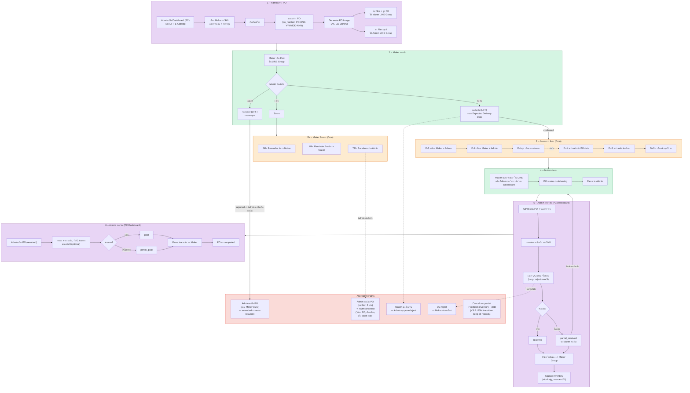
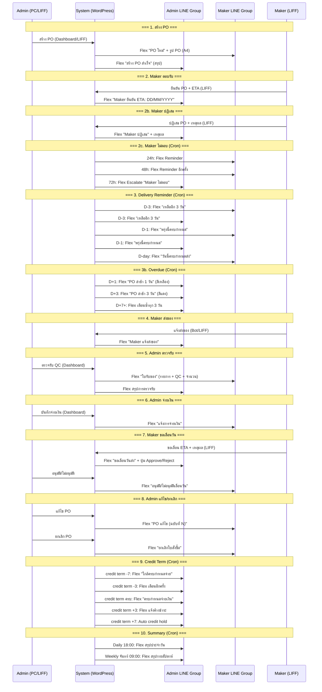

# DINOCO Workflow Reference -- Complete Wiki

> Date: 2026-04-09
> Consolidated from: WORKFLOW-MAP.md, B2F-WORKFLOW.md

---

## Table of Contents

1. [B2C Warranty Workflows](#1-b2c-warranty-workflows)
   - 1.1 [Warranty Registration](#11-warranty-registration)
   - 1.2 [Warranty Claim](#12-warranty-claim)
   - 1.3 [Warranty Transfer](#13-warranty-transfer)
2. [B2B Distributor Workflows](#2-b2b-distributor-workflows)
   - 2.1 [B2B Order (LINE Bot)](#21-b2b-order-line-bot)
   - 2.2 [Walk-in Order Flow](#22-walk-in-order-flow)
   - 2.3 [B2B Payment Flow](#23-b2b-payment-flow)
   - 2.4 [B2B Shipping (Flash Express)](#24-b2b-shipping-flash-express)
3. [B2F Factory Purchasing Workflows](#3-b2f-factory-purchasing-workflows)
   - 3.1 [Create PO (Admin) -- Text](#31-create-po-admin----text)
   - 3.2 [Maker Confirm/Reject PO -- Text](#32-maker-confirmreject-po----text)
   - 3.3 [Maker Delivery -- Text](#33-maker-delivery----text)
   - 3.4 [Receive Goods (Admin) -- Text](#34-receive-goods-admin----text)
   - 3.5 [Payment (Admin to Maker) -- Text](#35-payment-admin-to-maker----text)
   - 3.6 [B2F Full Loop Flow -- Mermaid Diagram](#36-b2f-full-loop-flow----mermaid-diagram)
4. [B2F FSM Diagram (State Machine)](#4-b2f-fsm-diagram-state-machine)
   - 4.1 [Mermaid stateDiagram](#41-mermaid-statediagram)
   - 4.2 [Transition Rules Table](#42-transition-rules-table)
5. [B2F Notification Flow](#5-b2f-notification-flow)
   - 5.1 [Sequence Diagram (Mermaid)](#51-sequence-diagram-mermaid)
   - 5.2 [Notification Matrix](#52-notification-matrix)
   - 5.3 [Credit Term Reminder Timeline](#53-credit-term-reminder-timeline)
6. [Bot Commands per Group](#6-bot-commands-per-group)
   - 6.1 [Admin Group (B2B + B2F)](#61-admin-group-b2b--b2f)
   - 6.2 [Distributor Group (B2B Only)](#62-distributor-group-b2b-only)
   - 6.3 [Maker Group (B2F Only)](#63-maker-group-b2f-only)
7. [AI Chatbot Workflow (OpenClaw Mini CRM)](#7-ai-chatbot-workflow-openclaw-mini-crm)
8. [Finance / Debt Workflows](#8-finance--debt-workflows)
   - 8.1 [B2B Debt Lifecycle](#81-b2b-debt-lifecycle)
   - 8.2 [B2F Credit Lifecycle](#82-b2f-credit-lifecycle)
9. [Cron Jobs Schedule](#9-cron-jobs-schedule)
   - 9.1 [B2B Cron Jobs](#91-b2b-cron-jobs)
   - 9.2 [B2B Single Events (Dynamic)](#92-b2b-single-events-dynamic)
   - 9.3 [B2F Cron Jobs -- Table](#93-b2f-cron-jobs----table)
   - 9.4 [B2F Cron Jobs -- Gantt Chart](#94-b2f-cron-jobs----gantt-chart)
   - 9.5 [B2F Cron Schedule Detail](#95-b2f-cron-schedule-detail)
   - 9.6 [B2F Cron Notes](#96-b2f-cron-notes)
   - 9.7 [System Cron Jobs](#97-system-cron-jobs)
10. [Inventory Flow (V.6.0 -- 3-Level Hierarchy)](#10-inventory-flow-v60----3-level-hierarchy)
11. [Appendix: B2F Architecture Reference](#11-appendix-b2f-architecture-reference)

---

## 1. B2C Warranty Workflows

### 1.1 Warranty Registration

```
Trigger: ลูกค้าสแกน QR / เปิดลิงก์ลงทะเบียน

1. เข้าหน้า [dinoco_gateway] (LINE Callback)
2. กดปุ่ม "Login with LINE" → redirect LINE Login OAuth
3. LINE redirect กลับ → สร้าง/link WP user
4. หน้า Dashboard [dinoco_dashboard] → กดลงทะเบียน
5. กรอก Serial Number + เลือกรุ่นมอเตอร์ไซค์
6. อัพโหลดรูปสินค้า + ใบเสร็จ
7. กรอกที่อยู่ (ถ้ายังไม่มี) → ยืนยัน PDPA
8. สร้าง warranty_registration CPT
9. → แสดงหน้า Assets List

End State: warranty_registration สถานะ active
```

### 1.2 Warranty Claim

```
Trigger: ลูกค้ากด "แจ้งเคลม" ในหน้า Dashboard

1. เลือกสินค้าที่จะเคลม (จาก assets list)
2. เลือกประเภท: ซ่อม (repair) / ชิ้นส่วนทดแทน (parts)
3. อธิบายปัญหา + อัพโหลดรูปประกอบ
4. สร้าง claim_ticket CPT → status = "Registered in System"
5. (Admin) ตรวจสอบ → เปลี่ยนสถานะตามขั้นตอน

Claim Statuses:
  repair:  Registered → Awaiting Customer Shipment → In Transit → Received at Company
           → Under Maintenance → Maintenance Completed → Repaired Item Dispatched
  parts:   Registered → Pending Issue Verification
           → Replacement Approved → Replacement Shipped
           OR → Replacement Rejected by Company
                (ไม่ใช่ dead end -- Admin สามารถ re-review กลับไป Approved ได้)

Auto-close: Cron job (daily) ปิดอัตโนมัติหลัง 30 วัน สำหรับ 3 สถานะ:
  - Replacement Shipped
  - Repaired Item Dispatched
  - Replacement Rejected by Company
End State: claim_ticket สถานะ closed/resolved
```

### 1.3 Warranty Transfer

```
Trigger: ลูกค้ากด "โอนสินค้า" ในหน้า Dashboard

1. กรอกเบอร์โทรผู้รับ
2. ระบบค้นหาสมาชิกจากเบอร์โทร
3. ถ้าเจอ → แสดงชื่อ + ยืนยันโอน
4. โอน warranty_registration ไปยัง user ใหม่
5. → แสดงผลสำเร็จ

End State: warranty_registration เปลี่ยน owner
```

---

## 2. B2B Distributor Workflows

### 2.1 B2B Order (LINE Bot)

```
Trigger: ตัวแทนพิมพ์ "@DINOCO" หรือ "สั่งของ" ในกลุ่ม LINE

1. Bot ส่ง Flex Menu carousel → ลูกค้ากด "สั่งของ"
2. เปิด LIFF E-Catalog (/b2b-catalog/)
3. Auth: HMAC signed URL → POST /b2b/v1/auth-group → JWT token
4. แสดง catalog + ราคาตาม rank tier
5. ลูกค้าเลือกสินค้า + ใส่จำนวน → กดตะกร้า → Modal สรุป
6. กรอกหมายเหตุ (optional) → กดยืนยัน
7. POST /b2b/v1/place-order → สร้าง b2b_order (status: draft → checking_stock)
8. Bot ส่ง Flex "ออเดอร์ใหม่" → กลุ่ม Admin

------- Admin Flow -------

9.  Admin ดู Dashboard / LIFF → กด "ยืนยัน"
10. Status: checking_stock → awaiting_confirm (ตัด leaf SKUs ผ่าน dinoco_get_leaf_skus() V.6.0)
11. Bot ส่ง Flex "ยืนยันสต็อก" → กลุ่มลูกค้า

12. ลูกค้ากด "ยืนยันบิล" → awaiting_confirm → awaiting_payment
13. Bot ส่ง Flex Invoice + ข้อมูลธนาคาร → กลุ่มลูกค้า

14. ลูกค้าโอนเงิน → ส่งรูปสลิปในกลุ่ม
15. Bot จับรูป → Slip2Go verify → ถ้าผ่าน → paid
16. Bot ส่ง Flex ใบเสร็จ → กลุ่มลูกค้า

17. Admin Flash Create → packed → courier pickup → shipped
18. Cron: 3 วันหลัง shipped → ถามลูกค้า "ได้รับของไหม?"
19. ลูกค้ายืนยัน / Auto 7 วัน → completed

Cancel Flow (V.39.2 + V.6.0 leaf-only):
  - Admin กด @admincancel #ID หรือกดยกเลิกใน Dashboard
  - POST /b2b/v1/cancel-request → ใช้ FSM transition (status history recorded)
  - คืนสต็อก: dinoco_get_leaf_skus() resolve → dinoco_stock_add() เฉพาะ leaf SKUs + guard `_stock_returned` ป้องกันคืนซ้ำ (V.31.7)
  - cascade dinoco_stock_auto_status() + ancestor cache invalidation (V.6.0)
  - คืนหนี้ (ถ้า is_billed): b2b_recalculate_debt()
  - ส่ง Flex แจ้งยกเลิก → กลุ่มลูกค้า + Admin

End State: b2b_order สถานะ completed หรือ cancelled
```

### 2.2 Walk-in Order Flow

```
Trigger: Walk-in distributor (is_walkin=1) สั่งของผ่าน LINE Bot/LIFF

1-7. เหมือน flow ปกติ
8.   Walk-in: draft → awaiting_confirm (ข้ามเช็คสต็อก)
9.   ลูกค้ายืนยันบิล → awaiting_payment
10.  จ่ายเงิน → paid
11.  Auto-complete ทันที (ข้ามเลือกวิธีส่ง)

Walk-in Cancel:
  - Admin สามารถยกเลิก completed walk-in order ได้
  - completed → cancelled (admin only, FSM V.1.3)
  - คืนสต็อก: dinoco_get_leaf_skus() resolve → dinoco_stock_add() เฉพาะ leaf SKUs + guard `_stock_returned` ป้องกันคืนซ้ำ (V.31.7)
  - cascade ancestor status + cache (V.6.0)
  - คืนหนี้อัตโนมัติ (is_billed check + b2b_recalculate_debt)

End State: b2b_order สถานะ completed หรือ cancelled
```

### 2.3 B2B Payment Flow

```
Trigger: ลูกค้าส่งรูปสลิปในกลุ่ม LINE

1. Bot จับรูปภาพ (image message)
2. Download รูปจาก LINE Content API
3. ส่งไป Slip2Go API verify
4. Match ยอดเงิน ±2% กับ order ค้างชำระ
5. ถ้าผ่าน:
   a. Status → paid
   b. หักหนี้ (b2b_debt_subtract)
   c. ส่ง Flex ใบเสร็จ → กลุ่มลูกค้า
   d. ส่ง Flex แจ้ง Admin
6. ถ้าไม่ผ่าน:
   a. ส่ง Flex "สลิปไม่ผ่าน" → กลุ่มลูกค้า
   b. แจ้ง Admin ตรวจสอบ

Walk-in Bank Account:
  - Walk-in orders ใช้บัญชี B2B_WALKIN_BANK_* (ถ้า define)
  - Slip verify accept ทั้ง 2 บัญชี (ปกติ + walk-in)

End State: Order paid, debt updated
```

### 2.4 B2B Shipping (Flash Express)

```
Trigger: Admin กด "จัดส่ง Flash" ใน Dashboard

1. POST /b2b/v1/flash-create → สร้าง Flash order
2. Flash API return pno (tracking number) + sort code
3. Generate label → print
4. Status: paid → packed
5. POST /b2b/v1/flash-ready-to-ship → เรียก courier pickup
6. Courier pickup → packed → shipped
7. Flash Tracking Cron (every 2 hours):
   a. Poll Flash API for status updates
   b. Update order status accordingly
   c. "Signed" → 24hr auto-complete
   d. "Detained" → alert admin

Manual Shipping:
  - Admin กด "จัดส่งเอง" → ใส่ tracking number → shipped
  - Manual Flash (/manual-ship): standalone (ไม่ต้องมี B2B order)
  - Webhook Status Update (V.40.8): Flash webhook อัพเดทสถานะ manual shipment อัตโนมัติ (picked_up → in_transit → delivered). `b2b_flash_manual_shipment_webhook()` ใน Snippet 3 จับ PNO ที่ไม่ใช่ B2B ticket แล้วค้นหา+อัพเดทใน wp_options manual shipments
  - V.41.0 Features (9 items):
    * Flash Label: ดึง label จาก Flash API + แสดง/print ผ่าน RPi (`manual-flash-label` + `manual-reprint`)
    * Check Status: modal เช็คสถานะ Flash ตาม PNO (`manual-flash-status`) + Thai status labels
    * Test Flash: ทดสอบ Flash API connectivity (`manual-flash-test`)
    * Status Polling: cron `b2b_manual_flash_poll_cron` อัพเดทสถานะ active shipments อัตโนมัติ
    * Tracking Links: PNO แสดงเป็น link ไป Flash tracking
    * Export CSV: ดาวน์โหลดรายการ manual shipments เป็น CSV
    * Multi-box fix: courier รองรับ all_pnos param (หลายกล่อง)
    * Month helper: `b2b_manual_shipment_months()` ดึงเดือนที่มีข้อมูล
  - V.41.1/V.41.2 (2026-04-16): แยก **pickup (warehouse)** ออกจาก **label (registered)** — mirror B2B ticket flow
    * Bug ก่อนหน้า: sender_key='dinoco' → hardcode srcDetailAddress='21/106 ลาดพร้าว' ส่ง Flash → คูเรียไปที่ 21/106 (registered) แทนที่จะเป็นโกดัง
    * Fix ใน `b2b_rest_manual_flash_create`:
      - `srcDetailAddress` ไป Flash API = `b2b_warehouse_address` option (รามอินทรา 14) → คูเรียมารับที่โกดัง
      - Response `label_sender` = `b2b_registered_address` option (21/106 ลาดพร้าว) → RPi render บน label
      - V.41.2: concat `reg_address + reg_district + reg_province + reg_postcode` → ใบปะหน้าครบทุกส่วน
    * Snapshot `label_sender_*` + `sender_key` ใน shipment record → reprint ได้ idempotent (ถึง option จะเปลี่ยน)
    * RPi `dashboard.py` V.41.0: `api_manual_flash_create` ใช้ `data.label_sender`; `api_manual_reprint_label` แก้ NameError `SENDERS` undefined → ใช้ `label_sender_*` จาก shipment
    * Frontend `manual_ship.html` V.41: ลบ hardcoded src_*, โชว์ 2 บรรทัด (รับของที่ / ใบแปะหน้า)
    * Config: ตั้ง `b2b_warehouse_address` + `b2b_registered_address` ใน B2B Admin → Print Settings
    * Isolation: B2B ticket flow (`b2b_flash_create_order` Snippet 1 + `shipping_label.html`) ไม่ถูกแตะ

End State: Order shipped → completed
```

### 2.10 B2B Backorder System -- Opaque Accept + Admin Split BO (V.1.6, 2026-04-16)

Phase A-D implementation per `FEATURE-SPEC-B2B-BACKORDER-2026-04-16.md`. Master flag `b2b_flag_bo_system` default OFF.

#### 2.10.1 Customer Opaque Accept Flow

```
Agent LIFF → เลือกสินค้า + qty → กด "สั่งซื้อ"
    ↓
POST /b2b/v1/place-order
    ├─ Snippet 3 V.41.4: sanitize + price lookup server-side + duplicate dedup
    ├─ Snippet 16 hook (rest_pre_dispatch priority 5): hard caps + rate limits
    │     * qty ≤ 500/item + items ≤ 50/order
    │     * 10/hr + 50/day + 2000 qty/SKU/day + tier value cap
    │     * unique-SKU/day 20 + suspicious qty flagger (100/500/1000/2000 → Telegram)
    │     * artificial jitter 50-150ms (timing side-channel)
    ├─ สร้าง order status=draft + _b2b_order_draft_at
    └─ fire do_action('b2b_place_order_post_process') — C1 hook
         ↓
Customer รับ Flex card draft → กด "ยืนยันสั่ง" postback
    ↓
Snippet 2 V.34.4 b2b_action_confirm_order:
    ├─ lock + status check (draft)
    ├─ Walk-in path → awaiting_confirm ตามเดิม (skip opaque accept)
    └─ Non-walkin:
         ├─ C2 GATE: if b2b_bo_flag_enabled($dist_id):
         │     ├─ transition draft → pending_stock_review
         │     ├─ snapshot _b2b_stock_snapshot (admin-only, filtered from REST)
         │     ├─ _b2b_opaque_accept_at = now()
         │     ├─ increment daily counters (qty + value per SKU)
         │     ├─ b2b_log_attempt('place_order', accepted)
         │     ├─ b2b_bo_notify_admin_stock_review() — Flex bucket indicator
         │     └─ reply customer OPAQUE "✅ รับคำสั่งซื้อ รอ admin 2-4 ชม."
         └─ else (flag OFF): legacy OOS check → checking_stock (existing flow)

End State: order status=pending_stock_review, awaiting admin review
```

#### 2.10.2 Admin Split Review Flow

```
Admin LINE Group → Flex "🔔 ตรวจสอบสต็อก #ORDER"
    ┌────────────────────────────────────┐
    │ SKU A  สั่ง 10 · ⚠️ ไม่พอ           │ ← bucket only, ไม่มี exact qty
    │ SKU B  สั่ง 5  · ✓ พอ               │
    │ ───────                            │
    │ ยอด: ฿X,XXX · สต็อกไม่พอ 1 รายการ │
    └────────────────────────────────────┘
    [✅ ยืนยันเต็ม]  [⚙️ Split BO]  [❌ ปฏิเสธ]

Option A: [✅ ยืนยันเต็ม]
    → POST /b2b/v1/bo-confirm-full
    → FSM pending_stock_review → awaiting_confirm
    → existing stock subtract + debt flow

Option B: [⚙️ Split BO] → URI deep-link → Admin Dashboard
    → Sidebar → ระบบ B2B → Backorders → Pending Review tab
    → กด "Split" row → open modal:
       ┌─────────────────────────────────┐
       │ SKU A (สั่ง 10 · สต็อก 8)       │
       │   ส่งทันที: [8]  BO: [2]  ETA: [7d] │
       │ SKU B (สั่ง 5 · สต็อก 20)       │
       │   ส่งทันที: [5]  BO: [0]        │
       │ ───────                         │
       │ สรุป: ส่ง 13 · BO 2             │
       └─────────────────────────────────┘
       [ยืนยัน Split]
    → POST /b2b/v1/bo-split
       ├─ validate invariant (qty_fulfill + qty_bo = order_qty per SKU)
       ├─ per-SKU leaf stock subtract (DD-2 — dinoco_get_leaf_skus)
       ├─ insert bo_queue rows (status=pending + eta_date)
       ├─ per-SKU compound debt = Σ(price × qty_fulfill) — M3 FIX precision
       ├─ FSM pending_stock_review → partial_fulfilled
       ├─ set undo window (10 min + 1 max/order)
       └─ notify customer combined Flex (M6 FIX footer [ยืนยันบิล] [ดูออเดอร์])

Option C: [❌ ปฏิเสธ]
    → POST /b2b/v1/bo-reject
    → FSM → cancelled + revert daily counters + notify customer

End State: order is partial_fulfilled (BO pending) OR awaiting_confirm (full) OR cancelled
```

#### 2.10.3 Restock + Fulfill Cycle

```
Cron b2b_bo_restock_scan_cron (every 15 min)
    ↓
SELECT bo_queue WHERE status='pending'
    ↓
ต่อแต่ละ row:
    available = dinoco_compute_hierarchy_stock(sku) - dinoco_get_reserved_qty(sku)
    IF available >= qty_bo:
        UPDATE bo_queue SET status='ready'
        Telegram alert bo_restock_ready
    ↓
Admin Dashboard → Backorders tab → filter status=ready
    ↓
ต่อแถว [ส่ง BO]
    → POST /b2b/v1/bo-fulfill
    ├─ FOR UPDATE lock bo_queue row (H4 DB race fix)
    ├─ per-leaf stock_subtract($leaf, $qty, 'b2b_bo_fulfilled')
    ├─ b2b_debt_add(dist_id, price × qty_bo)
    ├─ IF all bo_queue of order resolved → FSM partial_fulfilled → awaiting_confirm
    ├─ do_action('b2b_bo_items_fulfilled') — H5 + H6:
    │     * H5 Flash secondary order (b2b_flash_create_secondary หรือ b2b_flash_create_order + is_bo_secondary)
    │     * H6 print queue secondary label (b2b_enqueue_print_job source=bo_fulfill หรือ meta _print_queued_bo)
    └─ notify customer Flex BO ready (M7 FIX footer [ยืนยันบิล BO] [ดูออเดอร์])

End State: BO items shipped + debt updated + billing flow continues
```

#### 2.10.4 Cancel / Undo Flows

```
Customer cancel (LIFF) → POST /b2b/v1/cancel-request (Snippet 3 V.41.3)
    ├─ grace period: first 5 min unlimited (legitimate UX)
    ├─ after: 2/hr + 10/day (tighter H4)
    ├─ allowed states: draft, pending, checking_stock, pending_stock_review,
    │     awaiting_confirm, awaiting_payment
    └─ transition → cancel_requested (admin approves/rejects)

Admin undo split (within 10 min) → POST /b2b/v1/bo-undo-split
    ├─ check _b2b_split_undo_deadline > now()
    ├─ check _b2b_undo_count < 1 (H5 — 1 max per order to prevent oscillation)
    ├─ restore stock + delete bo_queue rows + reverse debt
    └─ FSM partial_fulfilled → pending_stock_review

Cron b2b_bo_pending_review_expire_cron (hourly)
    → orders with _b2b_opaque_accept_at > 72h old → auto-cancel + notify
```

#### 2.10.5 Security Alerts Flow

```
Cron b2b_bo_enumeration_scan_cron (hourly)
    ├─ SELECT distributor_id, COUNT(*) FROM attempt_log
    │     WHERE action='cancel' AND created_at > NOW() - INTERVAL 24 HOUR
    │     GROUP BY distributor_id HAVING cnt >= 5
    │     → update_post_meta _b2b_enumeration_flags = 2 (cancel_abuse bit)
    │     → Telegram enumeration_attempt alert
    └─ SELECT distributor_id, COUNT(*) FROM attempt_log
          WHERE rejection_code='QTY_OVER_LIMIT' AND created_at > NOW() - 24 HOUR
          HAVING cnt >= 3
          → update_post_meta _b2b_enumeration_flags = 4 (qty_cap_hit bit)
          → Telegram

Admin Dashboard → Security Log tab
    → filter action/result/days/distributor
    → view flagged distributors list
    → [ดู log] button filter automatic
    → Admin review → [Clear flag] → POST /bo-clear-enum-flag
```

### 2.11 BO Cron Jobs Schedule

| Cron | Interval | Purpose |
|------|----------|---------|
| `b2b_bo_restock_scan_cron` | every 15 min | pending → ready when available ≥ qty_bo |
| `b2b_bo_eta_warn_cron` | daily 09:00 | ETA < +3d → admin reminder Telegram |
| `b2b_bo_pending_review_expire_cron` | hourly | 72h timeout → auto-cancel |
| `b2b_bo_enumeration_scan_cron` | hourly | detect abuse patterns + Telegram |
| `b2b_bo_attempt_log_cleanup_cron` | daily 03:00 | 90d retention, chunked 1000/iter + 50ms gap |

---

## 3. B2F Factory Purchasing Workflows

### 3.1 Create PO (Admin) -- Text

```
Trigger: Admin เปิด LIFF Catalog หรือ B2F Dashboard

1. เลือก Maker จาก dropdown
2. ระบบแสดง product catalog ของ Maker + ราคาทุน
3. เลือก SKU + จำนวน
4. ถ้า foreign (CNY/USD): เลือก shipping method (land/sea) + exchange rate
5. ระบบคำนวณ: total (สกุลโรงงาน), total_thb, shipping_total, grand_total_thb
6. กด Submit → POST /b2f/v1/create-po
7. DD-7: Auto-expand SET → leaf items + snapshot poi_parent_sku/name (V.8.7)
8. สร้าง b2f_order (draft → submitted)
9. ส่ง Flex "New PO" → กลุ่ม Maker (ENG ถ้า non-THB) — items grouped by SET 🟣 (V.6.1)
10. ส่ง Flex "สร้าง PO สำเร็จ" → กลุ่ม Admin — items grouped by SET 🟣 (V.6.1)

End State: b2f_order สถานะ submitted
```

### 3.2 Maker Confirm/Reject PO -- Text

```
Trigger: Maker เปิด LIFF จาก Flex Card

Path A — Confirm:
1. Maker เปิด LIFF confirm page
2. ดูรายการ + ราคา
3. กรอก ETA (expected delivery date)
4. กด Confirm → POST /b2f/v1/maker-confirm
5. Status: submitted → confirmed
6. ส่ง Flex → Admin + Maker groups

Path B — Reject:
1. Maker กด Reject → กรอกเหตุผล
2. POST /b2f/v1/maker-reject
3. Status: submitted → rejected
4. ส่ง Flex → Admin + Maker groups

Path C — Reschedule:
1. Maker กด Reschedule → เลือกวันใหม่ + เหตุผล
2. POST /b2f/v1/maker-reschedule
3. Admin ได้ Flex → Approve/Reject reschedule
4. ถ้า approve: อัพเดท expected_date
5. ถ้า reject: Maker ต้องส่งตามเดิม

End State: confirmed / rejected / reschedule pending
```

### 3.3 Maker Delivery -- Text

```
Trigger: Maker แจ้งส่งของ (LIFF หรือ Bot command)

1. Maker เลือก PO → กรอกจำนวนที่ส่งแต่ละ SKU
2. POST /b2f/v1/maker-deliver (concurrent lock)
3. อัพเดท poi_qty_shipped ใน po_items
4. บันทึก delivery record ใน po_deliveries repeater
5. Status: confirmed → delivering
6. ส่ง Flex → Admin + Maker groups

Partial Delivery:
  - ส่งไม่ครบ → delivering (ไม่เปลี่ยน)
  - Maker ส่งเพิ่มได้ (delivering → delivering)

End State: b2f_order สถานะ delivering
```

### 3.4 Receive Goods (Admin) -- Text

```
Trigger: Admin กด "ตรวจรับ" ใน B2F Dashboard

1. เลือก PO → กรอกจำนวนรับ + QC แต่ละ SKU
2. POST /b2f/v1/receive-goods
3. สร้าง b2f_receiving record
4. คำนวณ rcv_total_value (THB) = qty * unit_cost * exchange_rate
5. เพิ่มหนี้ (b2f_payable_add) → เครดิตเกิดตอน receive เท่านั้น
6. อัพเดท poi_qty_received ใน po_items
7. ถ้ารับครบ: delivering → received
8. ถ้ารับบางส่วน: delivering → partial_received
9. ถ้ามี reject: rcv_has_reject = true → Admin ต้อง resolve

Reject Resolution:
  - POST /b2f/v1/reject-lot → บันทึก reject
  - POST /b2f/v1/reject-resolve → เลือก action:
    a. "reship" → สร้าง replacement PO
    b. "credit" → หักเครดิต Maker
    c. "accept" → ยอมรับ (ไม่ทำอะไร)

End State: received / partial_received
```

### 3.5 Payment (Admin to Maker) -- Text

```
Trigger: Admin กด "บันทึกจ่ายเงิน" ใน B2F Dashboard

1. เลือก PO → กรอกจำนวนเงิน + วิธีจ่าย + slip
2. POST /b2f/v1/record-payment
3. สร้าง b2f_payment record
4. Slip verify:
   - THB: Slip2Go verify → pmt_slip_status
   - CNY/USD: ข้าม verify (admin_approved)
5. หักหนี้ (b2f_payable_subtract)
6. อัพเดท po_paid_amount
7. ถ้าจ่ายครบ: received → paid → completed (auto)
8. ถ้าจ่ายบางส่วน: → partial_paid
9. ส่ง Flex แจ้ง Maker

End State: paid → completed
```

### 3.6 B2F Full Loop Flow -- Mermaid Diagram

แสดง flow ทั้งหมดตั้งแต่ Admin สร้าง PO จนถึง completed รวม alternative paths ทุกเส้นทาง



#### คำอธิบาย B2F Full Loop

B2F Full Loop Flow แสดงการทำงานตลอด lifecycle ของ Purchase Order:

1. **Admin สร้าง PO** -- ทำได้ทั้งบน PC (Admin Dashboard) และ LIFF (E-Catalog) ระบบ generate PO image (A4) แล้วส่ง Flex พร้อมรูปไปทั้ง Maker group และ Admin group
2. **Maker ตอบรับ** -- ยืนยัน (กรอก ETA ผ่าน LIFF), ปฏิเสธ (กรอกเหตุผล), หรือเงียบ (ระบบเตือนอัตโนมัติ 24h/48h/72h escalate)
3. **ติดตามการจัดส่ง** -- Cron เตือนตามกำหนด D-3, D-1, D-day แล้วแจ้ง overdue D+1, D+3, D+7+
4. **Maker ส่งของ** -- แจ้งผ่าน LINE Bot หรือ Admin กดบน Dashboard
5. **Admin ตรวจรับ** -- QC ต่อ SKU, partial delivery support, auto-update inventory
6. **Admin จ่ายเงิน** -- รองรับ partial payment, Flex แจ้ง Maker ทุกครั้ง

Alternative paths: แก้ไข PO (amended), ยกเลิก (cancelled -- V.8.2: FSM transition ไม่ลบ PO, คืนสต็อก received SKUs, เก็บ audit trail + metadata: po_cancelled_reason/by/date), ขอเลื่อนวัน, QC reject, rollback หลัง partial cancel

---

## 4. B2F FSM Diagram (State Machine)

12 สถานะ + transitions + ระบุ actor (admin/maker/system) ทุกเส้น

### 4.1 Mermaid stateDiagram

```mermaid
stateDiagram-v2
    [*] --> draft

    draft --> submitted : Admin submit
    draft --> cancelled : Admin cancel

    submitted --> confirmed : Maker confirm
    submitted --> rejected : Maker reject
    submitted --> amended : Admin amend
    submitted --> cancelled : Admin cancel

    confirmed --> delivering : Maker deliver
    confirmed --> amended : Admin amend
    confirmed --> cancelled : Admin cancel

    amended --> submitted : System auto-resubmit

    rejected --> amended : Admin amend
    rejected --> cancelled : Admin cancel
    rejected --> submitted : Admin re-submit (ไม่แก้ไข)

    delivering --> received : Admin inspect (ครบ)
    delivering --> partial_received : Admin inspect (ไม่ครบ)
    delivering --> confirmed : Admin reject lot -> Maker ส่งใหม่

    partial_received --> delivering : Maker ส่งเพิ่ม
    partial_received --> received : Admin รับครบแล้ว
    partial_received --> cancelled : Admin cancel (rollback inventory+debt)

    received --> paid : Admin จ่ายครบ
    received --> partial_paid : Admin จ่ายบางส่วน
    received --> completed : Admin (sample/ของฟรี)

    partial_paid --> paid : Admin จ่ายเพิ่มจนครบ

    paid --> completed : System auto-complete

    completed --> [*]
    cancelled --> [*]

    note right of draft : Admin เพิ่งเริ่มกรอก
    note right of amended : Transient state\nauto-resubmit ทันที
    note right of cancelled : Terminal state\nV.8.2: FSM transition (ไม่ลบ PO)\nrollback สต็อก+หนี้ ถ้ามี receiving\nเก็บ audit trail ทุก record
    note right of completed : Terminal state\nPO จบสมบูรณ์
```

### 4.2 Transition Rules Table

| From | To | Actor | เงื่อนไข |
|------|----|-------|---------|
| `draft` | `submitted` | Admin | Admin กดยืนยัน PO |
| `draft` | `cancelled` | Admin | Admin ยกเลิกก่อนส่ง |
| `submitted` | `confirmed` | Maker | Maker ยืนยัน + กรอก ETA |
| `submitted` | `rejected` | Maker | Maker ปฏิเสธ + เหตุผล |
| `submitted` | `amended` | Admin | Admin แก้ไข PO |
| `submitted` | `cancelled` | Admin | Admin ยกเลิก |
| `confirmed` | `delivering` | Maker | Maker แจ้งส่งของ |
| `confirmed` | `amended` | Admin | Admin แก้ไขหลัง confirm |
| `confirmed` | `cancelled` | Admin | Admin ยกเลิก |
| `amended` | `submitted` | System | Auto-resubmit ทันที (transient state) |
| `rejected` | `amended` | Admin | Admin แก้ไขแล้วส่งใหม่ |
| `rejected` | `cancelled` | Admin | Admin ยกเลิกหลังถูกปฏิเสธ |
| `rejected` | `submitted` | Admin | Admin re-submit โดยไม่แก้ไข |
| `delivering` | `received` | Admin | ตรวจรับครบ |
| `delivering` | `partial_received` | Admin | ตรวจรับไม่ครบ |
| `delivering` | `confirmed` | Admin | Reject ทั้ง lot -> Maker ส่งใหม่ |
| `partial_received` | `delivering` | Maker | Maker ส่งเพิ่ม |
| `partial_received` | `received` | Admin | รับครบแล้ว |
| `partial_received` | `cancelled` | Admin | Cancel + rollback inventory & debt |
| `received` | `paid` | Admin | จ่ายเงินครบ |
| `received` | `partial_paid` | Admin | จ่ายบางส่วน |
| `received` | `completed` | Admin | Sample/ของฟรี (is_sample=true) |
| `partial_paid` | `paid` | Admin | จ่ายเพิ่มจนครบ |
| `paid` | `completed` | System | Auto-complete |

**Terminal States:** `completed`, `cancelled`

---

## 5. B2F Notification Flow

### 5.1 Sequence Diagram (Mermaid)

แสดงว่าใครได้รับ Flex message เมื่อไหร่ แยกตาม Maker Group vs Admin Group



### 5.2 Notification Matrix

| Event | Trigger | Maker Group | Admin Group |
|-------|---------|:-----------:|:-----------:|
| สร้าง PO | Admin submit | Flex + รูป PO | Flex สรุป |
| Maker ยืนยัน | Maker confirm | -- | Flex (ETA) |
| Maker ปฏิเสธ | Maker reject | -- | Flex (เหตุผล) |
| Maker ไม่ตอบ 24h | Cron 09:30 | Flex Reminder | -- |
| Maker ไม่ตอบ 48h | Cron 09:30 | Flex Reminder | -- |
| Maker ไม่ตอบ 72h | Cron 09:30 | -- | Flex Escalate |
| เตือนจัดส่ง D-3 | Cron 08:30 | Flex เตือน | Flex เตือน |
| เตือนจัดส่ง D-1 | Cron 08:30 | Flex เตือน | Flex เตือน |
| เตือนจัดส่ง D-day | Cron 08:30 | Flex เตือน | -- |
| PO ล่าช้า D+1 | Cron 09:00 | -- | Flex (สีเหลือง) |
| PO ล่าช้า D+3 | Cron 09:00 | -- | Flex (สีแดง) |
| PO ล่าช้า D+7+ | Cron 09:00 | -- | Flex ซ้ำทุก 3 วัน |
| Maker แจ้งส่งของ | Maker action | -- | Flex |
| Maker ขอเลื่อนวัน | Maker action | -- | Flex + ปุ่ม approve/reject |
| Admin อนุมัติ/ปฏิเสธเลื่อน | Admin action | Flex ผลการพิจารณา | -- |
| Admin ตรวจรับ | Admin action | Flex ใบรับของ | Flex สรุป |
| Admin จ่ายเงิน | Admin action | Flex แจ้งจ่ายเงิน | -- |
| Admin แก้ไข PO | Admin action | Flex PO ฉบับแก้ไข | -- |
| Admin ยกเลิก PO | Admin action | Flex ยกเลิก | -- |
| Credit term ใกล้ครบ | Cron (Weekly) | -- | Flex เตือนจ่ายเงิน |
| Credit term เลย + hold | Cron (Weekly) | -- | Flex auto hold |
| สรุปประจำวัน | Cron 18:00 | -- | Flex Daily Summary |
| สรุปรายสัปดาห์ | Cron จันทร์ 09:00 | -- | Flex Weekly Summary |

### 5.3 Credit Term Reminder Timeline

| วัน | ระดับ | Action |
|-----|-------|--------|
| credit term **-7** วัน | Friendly | Flex เตือน Admin "ใกล้ครบกำหนดจ่ายเงิน Maker XXX" |
| credit term **-3** วัน | Official | Flex เตือนอีกครั้ง |
| credit term **ครบกำหนด** | Final | Flex "ครบกำหนดจ่ายเงิน" |
| credit term **+3** วัน | Overdue | Flex แจ้งค้างชำระ |
| credit term **+7** วัน | **Auto Hold** | `maker_credit_hold = true`, `reason = auto` -- block สร้าง PO ใหม่ |

---

## 6. Bot Commands per Group

### 6.1 Admin Group (B2B + B2F)

**B2B Commands:**

| Command | Action |
|---------|--------|
| @DINOCO / @mention | ส่ง Flex Menu carousel (3 หน้า) |
| สรุป / สรุปวัน | Trigger daily summary |
| รอยืนยัน | แสดง orders รอยืนยัน |
| ค้างส่ง | แสดง orders ค้างจัดส่ง |
| @admincancel #ID | ยกเลิก order (admin) |
| ดูหนี้ [ชื่อร้าน] | ดูยอดหนี้ตัวแทน |
| จัดส่ง #ID | เริ่ม Flash Create |

**B2F Commands:**

| Command | Action |
|---------|--------|
| สั่งโรงงาน | เปิด B2F Catalog LIFF |
| ดูPO / ดูpoโรงงาน | แสดง PO list |
| สรุปโรงงาน | สรุป B2F stats |
| po#NUMBER | แสดง PO detail |

### 6.2 Distributor Group (B2B Only)

| Command | Action |
|---------|--------|
| @DINOCO / @mention | ส่ง Flex Customer Menu |
| สั่งของ | เปิด LIFF Catalog |
| ดูออเดอร์ | ดูประวัติ order |
| ดูหนี้ | ดูยอดหนี้ตัวเอง |
| (ส่งรูปสลิป) | Auto verify + match payment |

### 6.3 Maker Group (B2F Only)

| Command | Action |
|---------|--------|
| @DINOCO / @mention | ส่ง Flex Maker Menu (ENG if non-THB) |
| ดูPO / View PO | แสดง PO list |
| ส่งของ / Deliver | เปิด LIFF delivery page |
| (ส่งรูปสลิป) | Auto match payment ±2% |

---

## 7. AI Chatbot Workflow (OpenClaw Mini CRM)

```
Trigger: ลูกค้าส่งข้อความผ่าน LINE / Facebook / Instagram

1. Platform webhook → OpenClaw proxy/index.js (V.2.1)
2. Auth middleware → ตรวจ platform token
3. Load conversation from MongoDB
4. AI Provider:
   a. Gemini Flash (primary) → function calling
   b. Claude Sonnet (supervisor) → quality check
5. Available Tools (11):
   - get_product → MCP Bridge → product-lookup
   - get_dealer → MCP Bridge → dealer-lookup
   - check_warranty → MCP Bridge → warranty-check
   - search_kb → MCP Bridge → kb-search
   - create_claim → MCP Bridge → claim-manual-create
   - create_lead → MCP Bridge → lead-create
   - escalate_to_admin → notify admin
   - get_moto_catalog → MCP Bridge → moto-catalog
   - check_stock_status → MCP Bridge → product-lookup (stock_status)
   - dinoco_claim_status → MCP Bridge → claim-status
   - dinoco_create_claim → MCP Bridge → claim-manual-create (platform auto-detect)
6. Anti-hallucination:
   - Prompt layer: strict instructions
   - Tool boundary: only use tool results
   - Output sanitize: claudeSupervisor check
7. Response → platform-specific format → reply
8. Telegram alert → telegram-alert.js → บอส (new chat/escalation/claim)

No message cap (context: 6-10 messages ล่าสุด), Temperature: 0.3 (tools), 0.2 (Claude), 0.4 (claim)
Additional guards (V.8.1): PII masking in history, Claude review text guard, false hallucination fix
```

### 7.1 Auto-Lead V.8.0 Flow

```
Trigger: ลูกค้าพิมพ์ชื่อ+เบอร์ในแชท

1. ai-chat.js detect ชื่อ+เบอร์ในข้อความ
2. create_lead tool → MCP lead-create → MongoDB leads collection
3. lookupProductForLead() → MCP product-lookup → enrich lead ด้วยรูป+ราคา
4. notifyDealerDirect() → LINE Push API → ส่ง Flex card (LeadNotify) ตรงไปตัวแทน
   - Flex: DINOCO CO DEALER header + รูปสินค้า + ราคา + ข้อมูลลูกค้า
   - ไม่ผ่าน WP /distributor-notify (ส่งตรงจาก Agent)
5. Lead status → dealer_notified

Output-based coordination (V.6.3):
- AI ตอบลูกค้าพร้อมชื่อร้าน+เบอร์
- ai-chat.js detect → append "ทางเราจะประสานงานกับตัวแทนให้ครับ"
```

### 7.2 Dealer Notification Flow (V.2.0)

```
Trigger: Lead ใหม่ / สินค้ากลับมามีสต็อก / เตือนติดตาม

1. Event trigger → lead-pipeline.js
2. lookupProductForLead() → enrich product data (รูป+ราคา)
3. Build Flex card (5 builders: LeadNotify, FollowUp, StockBack, DealerReminder, Closed)
4. notifyDealerDirect() → LINE Push API (LINE_CHANNEL_ACCESS_TOKEN)
   - ส่งไป owner_line_uid ของ dealer
   - ถ้าไม่มี → fallback admin group
5. Postback จาก Flex → postback handler → updateLeadStatus (FSM)

Lead Statuses (V.2.0 — 20 statuses):
  new → contacted → interested → dealer_notified → waiting_decision → closed_won
                                                  → waiting_stock → dealer_notified
                                                  → closed_lost
  (ทุก status มีทางไป closed_lost/cancelled)
```

### 7.3 Telegram Command Workflow (น้องกุ้ง V.1.0)

```
Trigger: บอสส่งข้อความใน Telegram @dinoco_alert_bot

1. Telegram webhook → POST /webhook/telegram/{secret}
2. Security check: chat_id == TELEGRAM_CHAT_ID (บอสเท่านั้น)
3. Command parser → route to handler:

   เคลม Commands:
   - "เคลม MC-XXXXX" → ดึงรายละเอียดเคลม
   - "อนุมัติ" → อนุมัติเคลมที่กำลังดูอยู่
   - "ปฏิเสธ [เหตุผล]" → ปฏิเสธเคลมพร้อมเหตุผล
   - "เคลมรอตรวจ" → list เคลมรอ review
   - "เคลมวันนี้" → list เคลมที่เข้าวันนี้

   ตอบลูกค้า Commands:
   - "ตอบ [ชื่อ]: [ข้อความ]" → ส่งข้อความกลับผ่าน platform เดิม
   - "ตอบล่าสุด" → ตอบ conversation ล่าสุดที่ alert
   - Reply alert message → ตอบกลับ conversation ที่ alert นั้น

   Lead/KB/Stats Commands:
   - "ตัวแทน [จังหวัด]" → ค้นหาตัวแทน
   - "Lead วันนี้" → สรุป lead
   - "Lead รอติดต่อ" → leads ที่ยังไม่ contact
   - "KB เพิ่ม/ค้นหา/ทั้งหมด" → จัดการ Knowledge Base
   - "แชทวันนี้" → สถิติ chat
   - "สถิติ AI" → AI performance stats
   - "เทรน [จำนวน]" → generate training set
   - "สถานะ" → system status
   - "ล้างแชท" → clear context
   - "/help" → แสดงรายการคำสั่ง

4. Response → plain text (ป้องกัน Markdown parse error)
5. Command logged → MongoDB telegram_command_log

Cron Jobs (น้องกุ้ง):
- Daily summary: 09:00 ICT → สรุปยอดวันก่อน
- Lead no contact: ทุก 4 ชม. → แจ้ง leads ที่ยังไม่ติดต่อ
- Claim aging: ทุก 4 ชม. → แจ้ง claims ที่ค้างนาน
```

### 7.2 Telegram Alert Flow

```
Trigger: เหตุการณ์สำคัญในระบบ (chat ใหม่ / escalation / claim ใหม่)

1. Event เกิดใน OpenClaw Agent
2. telegram-alert.js V.2.0:
   a. sendTelegramAlert(title, body) → ส่ง text message
   b. sendTelegramReply(chatId, replyToMsgId, text) → reply to specific message
   c. sendTelegramPhoto(chatId, photoUrl, caption) → ส่งรูป
   d. escapeMarkdown(text) → escape special chars
3. บันทึก alert record → MongoDB telegram_alerts collection
   - mapping: message_id ↔ sourceId (เพื่อ reply กลับถูก conversation)
4. init({getDB}) → wire up MongoDB connection ตอน server start
```

---

## 8. Finance / Debt Workflows

### 8.1 B2B Debt Lifecycle

```
1. Admin ยืนยันบิล (confirm_bill):
   → b2b_debt_add(dist_id, amount, 'bill_issued')
   → distributor.current_debt += amount

2. ลูกค้าจ่ายเงิน (slip verified / manual):
   → b2b_debt_subtract(dist_id, amount, 'payment')
   → distributor.current_debt -= amount

3. Source of Truth:
   → b2b_recalculate_debt(dist_id) = Single SQL query
   → SUM(billed orders) - SUM(payments)

4. Credit Control:
   → ถ้า current_debt > credit_limit → credit_hold = true
   → Dunning cron: friendly (7d) → official (14d) → hold (30d)
```

### 8.2 B2F Credit Lifecycle

ทิศทางกลับจาก B2B -- DINOCO เป็นหนี้ Maker

```
1. Admin ตรวจรับของ (receive-goods):
   → b2f_payable_add(maker_id, rcv_total_value, 'goods_received')
   → maker.maker_current_debt += rcv_total_value (THB)
   → เครดิตเกิดตอน receive เท่านั้น (ไม่หักตอน create-po)

2. Admin จ่ายเงิน (record-payment):
   → b2f_payable_subtract(maker_id, amount, 'payment')
   → maker.maker_current_debt -= amount

3. Source of Truth:
   → b2f_recalculate_payable(maker_id) = Single SQL query
   → SUM(rcv_total_value ของ receiving records) - SUM(payments)

4. Auto Hold/Unhold:
   → ถ้า current_debt > credit_limit → auto hold (reason=auto)
   → ถ้า recalculate ลดลงต่ำกว่า → auto unhold
   → Admin hold เอง (reason=manual) → ไม่ auto unhold
```

---

## 9. Cron Jobs Schedule

### 9.1 B2B Cron Jobs

Source: Snippet 7, DB_ID: 56

| Hook | Schedule | Time (ICT) | Description |
|------|----------|------------|-------------|
| `b2b_dunning_cron_event` | Daily | 09:00 | ทวงหนี้ (friendly → official → hold) |
| `b2b_daily_summary_cron` | Daily | 17:30 | สรุปยอดประจำวัน → Admin group |
| `b2b_rank_update_event` | Monthly | วันที่ 1, 00:05 | อัพเดท rank tier |
| `b2b_bo_overdue_check` | Daily | 10:00 | BO เกิน ETA |
| `b2b_auto_complete_check` | Daily | 11:00 | Auto complete 7 วันหลัง shipped |
| `b2b_oos_expiry_check` | Daily | 06:00 | OOS หมดอายุ |
| `b2b_weekly_report_event` | Weekly | Sun 17:30 | สรุปสัปดาห์ |
| `b2b_shipping_overdue_cron` | Daily | 15:00 | สรุปค้างจัดส่ง |
| `b2b_flash_tracking_cron` | Every 2 hours | -- | Poll Flash API tracking |
| `b2b_flex_retry_cron` | Every 1 min | -- | Retry failed Flex sends |
| `b2b_rpi_heartbeat_check` | Every 5 min | -- | RPi heartbeat check |

### 9.2 B2B Single Events (Dynamic)

| Hook | Trigger | Delay | Description |
|------|---------|-------|-------------|
| `b2b_delivery_check_event` | After shipped | 3 days | ถามลูกค้า "ได้รับของไหม?" |
| `b2b_sla_alert_event` | After order created | 10-60 min | SLA alert escalation |
| `b2b_auto_ship_flash_event` | After confirm | 1 hour | Auto Flash create |
| `b2b_flash_24hr_complete` | After Flash signed | 24 hours | Auto complete |
| `b2b_flash_courier_retry` | After Flash fail | Variable | Retry courier notify |
| `b2b_verify_slip_async` | After slip upload | Immediate | Async slip verification |

### 9.3 B2F Cron Jobs -- Table

Source: Snippet 11, DB_ID: 1171

| Hook | Schedule | Description |
|------|----------|-------------|
| `b2f_cron_delivery_reminder` | Daily 09:00 | เตือนจัดส่ง (D-3, D-1, D-day, D+1, D+3, D+7+) |
| `b2f_cron_overdue_check` | Daily 10:00 | เตือน overdue |
| `b2f_cron_maker_noresponse` | Daily 11:00 | Maker ไม่ตอบ (24h, 48h, escalate 72h) |
| `b2f_cron_payment_reminder` | Daily 09:30 | เตือนชำระ (term -7, -3, ครบ, +3, +7 auto hold) |
| `b2f_cron_daily_summary` | Daily 17:30 | สรุปประจำวัน |
| `b2f_cron_weekly_summary` | Weekly Mon | สรุปรายสัปดาห์ |
| `b2f_cron_rejected_escalation` | Daily 10:30 | Rejected PO escalation (7 วันไม่มี action → alert Admin) |
| `b2f_flex_retry_cron` | Every 1 min | Retry failed Flex sends |

### 9.4 B2F Cron Jobs -- Gantt Chart

```mermaid
gantt
    title B2F Cron Jobs -- Daily Schedule (Asia/Bangkok)
    dateFormat HH:mm
    axisFormat %H:%M

    section Daily
    b2f_delivery_reminder (D-3, D-1, D-day)     :active, 08:30, 15m
    b2f_overdue_check (D+1, D+3, D+7+)          :crit, 09:00, 15m
    b2f_maker_noresponse (24h, 48h, 72h esc)     :09:30, 15m
    b2f_rejected_escalation (7d no action)       :10:30, 15m
    b2f_daily_summary                            :18:00, 15m

    section Weekly (จันทร์)
    b2f_payment_due_check (credit term)          :09:00, 15m
    b2f_weekly_summary                           :09:00, 15m

    section Monthly (วันที่ 1)
    b2f_monthly_summary + Maker performance      :09:00, 30m
```



### 9.5 B2F Cron Schedule Detail

| เวลา | ความถี่ | Job Name | รายละเอียด | Query Filter | ส่งถึง |
|------|---------|----------|-----------|--------------|--------|
| **08:30** | Daily | `b2f_delivery_reminder` | เตือน PO ใกล้ ETA: D-3, D-1, D-day | `po_status IN (confirmed, delivering)` AND `po_expected_date` ใกล้ถึง | Maker + Admin |
| **09:00** | Daily | `b2f_overdue_check` | แจ้ง PO เลย ETA: D+1 (เหลือง), D+3 (แดง), D+7+ (ซ้ำทุก 3 วัน) | `po_status IN (confirmed, delivering)` AND `po_expected_date < today` | Admin |
| **09:30** | Daily | `b2f_maker_noresponse` | เตือน Maker ที่ไม่ตอบ: 24h reminder, 48h reminder, 72h escalate Admin | `po_status = submitted` AND `post_date` เกิน threshold | 24h/48h: Maker, 72h: Admin |
| **10:30** | Daily | `b2f_rejected_escalation` | Rejected PO ค้างเกิน 7 วันไม่มี action (amend/cancel) → alert Admin ให้ตัดสินใจ | `po_status = rejected` AND `po_rejected_date + 7 days < today` | Admin |
| **18:00** | Daily | `b2f_daily_summary` | สรุปประจำวัน: PO ใหม่, delivery วันนี้, overdue, payments | ทุก PO ที่ active | Admin |
| **09:00** | Weekly (จันทร์) | `b2f_payment_due_check` | ตรวจ PO ที่รับของแล้วยังไม่จ่ายเงิน, ใกล้/เลย credit term | `po_status IN (received, partial_paid)` AND credit term calculation | Admin |
| **09:00** | Weekly (จันทร์) | `b2f_weekly_summary` | สรุปรายสัปดาห์: PO ใหม่/ปิด, outstanding payments, Maker performance | Aggregate ทั้งสัปดาห์ | Admin |
| **09:00** | Monthly (วันที่ 1) | `b2f_monthly_summary` | สรุปรายเดือน: ยอดสั่งซื้อ, ต้นทุนรวม, Maker performance rating, overdue % | Aggregate ทั้งเดือน | Admin |

### 9.6 B2F Cron Notes

- แยกเวลา cron (08:30, 09:00, 09:30) เพื่อกระจาย DB load ไม่ให้ spike พร้อมกัน
- แนะนำใช้ real system crontab (`wp-cron.php`) แทน WP pseudo-cron เพราะ reminder ต้อง reliable
- ทุก cron query filter เฉพาะ status + date range ที่เกี่ยวข้อง ไม่ scan ทุก PO
- ใช้ `po_last_reminder_sent` ป้องกันส่ง reminder ซ้ำในวันเดียวกัน
- Timezone: `Asia/Bangkok` (hardcoded ทั้งระบบ)

### 9.7 System Cron Jobs

| Hook | Schedule | Source | Description |
|------|----------|--------|-------------|
| `dinoco_daily_auto_close_event` | Daily | Admin Service Center | Auto-close claim tickets 30 วันหลังเข้าสถานะ: Replacement Shipped, Repaired Item Dispatched, Replacement Rejected by Company |
| `b2b_cleanup_old_invoices` | Daily (on summary) | B2B Snippet 10 | Cleanup old invoice images |
| `b2b_cleanup_old_slips` | Daily (on summary) | B2B Snippet 3 | Cleanup old slip images |
| `dinoco_inv_cron_reminder` | Daily 09:00 | Manual Invoice | Invoice payment reminders |
| `dinoco_inv_cron_overdue` | Daily | Manual Invoice | Overdue invoice notices |

### 9.8 OpenClaw Cron Jobs (Node.js)

| Job | Schedule | Source | Description |
|-----|----------|--------|-------------|
| Telegram Daily Summary | Daily 09:00 ICT | telegram-gung.js | สรุปยอดวันก่อน (chat, lead, claim) ส่ง Telegram |
| Telegram Lead No Contact | Every 4 hours | telegram-gung.js | แจ้ง leads ที่ยังไม่ติดต่อ |
| Telegram Claim Aging | Every 4 hours | telegram-gung.js | แจ้ง claims ที่ค้างนาน (reviewing > 48h, etc.) |

---

## 10. Inventory Flow (V.6.0 -- 3-Level Hierarchy)

### 10.1 Stock Architecture

```
Custom Tables (Snippet 15):
  - dinoco_warehouse_stock: per SKU per warehouse (stock_qty จริง)
  - dinoco_stock_transactions: audit trail ทุกการเปลี่ยนแปลง
  - dinoco_warehouses: multi-warehouse support (โกดังหลัก default)
  - dinoco_dip_stock + dinoco_dip_stock_items: physical count sessions

Atomic Operations:
  - dinoco_stock_add($sku, $qty, $type, $warehouse_id, $user_id)
  - dinoco_stock_subtract($sku, $qty, $type, $warehouse_id, $user_id)
  - ทุกการเปลี่ยนแปลงผ่าน FOR UPDATE lock ป้องกัน race condition
```

### 10.2 3-Level SKU Hierarchy (V.6.0)

```
โครงสร้าง 3 ระดับ:
  แม่ (Top-level Set)
    └── ลูก (Sub-Set / ชิ้นส่วน)
         └── ชิ้นส่วนย่อย (Leaf / ชิ้นเดี่ยว)

ตัวอย่าง:
  ชุดแต่งเต็มคัน (SET-FULL)
    ├── ชุดกันล้ม (SET-GUARD)
    │    ├── กันล้มหน้า (SKU-FRONT)      ← leaf
    │    └── กันล้มหลัง (SKU-REAR)       ← leaf
    └── ชุดกล่อง (SET-BOX)
         ├── กล่องข้าง L (SKU-SIDE-L)    ← leaf
         ├── กล่องข้าง R (SKU-SIDE-R)    ← leaf
         └── กล่องหลัง (SKU-TOP)         ← leaf

Stock Computation:
  - Leaf SKU: ใช้ stock_qty จาก dinoco_warehouse_stock ตรงๆ
  - Sub-Set (SET-GUARD): MIN(SKU-FRONT stock, SKU-REAR stock)
  - Top-level (SET-FULL): MIN(SET-GUARD computed, SET-BOX computed)
  - Function: dinoco_compute_hierarchy_stock() — recursive MIN

Helper Functions (PART 1.35):
  - dinoco_get_leaf_skus($sku)       → resolve ลง leaf nodes
  - dinoco_is_leaf_sku($sku)         → ไม่มี children = leaf
  - dinoco_get_ancestor_skus($sku)   → หา parent ทุกระดับขึ้น
  - dinoco_compute_hierarchy_stock() → recursive MIN stock
  - dinoco_is_top_level_set($sku)    → เป็น parent ไม่เป็น child ของใคร
  - dinoco_validate_sku_hierarchy()  → validate depth ≤ 3, no circular ref
  - dinoco_get_sku_tree($sku)        → nested tree สำหรับ UI
```

### 10.3 Stock Deduction Flow (B2B Order)

```
Trigger: Admin ยืนยัน order → status: checking_stock → awaiting_confirm

Flow (Snippet 2 V.34.2 — walk-in allow_negative):
  1. วน order_items แต่ละ SKU
  2. Detect _b2b_is_walkin meta → set $allow_neg flag
  3. dinoco_get_leaf_skus($sku) → resolve เป็น leaf SKUs (V.7.1 value-copy visited)
  4. dinoco_stock_subtract($leaf, $qty, ..., $allow_neg) — walk-in = true ให้ติดลบได้
  5. dinoco_stock_auto_status() → อัพเดท stock_status ของ leaf
  6. dinoco_get_ancestor_skus($leaf) → หา parent ทุกระดับ
  7. cascade dinoco_stock_auto_status() ขึ้น ancestor ทุกตัว
  8. Delete transient cache (leaf + ancestors)

Cancel / Stock Restore (Snippet 2 + Snippet 5 V.32.0):
  1. dinoco_get_leaf_skus($sku) → resolve เป็น leaf SKUs
  2. dinoco_stock_add() เฉพาะ leaf SKUs (คืนสต็อก)
  3. Guard: _stock_returned meta ป้องกันคืนซ้ำ (V.31.7)
  4. Cascade status + cache invalidation เหมือน deduction
```

### 10.4 B2F Receive → Stock Addition

```
Trigger: Admin ตรวจรับของจาก Maker → POST /b2f/v1/receive-goods

Flow:
  1. สร้าง b2f_receiving record
  2. วน rcv_items → dinoco_stock_add() per SKU (leaf เสมอเพราะ B2F สั่งชิ้นส่วน)
  3. dinoco_stock_auto_status() + cascade ancestor
  4. b2f_payable_add() เพิ่มหนี้
```

### 10.5 Additional Features

```
Dip Stock (Physical Count):
  - เริ่ม session → snapshot เฉพาะ leaf SKUs (dinoco_is_leaf_sku filter)
  - นับจริง → เปรียบเทียบกับ expected → variance report
  - Approve → adjust stock ผ่าน dinoco_stock_add/subtract

Inventory Valuation:
  - WAC (Weighted Average Cost) per SKU
  - ใช้ dinoco_compute_hierarchy_stock() แทน raw stock (V.6.0)
  - THB เสมอ (foreign currency × exchange_rate ตอน B2F receive)

Stock Forecasting:
  - avg_daily_usage จาก outbound transactions (b2b_reserved, b2b_shipped, manual_subtract)
  - days_of_stock, reorder_in_days, suggested_order_qty
  - Guard: ต้องมี data >= 30 วัน

Multi-Warehouse:
  - dinoco_warehouses table (โกดังหลัก = default)
  - dinoco_get_total_stock($sku) รวมทุกคลัง
  - dinoco_transfer_stock($sku, $from, $to, $qty)
```

### 10.6 Auto-Split Workflow (V.41.0 → V.42.11)

```
Purpose: แยกสินค้าเดี่ยวหรือ child → 2-6 ชิ้นส่วนย่อย ในคลิกเดียว (V.42.11 N-part)

Entry: Admin Inventory → Edit product (single หรือ child) → กด "Auto-Split"

Pre-check (V.42.8 + V.42.11):
  - type = 'single' หรือ 'child' (V.42.8 allow single)
  - parent ต้องยังไม่มี children (skuRelations[parent].length === 0)
  - ถ้า -sfx orphan มีอยู่แล้ว (V.42.7 resume mode) → allow resume ถ้าไม่ได้ link กับ parent ไหน

N-part Selection (V.42.11):
  - Count chips: 2 / 3 / 4 / 5 / 6 ชิ้น (default 2)
  - Pattern chips filter ตาม count:
    * 2-part: L|R, U|D, F|B, FR|RR
    * 3-part: L|R|U, L|R|T, F|L|R
    * 4-part: L|R|U|D, F|B|L|R
    * custom: กำหนด suffix เอง (ทำงานทุก count)
  - Columns render dynamic ผ่าน renderSplitColumns(n)
  - _splitState.col[1..N] + _splitState.sfx[N]

Price Split Modes (V.42.8 + V.42.11 N-column):
  - equal (default): หาร /N เท่ากัน (last col gets remainder)
  - percent: admin ใส่ % ทั้ง N ช่อง (ต้องรวม 100)
  - quantity: qty_1..qty_N → prices[i] = base * (qty[i] / total)
  - manual: admin กรอกเอง N ช่อง
  → ปุ่ม "คำนวณ" auto-fill ราคาทั้ง N ช่อง

Execute Flow (4 steps + CORS proxy):
  0. generateLabeledImage (V.42.10) — canvas + overlay text
     ├── ลอง load ตรง (crossOrigin=anonymous)
     ├── ถ้า canvas tainted → direct load ไม่ใช้ CORS
     └── ถ้ายังไม่ได้ → POST /dinoco-stock/v1/image-proxy → data URL → canvas OK
  1. save_product × N SKUs (parallel via $.when.apply)
  2. save pricing × N SKUs (parallel)
  3. save_sku_relation parent={parent}, child_skus=[sku1..skuN], confirm_stock_migrate=1 (V.42.5)
      ├── backend detect parent had stock → migrate ไป sku1 (H1)
      └── insert audit: hierarchy_migrate_out (parent) + hierarchy_migrate_in (sku1)
  4. Success → แสดง N edit buttons + reload catalog

Error Handling:
  - Step 4 fail เดิม → orphan -sfx ค้าง (V.42.7 fix: allow resume)
  - Response success:false → แสดง error message จริงจาก backend (V.42.6)
  - Silent fail (HTTP 200 + success:false) → ถูกจับด้วย relationResponse inspection (V.42.6)

Auto-Split Image (V.42.0 → V.42.10):
  - Canvas = aspect ratio ของรูปต้นฉบับ (maxDim 1600)
  - แถบแดงซ้อนทับด้านล่าง 16% ของ canvas height
  - Text overlay (Thai font) 50% ของ bar height
  - jpeg quality 0.9 → upload + overwrite SKU image
  - V.42.10: WP image-proxy fallback แก้ CORS tainted (admin panel ↔ รูป cross-origin)
```

### 10.7 Hierarchy Bug Fixes (V.7.1 / V.42.4-42.8 — 2026-04-10)

```
3 CRITICAL + 2 HIGH bugs จาก audit SKU hierarchy system

🔴 C1/C2 — Shared child (DD-3) แตก
  File: Snippet 15 V.7.1
  Bug: $visited เป็น reference → sibling branches share → shared leaf return 0/empty
  Fix: value-copy + array_unique dedup
  Functions: dinoco_get_leaf_skus, dinoco_compute_hierarchy_stock, dinoco_get_sku_tree

🔴 C3 — Walk-in stock ติดลบไม่ได้
  File: Snippet 15 V.7.1 + Snippet 2 V.34.2
  Bug: max(0, ...) cap เสมอ → ขัด DD-5
  Fix: $allow_negative param + walk-in path ส่ง true (detect _b2b_is_walkin)

🟡 H1 — Auto-Split parent stock หาย
  File: Admin Inventory V.42.4
  Bug: parent มี stock_qty > 0 → กลายเป็น non-leaf → stock หาย (compute ไม่อ่าน parent)
  Fix: save_sku_relation เช็ค becoming_parent → require confirm_stock_migrate flag
       → migrate parent stock → leaf แรก + audit trail (hierarchy_migrate_out/in)

🟡 H2 — Defensive leaf guard
  File: Snippet 15 V.7.1
  Fix: dinoco_stock_add/subtract เพิ่ม guard ต้น function
       → !dinoco_is_leaf_sku → return WP_Error('not_leaf') + log CRITICAL
       → caller ทุกตัวต้อง expand leaf ก่อน (Snippet 2/5 + B2F Snippet 2 ทำถูกแล้ว)

Frontend Fix Wave (V.42.5-42.8):
  V.42.5 — Auto-Split JS ส่ง confirm_stock_migrate=1 auto
  V.42.6 — Manual Edit modal ส่ง flag + inspect relationResponse (silent fail fix)
  V.42.7 — Auto-Split resume from orphan (retry ได้ไม่ติด guard)
  V.42.8 — Price split mode 4 แบบ + type check fix (single) + debug console log
```

### 10.8 Hierarchy Tag System + UX Overhaul (V.42.9 → V.42.14 — 2026-04-10)

```
ปัญหา: Tag "SET" เก่าไม่สื่อโครงสร้าง 3 ระดับ + มีบัคหลายจุดใน Edit modal

V.42.9 CRITICAL — Save grandchild ไม่ได้ (blocker ตั้งแต่ V.40.5)
  Bug: skipRelations = (ptype === 'child' || 'grandchild') → ห้ามส่ง save_sku_relation
       → admin เพิ่ม grandchild ใต้ child → save → skipped → grandchild หาย
  Fix: skip เฉพาะ grandchild + ไม่มี children และไม่เคยมี (everHadChildren check)

V.42.10 CORS Image Proxy
  Bug: Canvas tainted เวลา generateLabeledImage โหลดรูปจาก dinoco.in.th
       บน admin panel akesa.ch (cross-origin) → toBlob throw SecurityError
  Fix: POST /dinoco-stock/v1/image-proxy (server-side fetch + base64)
       - https only, 10MB limit, image/* content-type check, admin only
       - Fallback chain: direct CORS → direct no-CORS → WP proxy data URL
       - data URL = same-origin → no CORS issue

V.42.11 N-part Auto-Split (2-6 parts dynamic)
  เดิม: hardcoded 2 cols L/R
  ใหม่: count chip (2-6) + pattern filter + dynamic render
        - renderSplitColumns(n) สร้าง N cols + accent color
        - parallel save via \$.when.apply(\$, deferreds)
        - applySplitPriceMode รองรับ N cols ทุก mode

V.42.12 Hierarchy Tag Redesign + Skeleton + Case-Insensitive
  - Badge 4 types: purple set / blue child / green grandchild / gray single
    * Contrast AAA (>7:1) ทุกสี
    * Icon Font Awesome: sitemap/puzzle-piece/gear/cube
  - Breadcrumb: child "← {parent}", grandchild "← {gp} › {parent}" คลิกได้
  - Count: set "N ชิ้นส่วน · M ชิ้นย่อย" (รวมหลานใต้ลูก)
  - Filter chips ใหม่: ทั้งหมด / สินค้าเดี่ยว / ชุดหลัก / └─ ชิ้นส่วน / └─ ชิ้นส่วนย่อย
  - Image skeleton loader: .cedit-thumb-wrap + shimmer animation
  - cat(sku) helper: case-insensitive lookup + uppercase cache
    แก้บัค SKU case mismatch (relations uppercase, catalogData mixed)
    → รูปใน Set Components list random N/A
  - computeProductTypes V.42.12: direct_children_count + grandchildren_total
    + grandchildren_count + parent_count (shared child support DD-3)

V.42.13 Leaf-based Classification
  ปัญหา: SET → [L, R] ตรงๆ (2 ชั้น) classify L/R เป็น 'child' ผิด
  เดิม (depth-based): if (myParent && childToParent[myParent]) → grandchild
  ใหม่ (leaf-based):  if (myParent && isLeaf) → grandchild
  Case matrix:
    - SET → [L, R] (flat 2): L/R = grandchild ✅
    - SET → [Upper → [L,R]] (3): Upper=child, L/R=grandchild ✅
    - SET → [Upper(leaf), Lower → [L,R]]: Upper=grandchild, Lower=child ✅
  Breadcrumb: 3 ชั้น (← gp › parent) หรือ 2 ชั้น (← parent เดียว) — เพิ่ม null check
  ไม่กระทบ DD-2 backend (dinoco_get_leaf_skus leaf-aware อยู่แล้ว)

V.42.14 Hybrid Override (Manual admin choice)
  เพิ่ม column ui_role_override VARCHAR(20) DEFAULT 'auto' (auto-migration)
  Backend save_product whitelist: auto / set / child / grandchild / single
  Frontend:
    - UI: radio chips ใน Edit Product modal (5 choices)
    - Hint: "อัตโนมัติ: {auto_type_label}" ให้ admin เห็นว่า auto จะเดาเป็นอะไร
    - computeProductTypes: ถ้า override !== 'auto' && !== autoType → ใช้ override
    - is_override=true → แสดง icon ✋ ต่อท้าย badge label
    - edge cases: override=child/gc/single บนสินค้าไม่มี parent (render ไม่มี breadcrumb)
  สำคัญ: UI layer only — ไม่กระทบ stock / orders / DD-2 (backend ใช้ structure จริง)

V.42.15 Price Suggestion (deprecated — superseded ใน V.42.16)
  เดิม equal-split /N — concept ผิดสำหรับ SET ผสมที่ราคาลูกไม่เท่ากัน

V.42.16 Sum Integrity Check (Phase 2 Redesign)
  เปลี่ยนจาก "แนะนำราคา" → "ตรวจความครบของราคา"
  Header card: parent / sum(children effective) / margin + status
    - ok (|diff| < 1%): เขียว "ราคาสมดุล"
    - loss (sum > parent): แดง "แม่ถูกกว่าผลรวมลูก" (ขาดทุน)
    - profit (sum < parent): ฟ้า "แม่แพงกว่าผลรวมลูก" (margin +)
  Effective cost: ถ้า child เป็น sub-SET → ใช้ sum(grandchildren) แทน child.price
  Per-child: "ราคาจริง X฿ · Y% ของแม่" (contribution %)
  Sub-SET integrity: ถ้ามี grandchildren → เทียบ sum(gc) vs child.price
    - match: "✅ ชิ้นย่อยรวมตรงกับ sub-SET"
    - mismatch: "⚠️ ลูกรวมเกิน/ต่ำกว่า +/-X฿ (+/-Y%)"
  Per-grandchild: "ราคาจริง · Y% ของ sub-SET" (fallback "ของแม่")
  Live update: input handler บน #cat-price debounced 250ms (เหมือน V.42.15)

V.42.17 Margin Analysis (God Mode Only)
  Backend-enforced cost visibility — ไม่ rely on client-side class
  Endpoints:
    POST /dinoco-stock/v1/god-mode/verify — PIN → JWT 30 min (HMAC via DINOCO_JWT)
    GET  /dinoco-stock/v1/margin-analysis?sku=X — header X-Dinoco-God required
  Permissions: manage_options cap + valid god JWT + rate limit 30/min/user
  Helper: dinoco_get_wac_for_skus() batch (Snippet 15 V.7.2) — 1 SQL query
         fallback b2f_maker_product × exchange rate, cache 1 ชม per SKU
  Client flow:
    1. Admin กด god badge → prompt PIN → POST /god-mode/verify → JWT ใน sessionStorage
    2. openEditCatalogModal → ถ้า god → fetchMarginAnalysis(sku) → prefetch _marginContext
    3. updateTierPreview(tid) extend → append profit line ใต้ dealer price
       (client-side math ไม่เรียก API ซ้ำ — แก้ราคา/ส่วนลด → refresh ทันที)
    4. Banner ใน Tier Pricing section: ต้นทุน WAC + source + incomplete warning
  Incomplete handling: partial cost + list missing_wac_leaves (not silent 0)
  Security note: god mode client-side class ยังใช้สำหรับ UI gate (ปุ่ม edit)
                 แต่ cost data enforce ฝั่ง server — DevTools manipulation ไม่เข้า
```

---

## 11. Appendix: B2F Architecture Reference

### ช่องทางทำงานแต่ละ Role

| Role | ช่องทาง | ทำอะไรได้ |
|------|---------|----------|
| **Admin** | PC Dashboard (shortcode tabs) | สร้าง PO, ตรวจรับ, จ่ายเงิน, แก้ไข/ยกเลิก, ดู credit |
| **Admin** | LIFF (E-Catalog) | สร้าง PO |
| **Admin** | LINE Bot (Admin Group) | สั่งโรงงาน, ดู PO, สรุปโรงงาน |
| **Maker** | LINE Bot (Maker Group) | @mention ดู PO, พิมพ์ "ส่งของ" |
| **Maker** | LIFF (Signed URL + JWT) | ยืนยัน/ปฏิเสธ PO, กรอก ETA, ขอเลื่อนวัน |
| **System** | Cron Jobs | Delivery reminder, overdue check, no-response escalate, summaries, credit check |

### B2F Snippet Map

| Snippet | DB_ID | หน้าที่ |
|---------|-------|--------|
| Snippet 0 | 1160 | CPT & ACF Registration (5 CPTs + helpers) |
| Snippet 1 | 1163 | Core Utilities & Flex Builders (LINE push + 13 Flex templates) |
| Snippet 2 | 1165 | REST API (19+ endpoints `/b2f/v1/`) |
| Snippet 3 | 1164 | Webhook Handler & Bot Commands (Maker + Admin B2F commands) |
| Snippet 4 | 1167 | Maker LIFF Pages (`[b2f_maker_liff]` route `/b2f-maker/`) |
| Snippet 5 | 1166 | Admin Dashboard Tabs (Orders + Makers + Credit tabs) |
| Snippet 6 | 1161 | Order State Machine (`B2F_Order_FSM` class) |
| Snippet 7 | 1162 | Credit Transaction Manager (atomic `b2f_payable_add/subtract()`) |

---

## Regression Guard Test Flow (OpenClaw V.1.5)

### CLI Test Flow

```
node scripts/regression.js --mode=gate --severity=critical,high
  ↓
Load scenarios from MongoDB (regression_scenarios collection, active=true)
  ↓
For each scenario (sequential, 2s delay):
  - sourceId = "reg_" + bug_id + "_" + timestamp (isolation)
  - For each turn in scenario.turns:
      - runRegressionTurn(sourceId, turn.message)  ← V.1.5
        ├─ saveMsg(user)            [context persistence]
        ├─ Auto-lead pre-check      [phone regex + bot cue]
        ├─ callDinocoAI(prompt, message, sourceId)
        ├─ Dealer coordination append
        └─ saveMsg(assistant)
      - Capture tools from aiChat._lastToolResults (Array per sourceId)
      - Clear tool results before next turn
  ↓
Cleanup: deleteMany({ sourceId }) + deleteMany({ sourceId }) for ai_memory
  ↓
3-Layer Validation (Hard → Soft short-circuit):
  Layer 1: Regex forbidden/required (0 token, safe-regex2 compiled)
  Layer 2: Tool call check (expected_tools + forbidden_tools)
  Layer 3: Gemini semantic judge (only if hard passes + expect_behavior set)
           └─ JSON envelope prompt (SEC-C3) + fail-closed on error
  ↓
Write to regression_runs collection + console table
  ↓
Exit code: mode=gate → critical fail = 1 (blocks deploy), else 0
```

### Deploy Gate Flow (3-Layer Fail-Fast)

```
Dev: git push origin main
  ↓
Pre-push hook (scripts/git-hooks/pre-push V.2.0)
  ├─ Read stdin refs (git hook spec)
  ├─ Check chatbot files changed?
  │   ├─ No → exit 0 (allow push)
  │   └─ Yes → check agent container running
  │       ├─ No → fail-closed (override: REGRESSION_REQUIRE_AGENT=0)
  │       └─ Yes → docker exec agent regression.js --mode=gate --severity=critical
  │           ├─ Pass → allow push
  │           └─ Fail → block push (override: git push --no-verify)
  ↓
GitHub Actions (.github/workflows/regression-guard.yml)
  ├─ Trigger: push to main (chatbot paths only)
  ├─ Spin up mongodb + agent + seed minimal fixtures
  ├─ Run regression --severity=critical,high (3 min)
  └─ On fail: Telegram alert (regression_fail_gate)
  ↓
SSH deploy (scripts/deploy.sh Step 0)
  ├─ Pre-check: docker compose up mongodb + agent (if not running)
  ├─ Run regression --mode=gate --severity=critical
  │   ├─ Pass → docker compose up -d --build (full deploy)
  │   └─ Fail → abort (override: SKIP_REGRESSION=1 ./deploy.sh)
```

### Dashboard "ระบบกันถอย" Tab Flow

```
Admin opens /dashboard/train → Tab "ระบบกันถอย" (🛡️)
  ↓
GET /dashboard/api/regression/stats (protected via proxy.ts auth)
  ↓ (proxy → agent)
Stats cards: Total / Critical / Last run / Pass rate 7d (trend arrow)
  ↓
GET /dashboard/api/regression/scenarios?filter
  ↓
Table: ID / title / category badge / severity badge / status / action menu
  ↓
Row click → Detail modal
  ├─ [Re-run] → POST /api/regression/run { bug_ids: [...] } (in-memory lock)
  ├─ [Edit] → PATCH (safe-regex2 validation)
  └─ [Delete] → DELETE (soft delete, active=false)
  ↓
[+ Add Scenario]
  ├─ Quick mode: paste conversation → AI auto-suggest fields
  └─ Advanced mode: JSON editor with live validation
```

### Cron Jobs (Nightly)

| Time | Job | Action |
|------|-----|--------|
| 03:00 | Update `pass_rate_7d` | Rolling 7d aggregate from `regression_runs` |
| 03:00 | Drift detection | Alert Telegram ถ้า `pass_rate_7d < 0.9` × ≥3 runs |
| 03:30 | Cleanup stale | Delete `messages` where `sourceId ^= "reg_"` AND `createdAt < 1h` |
| Sun 04:00 | Archive | Scenarios `active=false > 90 days` → summary Telegram |

### Auto-Lead V.8.0 Flow (ในการ regression test)

```
Turn 1: "แถวลาดพร้าวติดตั้งที่ไหน"
  → runRegressionTurn(sourceId, turn1)
  → saveMsg(user)
  → callDinocoAI → Gemini calls dinoco_dealer_lookup
  → reply: "สำหรับ กทม. แอดมินแนะนำร้าน FOX RIDER SHOP..."
  → Dealer append: "ถ้าสะดวกแจ้งชื่อและเบอร์โทร แอดมินจะประสาน..."
  → saveMsg(assistant) ← context for turn 2

Turn 2: "เปรม 0812345678"
  → runRegressionTurn(sourceId, turn2)
  → saveMsg(user)
  → Auto-lead pre-check:
      ├─ phoneMatch = "0812345678" ✓
      ├─ recentMsgs → find lastBotCue "แจ้งชื่อและเบอร์" ✓
      ├─ nameText = "เปรม"
      ├─ dealerName = "FOX RIDER" (regex from dealerMsg)
      ├─ skip callDinocoAI
      └─ return "ขอบคุณค่ะคุณเปรม รับเรื่องแล้วนะคะ แอดมินจะประสานให้ร้าน FOX RIDER ติดต่อกลับ..."
  → saveMsg(assistant)

Cleanup: deleteMany({ sourceId: "reg_REG-005_...") })
```
