# DINOCO Workflow Reference -- Complete Wiki

> Date: 2026-04-09
> Consolidated from: WORKFLOW-MAP.md, B2F-WORKFLOW.md

---

## Table of Contents

1. [B2C Warranty Workflows](#1-b2c-warranty-workflows)
   - 1.1 [Warranty Registration](#11-warranty-registration)
     - 1.1.1 [Member Warranty Registration Flow (sequenceDiagram)](#111-member-warranty-registration-flow-sequencediagram)
   - 1.2 [Warranty Claim](#12-warranty-claim)
   - 1.3 [Warranty Transfer](#13-warranty-transfer)
2. [B2B Distributor Workflows](#2-b2b-distributor-workflows)
   - 2.1 [B2B Order (LINE Bot)](#21-b2b-order-line-bot)
     - 2.1.1 [B2B Order Confirmation Flow (sequenceDiagram)](#211-b2b-order-confirmation-flow-sequencediagram)
   - 2.2 [Walk-in Order Flow](#22-walk-in-order-flow)
   - 2.3 [B2B Payment Flow](#23-b2b-payment-flow)
   - 2.4 [B2B Shipping (Flash Express)](#24-b2b-shipping-flash-express)
   - 2.5 [B2B Order Lifecycle (Full FSM Diagram)](#25-b2b-order-lifecycle-full-fsm-diagram--v18-snippet-14)
3. [B2F Factory Purchasing Workflows](#3-b2f-factory-purchasing-workflows)
   - 3.1 [Create PO (Admin) -- Text](#31-create-po-admin----text)
   - 3.2 [Maker Confirm/Reject PO -- Text](#32-maker-confirmreject-po----text)
   - 3.3 [Maker Delivery -- Text](#33-maker-delivery----text)
   - 3.4 [Receive Goods (Admin) -- Text](#34-receive-goods-admin----text)
   - 3.5 [Payment (Admin to Maker) -- Text](#35-payment-admin-to-maker----text)
   - 3.6 [B2F Full Loop Flow -- Mermaid Diagram](#36-b2f-full-loop-flow----mermaid-diagram)
4. [B2F PO Lifecycle (Full FSM Diagram)](#4-b2f-po-lifecycle-full-fsm-diagram--v17-snippet-6)
   - 4.1 [Mermaid stateDiagram](#41-mermaid-statediagram)
   - 4.2 [Transition Rules Table](#42-transition-rules-table)
5. [B2F Notification Flow](#5-b2f-notification-flow)
   - 5.1 [Sequence Diagram (Mermaid)](#51-sequence-diagram-mermaid)
   - 5.2 [Notification Matrix](#52-notification-matrix)
   - 5.3 [Credit Term Reminder Timeline](#53-credit-term-reminder-timeline)
6. [Bot Commands per Group](#6-bot-commands-per-group)
   - 6.1 [Admin Group (B2B + B2F)](#61-admin-group-b2b--b2f)
   - 6.2 [Distributor Group (B2B Only)](#62-distributor-group-b2b-only)
   - 6.3 [Maker Group (B2F Only)](#63-maker-group-b2f-only)
7. [AI Chatbot Workflow (OpenClaw Mini CRM)](#7-ai-chatbot-workflow-openclaw-mini-crm)
8. [Finance / Debt Workflows](#8-finance--debt-workflows)
   - 8.1 [B2B Debt Lifecycle](#81-b2b-debt-lifecycle)
   - 8.2 [B2F Credit Lifecycle](#82-b2f-credit-lifecycle)
   - 8.3 [Manual Invoice Lifecycle](#83-manual-invoice-lifecycle-v3410--2026-04-28)
9. [Cron Jobs Schedule](#9-cron-jobs-schedule)
   - 9.1 [B2B Cron Jobs](#91-b2b-cron-jobs)
   - 9.2 [B2B Single Events (Dynamic)](#92-b2b-single-events-dynamic)
   - 9.3 [B2F Cron Jobs -- Table](#93-b2f-cron-jobs----table)
   - 9.4 [B2F Cron Jobs -- Gantt Chart](#94-b2f-cron-jobs----gantt-chart)
   - 9.5 [B2F Cron Schedule Detail](#95-b2f-cron-schedule-detail)
   - 9.6 [B2F Cron Notes](#96-b2f-cron-notes)
   - 9.7 [System Cron Jobs](#97-system-cron-jobs)
10. [Inventory Flow (V.6.0 -- 3-Level Hierarchy)](#10-inventory-flow-v60----3-level-hierarchy)
    - 10.0 [Inventory Stock Cycle Sequence Diagram](#100-inventory-stock-cycle-sequence-diagram-v85--2026-04-29)
11. [Appendix: B2F Architecture Reference](#11-appendix-b2f-architecture-reference)

---

## 1. B2C Warranty Workflows

### 1.1 Warranty Registration

```text
Trigger: ลูกค้าสแกน QR / เปิดลิงก์ลงทะเบียน

1. เข้าหน้า [dinoco_gateway] (LINE Callback)
2. กดปุ่ม "Login with LINE" → redirect LINE Login OAuth
3. LINE redirect กลับ → สร้าง/link WP user
4. หน้า Dashboard [dinoco_dashboard] → กดลงทะเบียน
5. กรอก Serial Number + เลือกรุ่นมอเตอร์ไซค์
6. อัพโหลดรูปสินค้า + ใบเสร็จ
7. กรอกที่อยู่ (ถ้ายังไม่มี) → ยืนยัน PDPA
8. สร้าง warranty_registration CPT
9. → แสดงหน้า Assets List

End State: warranty_registration สถานะ active
```

#### 1.1.1 Member Warranty Registration Flow (sequenceDiagram)

End-to-end sequence ตั้งแต่ลูกค้าสแกน QR → LINE Login → กรอก serial number + รุ่นมอเตอร์ไซค์ → ID card OCR (Gemini AI) → สร้าง `warranty_registration` CPT + ผูก `serial_number` → 12-month warranty period start.

Code references: `[System] DINOCO Login Button` (LINE OAuth gateway), `[System] DINOCO Gateway` (registration form), `[System] DINOCO Dashboard` (member assets list), `[Admin System] DINOCO AI Module` (Gemini OCR helper), `dinoco_create_warranty()` helper (CPT factory), Custom Tables `dinoco_moto_brands` + `dinoco_moto_models`.

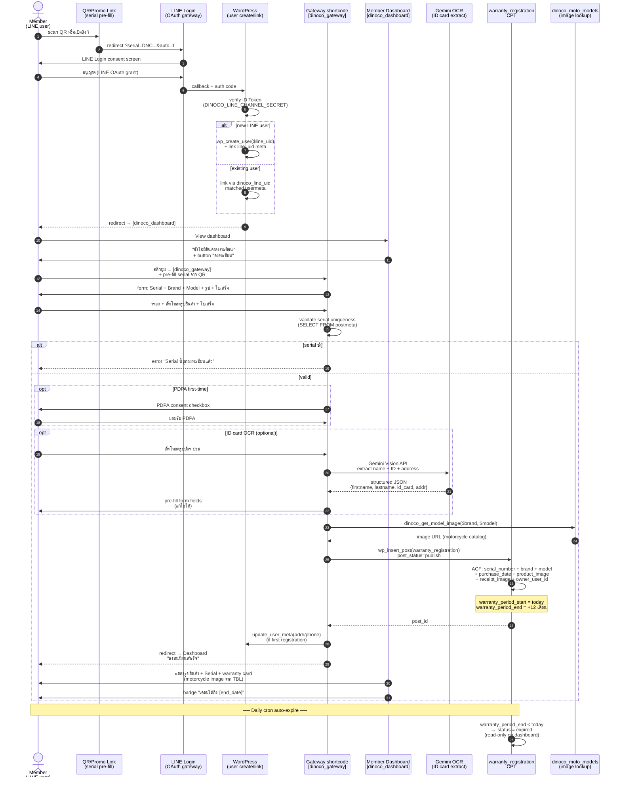

**Edge cases noted in diagram**:

- **Serial uniqueness**: validate ตอน submit (SELECT FROM postmeta) — ไม่ใช่ DB unique constraint เพราะรองรับ legacy migration
- **PDPA consent**: บันทึก usermeta `pdpa_consent_at` first-time only — ไม่ถามซ้ำ ครั้งหน้าลงทะเบียน
- **ID card OCR**: optional + non-blocking — ถ้า OCR fail หรือลูกค้าไม่อัพโหลดบัตร → กรอกเองได้
- **Motorcycle image**: ดึงจาก `DINOCO_MotoDB::get_model_image()` (custom table) — fallback default image ถ้า model ไม่มีรูป
- **Auto-expire**: daily cron set status=expired หลัง 12 เดือน — สมาชิกเห็น warranty card แต่กดเคลมไม่ได้ (claim button hidden)

### 1.2 Warranty Claim

```text
Trigger: ลูกค้ากด "แจ้งเคลม" ในหน้า Dashboard

1. เลือกสินค้าที่จะเคลม (จาก assets list)
2. เลือกประเภท: ซ่อม (repair) / ชิ้นส่วนทดแทน (parts)
3. อธิบายปัญหา + อัพโหลดรูปประกอบ
4. สร้าง claim_ticket CPT → status = "Registered in System"
5. (Admin) ตรวจสอบ → เปลี่ยนสถานะตามขั้นตอน

Claim Statuses:
  repair:  Registered → Awaiting Customer Shipment → In Transit → Received at Company
           → Under Maintenance → Maintenance Completed → Repaired Item Dispatched
  parts:   Registered → Pending Issue Verification
           → Replacement Approved → Replacement Shipped
           OR → Replacement Rejected by Company
                (ไม่ใช่ dead end -- Admin สามารถ re-review กลับไป Approved ได้)

Auto-close: Cron job (daily) ปิดอัตโนมัติหลัง 30 วัน สำหรับ 3 สถานะ:
  - Replacement Shipped
  - Repaired Item Dispatched
  - Replacement Rejected by Company
End State: claim_ticket สถานะ closed/resolved
```

### 1.3 Warranty Transfer

```text
Trigger: ลูกค้ากด "โอนสินค้า" ในหน้า Dashboard

1. กรอกเบอร์โทรผู้รับ
2. ระบบค้นหาสมาชิกจากเบอร์โทร
3. ถ้าเจอ → แสดงชื่อ + ยืนยันโอน
4. โอน warranty_registration ไปยัง user ใหม่
5. → แสดงผลสำเร็จ

End State: warranty_registration เปลี่ยน owner
```

---

## 2. B2B Distributor Workflows

### 2.1 B2B Order (LINE Bot)

```text
Trigger: ตัวแทนพิมพ์ "@DINOCO" หรือ "สั่งของ" ในกลุ่ม LINE

1. Bot ส่ง Flex Menu carousel → ลูกค้ากด "สั่งของ"
2. เปิด LIFF E-Catalog (/b2b-catalog/)
3. Auth: HMAC signed URL → POST /b2b/v1/auth-group → JWT token
4. แสดง catalog + ราคาตาม rank tier
5. ลูกค้าเลือกสินค้า + ใส่จำนวน → กดตะกร้า → Modal สรุป
6. กรอกหมายเหตุ (optional) → กดยืนยัน
7. POST /b2b/v1/place-order → สร้าง b2b_order (status: draft → checking_stock)
8. Bot ส่ง Flex "ออเดอร์ใหม่" → กลุ่ม Admin

------- Admin Flow -------

9.  Admin ดู Dashboard / LIFF → กด "ยืนยัน"
10. Status: checking_stock → awaiting_confirm (ตัด leaf SKUs ผ่าน dinoco_get_leaf_skus() V.6.0)
11. Bot ส่ง Flex "ยืนยันสต็อก" → กลุ่มลูกค้า

12. ลูกค้ากด "ยืนยันบิล" → awaiting_confirm → awaiting_payment
13. Bot ส่ง Flex Invoice + ข้อมูลธนาคาร → กลุ่มลูกค้า

14. ลูกค้าโอนเงิน → ส่งรูปสลิปในกลุ่ม
15. Bot จับรูป → Slip2Go verify → ถ้าผ่าน → paid
16. Bot ส่ง Flex ใบเสร็จ → กลุ่มลูกค้า

17. Admin Flash Create → packed → courier pickup → shipped
18. Cron: 3 วันหลัง shipped → ถามลูกค้า "ได้รับของไหม?"
19. ลูกค้ายืนยัน / Auto 7 วัน → completed

Cancel Flow (V.39.2 + V.6.0 leaf-only):
  - Admin กด @admincancel #ID หรือกดยกเลิกใน Dashboard
  - POST /b2b/v1/cancel-request → ใช้ FSM transition (status history recorded)
  - คืนสต็อก: dinoco_get_leaf_skus() resolve → dinoco_stock_add() เฉพาะ leaf SKUs + guard `_stock_returned` ป้องกันคืนซ้ำ (V.31.7)
  - cascade dinoco_stock_auto_status() + ancestor cache invalidation (V.6.0)
  - คืนหนี้ (ถ้า is_billed): b2b_recalculate_debt()
  - ส่ง Flex แจ้งยกเลิก → กลุ่มลูกค้า + Admin

End State: b2b_order สถานะ completed หรือ cancelled
```

#### 2.1.1 B2B Order Confirmation Flow (sequenceDiagram)

End-to-end sequence ของ confirm_order webhook (postback `act=confirm_order`) ผ่าน LINE Bot — ครอบคลุม BO opaque accept (V.1.6+) + walk-in bypass + atomic stock subtract + debt update + INV image push + courier pickup notification.

Code references: `[B2B] Snippet 2 V.34.7+` (`b2b_action_confirm_order`), `[B2B] Snippet 16 V.3.3` (BO gate + place-order hook), `[B2B] Snippet 15 V.7.x` (`dinoco_stock_subtract` FOR UPDATE), `[B2B] Snippet 13` (`b2b_debt_add` FOR UPDATE), `[B2B] Snippet 10 V.30.x` (`b2b_send_invoice_image`), `[B2B] Snippet 1 V.34.x` (`b2b_flash_dispatch_create_all`).

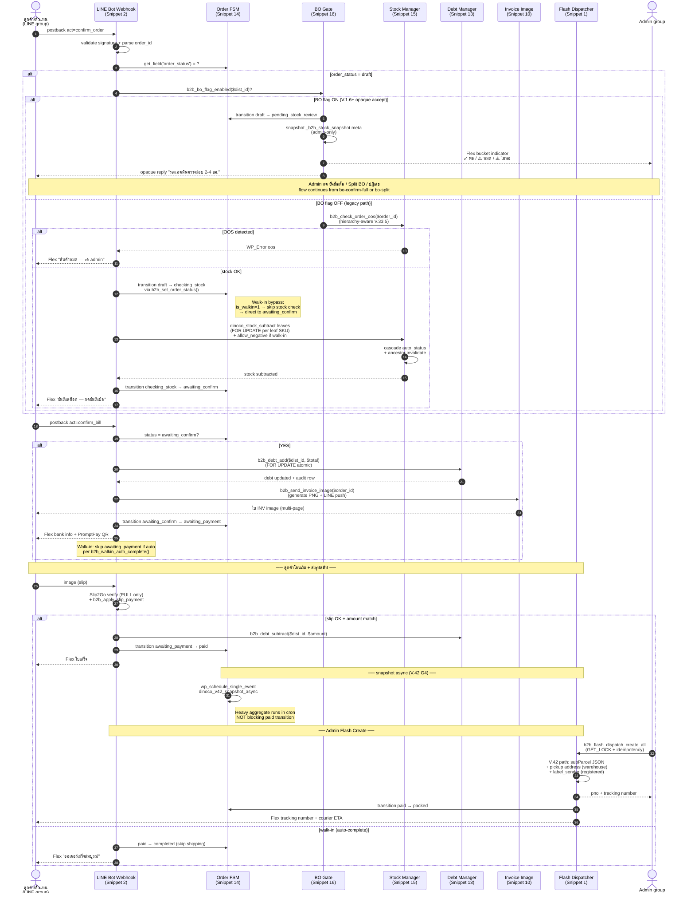

**Edge cases noted in diagram**:

- **Walk-in (`is_walkin=1`)**: ข้ามเช็คสต็อก + auto-complete หลัง paid (skip awaiting_payment + shipping)
- **BO opaque accept (V.1.6+)**: ไม่เผย stock info ลูกค้า + admin Flex bucket indicator (✓/⚠️) + 72hr timeout cron
- **Snapshot async (V.42 G4)**: snapshot ของ shipping metadata ทำใน wp-cron ไม่ block `paid` transition
- **Slip2Go**: PULL-only architecture (no webhook) — bot รับรูปสลิป → API call on-demand → ±2% match
- **Admin Flash Create**: ผ่าน dispatcher (V.42 G1) — GET_LOCK + walk-in guard + idempotency check ป้องกัน race

### 2.2 Walk-in Order Flow

```text
Trigger: Walk-in distributor (is_walkin=1) สั่งของผ่าน LINE Bot/LIFF

1-7. เหมือน flow ปกติ
8.   Walk-in: draft → awaiting_confirm (ข้ามเช็คสต็อก)
9.   ลูกค้ายืนยันบิล → awaiting_payment
10.  จ่ายเงิน → paid
11.  Auto-complete ทันที (ข้ามเลือกวิธีส่ง)

Walk-in Cancel:
  - Admin สามารถยกเลิก completed walk-in order ได้
  - completed → cancelled (admin only, FSM V.1.3)
  - คืนสต็อก: dinoco_get_leaf_skus() resolve → dinoco_stock_add() เฉพาะ leaf SKUs + guard `_stock_returned` ป้องกันคืนซ้ำ (V.31.7)
  - cascade ancestor status + cache (V.6.0)
  - คืนหนี้อัตโนมัติ (is_billed check + b2b_recalculate_debt)

End State: b2b_order สถานะ completed หรือ cancelled
```

### 2.3 B2B Payment Flow

```text
Trigger: ลูกค้าส่งรูปสลิปในกลุ่ม LINE

1. Bot จับรูปภาพ (image message)
2. Download รูปจาก LINE Content API
3. ส่งไป Slip2Go API verify
4. Match ยอดเงิน ±2% กับ order ค้างชำระ
5. ถ้าผ่าน:
   a. Status → paid
   b. หักหนี้ (b2b_debt_subtract)
   c. ส่ง Flex ใบเสร็จ → กลุ่มลูกค้า
   d. ส่ง Flex แจ้ง Admin
6. ถ้าไม่ผ่าน:
   a. ส่ง Flex "สลิปไม่ผ่าน" → กลุ่มลูกค้า
   b. แจ้ง Admin ตรวจสอบ

Walk-in Bank Account:
  - Walk-in orders ใช้บัญชี B2B_WALKIN_BANK_* (ถ้า define)
  - Slip verify accept ทั้ง 2 บัญชี (ปกติ + walk-in)

End State: Order paid, debt updated
```

#### 2.3.1 Slip Verification Sequence Diagram (Mermaid)

แสดงลำดับการยืนยันสลิปใน B2B + B2F (Slip2Go API integration = PULL-only, no webhook).

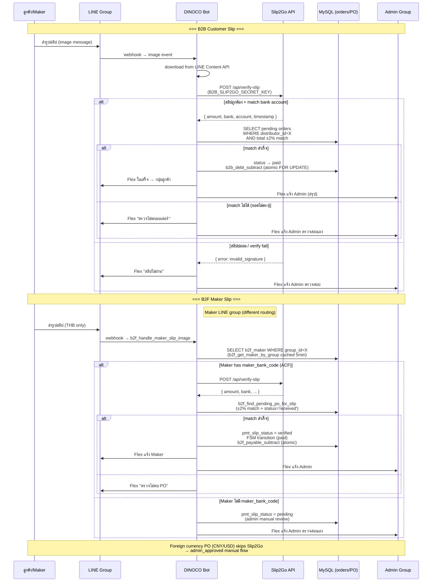

**Implementation refs**:

- B2B: Snippet 2 (`b2b_handle_distributor_slip_image`) + Snippet 3 (slip match query)
- B2F: Snippet 1 (`b2f_verify_slip_image`) + Snippet 3 (`b2f_handle_maker_slip_image`)
- Constants: `B2B_SLIP2GO_SECRET_KEY` (shared B2B + B2F)
- Atomic transactions: `b2b_debt_subtract` / `b2f_payable_subtract` (FOR UPDATE lock)

#### 2.3.2 Slip Replay Pool Cascade + Manual Review Flow (V.34.10+ — 2026-04-24)

**Background**: CNX MotoGear regression incident — สลิป KKP 069 ยอด 2,280 THB ส่งช่วง V.34.7 routing bug → บอทเงียบ + Slip2Go cache 7d → V.34.9 ส่งซ้ำ → Slip2Go return 200501 (duplicate, no trans_ref/amount) → ตัดหนี้ไม่ได้. V.34.10 ปิดด้วย 4-layer architecture: image hash dedup + replay cascade + persisted Slip2Go JSON + admin manual process tool.

##### 2.3.2.1 Replay Cascade State Diagram

แสดง state machine ของ slip processing ในมุมมอง `_slip_final_status` (column ใน `dinoco_slip_log`).

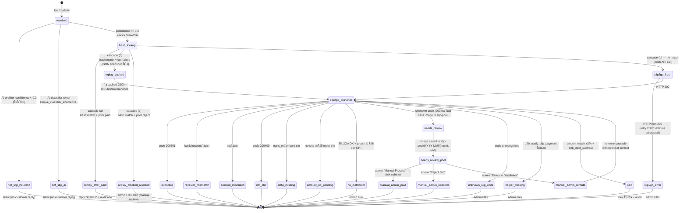

##### 2.3.2.2 Cascade Lookup Sequence (Path a/b/c/d)

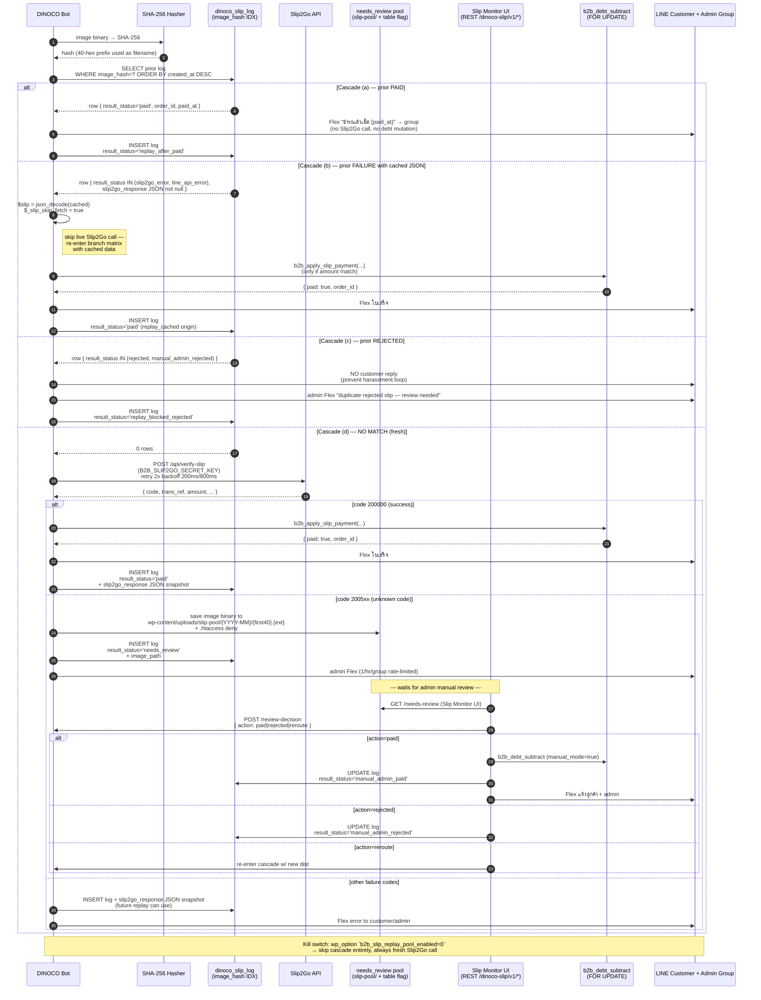

##### 2.3.2.3 Status Enum Reference

| `_slip_final_status` | Customer Reply | Admin Notify | Debt Mutation | Notes |
| --- | --- | --- | --- | --- |
| `paid` | Flex ใบเสร็จ | summary | YES (b2b_debt_subtract) | success path |
| `replay_after_paid` | "ชำระแล้วเมื่อ X" | none | NO | cascade (a) |
| `replay_blocked_rejected` | none (silence) | manual review Flex | NO | cascade (c) prevent loop |
| `needs_review` | none | rate-limited 1/hr | NO | unknown code → pool |
| `unknown_slip_code` | error Flex | yes | NO | unrecognized 200xxx |
| `manual_admin_paid` | Flex via admin action | manual logged | YES (admin-initiated) | from pool review |
| `manual_admin_rejected` | none | manual logged | NO | from pool review |
| `slip2go_error` | retry exhausted message | yes | NO | HTTP non-200 + retry fail |
| `line_api_error` | none | yes | NO | LINE Content API fail |
| `duplicate` | "สลิปซ้ำ" | none | NO | Slip2Go 200501 |
| `receiver_mismatch` | "บัญชีรับโอนไม่ตรง" | none | NO | bank/account differ |
| `amount_mismatch` | "ยอดไม่ตรง" | none | NO | ±2% tolerance fail |
| `amount_no_pending` | "ตรวจไม่พบออเดอร์" | yes (admin manual) | NO | match fail at WP layer |
| `not_slip` / `not_slip_heuristic` / `not_slip_ai` | none | none | NO | filtered out |
| `data_missing` | "ข้อมูลสลิปไม่ครบ" | none | NO | trans_ref/amount null |
| `no_distributor` | none | yes (Flex urgent) | NO | group_id orphan |
| `helper_missing` | error | urgent | NO | b2b_apply_slip_payment unavailable |

##### 2.3.2.4 Audit Trail Sources

- **`dinoco_slip_log`** (Snippet 15 V.8.4+) — every slip processed writes 1 row: `id`, `image_hash`, `image_path`, `slip2go_response JSON`, `result_status`, `error_code`, `error_msg`, `http_code`, `processing_time_ms`, `retry_count`, `created_at`, `manual_mode` (boolean), `actor` ('bot'|'admin')
- **`dinoco_slip_replay_log`** — append-only on cascade hits (a/b/c) + manual review actions (paid/rejected/reroute)
- **REST endpoints** (Slip Monitor namespace `/wp-json/dinoco-slip/v1/`): `monitor`, `recent`, `clear-locks`, `missed-sweep`, `manual-process`, `replay-candidates`, `replay-slip`, `distributors`, `needs-review`, `review-decision`, `pool-image`, `ai-stats`, `ai-toggle`, `credit-note-eligible`, `issue-credit-note`
- **Snippets** wired: `[B2B] Snippet 2` V.34.10+ (orchestrator), `[B2B] Snippet 1` V.34.12+ (helpers `b2b_slip_compute_image_hash`, `b2b_slip_is_trans_ref_seen`), `[B2B] Snippet 15` V.8.6+ (schema + `image_hash` index), `[Admin System] DINOCO Slip Monitor` V.1.13+ (admin UI + REST)

**Rollback**: `update_option('b2b_slip_replay_pool_enabled', 0)` → cascade lookup skipped, every slip = fresh Slip2Go call (V.34.9 behavior). Image hash + JSON snapshots still recorded in slip_log (audit-only, not consumed by short-circuits).

### 2.4 B2B Shipping (Flash Express)

```text
Trigger: Admin กด "จัดส่ง Flash" ใน Dashboard

1. POST /b2b/v1/flash-create → สร้าง Flash order
2. Flash API return pno (tracking number) + sort code
3. Generate label → print
4. Status: paid → packed
5. POST /b2b/v1/flash-ready-to-ship → เรียก courier pickup
6. Courier pickup → packed → shipped
7. Flash Tracking Cron (every 2 hours):
   a. Poll Flash API for status updates
   b. Update order status accordingly
   c. "Signed" → 24hr auto-complete
   d. "Detained" → alert admin

Manual Shipping:
  - Admin กด "จัดส่งเอง" → ใส่ tracking number → shipped
  - Manual Flash (/manual-ship): standalone (ไม่ต้องมี B2B order)
  - Webhook Status Update (V.40.8): Flash webhook อัพเดทสถานะ manual shipment อัตโนมัติ (picked_up → in_transit → delivered). `b2b_flash_manual_shipment_webhook()` ใน Snippet 3 จับ PNO ที่ไม่ใช่ B2B ticket แล้วค้นหา+อัพเดทใน wp_options manual shipments
  - V.41.0 Features (9 items):
    * Flash Label: ดึง label จาก Flash API + แสดง/print ผ่าน RPi (`manual-flash-label` + `manual-reprint`)
    * Check Status: modal เช็คสถานะ Flash ตาม PNO (`manual-flash-status`) + Thai status labels
    * Test Flash: ทดสอบ Flash API connectivity (`manual-flash-test`)
    * Status Polling: cron `b2b_manual_flash_poll_cron` อัพเดทสถานะ active shipments อัตโนมัติ
    * Tracking Links: PNO แสดงเป็น link ไป Flash tracking
    * Export CSV: ดาวน์โหลดรายการ manual shipments เป็น CSV
    * Multi-box fix: courier รองรับ all_pnos param (หลายกล่อง)
    * Month helper: `b2b_manual_shipment_months()` ดึงเดือนที่มีข้อมูล
  - V.41.1/V.41.2 (2026-04-16): แยก **pickup (warehouse)** ออกจาก **label (registered)** — mirror B2B ticket flow
    * Bug ก่อนหน้า: sender_key='dinoco' → hardcode srcDetailAddress='21/106 ลาดพร้าว' ส่ง Flash → คูเรียไปที่ 21/106 (registered) แทนที่จะเป็นโกดัง
    * Fix ใน `b2b_rest_manual_flash_create`:
      - `srcDetailAddress` ไป Flash API = `b2b_warehouse_address` option (รามอินทรา 14) → คูเรียมารับที่โกดัง
      - Response `label_sender` = `b2b_registered_address` option (21/106 ลาดพร้าว) → RPi render บน label
      - V.41.2: concat `reg_address + reg_district + reg_province + reg_postcode` → ใบปะหน้าครบทุกส่วน
    * Snapshot `label_sender_*` + `sender_key` ใน shipment record → reprint ได้ idempotent (ถึง option จะเปลี่ยน)
    * RPi `dashboard.py` V.41.0: `api_manual_flash_create` ใช้ `data.label_sender`; `api_manual_reprint_label` แก้ NameError `SENDERS` undefined → ใช้ `label_sender_*` จาก shipment
    * Frontend `manual_ship.html` V.41: ลบ hardcoded src_*, โชว์ 2 บรรทัด (รับของที่ / ใบแปะหน้า)
    * Config: ตั้ง `b2b_warehouse_address` + `b2b_registered_address` ใน B2B Admin → Print Settings
    * Isolation: B2B ticket flow (`b2b_flash_create_order` Snippet 1 + `shipping_label.html`) ไม่ถูกแตะ

End State: Order shipped → completed
```

### 2.4.1 Flash Shipping V.42 (Per-PNO Metadata — flag-gated)

**Flag**: `dinoco_shipping_meta_enabled` (default OFF). Walk-in orders bypass V.42 entirely (decision #15).

```text
Trigger: Admin confirm_bill → status transitions awaiting_shipping / shipping_scheduled

1. b2b_order_status_changed hook fires (priority 9, before Flash create listener):
   a. dinoco_snapshot_ticket_shipping($ticket_id, $manifest) — M1 immutable snapshot
   b. Writes `_flash_shipping_snapshot` post meta (idempotent, version=42.0)
   c. Contains per-PNO {weight_g, length_cm, width_cm, height_cm, article_category, express_category, source}

2. b2b_flash_dispatch_create_all($ticket_id) router:
   - Walk-in OR flag OFF OR V.42 unavailable → b2b_flash_create_all_boxes (legacy V.41)
   - Flag ON + non-walk-in → b2b_flash_create_all_boxes_v42:
     a. Read _flash_shipping_snapshot (or resolve now if missing)
     b. Pattern B: 1 Flash order with subParcelQuantity + subParcel[] (up to 99)
     c. Each sub-parcel has own weight/dims from resolver
     d. Single parent tracking for customer (save ~30-50 THB/order)
     e. F4 Method 2 routing: warehouseNo from `dinoco_warehouse_mapping`
        * EC=1 (bike) → BKN_SP-บางเขน
        * EC=4 (truck) → 5BKN_PDC-บางเขน
        * Flash reject → fallback Method 1 (srcXXX) + admin Flex
     f. Wrap with dinoco_api_retry (exp backoff 3 tries 1s/2s/5s + jitter 50-150ms)
     g. Retryable: 1003/500/502/504/timeout; abandon: 400/401/403/409/422

3. V.42 failure branches:
   - Retry exhausted → INSERT `dinoco_flash_dead_letter` + b2b_build_flex_flash_dlq_alert
   - Non-retryable → straight to DLQ
   - V.42 code path error → fall back to legacy b2b_flash_create_all_boxes (graceful)

4. F2 Post-create verify (flash_category_verify_cron every 15min):
   a. Poll Flash Routes API per recent ticket
   b. Compare expected_ec (from snapshot) vs actual_ec (Flash response)
   c. Flash auto-bumped → fire b2b_build_flex_flash_category_bumped alert
   d. Log event in `dinoco_flash_audit` (90-day retention)

5. Resolver priority chain (dinoco_resolve_pno_shipping):
   1. Ticket meta `_flash_weight_grams` / `_flash_express_category` (legacy escape hatch)
   2. SKU template-override (length_cm_override / tare_weight_override_g / etc)
   3. Box template via box_template_id (primary for most SKUs)
   4. SKU plain dims (weight_grams / length_cm / etc) — ad-hoc/unknown/legacy
   5. Recursive aggregate from leaves (pack_mode=auto, DD-3 safe via static $memo)
   6. Global defaults (`dinoco_shipping_defaults` option)

6. Pack mode branches (dinoco_resolve_pno_shipping):
   - single_box / assembled_set → content + box_template.tare (+ override)
   - multi_box → per-slot via `dinoco_pack_slots` table
   - bulk_pack → qty_in_box × weight_per_unit + box.tare
   - unknown → plain dims (ad-hoc save-back) / defaults
   - auto → aggregate from leaves recursive

7. BO secondary flow (b2b_flash_create_secondary):
   - On `b2b_bo_items_fulfilled` action (Phase 4)
   - Build mini-manifest from BO items subset only (not full order)
   - Resolve via dinoco_resolve_manifest_shipping → own PNO with BO-specific dims
   - Separate snapshot meta `_flash_shipping_snapshot_bo` from primary

Manual-Ship V.44.0 (RPi /manual-ship):
  - **NEW V.44.0 (2026-04-29)**: Full visual redesign + product picker modal + box-template fix
    * 4-step section flow (Sender → Recipient → Parcel → Submit) with gradient step badges
    * Product picker modal (🔍 ค้นหาสินค้า): search debounce 250ms + filter chips (ทั้งหมด/SET/เดี่ยว) + 52×52 thumbnails + tap-to-pick auto-fills SKU + triggers existing v43AutoFillFromSku()
    * Box Templates dropdown FIX: was empty since V.43.0 — root cause `$inv_perm` requires WP nonce, RPi only has X-Print-Key. NEW endpoint `/b2b/v1/rpi-box-templates` (X-Print-Key auth) replaces broken `/dinoco-stock/v1/box-templates` proxy. ↻ refresh button + count badge added.
    * NEW endpoint `/b2b/v1/rpi-products?search=KW` (slim payload: sku/title/img/catalog_price/dealer_price/children/stock_status/category) ~500 SKUs typical
    * NEW dashboard.py route `/api/product-search?q=KW&nocache=1` (5min cache, thread-safe, atomic write)
    * CSS scoped `.dnc-ship-*` (RPi-specific), mobile-first 560px breakpoint, touch ≥44px
  - V.43 (preserved): Scanner reads SKU → GET /api/sku-auto-fill/<sku> → fills L/W/H/weight from box template
  - V.43.2 safety logic preserved: _dimsDirty tracking, scanner ASCII validate, template confirm-before-overwrite, ad-hoc save-back
  - Ad-hoc SKU (not in catalog) → warehouse_staff enters dims + checks 💾 save → POST save_sku_data=1
  - Ad-hoc save-back creates `wp_dinoco_products` row with pack_mode='unknown' (admin classifies later via M2 queue)
  - D-12 articleCategory: flag ON → default 6 (อะไหล่รถยนต์), flag OFF → 1 (legacy)

Auto-rollback (Phase 5):
  - Cron `dinoco_shipping_auto_rollback_cron` (ten_minutes interval)
  - Trigger: error rate >5% AND absolute count ≥20/hr (both conditions)
  - Action: update_option('dinoco_shipping_meta_enabled', false) + Telegram alert

Rollback (instant):
  update_option('dinoco_shipping_meta_enabled', false)
  → b2b_flash_dispatch_create_all routes to legacy V.41 path
  → byte-identical behavior (REG-029 guarantee)
```

### 2.5 B2B Order Lifecycle (Full FSM Diagram) — V.1.8 (Snippet 14)

ระบบสถานะ order ครบทุกเส้นทาง — รวม legacy stock-check + walk-in + BO opaque accept + cancel_request + change_request + claim flow. ใช้ `B2B_Order_FSM::transition()` (ผ่าน Transaction Wrapper V.1.8 → GET_LOCK per-order + audit log) เป็น single point of mutation. ทุก transition ต้องผ่าน FSM validation (`required_role` + `from_status` whitelist).

**หมายเหตุ stateDiagram**:

- เส้น actor: `customer` (ลูกค้า/ตัวแทน), `admin` (Admin LIFF/Bot/Dashboard), `system` (cron/auto), `any` (ทั้ง 3 ใช้ได้)
- BO flag (`b2b_flag_bo_system`) เปิด ON globally ตั้งแต่ 2026-04-17 — non-walkin ใหม่ทั้งหมดเข้า `pending_stock_review`
- Legacy `checking_stock` ยังทำงานสำหรับ orders เก่าที่สร้างก่อน flag ON + flag OFF path
- Walk-in (is_walkin=1) bypass stock check ทั้งหมด → `draft → awaiting_confirm` ตรง

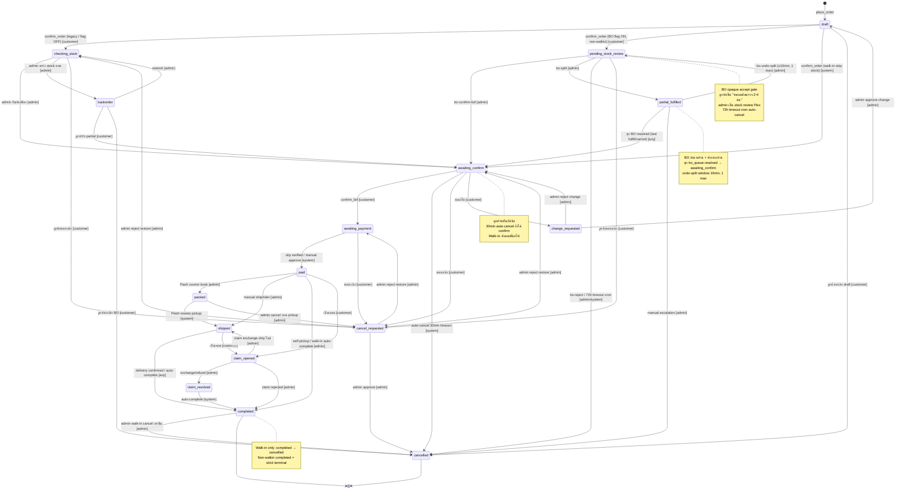

**Transition Rules Table (B2B FSM V.1.8 — Snippet 14):**

| From | To | Actor | Trigger / Notes |
|------|----|-------|-----------------|
| `draft` | `checking_stock` | customer | confirm_order (legacy / BO flag OFF) |
| `draft` | `pending_stock_review` | customer | confirm_order (BO flag ON, non-walkin) |
| `draft` | `awaiting_confirm` | system | Walk-in: skip stock check |
| `draft` | `cancelled` | customer | ลูกค้ายกเลิก draft |
| `checking_stock` | `awaiting_confirm` | admin | admin ยืนยันสต็อก |
| `checking_stock` | `backorder` | admin | สินค้าหมด |
| `checking_stock` | `cancel_requested` | customer | ขอยกเลิก |
| `pending_stock_review` | `awaiting_confirm` | admin | bo-confirm-full (full stock available) |
| `pending_stock_review` | `partial_fulfilled` | admin | bo-split (invariant: Σ qty_fulfill + Σ qty_bo = Σ qty per SKU) |
| `pending_stock_review` | `cancelled` | admin | bo-reject / 72h timeout cron |
| `pending_stock_review` | `cancel_requested` | customer | ขอยกเลิก |
| `partial_fulfilled` | `awaiting_confirm` | any | ทุก bo_queue resolved (`b2b_bo_check_all_resolved`) |
| `partial_fulfilled` | `pending_stock_review` | admin | bo-undo-split (`now() < _b2b_split_undo_deadline` AND undo_count < 1) |
| `partial_fulfilled` | `cancelled` | admin | manual escalation |
| `backorder` | `checking_stock` | admin | restock |
| `backorder` | `awaiting_confirm` | customer | ลูกค้ารับ partial |
| `backorder` | `cancelled` | customer | ลูกค้ายกเลิก BO |
| `awaiting_confirm` | `awaiting_payment` | customer | ลูกค้ายืนยันบิล (confirm_bill) |
| `awaiting_confirm` | `cancelled` | system | auto-cancel 30min timeout (Inventory cron) |
| `awaiting_confirm` | `cancel_requested` | customer | ขอยกเลิก |
| `awaiting_confirm` | `change_requested` | customer | ขอแก้ไข |
| `awaiting_payment` | `paid` | system | slip verify / manual payment |
| `awaiting_payment` | `cancel_requested` | customer | ขอยกเลิก |
| `paid` | `packed` | admin | Flash Express book courier |
| `paid` | `shipped` | admin | manual ship / rider |
| `paid` | `completed` | admin | self-pickup / walk-in auto-complete |
| `paid` | `claim_opened` | customer | เปิดเคลม |
| `packed` | `shipped` | system | Flash courier pickup |
| `packed` | `cancel_requested` | admin | admin cancel ก่อน courier pickup |
| `shipped` | `completed` | any | delivery confirmed / auto-complete |
| `shipped` | `claim_opened` | customer | เปิดเคลม |
| `cancel_requested` | `cancelled` | admin | admin approve cancel |
| `cancel_requested` | `awaiting_payment` | admin | admin reject restore |
| `cancel_requested` | `awaiting_confirm` | admin | admin reject restore |
| `cancel_requested` | `checking_stock` | admin | admin reject restore |
| `change_requested` | `draft` | admin | admin approve change → กลับ draft |
| `change_requested` | `awaiting_confirm` | admin | admin reject change |
| `claim_opened` | `claim_resolved` | admin | exchange / refund |
| `claim_opened` | `completed` | admin | claim rejected |
| `claim_opened` | `shipped` | admin | claim exchange → ship ใหม่ |
| `claim_resolved` | `completed` | system | auto-complete after resolution |
| `completed` | `cancelled` | admin | Walk-in only — non-walkin = strict terminal |

**Terminal States:** `cancelled` (always), `completed` (non-walkin only — walkin can re-cancel)

**Atomic Guards (V.1.8 Phase 4d Transaction Wrapper):**

- ทุก transition acquire GET_LOCK `b2b_fsm_order_<id>` (3s timeout) → serialize concurrent transitions
- Audit row event=`b2b_fsm_transition` with correlation_id chain
- Phase 1.5 in-body `dinoco_audit_log` calls preserved (dual-write index overlay)
- Failure modes logged: `terminal_state` / `invalid_transition` / `permission_denied`
- Hook `do_action('b2b_order_status_changed', $order_id, $current, $new_status, $actor)` fires on success

---

### 2.10 B2B Backorder System -- Opaque Accept + Admin Split BO (V.1.6, 2026-04-16)

Phase A-D implementation per `FEATURE-SPEC-B2B-BACKORDER-2026-04-16.md`.

**Flag state**: `b2b_flag_bo_system=1` **ON globally** (activated 2026-04-17 via phpMyAdmin after Phase 1-4 audit remediation closed all ship-blockers). Whitelist `b2b_flag_bo_beta_distributors` empty = applies to **all distributors**.

**Rollback (instant, no re-deploy)**:
```sql
UPDATE wp_options SET option_value='0' WHERE option_name='b2b_flag_bo_system';
```
Or via UI: Admin Dashboard → ระบบ B2B → BO Flags → กด "ปิด (OFF)". Reverts to Phase 0 hotfix (Snippet 1 V.33.7 + Snippet 15 V.7.5) — `b2b_check_order_oos()` hierarchy-aware still protects against Ticket #6266.

#### 2.10.1 Customer Opaque Accept Flow

```text
Agent LIFF → เลือกสินค้า + qty → กด "สั่งซื้อ"
    ↓
POST /b2b/v1/place-order
    ├─ Snippet 3 V.41.4: sanitize + price lookup server-side + duplicate dedup
    ├─ Snippet 16 hook (rest_pre_dispatch priority 5): hard caps + rate limits
    │     * qty ≤ 500/item + items ≤ 50/order
    │     * 10/hr + 50/day + 2000 qty/SKU/day + tier value cap
    │     * unique-SKU/day 20 + suspicious qty flagger (100/500/1000/2000 → Telegram)
    │     * artificial jitter 50-150ms (timing side-channel)
    ├─ สร้าง order status=draft + _b2b_order_draft_at
    └─ fire do_action('b2b_place_order_post_process') — C1 hook
         ↓
Customer รับ Flex card draft → กด "ยืนยันสั่ง" postback
    ↓
Snippet 2 V.34.4 b2b_action_confirm_order:
    ├─ lock + status check (draft)
    ├─ Walk-in path → awaiting_confirm ตามเดิม (skip opaque accept)
    └─ Non-walkin:
         ├─ C2 GATE: if b2b_bo_flag_enabled($dist_id):
         │     ├─ transition draft → pending_stock_review
         │     ├─ snapshot _b2b_stock_snapshot (admin-only, filtered from REST)
         │     ├─ _b2b_opaque_accept_at = now()
         │     ├─ increment daily counters (qty + value per SKU)
         │     ├─ b2b_log_attempt('place_order', accepted)
         │     ├─ b2b_bo_notify_admin_stock_review() — Flex bucket indicator
         │     └─ reply customer OPAQUE "✅ รับคำสั่งซื้อ รอ admin 2-4 ชม."
         └─ else (flag OFF): legacy OOS check → checking_stock (existing flow)

End State: order status=pending_stock_review, awaiting admin review
```

#### 2.10.2 Admin Split Review Flow

```text
Admin LINE Group → Flex "🔔 ตรวจสอบสต็อก #ORDER"
    ┌────────────────────────────────────┐
    │ SKU A  สั่ง 10 · ⚠️ ไม่พอ           │ ← bucket only, ไม่มี exact qty
    │ SKU B  สั่ง 5  · ✓ พอ               │
    │ ───────                            │
    │ ยอด: ฿X,XXX · สต็อกไม่พอ 1 รายการ │
    └────────────────────────────────────┘
    [✅ ยืนยันเต็ม]  [⚙️ Split BO]  [❌ ปฏิเสธ]

Option A: [✅ ยืนยันเต็ม]
    → POST /b2b/v1/bo-confirm-full
    → FSM pending_stock_review → awaiting_confirm
    → existing stock subtract + debt flow

Option B: [⚙️ Split BO] → URI deep-link → Admin Dashboard
    → Sidebar → ระบบ B2B → Backorders → Pending Review tab
    → กด "Split" row → open modal:
       ┌─────────────────────────────────┐
       │ SKU A (สั่ง 10 · สต็อก 8)       │
       │   ส่งทันที: [8]  BO: [2]  ETA: [7d] │
       │ SKU B (สั่ง 5 · สต็อก 20)       │
       │   ส่งทันที: [5]  BO: [0]        │
       │ ───────                         │
       │ สรุป: ส่ง 13 · BO 2             │
       └─────────────────────────────────┘
       [ยืนยัน Split]
    → POST /b2b/v1/bo-split
       ├─ validate invariant (qty_fulfill + qty_bo = order_qty per SKU)
       ├─ per-SKU leaf stock subtract (DD-2 — dinoco_get_leaf_skus)
       ├─ insert bo_queue rows (status=pending + eta_date)
       ├─ per-SKU compound debt = Σ(price × qty_fulfill) — M3 FIX precision
       ├─ FSM pending_stock_review → partial_fulfilled
       ├─ set undo window (10 min + 1 max/order)
       └─ notify customer combined Flex (M6 FIX footer [ยืนยันบิล] [ดูออเดอร์])

Option C: [❌ ปฏิเสธ]
    → POST /b2b/v1/bo-reject
    → FSM → cancelled + revert daily counters + notify customer

End State: order is partial_fulfilled (BO pending) OR awaiting_confirm (full) OR cancelled
```

#### 2.10.3 Restock + Fulfill Cycle

```text
Cron b2b_bo_restock_scan_cron (every 15 min)
    ↓
SELECT bo_queue WHERE status='pending'
    ↓
ต่อแต่ละ row:
    available = dinoco_compute_hierarchy_stock(sku) - dinoco_get_reserved_qty(sku)
    IF available >= qty_bo:
        UPDATE bo_queue SET status='ready'
        Telegram alert bo_restock_ready
    ↓
Admin Dashboard → Backorders tab → filter status=ready
    ↓
ต่อแถว [ส่ง BO]
    → POST /b2b/v1/bo-fulfill
    ├─ FOR UPDATE lock bo_queue row (H4 DB race fix)
    ├─ per-leaf stock_subtract($leaf, $qty, 'b2b_bo_fulfilled')
    ├─ b2b_debt_add(dist_id, price × qty_bo)
    ├─ IF all bo_queue of order resolved → FSM partial_fulfilled → awaiting_confirm
    ├─ do_action('b2b_bo_items_fulfilled') — H5 + H6:
    │     * H5 Flash secondary order (b2b_flash_create_secondary หรือ b2b_flash_create_order + is_bo_secondary)
    │     * H6 print queue secondary label (b2b_enqueue_print_job source=bo_fulfill หรือ meta _print_queued_bo)
    └─ notify customer Flex BO ready (M7 FIX footer [ยืนยันบิล BO] [ดูออเดอร์])

End State: BO items shipped + debt updated + billing flow continues
```

#### 2.10.4 Cancel / Undo Flows

```text
Customer cancel (LIFF) → POST /b2b/v1/cancel-request (Snippet 3 V.41.3)
    ├─ grace period: first 5 min unlimited (legitimate UX)
    ├─ after: 2/hr + 10/day (tighter H4)
    ├─ allowed states: draft, pending, checking_stock, pending_stock_review,
    │     awaiting_confirm, awaiting_payment
    └─ transition → cancel_requested (admin approves/rejects)

Admin undo split (within 10 min) → POST /b2b/v1/bo-undo-split
    ├─ check _b2b_split_undo_deadline > now()
    ├─ check _b2b_undo_count < 1 (H5 — 1 max per order to prevent oscillation)
    ├─ restore stock + delete bo_queue rows + reverse debt
    └─ FSM partial_fulfilled → pending_stock_review

Cron b2b_bo_pending_review_expire_cron (hourly)
    → orders with _b2b_opaque_accept_at > 72h old → auto-cancel + notify
```

#### 2.10.5 Security Alerts Flow

```text
Cron b2b_bo_enumeration_scan_cron (hourly)
    ├─ SELECT distributor_id, COUNT(*) FROM attempt_log
    │     WHERE action='cancel' AND created_at > NOW() - INTERVAL 24 HOUR
    │     GROUP BY distributor_id HAVING cnt >= 5
    │     → update_post_meta _b2b_enumeration_flags = 2 (cancel_abuse bit)
    │     → Telegram enumeration_attempt alert
    └─ SELECT distributor_id, COUNT(*) FROM attempt_log
          WHERE rejection_code='QTY_OVER_LIMIT' AND created_at > NOW() - 24 HOUR
          HAVING cnt >= 3
          → update_post_meta _b2b_enumeration_flags = 4 (qty_cap_hit bit)
          → Telegram

Admin Dashboard → Security Log tab
    → filter action/result/days/distributor
    → view flagged distributors list
    → [ดู log] button filter automatic
    → Admin review → [Clear flag] → POST /bo-clear-enum-flag
```

#### 2.10.6 BO Queue Bulk Operations + Manual ETA (V.3.0, 2026-04-29)

Closes 2 deferred-low-priority items from FEATURE-SPEC-B2B-BACKORDER-2026-04-16. Backend endpoints existed since V.1.6 — V.3.0 ships the Admin Dashboard UI.

```text
Admin Dashboard → ระบบ B2B → Backorders tab
    ├─ Filter status=pending|ready (cancelled/fulfilled rows = readonly, no checkbox)
    ├─ ☑ select-all in <thead> + ☐ per-row checkbox in <tbody>
    │     ↓ selection state = Set<bo_queue_id> preserved across loadQueue() refresh
    │     ↓ cleared when filter changes (status/age/sku)
    └─ Sticky bulk-action bar appears when ≥1 row selected:

    ┌──────────────────────────────────────────────────────────────────┐
    │ เลือกแล้ว N รายการ   [✅ จัดส่ง]  [❌ ยกเลิก]  [ล้างการเลือก]   │
    └──────────────────────────────────────────────────────────────────┘

Bulk Fulfill flow:
    POST /b2b/v1/bo-bulk-fulfill body { items: [{ bo_queue_id, qty }, ...] }
    ├─ groups by order_id internally (b2b_rest_bo_bulk_fulfill)
    ├─ delegates to b2b_rest_bo_fulfill per order (FOR UPDATE per row + atomic)
    └─ returns { results: { success, failed, errors[] } }
       → admin sees aggregated toast: ✅ N succeeded · ❌ M failed
       → first 5 errors shown inline + count for remainder

Bulk Cancel flow:
    Reason prompt → POST /b2b/v1/bo-bulk-cancel body { bo_queue_ids: [], reason }
    ├─ per-row delegates to b2b_rest_bo_cancel_item
    ├─ debt restore + cancellation note
    └─ returns same { success, failed, errors[] } shape

Manual ETA inline button (per pending/ready row):
    [📅 ETA] button → dinocoModal.prompt for days (0-90)
    ├─ days=0 → clears ETA (server-side: $new_eta = null)
    ├─ days>0 → eta = today + Ndays
    ├─ optional admin note → appended to bo_queue.notes via "|" separator
    └─ POST /b2b/v1/bo-update-eta { bo_queue_id, eta_days, notes }
       → success toast + loadQueue() refresh

End State: bulk ops eliminate manual N×ส่งBO clicking + ETA edits don't require modal navigation
```

**Server-side guards** (already validated since V.1.6):

- `bo-update-eta`: only `pending` or `ready` rows accept ETA changes (other states return `invalid_status` 400)
- `bo-bulk-fulfill`: per-order FOR UPDATE lock + compensation closure (V.2.0/V.2.3 atomic-boundary)
- `bo-bulk-cancel`: each cancel goes through `b2b_rest_bo_cancel_item` (debt reverse + audit row)

### 2.10.7 BO FSM State Diagram (Mermaid)

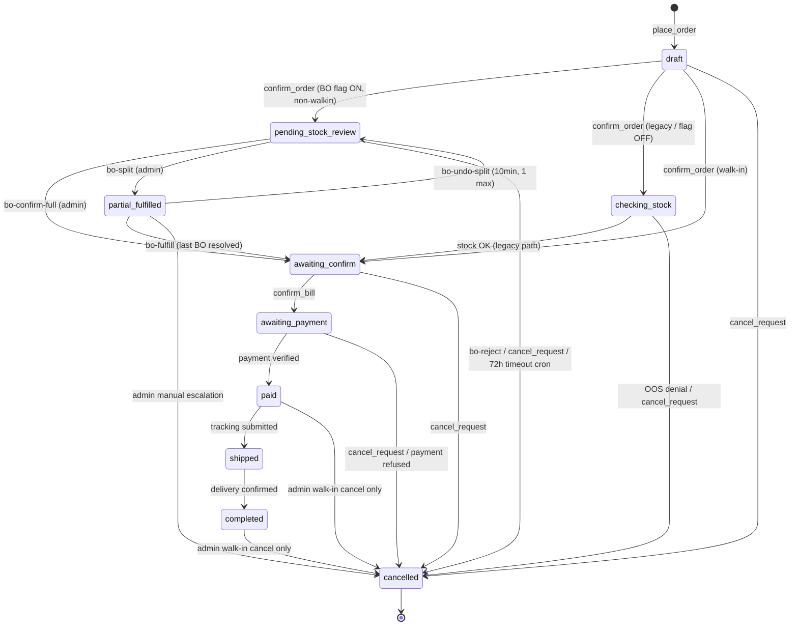

**Transition guards** (Snippet 14 V.1.6 FSM):

- `pending_stock_review → partial_fulfilled` requires invariant `Σ qty_fulfill + Σ qty_bo = Σ order_qty` per SKU
- `partial_fulfilled → pending_stock_review` requires `now() < _b2b_split_undo_deadline` AND `_b2b_undo_count < 1` (H5 oscillation guard)
- `partial_fulfilled → awaiting_confirm` only when ALL bo_queue rows status IN (fulfilled, cancelled) — `b2b_bo_check_all_resolved($order_id)`
- Walk-in path bypasses BO entirely — direct `draft → awaiting_confirm` regardless of `b2b_flag_bo_system` state

### 2.11 BO Cron Jobs Schedule

| Cron | Interval | Purpose |
|------|----------|---------|
| `b2b_bo_restock_scan_cron` | every 15 min | pending → ready when available ≥ qty_bo |
| `b2b_bo_eta_warn_cron` | daily 09:00 | ETA < +3d → admin reminder Telegram |
| `b2b_bo_pending_review_expire_cron` | hourly | 72h timeout → auto-cancel |
| `b2b_bo_enumeration_scan_cron` | hourly | detect abuse patterns + Telegram |
| `b2b_bo_attempt_log_cleanup_cron` | daily 03:00 | 90d retention, chunked 1000/iter + 50ms gap |

### 2.12 BO Restock + Lifecycle Cron Flow (Mermaid)

แสดง 5 BO crons ของ Snippet 16 V.3.0+ ทำงานพร้อมกัน. แต่ละ cron มี responsibility แยก ไม่ทับกัน — restock scan = promotion path / eta warn = reminder / expire = timeout / enumeration scan = abuse detection / cleanup = retention.

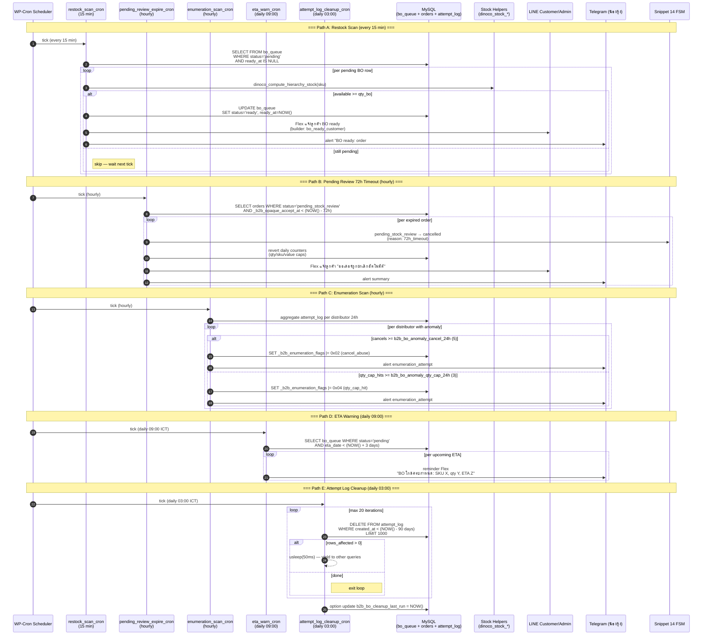

**Cron handler sources**:

- `b2b_bo_restock_scan_cron` — promotion logic (`pending → ready`) + customer Flex alert + Telegram digest
- `b2b_bo_pending_review_expire_cron` — 72h hard deadline (`_b2b_opaque_accept_at` timestamp gate)
- `b2b_bo_enumeration_scan_cron` — bit-field flag mutation (rate_hit=1, cancel_abuse=2, qty_cap_hit=4, suspicious_pattern=8 — OR-combined per Phase 1 BUG-C1 fix)
- `b2b_bo_eta_warn_cron` — non-mutating; only Telegram reminder
- `b2b_bo_attempt_log_cleanup_cron` — chunked DELETE (1000/iter + 50ms gap + 20-iteration cap = max 20K rows/run, conservative for shared MySQL)

**Idempotency**: All BO crons are safe to re-run. State transitions guarded by FSM (`b2b_set_order_status`) + `FOR UPDATE` lock for stock subtract path. Cleanup cron tracks last run via wp_options for monitoring drift detection.

**Observability**: Each cron writes heartbeat to `dinoco_cron_<name>_last_run` wp_option (matched on Round 4-8 fix HIGH-1 — option key naming consistency). Admin Dashboard Slip Monitor + BO admin tabs show last-run badges.

### 2.13 Modal Pattern (V.1.0 — 2026-04-17)

Native `confirm/alert/prompt` replaced with `window.dinocoModal.*` API on destructive admin actions. Migration pattern for callers:

```javascript
// Before (blocking, no styling, inconsistent UX)
if (!confirm('ยืนยันลบข้อมูล?')) return;

// After (async, scoped CSS, ESC/focus-trap, native fallback)
try {
  const ok = await window.dinocoModal.confirm({
    title: 'ยืนยันการลบ',
    message: 'ข้อมูลจะถูกลบถาวร ไม่สามารถกู้คืนได้',
    confirmText: 'ลบ', confirmVariant: 'danger',
    cancelText: 'ยกเลิก'
  });
  if (!ok) return;
} catch (e) {
  // Fallback to native if snippet not loaded
  if (!confirm('ยืนยันการลบ?')) return;
}
```

**Migration status (2026-04-17)**: **75/75 in-scope sites migrated (100%)** — Phase 5 foundation + Phase 6 bulk migration complete. Snippet `[Admin System] DINOCO Modal Helpers` V.1.0.

**Migrated by file** (Phase 6, 8 commits `7a9e90d..cfc453f`):

- `[B2B] Snippet 16` V.1.15 — 6 BO admin sites + flag-toggle refactor (inline onclick → event delegation)
- `[B2F] Snippet 5` V.7.8 — 13+ calls (cancel PO, resubmit, complete, delete auto-set, add missing leaves, quick shipping, delete product/maker, confirm unconfirmed, credit unlock/hold)
- `[Admin System] B2F Migration Audit` V.3.14 — 7 sites (activate schema, backfill, shadow toggle, junction read toggle, flag toggles, phase4 flag, sync intermediates)
- `[Admin System] DINOCO Global Inventory Database` V.43.8 — 4 sites (God Mode activate, category delete)
- `[Admin System] DINOCO Manual Invoice System` V.33.7 — 6 functions (cancel builder/list, confirm issue, refund, delete) *(later bumped V.33.8 → V.34.10 — V.33.8 helper shims, V.34.0-V.34.3 debt/transaction wrappers + module registry, V.34.4-V.34.6 picker price contract fix series, V.34.8 image push observability, V.34.9 stale nonce auto-reload, V.34.10 code-reviewer remediation 1 HIGH + 3 MED + 2 LOW)*
- `[B2B] Snippet 5` V.32.4 — 14 sites (Flash ops, reprint, bulk confirm/cancel/flash-ready, delete)
- `[B2B] Snippet 9` V.33.8 — 9 sites (reprint job, bulk reprint errors, save settings, regen key, rpi command, ft switch/cancel)
- `[Admin System] DINOCO Service Center & Claims` V.30.6 — 16 sites (submit return, close job, add custom part, approval, inline update, delete ticket)
- `[B2B] Snippet 12` V.31.4 — 9 sites (cancel pno, reship pno, unlock, tracking submit)

**Per-file helpers** (extracted for concise callsites + consistent UX): `_b2bCfm/_b2bAlert` (Snippet 5), `_cpCfm/_cpAlert` (Snippet 9), `_scCfm/_scAlert/_scPrompt` (Service Center), `_liffCfm/_liffAlert` (Snippet 12). Pattern: try/catch with native `confirm/alert/prompt` fallback → zero regression risk. Multiple async function conversions — inline `onclick=` handlers are fire-and-forget compatible (no upstream changes needed).

**Guidance for future code**: Any new native `confirm/alert/prompt` added after 2026-04-17 should use `dinocoModal` helper from the start. Auditor patterns look for `window.confirm\|window.alert\|window.prompt\|\bconfirm(\|\balert(\|\bprompt(` — allowlist existing fallback `catch` blocks only.

### 3.5 GDPR/PDPA Self-Service (V.1.0 stubs — 2026-04-17)

**Current status**: Flag `dinoco_gdpr_enabled=0` → endpoints return 503. Users directed to email support for manual handling until Phase 6 full implementation.

**Future workflow (when flag flipped ON)**:

```text
User → LIFF member dashboard → "ส่งออกข้อมูลของฉัน"
    ↓
POST /dinoco-gdpr/v1/my-data-export (WP login required)
    ├─ Validate user session
    ├─ INSERT wp_dinoco_gdpr_requests (user_id, type=export, status=queued)
    └─ Return { request_id, eta_days }
    ↓
Admin Dashboard → GDPR Requests tab (future UI) → review queue
    ↓
Admin approves → cron job generates ZIP bundle:
    ├─ wp_users + wp_usermeta export
    ├─ distributor CPT + warranties + claims (if linked)
    ├─ B2B orders history (if distributor)
    └─ LINE messages export (via openclaw agent:3000 bridge)
    ↓
Email user with download link (expires 7d) OR hard-delete on type=delete
    ↓
Update status=done + processed_at
```

**Data scope**: wp_users + wp_usermeta + distributor CPT + warranties + claims + B2B orders + LINE conversation logs (via OpenClaw agent).

---

## 3. B2F Factory Purchasing Workflows

### 3.1 Create PO (Admin) -- Text

```text
Trigger: Admin เปิด LIFF Catalog หรือ B2F Dashboard

1. เลือก Maker จาก dropdown
2. ระบบแสดง product catalog ของ Maker + ราคาทุน
3. เลือก SKU + จำนวน
4. ถ้า foreign (CNY/USD): เลือก shipping method (land/sea) + exchange rate
5. ระบบคำนวณ: total (สกุลโรงงาน), total_thb, shipping_total, grand_total_thb
6. กด Submit → POST /b2f/v1/create-po
7. DD-7: Auto-expand SET → leaf items + snapshot poi_parent_sku/name (V.8.7)
8. สร้าง b2f_order (draft → submitted)
9. ส่ง Flex "New PO" → กลุ่ม Maker (ENG ถ้า non-THB) — items grouped by SET 🟣 (V.6.1)
10. ส่ง Flex "สร้าง PO สำเร็จ" → กลุ่ม Admin — items grouped by SET 🟣 (V.6.1)

End State: b2f_order สถานะ submitted
```

### 3.1.7 Create PO V.7.0 — Order Intent System (2026-04-17)

**Context**: Admin LIFF B2F E-Catalog V.7.0 rework — admin สั่งของจากโรงงานได้ 3 ระดับ ชัดเจน แทน SET-centric แบบเดิม

#### 3 Order Modes

```text
🟣 ชุดเต็ม (full_set)     — สั่ง SET ครบชุด (เช่น DNCCBSET500X001 กันล้ม 4 ชิ้น)
🟠 แยกชุด (sub_unit)      — สั่งชุดย่อยที่มีลูก (เช่น Pannier Rack L+R pair)
⚪ ชิ้นเดี่ยว (single_leaf) — สั่ง 1 ชิ้น (เช่น Top Rack เดี่ยว)
🟠 DINOCO ประกอบ          — cross-factory (hidden default — admin สั่ง parts แต่ละโรงงาน)
```

#### 4 Use Cases

**Case A — สั่งชุดเต็มให้ร้าน**:
```text
1. Admin เปิด LIFF → เลือก Maker (HTP)
2. Tap 🟣 DNCCBSET500X001 card
3. Qty stepper: "+ สั่งครบชุด" × 5
4. Cart: 🟣 ชุดเต็ม section (purple)
5. Submit Review Gate: 🟣 ชุดเต็ม 5 ชุด ₿19,510
6. POST /create-po with order_mode='full_set'
7. DD-7 expand: 5 SETs × 4 parts = 20 leaves
```

**Case B — สั่งแยกชุด (sub-unit)**:
```text
1. Tap 🟠 DNCGNDPROS500 (Pannier Rack pair)
2. Info strip: "⚡ สั่ง 1 ชุด = ผลิต 2 ชิ้น (L+R)"
3. Qty stepper × 10 → preview "L × 10 + R × 10"
4. Cart: 🟠 แยกชุด section (amber)
5. POST with order_mode='sub_unit'
6. DD-7 expand: L × 10 + R × 10 = 20 leaves
```

**Case C — สั่งชิ้นเดี่ยว**:
```text
1. Tap ⚪ DNCGNDPROT500 (Top Rack)
2. Qty × 3
3. Cart: ⚪ ชิ้นเดี่ยว section (amber combined with sub_unit)
4. POST with order_mode='single_leaf'
5. No DD-7 expand — 3 pieces direct
```

**Case D — Cross-factory (DINOCO assembly)**:
```text
1. DNCGNDSDPRO500S = Set Top Case + Rack (กล่องโรงงานอื่น + rack HTP)
2. Card hidden default (admin_display_mode='as_parts')
3. Admin toggle "แสดง SET ที่ซ่อนไว้" → card appears with amber dashed border
4. Info: "ต้อง parts หลายโรงงาน — นี้ (HTP): PROS500 + PROT500"
5. Admin สั่งเฉพาะ parts HTP → ไปสั่งกล่องที่ LIFF โรงงานอื่นเอง
6. Stock DD-2 assemble SET ให้เองเมื่อ parts เข้าครบ
```

#### Ungroup System (3 Ways)

```text
1. Auto-detect (migration default)
   missing_leaves > 0 → admin_display_mode='as_parts' (SET hidden)

2. Bulk action (Admin Makers tab V.7.1)
   Select 200+ SKUs → "📁 ซ่อน SET → สั่งแค่ parts"

3. Per-SKU manual (edit modal)
   auto (default) / as_set (force show) / as_parts (hide SET)
```

#### Submit Flow

```text
Cart (dual section):
  🟣 ชุดเต็ม: 5 ชุด ₿19,510
  🟠+⚪ แยกชุด+ชิ้นเดี่ยว: 13 ชิ้น ₿36,000

↓ tap "ตรวจสอบก่อนส่ง"

Submit Review Gate (3-bucket accordion):
  ▼ 🟣 ชุดเต็ม: 5 ชุด ₿19,510
    DNCCBSET500X001 × 5 ₿19,510
  ▼ 🟠 แยกชุด: 10 ชุด ₿30,600
    DNCGNDPROS500 × 10 ₿30,600
  ▶ ⚪ ชิ้นเดี่ยว: 3 ชิ้น ₿5,400 (collapsed)
  ─────────────────────
  รวม: ₿55,510
  [กลับไปแก้] [ยืนยันส่ง]

↓ tap "ยืนยันส่ง" (no warn for mixed mode)

POST /b2f/v1/create-po:
{
  "maker_id": 5865,
  "items": [
    {"sku":"DNCCBSET500X001", "qty":5, "order_mode":"full_set", "source_sku":"DNCCBSET500X001"},
    {"sku":"DNCGNDPROS500", "qty":10, "order_mode":"sub_unit", "source_sku":"DNCGNDPROS500"},
    {"sku":"DNCGNDPROT500", "qty":3, "order_mode":"single_leaf", "source_sku":"DNCGNDPROT500",
     "intent_notes":"PO พิเศษสำหรับ event X"}
  ]
}

↓ server 7-rule validator

Backend saves:
- ACF po_items repeater: poi_order_mode + poi_intent_notes + poi_source_sku + poi_production_mode_snapshot
- Postmeta: _b2f_order_intent_summary = {full_set_count:5, sub_unit_count:10, single_leaf_count:3}

↓ 30s undo window

Post-submit toast: "ส่ง PO สำเร็จ [ยกเลิกภายใน 30 วิ]"
If admin tap → POST /po-undo-submit (FSM draft→cancelled + stock restore + credit refund)
```

#### Confirmation Flow (Admin Makers tab)

```text
Auto-synced SETs (Phase 2 backfill) default confirmation_status='auto_synced'
Admin Makers tab shows:
  ⚠️ "มี 9 SET รอยืนยัน"  [รีวิว]

↓ Admin reviews → tap "ยืนยัน" per SKU OR "ยืนยันทั้งหมด"

POST /junction-confirm-classification {maker_id, skus[]}
Sets confirmation_status='confirmed' + confirmed_by=$uid + confirmed_at=NOW()

Warning banner hides when unconfirmed_count=0 (clean UI per Decision #12)
```

#### Maker Perspective (Snippet 4 V.4.3)

```text
Maker opens LIFF → PO detail:
  Items:
    🟣 ชุดเต็ม: DNCCBSET500X001 × 5  ₿19,510
    🟠 แยกชุด: DNCGNDPROS500 × 10  ₿30,600
    ⚪ ชิ้นเดี่ยว: DNCGNDPROT500 × 3   ₿5,400
  Total: ₿55,510
  [ยืนยัน] [ปฏิเสธ]

Maker sees: mode badge (3-lang)
Maker does NOT see: intent_notes (admin-only per PII gate)
```

#### Feature Flags (Dependency Chain)

```text
b2f_flag_v11_explicit_mode   — enable first (backend returns new fields)
  ↓
b2f_flag_order_intent        — LIFF UI + validator (requires v11)

# V.3.8 (Phase 1 audit BUG-H8): `b2f_flag_ungroup_auto_hide` removed.
# Declared + UI-toggleable + dependency-checked but never consumed by business logic.
# Auto-hide is driven by `admin_display_mode='as_parts'` column set by Phase 4 migration
# when `missing_leaves>0` — not by a runtime flag.
```

**Rollback**: `update_option(flag, false)` → instant revert ไม่ต้อง re-deploy

### 3.1.8 Hierarchy Coverage Auto-Sync (Coverage Rule — 2026-04-17)

**Problem solved**: Admin Makers tab (Snippet 5) render hierarchy inconsistent — some SETs มีทุก level เป็น full row (CPT era register ครบ), บางอัน intermediate sub-units ขาด (Phase 2 backfill auto-sync เฉพาะ top-level orphan SETs) → render เป็น label separator แทน full row

**Example case**: DNCSETNX500EX001 (E-clutch Silver) vs DNCSETNX500X001 (Silver):

- DNCSETNX500X001 — CPT era register ครบ → 001 (ชุดบน) + 002 (ชุดล่าง) + L/R ทุกตัว = full rows
- DNCSETNX500EX001 — Phase 2 orphan auto-sync top SET + admin register leaves (001 shared + E002-L/R) — **DNCNX500E002 (ชุดล่าง E-clutch) ไม่ได้ register** → render แค่ "(2 ชิ้น)" label

**Coverage Rule** (decided 2026-04-17):

```text
SKU X registered for Maker M
⇔ explicit junction row
OR (X has children AND ALL children covered for M recursively)
```

**Leaves = source of truth**. Intermediate + top SETs **auto-derive** เมื่อลูกครบ. Admin maintain แค่ leaves — ส่วน aggregate layer ขึ้นมาเอง

#### 3-Layer Implementation

```text
┌─────────────────────────────────────────────────────────────────┐
│  LAYER 1 — REACTIVE (Snippet 0.5 V.1.5 + Snippet 1 V.7.3)       │
├─────────────────────────────────────────────────────────────────┤
│  Trigger: Every dual-write UPSERT to junction                   │
│  Flow:                                                          │
│    admin saves leaf DNCNX500E002-L for HTP                      │
│      ↓ b2f_dual_write_to_junction UPSERT succeeds               │
│      ↓ b2f_auto_sync_parent_coverage($maker_id, $child_sku)     │
│      ↓ walk UP via b2f_get_parents_for_sku                      │
│         for each parent:                                        │
│           blacklist? → skip                                     │
│           already registered? → recurse up                      │
│           coverage complete? → INSERT row + recurse up          │
│           else → stop                                           │
│      ↓ fire b2f_junction_updated ONCE per maker                 │
│        (batched via b2f_defer_junction_updates_state)           │
│                                                                 │
│  Gate: b2f_flag_coverage_autosync wp_option (default '1')       │
│  Kill-switch: update_option(..., '0') → instant revert          │
│  Lock-aware: migration_in_progress → defer via cron             │
└─────────────────────────────────────────────────────────────────┘

┌─────────────────────────────────────────────────────────────────┐
│  LAYER 2 — BULK CLEANUP (Audit V.3.7)                           │
├─────────────────────────────────────────────────────────────────┤
│  Endpoint: POST /dinoco-b2f-audit/v1/sync-missing-intermediates │
│  UI: "🔗 Sync Missing Intermediates (Coverage Rule)" card       │
│                                                                 │
│  Admin flow:                                                    │
│    1. Click "🧪 Dry-Run" → scan + preview grouped by maker      │
│    2. Review list                                               │
│    3. Click "⚡ Sync จริง" → INSERT all detected rows           │
│    4. Makers tab reload → intermediate rows visible             │
│                                                                 │
│  Backend: b2f_detect_missing_intermediates($filter_maker_id=0)  │
│    - Build {SKU_upper: true} set per maker (in-memory)          │
│    - Iterate all parents in dinoco_sku_relations                │
│    - Walk until stable (iteration cap 100)                      │
│    - Return flat list + grouped-by-maker                        │
│                                                                 │
│  Rate limit: 5/hr                                               │
└─────────────────────────────────────────────────────────────────┘

┌─────────────────────────────────────────────────────────────────┐
│  LAYER 3 — RENDER CONSISTENCY                                   │
├─────────────────────────────────────────────────────────────────┤
│  Auto-added rows defaults:                                      │
│    unit_cost = 0 (LIFF compute via V.11.3 unconditional)        │
│    confirmation_status = 'auto_synced' (admin review later)     │
│    notes = 'auto-synced (coverage rule)' (audit trail)          │
│    legacy_cpt_id = 0 (not CPT era)                              │
│    production_mode + admin_display_mode = inferred              │
│                                                                 │
│  Snippet 5 Makers tab renders full row (was label separator).   │
│  Admin can confirm via "ยืนยัน" button per SKU or bulk.          │
└─────────────────────────────────────────────────────────────────┘
```

#### SET Price Design (V.11.3 permanent)

SET **ไม่มี manual price input**. `unit_cost` คำนวณจาก leaves ตลอด:

```text
LIFF + Admin read /maker-products/{maker_id}
  ↓ Snippet 2 V.11.3 always runs b2f_compute_set_costs_v918($products, $rel_upper)
  ↓ For each SET: walk to leaves → sum(leaf.unit_cost) → override SET.unit_cost
  ↓ Set flags: unit_cost_computed, unit_cost_complete, unit_cost_leaf_count, unit_cost_missing[]
```

Consequences:

- Stale junction `unit_cost` (e.g. 666 จาก ACF backfill era) = dead data — LIFF ignore
- Makers tab shows read-only badge `.b2f-set-price-ro`:
  - ✓ เขียว — `unit_cost_complete=true` (ลูกครบ)
  - ⚠ อำพัน — partial (missing leaves in tooltip)
  - ⚠ แดง — `unit_cost_computed=false` (ยังไม่มี leaf ลงราคา)
- MOQ + lead_time ยังแก้ได้ (ไม่ derivable)
- Optional cleanup: `POST /purge-stale-prices` zero-out stale junction values (cosmetic)

#### Example Run (HTP first-time, 2026-04-17)

Dry-run result: **5 missing intermediates added**

| SKU | ประเภท | Parent SET |
| --- | --- | --- |
| DNCNX500E002 | ชุดล่าง E-clutch Silver | DNCSETNX500EX001 |
| DNCNX500E002B | ชุดล่าง E-clutch Black | DNCSETNX500E002 |
| DNCNX500E002IRONB | ชุดล่าง E-clutch IronBlack | DNCSETNX500EIRNB |
| DNCXL7500X001H | ชุดบน XL750 | DNCSETXL7500X001H |
| DNCXL7500X002H | ชุดล่าง XL750 | DNCSETXL7500X001H |

หลัง sync — DNCSETNX500EX001 structure เหมือน DNCSETNX500X001 (ทุก hierarchy level มี full row + color-coded price badge)

#### Rollback Procedure

```sql
# Disable reactive only (bulk still usable)
update_option('b2f_flag_coverage_autosync', '0');

# Delete specific auto-sync row
UPDATE wp_dinoco_product_makers
SET status='discontinued', deleted_at=NOW()
WHERE product_sku='DNCNX500E002' AND maker_id=5865;

# Undo bulk sync (if needed)
# → use Option F blacklist + soft-delete flow:
POST /junction-bulk-delete {maker_id, skus:[...], only_auto_synced:true, add_to_blacklist:true}
```

Blacklist (V.3.2 Option F) respected — `b2f_autosync_is_blacklisted($maker_id, $sku)` check ทั้ง reactive และ bulk path

### 3.2 Maker Confirm/Reject PO -- Text

```text
Trigger: Maker เปิด LIFF จาก Flex Card

Path A — Confirm:
1. Maker เปิด LIFF confirm page
2. ดูรายการ + ราคา
3. กรอก ETA (expected delivery date)
4. กด Confirm → POST /b2f/v1/maker-confirm
5. Status: submitted → confirmed
6. ส่ง Flex → Admin + Maker groups

Path B — Reject:
1. Maker กด Reject → กรอกเหตุผล
2. POST /b2f/v1/maker-reject
3. Status: submitted → rejected
4. ส่ง Flex → Admin + Maker groups

Path C — Reschedule:
1. Maker กด Reschedule → เลือกวันใหม่ + เหตุผล
2. POST /b2f/v1/maker-reschedule
3. Admin ได้ Flex → Approve/Reject reschedule
4. ถ้า approve: อัพเดท expected_date
5. ถ้า reject: Maker ต้องส่งตามเดิม

End State: confirmed / rejected / reschedule pending
```

### 3.3 Maker Delivery -- Text

```text
Trigger: Maker แจ้งส่งของ (LIFF หรือ Bot command)

1. Maker เลือก PO → กรอกจำนวนที่ส่งแต่ละ SKU
2. POST /b2f/v1/maker-deliver (concurrent lock)
3. อัพเดท poi_qty_shipped ใน po_items
4. บันทึก delivery record ใน po_deliveries repeater
5. Status: confirmed → delivering
6. ส่ง Flex → Admin + Maker groups

Partial Delivery:
  - ส่งไม่ครบ → delivering (ไม่เปลี่ยน)
  - Maker ส่งเพิ่มได้ (delivering → delivering)

End State: b2f_order สถานะ delivering
```

### 3.4 Receive Goods (Admin) -- Text

```text
Trigger: Admin กด "ตรวจรับ" ใน B2F Dashboard

1. เลือก PO → กรอกจำนวนรับ + QC แต่ละ SKU
2. POST /b2f/v1/receive-goods
3. สร้าง b2f_receiving record
4. คำนวณ rcv_total_value (THB) = qty * unit_cost * exchange_rate
5. เพิ่มหนี้ (b2f_payable_add) → เครดิตเกิดตอน receive เท่านั้น
6. อัพเดท poi_qty_received ใน po_items
7. ถ้ารับครบ: delivering → received
8. ถ้ารับบางส่วน: delivering → partial_received
9. ถ้ามี reject: rcv_has_reject = true → Admin ต้อง resolve

Reject Resolution:
  - POST /b2f/v1/reject-lot → บันทึก reject
  - POST /b2f/v1/reject-resolve → เลือก action:
    a. "reship" → สร้าง replacement PO
    b. "credit" → หักเครดิต Maker
    c. "accept" → ยอมรับ (ไม่ทำอะไร)

End State: received / partial_received
```

### 3.5 Payment (Admin to Maker) -- Text

```text
Trigger: Admin กด "บันทึกจ่ายเงิน" ใน B2F Dashboard

1. เลือก PO → กรอกจำนวนเงิน + วิธีจ่าย + slip
2. POST /b2f/v1/record-payment
3. สร้าง b2f_payment record
4. Slip verify:
   - THB: Slip2Go verify → pmt_slip_status
   - CNY/USD: ข้าม verify (admin_approved)
5. หักหนี้ (b2f_payable_subtract)
6. อัพเดท po_paid_amount
7. ถ้าจ่ายครบ: received → paid → completed (auto)
8. ถ้าจ่ายบางส่วน: → partial_paid
9. ส่ง Flex แจ้ง Maker

End State: paid → completed
```

### 3.6 B2F Full Loop Flow -- Mermaid Diagram

แสดง flow ทั้งหมดตั้งแต่ Admin สร้าง PO จนถึง completed รวม alternative paths ทุกเส้นทาง

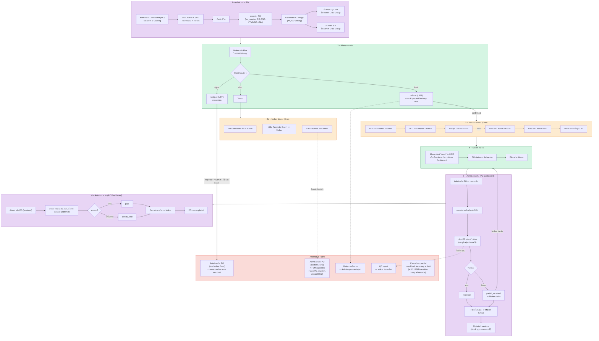

#### คำอธิบาย B2F Full Loop

B2F Full Loop Flow แสดงการทำงานตลอด lifecycle ของ Purchase Order:

1. **Admin สร้าง PO** -- ทำได้ทั้งบน PC (Admin Dashboard) และ LIFF (E-Catalog) ระบบ generate PO image (A4) แล้วส่ง Flex พร้อมรูปไปทั้ง Maker group และ Admin group
2. **Maker ตอบรับ** -- ยืนยัน (กรอก ETA ผ่าน LIFF), ปฏิเสธ (กรอกเหตุผล), หรือเงียบ (ระบบเตือนอัตโนมัติ 24h/48h/72h escalate)
3. **ติดตามการจัดส่ง** -- Cron เตือนตามกำหนด D-3, D-1, D-day แล้วแจ้ง overdue D+1, D+3, D+7+
4. **Maker ส่งของ** -- แจ้งผ่าน LINE Bot หรือ Admin กดบน Dashboard
5. **Admin ตรวจรับ** -- QC ต่อ SKU, partial delivery support, auto-update inventory
6. **Admin จ่ายเงิน** -- รองรับ partial payment, Flex แจ้ง Maker ทุกครั้ง

Alternative paths: แก้ไข PO (amended), ยกเลิก (cancelled -- V.8.2: FSM transition ไม่ลบ PO, คืนสต็อก received SKUs, เก็บ audit trail + metadata: po_cancelled_reason/by/date), ขอเลื่อนวัน, QC reject, rollback หลัง partial cancel

---

## 4. B2F PO Lifecycle (Full FSM Diagram) — V.1.7 (Snippet 6)

12 สถานะ + transitions + ระบุ actor (admin/maker/system/any) ทุกเส้น. ใช้ `B2F_Order_FSM::transition()` (ผ่าน Transaction Wrapper V.1.7 → GET_LOCK per-PO + audit log) เป็น single point of mutation. Multi-currency immutable หลัง `submitted` (po_currency + po_exchange_rate snapshot).

**หมายเหตุ stateDiagram**:

- เส้น actor: `admin` (DINOCO Admin LIFF/Dashboard), `maker` (โรงงาน Maker LIFF), `system` (cron/auto)
- `cancelled` ตอน V.8.2+ ใช้ FSM transition (ไม่ลบ PO) → preserve audit trail + rollback stock/debt
- `amended` = transient state — auto-resubmit เป็น `submitted` ทันที (ไม่ค้าง)
- Multi-currency: ทุก transition ที่กระทบ debt/credit คำนวณ THB (rcv_total_value × exchange_rate) — ดู Snippet 7 V.1.0

### 4.1 Mermaid stateDiagram

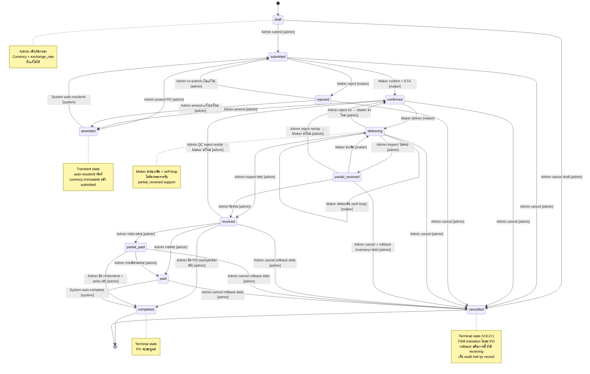

### 4.2 Transition Rules Table

| From | To | Actor | เงื่อนไข |
|------|----|-------|---------|
| `draft` | `submitted` | admin | Admin กดยืนยัน PO |
| `draft` | `cancelled` | admin | Admin ยกเลิกก่อนส่ง |
| `submitted` | `confirmed` | maker | Maker ยืนยัน + กรอก ETA |
| `submitted` | `rejected` | maker | Maker ปฏิเสธ + เหตุผล |
| `submitted` | `amended` | admin | Admin แก้ไข PO |
| `submitted` | `cancelled` | admin | Admin ยกเลิก |
| `confirmed` | `delivering` | maker | Maker แจ้งส่งของ |
| `confirmed` | `amended` | admin | Admin แก้ไขหลัง confirm |
| `confirmed` | `cancelled` | admin | Admin ยกเลิก |
| `amended` | `submitted` | system | Auto-resubmit ทันที (transient state) |
| `rejected` | `amended` | admin | Admin แก้ไขแล้วส่งใหม่ |
| `rejected` | `submitted` | admin | Admin re-submit โดยไม่แก้ไข |
| `rejected` | `cancelled` | admin | Admin ยกเลิกหลังถูกปฏิเสธ |
| `delivering` | `delivering` | maker | Maker ส่งของเพิ่ม (ไม่ต้องรอตรวจรับ — self-loop) |
| `delivering` | `received` | admin | ตรวจรับครบ |
| `delivering` | `partial_received` | admin | ตรวจรับไม่ครบ |
| `delivering` | `confirmed` | admin | Reject ทั้ง lot → Maker ส่งใหม่ |
| `delivering` | `cancelled` | admin | Admin ยกเลิก |
| `partial_received` | `delivering` | maker | Maker ส่งเพิ่ม |
| `partial_received` | `received` | admin | รับครบ |
| `partial_received` | `confirmed` | admin | Reject reship → Maker ส่งใหม่ |
| `partial_received` | `cancelled` | admin | Cancel + rollback inventory & debt |
| `received` | `confirmed` | admin | QC reject reship → Maker ส่งใหม่ |
| `received` | `paid` | admin | จ่ายเงินครบ |
| `received` | `partial_paid` | admin | จ่ายบางส่วน |
| `received` | `completed` | admin | ปิด PO ไม่จ่าย (sample/ของฟรี — is_sample=true) |
| `received` | `cancelled` | admin | Cancel + rollback debt |
| `partial_paid` | `paid` | admin | จ่ายเพิ่มจนครบ |
| `partial_paid` | `completed` | admin | ปิด PO (จ่ายบางส่วน + write-off) |
| `partial_paid` | `cancelled` | admin | Cancel + rollback debt |
| `paid` | `completed` | system | Auto-complete |
| `paid` | `cancelled` | admin | Cancel + rollback debt |

**Terminal States:** `completed`, `cancelled`

**Atomic Guards (V.1.7 Phase 4d Transaction Wrapper):**

- ทุก transition acquire GET_LOCK `b2f_fsm_po_<id>` (3s timeout) → serialize concurrent transitions
- Audit row event=`b2f_fsm_transition` with correlation_id chain + fsm='b2f' tag
- Phase 1.5 in-body `dinoco_audit_log` calls preserved (dual-write index overlay)
- Failure modes logged: `terminal_state` / `invalid_transition` / `permission_denied`
- Hook `do_action('b2f_order_status_changed', $po_id, $current, $new_status, $actor)` fires on success
- Currency immutable หลัง `submitted` — `po_currency` + `po_exchange_rate` snapshot ไม่เปลี่ยน
- `cancelled` ที่มี receiving records → rollback ผ่าน `dinoco_stock_add()` (คืน leaf) + `b2f_payable_subtract()` (THB amount × exchange_rate snapshot)

---

## 5. B2F Notification Flow

### 5.1 Sequence Diagram (Mermaid)

แสดงว่าใครได้รับ Flex message เมื่อไหร่ แยกตาม Maker Group vs Admin Group

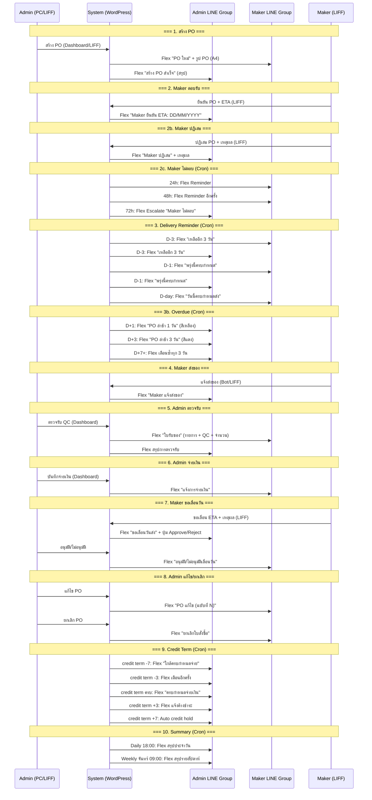

### 5.2 Notification Matrix

| Event | Trigger | Maker Group | Admin Group |
|-------|---------|:-----------:|:-----------:|
| สร้าง PO | Admin submit | Flex + รูป PO | Flex สรุป |
| Maker ยืนยัน | Maker confirm | -- | Flex (ETA) |
| Maker ปฏิเสธ | Maker reject | -- | Flex (เหตุผล) |
| Maker ไม่ตอบ 24h | Cron 09:30 | Flex Reminder | -- |
| Maker ไม่ตอบ 48h | Cron 09:30 | Flex Reminder | -- |
| Maker ไม่ตอบ 72h | Cron 09:30 | -- | Flex Escalate |
| เตือนจัดส่ง D-3 | Cron 08:30 | Flex เตือน | Flex เตือน |
| เตือนจัดส่ง D-1 | Cron 08:30 | Flex เตือน | Flex เตือน |
| เตือนจัดส่ง D-day | Cron 08:30 | Flex เตือน | -- |
| PO ล่าช้า D+1 | Cron 09:00 | -- | Flex (สีเหลือง) |
| PO ล่าช้า D+3 | Cron 09:00 | -- | Flex (สีแดง) |
| PO ล่าช้า D+7+ | Cron 09:00 | -- | Flex ซ้ำทุก 3 วัน |
| Maker แจ้งส่งของ | Maker action | -- | Flex |
| Maker ขอเลื่อนวัน | Maker action | -- | Flex + ปุ่ม approve/reject |
| Admin อนุมัติ/ปฏิเสธเลื่อน | Admin action | Flex ผลการพิจารณา | -- |
| Admin ตรวจรับ | Admin action | Flex ใบรับของ | Flex สรุป |
| Admin จ่ายเงิน | Admin action | Flex แจ้งจ่ายเงิน | -- |
| Admin แก้ไข PO | Admin action | Flex PO ฉบับแก้ไข | -- |
| Admin ยกเลิก PO | Admin action | Flex ยกเลิก | -- |
| Credit term ใกล้ครบ | Cron (Weekly) | -- | Flex เตือนจ่ายเงิน |
| Credit term เลย + hold | Cron (Weekly) | -- | Flex auto hold |
| สรุปประจำวัน | Cron 18:00 | -- | Flex Daily Summary |
| สรุปรายสัปดาห์ | Cron จันทร์ 09:00 | -- | Flex Weekly Summary |

### 5.3 Credit Term Reminder Timeline

| วัน | ระดับ | Action |
|-----|-------|--------|
| credit term **-7** วัน | Friendly | Flex เตือน Admin "ใกล้ครบกำหนดจ่ายเงิน Maker XXX" |
| credit term **-3** วัน | Official | Flex เตือนอีกครั้ง |
| credit term **ครบกำหนด** | Final | Flex "ครบกำหนดจ่ายเงิน" |
| credit term **+3** วัน | Overdue | Flex แจ้งค้างชำระ |
| credit term **+7** วัน | **Auto Hold** | `maker_credit_hold = true`, `reason = auto` -- block สร้าง PO ใหม่ |

---

## 6. Bot Commands per Group

### 6.1 Admin Group (B2B + B2F)

**B2B Commands:**

| Command | Action |
|---------|--------|
| @DINOCO / @mention | ส่ง Flex Menu carousel (3 หน้า) |
| สรุป / สรุปวัน | Trigger daily summary |
| รอยืนยัน | แสดง orders รอยืนยัน |
| ค้างส่ง | แสดง orders ค้างจัดส่ง |
| @admincancel #ID | ยกเลิก order (admin) |
| ดูหนี้ [ชื่อร้าน] | ดูยอดหนี้ตัวแทน |
| จัดส่ง #ID | เริ่ม Flash Create |

**B2F Commands:**

| Command | Action |
|---------|--------|
| สั่งโรงงาน | เปิด B2F Catalog LIFF |
| ดูPO / ดูpoโรงงาน | แสดง PO list |
| สรุปโรงงาน | สรุป B2F stats |
| po#NUMBER | แสดง PO detail |

### 6.2 Distributor Group (B2B Only)

| Command | Action |
|---------|--------|
| @DINOCO / @mention | ส่ง Flex Customer Menu |
| สั่งของ | เปิด LIFF Catalog |
| ดูออเดอร์ | ดูประวัติ order |
| ดูหนี้ | ดูยอดหนี้ตัวเอง |
| (ส่งรูปสลิป) | Auto verify + match payment |

### 6.3 Maker Group (B2F Only)

| Command | Action |
|---------|--------|
| @DINOCO / @mention | ส่ง Flex Maker Menu (ENG if non-THB) |
| ดูPO / View PO | แสดง PO list |
| ส่งของ / Deliver | เปิด LIFF delivery page |
| (ส่งรูปสลิป) | Auto match payment ±2% |

---

## 7. AI Chatbot Workflow (OpenClaw Mini CRM)

```text
Trigger: ลูกค้าส่งข้อความผ่าน LINE / Facebook / Instagram

1. Platform webhook → OpenClaw proxy/index.js (V.2.1)
2. Auth middleware → ตรวจ platform token
3. Load conversation from MongoDB
4. AI Provider:
   a. Gemini Flash (primary) → function calling
   b. Claude Sonnet (supervisor) → quality check
5. Available Tools (11):
   - get_product → MCP Bridge → product-lookup
   - get_dealer → MCP Bridge → dealer-lookup
   - check_warranty → MCP Bridge → warranty-check
   - search_kb → MCP Bridge → kb-search
   - create_claim → MCP Bridge → claim-manual-create
   - create_lead → MCP Bridge → lead-create
   - escalate_to_admin → notify admin
   - get_moto_catalog → MCP Bridge → moto-catalog
   - check_stock_status → MCP Bridge → product-lookup (stock_status)
   - dinoco_claim_status → MCP Bridge → claim-status
   - dinoco_create_claim → MCP Bridge → claim-manual-create (platform auto-detect)
6. Anti-hallucination:
   - Prompt layer: strict instructions
   - Tool boundary: only use tool results
   - Output sanitize: claudeSupervisor check
7. Response → platform-specific format → reply
8. Telegram alert → telegram-alert.js → บอส (new chat/escalation/claim)

No message cap (context: 6-10 messages ล่าสุด), Temperature: 0.3 (tools), 0.2 (Claude), 0.4 (claim)
Additional guards (V.8.1): PII masking in history, Claude review text guard, false hallucination fix
```

### 7.1 Auto-Lead V.8.0 Flow

```text
Trigger: ลูกค้าพิมพ์ชื่อ+เบอร์ในแชท

1. ai-chat.js detect ชื่อ+เบอร์ในข้อความ
2. create_lead tool → MCP lead-create → MongoDB leads collection
3. lookupProductForLead() → MCP product-lookup → enrich lead ด้วยรูป+ราคา
4. notifyDealerDirect() → LINE Push API → ส่ง Flex card (LeadNotify) ตรงไปตัวแทน
   - Flex: DINOCO CO DEALER header + รูปสินค้า + ราคา + ข้อมูลลูกค้า
   - ไม่ผ่าน WP /distributor-notify (ส่งตรงจาก Agent)
5. Lead status → dealer_notified

Output-based coordination (V.6.3):
- AI ตอบลูกค้าพร้อมชื่อร้าน+เบอร์
- ai-chat.js detect → append "ทางเราจะประสานงานกับตัวแทนให้ครับ"
```

### 7.2 Dealer Notification Flow (V.2.0)

```text
Trigger: Lead ใหม่ / สินค้ากลับมามีสต็อก / เตือนติดตาม

1. Event trigger → lead-pipeline.js
2. lookupProductForLead() → enrich product data (รูป+ราคา)
3. Build Flex card (5 builders: LeadNotify, FollowUp, StockBack, DealerReminder, Closed)
4. notifyDealerDirect() → LINE Push API (LINE_CHANNEL_ACCESS_TOKEN)
   - ส่งไป owner_line_uid ของ dealer
   - ถ้าไม่มี → fallback admin group
5. Postback จาก Flex → postback handler → updateLeadStatus (FSM)

Lead Statuses (V.2.0 — 20 statuses):
  new → contacted → interested → dealer_notified → waiting_decision → closed_won
                                                  → waiting_stock → dealer_notified
                                                  → closed_lost
  (ทุก status มีทางไป closed_lost/cancelled)
```

#### 7.2.1 LIFF AI Lead Pipeline State Diagram (Mermaid)

แสดง state transitions ของ Lead (V.2.0 — 17 statuses ใน `lead-pipeline.js`). Used by LIFF AI Lead Detail page (`[liff_ai_page]`) + dealer postback handlers + Telegram commands. Diagram โฟกัสที่ key transitions; รัฐ terminal (`closed_won` / `closed_lost` / `cancelled`) เข้าได้จากเกือบทุก state.

```mermaid
stateDiagram-v2
    [*] --> new: AI detect ชื่อ+เบอร์<br/>(ai-chat.js Auto-Lead V.8.0)<br/>or admin manual create

    new --> contacted: dealer/admin contact<br/>(LINE/Phone)
    new --> dealer_notified: notifyDealerDirect()<br/>auto-assign

    contacted --> interested: customer ตอบรับ<br/>(qualified)
    contacted --> closed_lost: ติดต่อไม่ได้<br/>(>3 attempts)

    dealer_notified --> contacted: dealer accept lead<br/>(LIFF AI postback)
    dealer_notified --> waiting_decision: dealer ส่งใบเสนอราคา
    dealer_notified --> reassigned: dealer reject<br/>(>72h no response)

    interested --> waiting_decision: dealer ส่งใบเสนอราคา
    interested --> waiting_stock: สินค้าหมดสต็อก<br/>(StockBack Flex pending)

    waiting_decision --> closed_won: customer สั่งซื้อ
    waiting_decision --> closed_lost: customer ปฏิเสธ<br/>or no decision >14d
    waiting_decision --> negotiating: ต่อราคา/เงื่อนไข

    negotiating --> waiting_decision: ส่งข้อเสนอใหม่
    negotiating --> closed_won
    negotiating --> closed_lost

    waiting_stock --> interested: stock ready<br/>(StockBack Flex sent)
    waiting_stock --> closed_lost: customer หา/ใจเย็นไม่รอ

    reassigned --> dealer_notified: assign ตัวแทนใหม่
    reassigned --> closed_lost

    closed_won --> [*]: archived
    closed_lost --> [*]: archived
    cancelled --> [*]: archived

    note right of new
        Auto-followup cron (4h):
        - new >24h → followup
        - dealer_notified >72h → reassign
    end note
```

**Transition triggers**:

| Trigger Type | Source | Statuses Affected |
| ------------ | ------ | ----------------- |
| AI detect | `ai-chat.js` Auto-Lead V.8.0 | `[*] → new` |
| Dealer postback | LIFF AI Flex card buttons | `dealer_notified → contacted` / `interested → waiting_decision` |
| Cron auto-followup | OpenClaw `lead-no-contact-cron` (every 4h) | `new → contacted` (dealer reminder), `dealer_notified → reassigned` (>72h) |
| Cron stock back | WP `b2b_stock_back_notify_cron` | `waiting_stock → interested` |
| Telegram command | น้องกุ้ง bot (`/lead-update`) | any status (admin override) |
| LIFF AI direct | `POST /liff-ai/v1/lead/{id}/status` | any → any (dealer/admin auth) |

**FSM authority** (`openclawminicrm/proxy/lead-pipeline.js`):

- `updateLeadStatus(leadId, newStatus, actor)` — single FSM gate
- Validates transition table (rejects invalid edges) + logs to `leads.history[]` array
- Emits Telegram alert on status change (V.2.0 alert system)
- Postback handler **never** mutates status directly — always routes through FSM

**Backward compat**: 3 legacy statuses (`closed_won` / `waiting_decision` / `waiting_stock`) added in V.2.0 but old `new/contacted/interested/closed_lost` workflow unchanged. New leads default `status='new'`.

### 7.3 Telegram Command Workflow (น้องกุ้ง V.1.0)

```text
Trigger: บอสส่งข้อความใน Telegram @dinoco_alert_bot

1. Telegram webhook → POST /webhook/telegram/{secret}
2. Security check: chat_id == TELEGRAM_CHAT_ID (บอสเท่านั้น)
3. Command parser → route to handler:

   เคลม Commands:
   - "เคลม MC-XXXXX" → ดึงรายละเอียดเคลม
   - "อนุมัติ" → อนุมัติเคลมที่กำลังดูอยู่
   - "ปฏิเสธ [เหตุผล]" → ปฏิเสธเคลมพร้อมเหตุผล
   - "เคลมรอตรวจ" → list เคลมรอ review
   - "เคลมวันนี้" → list เคลมที่เข้าวันนี้

   ตอบลูกค้า Commands:
   - "ตอบ [ชื่อ]: [ข้อความ]" → ส่งข้อความกลับผ่าน platform เดิม
   - "ตอบล่าสุด" → ตอบ conversation ล่าสุดที่ alert
   - Reply alert message → ตอบกลับ conversation ที่ alert นั้น

   Lead/KB/Stats Commands:
   - "ตัวแทน [จังหวัด]" → ค้นหาตัวแทน
   - "Lead วันนี้" → สรุป lead
   - "Lead รอติดต่อ" → leads ที่ยังไม่ contact
   - "KB เพิ่ม/ค้นหา/ทั้งหมด" → จัดการ Knowledge Base
   - "แชทวันนี้" → สถิติ chat
   - "สถิติ AI" → AI performance stats
   - "เทรน [จำนวน]" → generate training set
   - "สถานะ" → system status
   - "ล้างแชท" → clear context
   - "/help" → แสดงรายการคำสั่ง

4. Response → plain text (ป้องกัน Markdown parse error)
5. Command logged → MongoDB telegram_command_log

Cron Jobs (น้องกุ้ง):
- Daily summary: 09:00 ICT → สรุปยอดวันก่อน
- Lead no contact: ทุก 4 ชม. → แจ้ง leads ที่ยังไม่ติดต่อ
- Claim aging: ทุก 4 ชม. → แจ้ง claims ที่ค้างนาน
```

### 7.2 Telegram Alert Flow

```text
Trigger: เหตุการณ์สำคัญในระบบ (chat ใหม่ / escalation / claim ใหม่)

1. Event เกิดใน OpenClaw Agent
2. telegram-alert.js V.2.0:
   a. sendTelegramAlert(title, body) → ส่ง text message
   b. sendTelegramReply(chatId, replyToMsgId, text) → reply to specific message
   c. sendTelegramPhoto(chatId, photoUrl, caption) → ส่งรูป
   d. escapeMarkdown(text) → escape special chars
3. บันทึก alert record → MongoDB telegram_alerts collection
   - mapping: message_id ↔ sourceId (เพื่อ reply กลับถูก conversation)
4. init({getDB}) → wire up MongoDB connection ตอน server start
```

---

## 8. Finance / Debt Workflows

### 8.1 B2B Debt Lifecycle

```text
1. Admin ยืนยันบิล (confirm_bill):
   → b2b_debt_add(dist_id, amount, 'bill_issued')
   → distributor.current_debt += amount

2. ลูกค้าจ่ายเงิน (slip verified / manual):
   → b2b_debt_subtract(dist_id, amount, 'payment')
   → distributor.current_debt -= amount

3. Source of Truth:
   → b2b_recalculate_debt(dist_id) = Single SQL query
   → SUM(billed orders) - SUM(payments)

4. Credit Control:
   → ถ้า current_debt > credit_limit → credit_hold = true
   → Dunning cron: friendly (7d) → official (14d) → hold (30d)
```

### 8.2 B2F Credit Lifecycle

ทิศทางกลับจาก B2B -- DINOCO เป็นหนี้ Maker

```text
1. Admin ตรวจรับของ (receive-goods):
   → b2f_payable_add(maker_id, rcv_total_value, 'goods_received')
   → maker.maker_current_debt += rcv_total_value (THB)
   → เครดิตเกิดตอน receive เท่านั้น (ไม่หักตอน create-po)

2. Admin จ่ายเงิน (record-payment):
   → b2f_payable_subtract(maker_id, amount, 'payment')
   → maker.maker_current_debt -= amount

3. Source of Truth:
   → b2f_recalculate_payable(maker_id) = Single SQL query
   → SUM(rcv_total_value ของ receiving records) - SUM(payments)

4. Auto Hold/Unhold:
   → ถ้า current_debt > credit_limit → auto hold (reason=auto)
   → ถ้า recalculate ลดลงต่ำกว่า → auto unhold
   → Admin hold เอง (reason=manual) → ไม่ auto unhold
```

### 8.3 Manual Invoice Lifecycle (V.34.10 — 2026-04-28)

`[Admin System] DINOCO Manual Invoice System` คือ admin tool สร้างใบแจ้งหนี้แยกจาก LINE Bot flow — ใช้กรณีลูกค้าโทรสั่ง / ขายหน้าโกดัง / กิจกรรมพิเศษ. ทุก invoice มี `_order_source = 'manual_invoice'` ป้องกันหลุดเข้า shipping cron (ดู "Manual Invoice Exclusion Series" 2026-04-20). State diagram ครอบคลุม V.34.4-V.34.10 series fixes (picker double-discount, image push observability, stale nonce auto-reload).

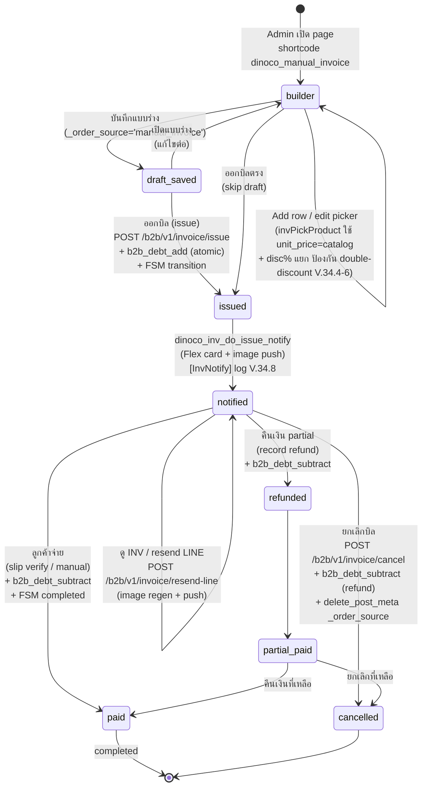

**Key state behaviors**:

| State | Trigger | Side Effects |
| ----- | ------- | ------------ |
| builder | Admin เปิด `[dinoco_manual_invoice]` | Picker autocomplete + multi-picker (V.34.4-V.34.6 catalog price + disc% contract) — ห้ามส่ง dealer-price + discPct ซ้อน |
| draft_saved | บันทึกแบบร่าง | INSERT post type=`shop_order`, status=`draft`, meta `_order_source='manual_invoice'` |
| issued | กดออกบิล | Atomic transaction: `b2b_debt_add` + post status=`issued` + INV# + `_b2b_invoice_image_pages` meta |
| notified | dinoco_inv_do_issue_notify | LINE Flex push (group_id) + `b2b_send_invoice_image()` (Snippet 10 V.30.7-30.8) — `[InvNotify]` + `[InvImg]` logs ทุก path |
| paid | Slip verified หรือ manual mark paid | `b2b_debt_subtract` + status=`completed` + audit trail |
| cancelled | Admin cancel | `b2b_debt_subtract` (full refund) + status=`cancelled` + delete meta keys |
| refunded | Admin partial refund | `b2b_debt_subtract` (partial) + meta `_partial_refund_amount` |

**V.34.4-V.34.10 fix series guards**:

- V.34.4-V.34.6 picker contract: 4 call-sites (`invPickProduct` / `invPickSingleFromMulti` / `invSubmitMultiPicker` / `invApplyProductToRow`) ส่ง `unit_price = info.base` (catalog) + `discount_raw = info.disc + '%'` (แยก) — ป้องกันลูกค้าได้ราคา 8800×0.8×0.8=5632 แทน 7040
- V.34.8 observability: 3 notify sites + Snippet 10 V.30.7 instrument silent-fail paths (GD missing / font fail / LINE batch HTTP non-200) → grep `\[InvNotify|\[InvImg|\[Font|\[GD` ใน debug.log
- V.34.9 stale nonce auto-reload: 24h+ tab → 403 `rest_cookie_invalid_nonce` → `_invHandleAuthError` confirm → `window.location.reload()` (one-shot guard `_invNonceReloadShown` ป้องกัน prompt spam)
- V.34.10 hardening: whitelist 4 nonce/auth codes (rest_cookie_invalid_nonce + rest_forbidden + rest_user_cannot_access + rest_not_logged_in) — non-auth 403 (rate limit, BO tier mismatch) ผ่าน normal toast ไม่ force-logout
- V.34.10 MED-1 infinite reload guard: เช็ค `content-type: application/json` ก่อนเรียก auth handler — HTML response (Cloudflare WAF / nginx 502) แสดง preview text ใน toast แทน reload spam

**Excluded from**:

- Daily Summary 17:30 ICT pending_ship (V.30.8)
- Admin LIFF "ค้างจัดส่ง"/"รอชำระ"/tracking (V.31.5 + V.41.7)
- Admin Dashboard stat boxes (V.32.5)
- Manual flash creation flow (separate B2B order path)

**Included in** (per user policy):

- Daily Summary revenue + MTD + Top Distributors + Weekly Report
- Finance Dashboard (รวมหน้าเดียวกัน)
- Customer LIFF + account_info Flex pending badge

---

## 9. Cron Jobs Schedule

### 9.1 B2B Cron Jobs

Source: Snippet 7, DB_ID: 56

| Hook | Schedule | Time (ICT) | Description |
|------|----------|------------|-------------|
| `b2b_dunning_cron_event` | Daily | 09:00 | ทวงหนี้ (friendly → official → hold) |
| `b2b_daily_summary_cron` | Daily | 17:30 | สรุปยอดประจำวัน → Admin group |
| `b2b_rank_update_event` | Monthly | วันที่ 1, 00:05 | อัพเดท rank tier |
| `b2b_bo_overdue_check` | Daily | 10:00 | BO เกิน ETA |
| `b2b_auto_complete_check` | Daily | 11:00 | Auto complete 7 วันหลัง shipped |
| `b2b_oos_expiry_check` | Daily | 06:00 | OOS หมดอายุ |
| `b2b_weekly_report_event` | Weekly | Sun 17:30 | สรุปสัปดาห์ |
| `b2b_shipping_overdue_cron` | Daily | 15:00 | สรุปค้างจัดส่ง |
| `b2b_flash_tracking_cron` | Every 2 hours | -- | Poll Flash API tracking |
| `b2b_flex_retry_cron` | Every 1 min | -- | Retry failed Flex sends |
| `b2b_rpi_heartbeat_check` | Every 5 min | -- | RPi heartbeat check |
| `dinoco_shipping_auto_rollback_cron` | `ten_minutes` | -- | **V.42 Phase 5** Auto-flip `dinoco_shipping_meta_enabled=false` on error rate >5% AND ≥20/hr count |
| `flash_category_verify_cron` | `fifteen_minutes` | -- | **V.42 F2** Post-create verify expected vs actual expressCategory → Flex alert if Flash auto-bumped |
| `dinoco_flash_dlq_cleanup_cron` | Daily | 03:00 | **V.42 F7** Prune `dinoco_flash_dead_letter` rows > 30 days |
| `dinoco_flash_audit_cleanup_cron` | Daily | 03:15 | **V.42** Prune `dinoco_flash_audit` rows > 90 days |

### 9.2 B2B Single Events (Dynamic)

| Hook | Trigger | Delay | Description |
|------|---------|-------|-------------|
| `b2b_delivery_check_event` | After shipped | 3 days | ถามลูกค้า "ได้รับของไหม?" |
| `b2b_sla_alert_event` | After order created | 10-60 min | SLA alert escalation |
| `b2b_auto_ship_flash_event` | After confirm | 1 hour | Auto Flash create |
| `b2b_flash_24hr_complete` | After Flash signed | 24 hours | Auto complete |
| `b2b_flash_courier_retry` | After Flash fail | Variable | Retry courier notify |
| `b2b_verify_slip_async` | After slip upload | Immediate | Async slip verification |

### 9.3 B2F Cron Jobs -- Table

Source: Snippet 11, DB_ID: 1171

| Hook | Schedule | Description |
|------|----------|-------------|
| `b2f_cron_delivery_reminder` | Daily 09:00 | เตือนจัดส่ง (D-3, D-1, D-day, D+1, D+3, D+7+) |
| `b2f_cron_overdue_check` | Daily 10:00 | เตือน overdue |
| `b2f_cron_maker_noresponse` | Daily 11:00 | Maker ไม่ตอบ (24h, 48h, escalate 72h) |
| `b2f_cron_payment_reminder` | Daily 09:30 | เตือนชำระ (term -7, -3, ครบ, +3, +7 auto hold) |
| `b2f_cron_daily_summary` | Daily 17:30 | สรุปประจำวัน |
| `b2f_cron_weekly_summary` | Weekly Mon | สรุปรายสัปดาห์ |
| `b2f_cron_rejected_escalation` | Daily 10:30 | Rejected PO escalation (7 วันไม่มี action → alert Admin) |
| `b2f_flex_retry_cron` | Every 1 min | Retry failed Flex sends |

### 9.4 B2F Cron Jobs -- Gantt Chart

```mermaid
gantt
    title B2F Cron Jobs -- Daily Schedule (Asia/Bangkok)
    dateFormat HH:mm
    axisFormat %H:%M

    section Daily
    b2f_delivery_reminder (D-3, D-1, D-day)     :active, 08:30, 15m
    b2f_overdue_check (D+1, D+3, D+7+)          :crit, 09:00, 15m
    b2f_maker_noresponse (24h, 48h, 72h esc)     :09:30, 15m
    b2f_rejected_escalation (7d no action)       :10:30, 15m
    b2f_daily_summary                            :18:00, 15m

    section Weekly (จันทร์)
    b2f_payment_due_check (credit term)          :09:00, 15m
    b2f_weekly_summary                           :09:00, 15m

    section Monthly (วันที่ 1)
    b2f_monthly_summary + Maker performance      :09:00, 30m
```

### 9.5 B2F Cron Schedule Detail

| เวลา | ความถี่ | Job Name | รายละเอียด | Query Filter | ส่งถึง |
|------|---------|----------|-----------|--------------|--------|
| **08:30** | Daily | `b2f_delivery_reminder` | เตือน PO ใกล้ ETA: D-3, D-1, D-day | `po_status IN (confirmed, delivering)` AND `po_expected_date` ใกล้ถึง | Maker + Admin |
| **09:00** | Daily | `b2f_overdue_check` | แจ้ง PO เลย ETA: D+1 (เหลือง), D+3 (แดง), D+7+ (ซ้ำทุก 3 วัน) | `po_status IN (confirmed, delivering)` AND `po_expected_date < today` | Admin |
| **09:30** | Daily | `b2f_maker_noresponse` | เตือน Maker ที่ไม่ตอบ: 24h reminder, 48h reminder, 72h escalate Admin | `po_status = submitted` AND `post_date` เกิน threshold | 24h/48h: Maker, 72h: Admin |
| **10:30** | Daily | `b2f_rejected_escalation` | Rejected PO ค้างเกิน 7 วันไม่มี action (amend/cancel) → alert Admin ให้ตัดสินใจ | `po_status = rejected` AND `po_rejected_date + 7 days < today` | Admin |
| **18:00** | Daily | `b2f_daily_summary` | สรุปประจำวัน: PO ใหม่, delivery วันนี้, overdue, payments | ทุก PO ที่ active | Admin |
| **09:00** | Weekly (จันทร์) | `b2f_payment_due_check` | ตรวจ PO ที่รับของแล้วยังไม่จ่ายเงิน, ใกล้/เลย credit term | `po_status IN (received, partial_paid)` AND credit term calculation | Admin |
| **09:00** | Weekly (จันทร์) | `b2f_weekly_summary` | สรุปรายสัปดาห์: PO ใหม่/ปิด, outstanding payments, Maker performance | Aggregate ทั้งสัปดาห์ | Admin |
| **09:00** | Monthly (วันที่ 1) | `b2f_monthly_summary` | สรุปรายเดือน: ยอดสั่งซื้อ, ต้นทุนรวม, Maker performance rating, overdue % | Aggregate ทั้งเดือน | Admin |

### 9.6 B2F Cron Notes

- แยกเวลา cron (08:30, 09:00, 09:30) เพื่อกระจาย DB load ไม่ให้ spike พร้อมกัน
- แนะนำใช้ real system crontab (`wp-cron.php`) แทน WP pseudo-cron เพราะ reminder ต้อง reliable
- ทุก cron query filter เฉพาะ status + date range ที่เกี่ยวข้อง ไม่ scan ทุก PO
- ใช้ `po_last_reminder_sent` ป้องกันส่ง reminder ซ้ำในวันเดียวกัน
- Timezone: `Asia/Bangkok` (hardcoded ทั้งระบบ)

### 9.7 System Cron Jobs

| Hook | Schedule | Source | Description |
|------|----------|--------|-------------|
| `dinoco_daily_auto_close_event` | Daily | Admin Service Center | Auto-close claim tickets 30 วันหลังเข้าสถานะ: Replacement Shipped, Repaired Item Dispatched, Replacement Rejected by Company |
| `b2b_cleanup_old_invoices` | Daily (on summary) | B2B Snippet 10 | Cleanup old invoice images |
| `b2b_cleanup_old_slips` | Daily (on summary) | B2B Snippet 3 | Cleanup old slip images |
| `dinoco_inv_cron_reminder` | Daily 09:00 | Manual Invoice | Invoice payment reminders |
| `dinoco_inv_cron_overdue` | Daily | Manual Invoice | Overdue invoice notices |

### 9.8 OpenClaw Cron Jobs (Node.js)

| Job | Schedule | Source | Description |
|-----|----------|--------|-------------|
| Telegram Daily Summary | Daily 09:00 ICT | telegram-gung.js | สรุปยอดวันก่อน (chat, lead, claim) ส่ง Telegram |
| Telegram Lead No Contact | Every 4 hours | telegram-gung.js | แจ้ง leads ที่ยังไม่ติดต่อ |
| Telegram Claim Aging | Every 4 hours | telegram-gung.js | แจ้ง claims ที่ค้างนาน (reviewing > 48h, etc.) |

---

## 10. Inventory Flow (V.6.0 -- 3-Level Hierarchy)

### 10.0 Inventory Stock Cycle Sequence Diagram (V.8.5+ — 2026-04-29)

ภาพรวม end-to-end ทุก stock movement: B2F receive (เข้า) → B2B order (ออก) → cancel (คืน) → walk-in (allow negative DD-5) → 3-level hierarchy compute (SET = MIN(children)) → multi-warehouse + dip stock variance. แสดง atomic FOR UPDATE locks + cascade ancestor updates + cache invalidation.

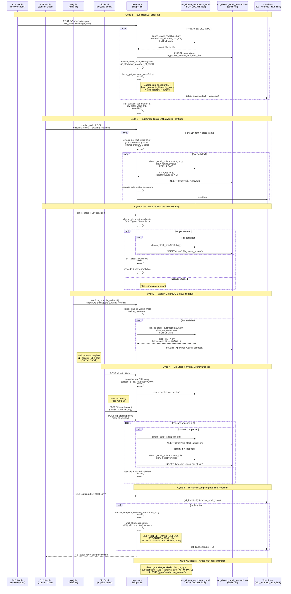

**Critical guards** (V.6.0+ regression):

| Guard | Rule | Reference |
| ----- | ---- | --------- |
| DD-2 | ตัดสต็อกเฉพาะ leaf nodes — non-leaf SET ห้ามเรียก stock_add/subtract ตรง | Snippet 15 V.7.1 |
| DD-3 | Shared child (อยู่ใน 2+ SET) — `&$visited` value-copy per branch ป้องกัน sibling double-count | V.7.1 fix C1/C2 |
| DD-4 | Max depth 3 (แม่→ลูก→หลาน) — `dinoco_validate_sku_hierarchy()` circular guard | V.6.0 |
| DD-5 | Walk-in allow_negative=true — Snippet 2 V.34.2 detect `_b2b_is_walkin` | V.7.1 fix C3 |
| DD-6 | B2C ไม่เห็นชิ้นส่วนย่อย — `dinoco_is_top_level_set` filter | V.6.0 |
| DD-7 | B2F auto-expand SET → leaves ใน PO + breakdown[] tracking (DD-3 multi-parent) | Snippet 0 V.3.3 |
| `_stock_returned` meta | Cancel restore idempotent — set flag หลัง first restore | Snippet 5 V.31.7 |
| Leaf guard (V.7.1 H2) | `dinoco_stock_add/subtract` defensive guard ต้น function — return WP_Error('not_leaf') ถ้าไม่ใช่ leaf | V.7.1 |

**Atomic transaction pattern** (used by ALL stock_add/subtract):

```php
$wpdb->query('START TRANSACTION');
$wpdb->query($wpdb->prepare(
    "SELECT stock_qty FROM dinoco_warehouse_stock
     WHERE warehouse_id=%d AND product_sku=%s
     FOR UPDATE", $warehouse_id, $sku));
// modify stock_qty
$wpdb->query($wpdb->prepare(
    "UPDATE dinoco_warehouse_stock SET stock_qty=%d
     WHERE warehouse_id=%d AND product_sku=%s",
    $new_qty, $warehouse_id, $sku));
// INSERT into dinoco_stock_transactions (audit trail)
$wpdb->query('COMMIT');
```

**Cache invalidation chain**: ทุก stock mutation → invalidate transients ของ leaf + ancestors (cascade up):

- `b2b_reserved_map_bulk` (Snippet 1)
- `b2b_sku_data_map` (Snippet 3)
- `hierarchy_stock_<sku>` (per ancestor)
- `dinoco_catalog_static_memo` (Snippet 15 V.32.6 per-request memo)

### 10.1 Stock Architecture

```text
Custom Tables (Snippet 15):
  - dinoco_warehouse_stock: per SKU per warehouse (stock_qty จริง)
  - dinoco_stock_transactions: audit trail ทุกการเปลี่ยนแปลง
  - dinoco_warehouses: multi-warehouse support (โกดังหลัก default)
  - dinoco_dip_stock + dinoco_dip_stock_items: physical count sessions

Atomic Operations:
  - dinoco_stock_add($sku, $qty, $type, $warehouse_id, $user_id)
  - dinoco_stock_subtract($sku, $qty, $type, $warehouse_id, $user_id)
  - ทุกการเปลี่ยนแปลงผ่าน FOR UPDATE lock ป้องกัน race condition
```

### 10.2 3-Level SKU Hierarchy (V.6.0)

```text
โครงสร้าง 3 ระดับ:
  แม่ (Top-level Set)
    └── ลูก (Sub-Set / ชิ้นส่วน)
         └── ชิ้นส่วนย่อย (Leaf / ชิ้นเดี่ยว)

ตัวอย่าง:
  ชุดแต่งเต็มคัน (SET-FULL)
    ├── ชุดกันล้ม (SET-GUARD)
    │    ├── กันล้มหน้า (SKU-FRONT)      ← leaf
    │    └── กันล้มหลัง (SKU-REAR)       ← leaf
    └── ชุดกล่อง (SET-BOX)
         ├── กล่องข้าง L (SKU-SIDE-L)    ← leaf
         ├── กล่องข้าง R (SKU-SIDE-R)    ← leaf
         └── กล่องหลัง (SKU-TOP)         ← leaf

Stock Computation:
  - Leaf SKU: ใช้ stock_qty จาก dinoco_warehouse_stock ตรงๆ
  - Sub-Set (SET-GUARD): MIN(SKU-FRONT stock, SKU-REAR stock)
  - Top-level (SET-FULL): MIN(SET-GUARD computed, SET-BOX computed)
  - Function: dinoco_compute_hierarchy_stock() — recursive MIN

Helper Functions (PART 1.35):
  - dinoco_get_leaf_skus($sku)       → resolve ลง leaf nodes
  - dinoco_is_leaf_sku($sku)         → ไม่มี children = leaf
  - dinoco_get_ancestor_skus($sku)   → หา parent ทุกระดับขึ้น
  - dinoco_compute_hierarchy_stock() → recursive MIN stock
  - dinoco_is_top_level_set($sku)    → เป็น parent ไม่เป็น child ของใคร
  - dinoco_validate_sku_hierarchy()  → validate depth ≤ 3, no circular ref
  - dinoco_get_sku_tree($sku)        → nested tree สำหรับ UI
```

### 10.3 Stock Deduction Flow (B2B Order)

```text
Trigger: Admin ยืนยัน order → status: checking_stock → awaiting_confirm

Flow (Snippet 2 V.34.2 — walk-in allow_negative):
  1. วน order_items แต่ละ SKU
  2. Detect _b2b_is_walkin meta → set $allow_neg flag
  3. dinoco_get_leaf_skus($sku) → resolve เป็น leaf SKUs (V.7.1 value-copy visited)
  4. dinoco_stock_subtract($leaf, $qty, ..., $allow_neg) — walk-in = true ให้ติดลบได้
  5. dinoco_stock_auto_status() → อัพเดท stock_status ของ leaf
  6. dinoco_get_ancestor_skus($leaf) → หา parent ทุกระดับ
  7. cascade dinoco_stock_auto_status() ขึ้น ancestor ทุกตัว
  8. Delete transient cache (leaf + ancestors)

Cancel / Stock Restore (Snippet 2 + Snippet 5 V.32.0):
  1. dinoco_get_leaf_skus($sku) → resolve เป็น leaf SKUs
  2. dinoco_stock_add() เฉพาะ leaf SKUs (คืนสต็อก)
  3. Guard: _stock_returned meta ป้องกันคืนซ้ำ (V.31.7)
  4. Cascade status + cache invalidation เหมือน deduction
```

### 10.4 B2F Receive → Stock Addition

```text
Trigger: Admin ตรวจรับของจาก Maker → POST /b2f/v1/receive-goods

Flow:
  1. สร้าง b2f_receiving record
  2. วน rcv_items → dinoco_stock_add() per SKU (leaf เสมอเพราะ B2F สั่งชิ้นส่วน)
  3. dinoco_stock_auto_status() + cascade ancestor
  4. b2f_payable_add() เพิ่มหนี้
```

### 10.5 Additional Features

```text
Dip Stock (Physical Count):
  - เริ่ม session → snapshot เฉพาะ leaf SKUs (dinoco_is_leaf_sku filter)
  - นับจริง → เปรียบเทียบกับ expected → variance report
  - Approve → adjust stock ผ่าน dinoco_stock_add/subtract

Inventory Valuation:
  - WAC (Weighted Average Cost) per SKU
  - ใช้ dinoco_compute_hierarchy_stock() แทน raw stock (V.6.0)
  - THB เสมอ (foreign currency × exchange_rate ตอน B2F receive)

Stock Forecasting:
  - avg_daily_usage จาก outbound transactions (b2b_reserved, b2b_shipped, manual_subtract)
  - days_of_stock, reorder_in_days, suggested_order_qty
  - Guard: ต้องมี data >= 30 วัน

Multi-Warehouse:
  - dinoco_warehouses table (โกดังหลัก = default)
  - dinoco_get_total_stock($sku) รวมทุกคลัง
  - dinoco_transfer_stock($sku, $from, $to, $qty)
```

#### 10.5.1 Dip Stock Cycle State Diagram (Mermaid)

แสดง state ของ dip stock session (V.39.0) ตั้งแต่ admin เปิด session จนกว่าจะ approve / force-close. Snapshot เฉพาะ leaf SKUs (V.42.22 leaf-based classification).

```mermaid
stateDiagram-v2
    [*] --> not_started: page load (no active session)

    not_started --> counting: POST /dip-stock/start<br/>(snapshot leaf SKUs<br/>dinoco_is_leaf_sku filter)

    counting --> counting: POST /dip-stock/count<br/>(per-SKU counted_qty update)
    counting --> variance_review: POST /dip-stock/current<br/>(all SKUs counted → preview variance)

    variance_review --> counting: edit some SKU<br/>(re-count adjustment)
    variance_review --> approved: POST /dip-stock/approve<br/>(adjust stock via<br/>dinoco_stock_add/subtract)

    counting --> force_closed: POST /dip-stock/force-close<br/>(admin abort, no adjustment)
    variance_review --> force_closed: POST /dip-stock/force-close

    counting --> expired: cron auto-expire >48h<br/>(dinoco_dip_stock_expire_cron)
    variance_review --> expired: cron auto-expire

    approved --> [*]: session archived<br/>(history viewable via /dip-stock/history)
    force_closed --> [*]
    expired --> [*]
```

**State transitions table**:

| From | To | Trigger | Side Effects |
| ---- | -- | ------- | ------------ |
| not_started | counting | `POST /dip-stock/start` | INSERT `dinoco_dip_stock` (status=counting) + per-SKU rows in `dinoco_dip_stock_items` (expected_qty=current stock or 0 for initial import) |
| counting | counting | `POST /dip-stock/count` | UPDATE `dinoco_dip_stock_items.counted_qty` per SKU (idempotent) |
| counting | variance_review | `POST /dip-stock/current` after all counted | Compute variance = counted - expected per SKU |
| variance_review | approved | `POST /dip-stock/approve` | For each variance: call `dinoco_stock_add()` or `dinoco_stock_subtract()` (atomic FOR UPDATE) + status='approved' + closed_at=NOW |
| counting/variance_review | force_closed | `POST /dip-stock/force-close` | status='force_closed' + reason logged + NO stock adjustment |
| counting/variance_review | expired | Cron `dinoco_dip_stock_expire_cron` (twicedaily) | status='expired' if started_at < NOW - 48h |

**Cron schedule** (Snippet 15):

- `dinoco_dip_stock_reminder_cron` — daily, 30-day interval (configurable) → reminder LINE Flex if no session in 30+ days
- `dinoco_dip_stock_expire_cron` — twicedaily → auto-expire stale sessions

**Guards**:

- DD-2 (V.39.0): snapshot เฉพาะ leaf nodes (ไม่นับ SET + sub-SET) — `dinoco_is_leaf_sku()` filter
- V.42.22: classification leaf-based (ตรงกับ stock/list V.42.21 + JS V.42.13)
- 1 active session per warehouse — INSERT guards via SELECT FOR UPDATE
- Approve requires all SKUs counted (no NULL counted_qty)

### 10.6 Auto-Split Workflow (V.41.0 → V.42.11)

```text
Purpose: แยกสินค้าเดี่ยวหรือ child → 2-6 ชิ้นส่วนย่อย ในคลิกเดียว (V.42.11 N-part)

Entry: Admin Inventory → Edit product (single หรือ child) → กด "Auto-Split"

Pre-check (V.42.8 + V.42.11):
  - type = 'single' หรือ 'child' (V.42.8 allow single)
  - parent ต้องยังไม่มี children (skuRelations[parent].length === 0)
  - ถ้า -sfx orphan มีอยู่แล้ว (V.42.7 resume mode) → allow resume ถ้าไม่ได้ link กับ parent ไหน

N-part Selection (V.42.11):
  - Count chips: 2 / 3 / 4 / 5 / 6 ชิ้น (default 2)
  - Pattern chips filter ตาม count:
    * 2-part: L|R, U|D, F|B, FR|RR
    * 3-part: L|R|U, L|R|T, F|L|R
    * 4-part: L|R|U|D, F|B|L|R
    * custom: กำหนด suffix เอง (ทำงานทุก count)
  - Columns render dynamic ผ่าน renderSplitColumns(n)
  - _splitState.col[1..N] + _splitState.sfx[N]

Price Split Modes (V.42.8 + V.42.11 N-column):
  - equal (default): หาร /N เท่ากัน (last col gets remainder)
  - percent: admin ใส่ % ทั้ง N ช่อง (ต้องรวม 100)
  - quantity: qty_1..qty_N → prices[i] = base * (qty[i] / total)
  - manual: admin กรอกเอง N ช่อง
  → ปุ่ม "คำนวณ" auto-fill ราคาทั้ง N ช่อง

Execute Flow (4 steps + CORS proxy):
  0. generateLabeledImage (V.42.10) — canvas + overlay text
     ├── ลอง load ตรง (crossOrigin=anonymous)
     ├── ถ้า canvas tainted → direct load ไม่ใช้ CORS
     └── ถ้ายังไม่ได้ → POST /dinoco-stock/v1/image-proxy → data URL → canvas OK
  1. save_product × N SKUs (parallel via $.when.apply)
  2. save pricing × N SKUs (parallel)
  3. save_sku_relation parent={parent}, child_skus=[sku1..skuN], confirm_stock_migrate=1 (V.42.5)
      ├── backend detect parent had stock → migrate ไป sku1 (H1)
      └── insert audit: hierarchy_migrate_out (parent) + hierarchy_migrate_in (sku1)
  4. Success → แสดง N edit buttons + reload catalog

Error Handling:
  - Step 4 fail เดิม → orphan -sfx ค้าง (V.42.7 fix: allow resume)
  - Response success:false → แสดง error message จริงจาก backend (V.42.6)
  - Silent fail (HTTP 200 + success:false) → ถูกจับด้วย relationResponse inspection (V.42.6)

Auto-Split Image (V.42.0 → V.42.10):
  - Canvas = aspect ratio ของรูปต้นฉบับ (maxDim 1600)
  - แถบแดงซ้อนทับด้านล่าง 16% ของ canvas height
  - Text overlay (Thai font) 50% ของ bar height
  - jpeg quality 0.9 → upload + overwrite SKU image
  - V.42.10: WP image-proxy fallback แก้ CORS tainted (admin panel ↔ รูป cross-origin)
```

### 10.7 Hierarchy Bug Fixes (V.7.1 / V.42.4-42.8 — 2026-04-10)

```text
3 CRITICAL + 2 HIGH bugs จาก audit SKU hierarchy system

🔴 C1/C2 — Shared child (DD-3) แตก
  File: Snippet 15 V.7.1
  Bug: $visited เป็น reference → sibling branches share → shared leaf return 0/empty
  Fix: value-copy + array_unique dedup
  Functions: dinoco_get_leaf_skus, dinoco_compute_hierarchy_stock, dinoco_get_sku_tree

🔴 C3 — Walk-in stock ติดลบไม่ได้
  File: Snippet 15 V.7.1 + Snippet 2 V.34.2
  Bug: max(0, ...) cap เสมอ → ขัด DD-5
  Fix: $allow_negative param + walk-in path ส่ง true (detect _b2b_is_walkin)

🟡 H1 — Auto-Split parent stock หาย
  File: Admin Inventory V.42.4
  Bug: parent มี stock_qty > 0 → กลายเป็น non-leaf → stock หาย (compute ไม่อ่าน parent)
  Fix: save_sku_relation เช็ค becoming_parent → require confirm_stock_migrate flag
       → migrate parent stock → leaf แรก + audit trail (hierarchy_migrate_out/in)

🟡 H2 — Defensive leaf guard
  File: Snippet 15 V.7.1
  Fix: dinoco_stock_add/subtract เพิ่ม guard ต้น function
       → !dinoco_is_leaf_sku → return WP_Error('not_leaf') + log CRITICAL
       → caller ทุกตัวต้อง expand leaf ก่อน (Snippet 2/5 + B2F Snippet 2 ทำถูกแล้ว)

Frontend Fix Wave (V.42.5-42.8):
  V.42.5 — Auto-Split JS ส่ง confirm_stock_migrate=1 auto
  V.42.6 — Manual Edit modal ส่ง flag + inspect relationResponse (silent fail fix)
  V.42.7 — Auto-Split resume from orphan (retry ได้ไม่ติด guard)
  V.42.8 — Price split mode 4 แบบ + type check fix (single) + debug console log
```

### 10.8 Hierarchy Tag System + UX Overhaul (V.42.9 → V.42.14 — 2026-04-10)

```text
ปัญหา: Tag "SET" เก่าไม่สื่อโครงสร้าง 3 ระดับ + มีบัคหลายจุดใน Edit modal

V.42.9 CRITICAL — Save grandchild ไม่ได้ (blocker ตั้งแต่ V.40.5)
  Bug: skipRelations = (ptype === 'child' || 'grandchild') → ห้ามส่ง save_sku_relation
       → admin เพิ่ม grandchild ใต้ child → save → skipped → grandchild หาย
  Fix: skip เฉพาะ grandchild + ไม่มี children และไม่เคยมี (everHadChildren check)

V.42.10 CORS Image Proxy
  Bug: Canvas tainted เวลา generateLabeledImage โหลดรูปจาก dinoco.in.th
       บน admin panel akesa.ch (cross-origin) → toBlob throw SecurityError
  Fix: POST /dinoco-stock/v1/image-proxy (server-side fetch + base64)
       - https only, 10MB limit, image/* content-type check, admin only
       - Fallback chain: direct CORS → direct no-CORS → WP proxy data URL
       - data URL = same-origin → no CORS issue

V.42.11 N-part Auto-Split (2-6 parts dynamic)
  เดิม: hardcoded 2 cols L/R
  ใหม่: count chip (2-6) + pattern filter + dynamic render
        - renderSplitColumns(n) สร้าง N cols + accent color
        - parallel save via \$.when.apply(\$, deferreds)
        - applySplitPriceMode รองรับ N cols ทุก mode

V.42.12 Hierarchy Tag Redesign + Skeleton + Case-Insensitive
  - Badge 4 types: purple set / blue child / green grandchild / gray single
    * Contrast AAA (>7:1) ทุกสี
    * Icon Font Awesome: sitemap/puzzle-piece/gear/cube
  - Breadcrumb: child "← {parent}", grandchild "← {gp} › {parent}" คลิกได้
  - Count: set "N ชิ้นส่วน · M ชิ้นย่อย" (รวมหลานใต้ลูก)
  - Filter chips ใหม่: ทั้งหมด / สินค้าเดี่ยว / ชุดหลัก / └─ ชิ้นส่วน / └─ ชิ้นส่วนย่อย
  - Image skeleton loader: .cedit-thumb-wrap + shimmer animation
  - cat(sku) helper: case-insensitive lookup + uppercase cache
    แก้บัค SKU case mismatch (relations uppercase, catalogData mixed)
    → รูปใน Set Components list random N/A
  - computeProductTypes V.42.12: direct_children_count + grandchildren_total
    + grandchildren_count + parent_count (shared child support DD-3)

V.42.13 Leaf-based Classification
  ปัญหา: SET → [L, R] ตรงๆ (2 ชั้น) classify L/R เป็น 'child' ผิด
  เดิม (depth-based): if (myParent && childToParent[myParent]) → grandchild
  ใหม่ (leaf-based):  if (myParent && isLeaf) → grandchild
  Case matrix:
    - SET → [L, R] (flat 2): L/R = grandchild ✅
    - SET → [Upper → [L,R]] (3): Upper=child, L/R=grandchild ✅
    - SET → [Upper(leaf), Lower → [L,R]]: Upper=grandchild, Lower=child ✅
  Breadcrumb: 3 ชั้น (← gp › parent) หรือ 2 ชั้น (← parent เดียว) — เพิ่ม null check
  ไม่กระทบ DD-2 backend (dinoco_get_leaf_skus leaf-aware อยู่แล้ว)

V.42.14 Hybrid Override (Manual admin choice)
  เพิ่ม column ui_role_override VARCHAR(20) DEFAULT 'auto' (auto-migration)
  Backend save_product whitelist: auto / set / child / grandchild / single
  Frontend:
    - UI: radio chips ใน Edit Product modal (5 choices)
    - Hint: "อัตโนมัติ: {auto_type_label}" ให้ admin เห็นว่า auto จะเดาเป็นอะไร
    - computeProductTypes: ถ้า override !== 'auto' && !== autoType → ใช้ override
    - is_override=true → แสดง icon ✋ ต่อท้าย badge label
    - edge cases: override=child/gc/single บนสินค้าไม่มี parent (render ไม่มี breadcrumb)
  สำคัญ: UI layer only — ไม่กระทบ stock / orders / DD-2 (backend ใช้ structure จริง)

V.42.15 Price Suggestion (deprecated — superseded ใน V.42.16)
  เดิม equal-split /N — concept ผิดสำหรับ SET ผสมที่ราคาลูกไม่เท่ากัน

V.42.16 Sum Integrity Check (Phase 2 Redesign)
  เปลี่ยนจาก "แนะนำราคา" → "ตรวจความครบของราคา"
  Header card: parent / sum(children effective) / margin + status
    - ok (|diff| < 1%): เขียว "ราคาสมดุล"
    - loss (sum > parent): แดง "แม่ถูกกว่าผลรวมลูก" (ขาดทุน)
    - profit (sum < parent): ฟ้า "แม่แพงกว่าผลรวมลูก" (margin +)
  Effective cost: ถ้า child เป็น sub-SET → ใช้ sum(grandchildren) แทน child.price
  Per-child: "ราคาจริง X฿ · Y% ของแม่" (contribution %)
  Sub-SET integrity: ถ้ามี grandchildren → เทียบ sum(gc) vs child.price
    - match: "✅ ชิ้นย่อยรวมตรงกับ sub-SET"
    - mismatch: "⚠️ ลูกรวมเกิน/ต่ำกว่า +/-X฿ (+/-Y%)"
  Per-grandchild: "ราคาจริง · Y% ของ sub-SET" (fallback "ของแม่")
  Live update: input handler บน #cat-price debounced 250ms (เหมือน V.42.15)

V.42.17 Margin Analysis (God Mode Only)
  Backend-enforced cost visibility — ไม่ rely on client-side class
  Endpoints:
    POST /dinoco-stock/v1/god-mode/verify — PIN → JWT 30 min (HMAC via DINOCO_JWT)
    GET  /dinoco-stock/v1/margin-analysis?sku=X — header X-Dinoco-God required
  Permissions: manage_options cap + valid god JWT + rate limit 30/min/user
  Helper: dinoco_get_wac_for_skus() batch (Snippet 15 V.7.2) — 1 SQL query
         fallback b2f_maker_product × exchange rate, cache 1 ชม per SKU
  Client flow:
    1. Admin กด god badge → prompt PIN → POST /god-mode/verify → JWT ใน sessionStorage
    2. openEditCatalogModal → ถ้า god → fetchMarginAnalysis(sku) → prefetch _marginContext
    3. updateTierPreview(tid) extend → append profit line ใต้ dealer price
       (client-side math ไม่เรียก API ซ้ำ — แก้ราคา/ส่วนลด → refresh ทันที)
    4. Banner ใน Tier Pricing section: ต้นทุน WAC + source + incomplete warning
  Incomplete handling: partial cost + list missing_wac_leaves (not silent 0)
  Security note: god mode client-side class ยังใช้สำหรับ UI gate (ปุ่ม edit)
                 แต่ cost data enforce ฝั่ง server — DevTools manipulation ไม่เข้า
```

---

## 11. Appendix: B2F Architecture Reference

### ช่องทางทำงานแต่ละ Role

| Role | ช่องทาง | ทำอะไรได้ |
|------|---------|----------|
| **Admin** | PC Dashboard (shortcode tabs) | สร้าง PO, ตรวจรับ, จ่ายเงิน, แก้ไข/ยกเลิก, ดู credit |
| **Admin** | LIFF (E-Catalog) | สร้าง PO |
| **Admin** | LINE Bot (Admin Group) | สั่งโรงงาน, ดู PO, สรุปโรงงาน |
| **Maker** | LINE Bot (Maker Group) | @mention ดู PO, พิมพ์ "ส่งของ" |
| **Maker** | LIFF (Signed URL + JWT) | ยืนยัน/ปฏิเสธ PO, กรอก ETA, ขอเลื่อนวัน |
| **System** | Cron Jobs | Delivery reminder, overdue check, no-response escalate, summaries, credit check |

### B2F Snippet Map

| Snippet | DB_ID | หน้าที่ |
|---------|-------|--------|
| Snippet 0 | 1160 | CPT & ACF Registration (5 CPTs + helpers) |
| Snippet 1 | 1163 | Core Utilities & Flex Builders (LINE push + 13 Flex templates) |
| Snippet 2 | 1165 | REST API (19+ endpoints `/b2f/v1/`) |
| Snippet 3 | 1164 | Webhook Handler & Bot Commands (Maker + Admin B2F commands) |
| Snippet 4 | 1167 | Maker LIFF Pages (`[b2f_maker_liff]` route `/b2f-maker/`) |
| Snippet 5 | 1166 | Admin Dashboard Tabs (Orders + Makers + Credit tabs) |
| Snippet 6 | 1161 | Order State Machine (`B2F_Order_FSM` class) |
| Snippet 7 | 1162 | Credit Transaction Manager (atomic `b2f_payable_add/subtract()`) |

---

## Regression Guard Test Flow (OpenClaw V.1.5)

### CLI Test Flow

```text
node scripts/regression.js --mode=gate --severity=critical,high
  ↓
Load scenarios from MongoDB (regression_scenarios collection, active=true)
  ↓
For each scenario (sequential, 2s delay):
  - sourceId = "reg_" + bug_id + "_" + timestamp (isolation)
  - For each turn in scenario.turns:
      - runRegressionTurn(sourceId, turn.message)  ← V.1.5
        ├─ saveMsg(user)            [context persistence]
        ├─ Auto-lead pre-check      [phone regex + bot cue]
        ├─ callDinocoAI(prompt, message, sourceId)
        ├─ Dealer coordination append
        └─ saveMsg(assistant)
      - Capture tools from aiChat._lastToolResults (Array per sourceId)
      - Clear tool results before next turn
  ↓
Cleanup: deleteMany({ sourceId }) + deleteMany({ sourceId }) for ai_memory
  ↓
3-Layer Validation (Hard → Soft short-circuit):
  Layer 1: Regex forbidden/required (0 token, safe-regex2 compiled)
  Layer 2: Tool call check (expected_tools + forbidden_tools)
  Layer 3: Gemini semantic judge (only if hard passes + expect_behavior set)
           └─ JSON envelope prompt (SEC-C3) + fail-closed on error
  ↓
Write to regression_runs collection + console table
  ↓
Exit code: mode=gate → critical fail = 1 (blocks deploy), else 0
```

### Deploy Gate Flow (3-Layer Fail-Fast)

```text
Dev: git push origin main
  ↓
Pre-push hook (scripts/git-hooks/pre-push V.2.0)
  ├─ Read stdin refs (git hook spec)
  ├─ Check chatbot files changed?
  │   ├─ No → exit 0 (allow push)
  │   └─ Yes → check agent container running
  │       ├─ No → fail-closed (override: REGRESSION_REQUIRE_AGENT=0)
  │       └─ Yes → docker exec agent regression.js --mode=gate --severity=critical
  │           ├─ Pass → allow push
  │           └─ Fail → block push (override: git push --no-verify)
  ↓
GitHub Actions (.github/workflows/regression-guard.yml)
  ├─ Trigger: push to main (chatbot paths only)
  ├─ Spin up mongodb + agent + seed minimal fixtures
  ├─ Run regression --severity=critical,high (3 min)
  └─ On fail: Telegram alert (regression_fail_gate)
  ↓
SSH deploy (scripts/deploy.sh Step 0)
  ├─ Pre-check: docker compose up mongodb + agent (if not running)
  ├─ Run regression --mode=gate --severity=critical
  │   ├─ Pass → docker compose up -d --build (full deploy)
  │   └─ Fail → abort (override: SKIP_REGRESSION=1 ./deploy.sh)
```

### Dashboard "ระบบกันถอย" Tab Flow

```text
Admin opens /dashboard/train → Tab "ระบบกันถอย" (🛡️)
  ↓
GET /dashboard/api/regression/stats (protected via proxy.ts auth)
  ↓ (proxy → agent)
Stats cards: Total / Critical / Last run / Pass rate 7d (trend arrow)
  ↓
GET /dashboard/api/regression/scenarios?filter
  ↓
Table: ID / title / category badge / severity badge / status / action menu
  ↓
Row click → Detail modal
  ├─ [Re-run] → POST /api/regression/run { bug_ids: [...] } (in-memory lock)
  ├─ [Edit] → PATCH (safe-regex2 validation)
  └─ [Delete] → DELETE (soft delete, active=false)
  ↓
[+ Add Scenario]
  ├─ Quick mode: paste conversation → AI auto-suggest fields
  └─ Advanced mode: JSON editor with live validation
```

### Cron Jobs (Nightly)

| Time | Job | Action |
|------|-----|--------|
| 03:00 | Update `pass_rate_7d` | Rolling 7d aggregate from `regression_runs` |
| 03:00 | Drift detection | Alert Telegram ถ้า `pass_rate_7d < 0.9` × ≥3 runs |
| 03:30 | Cleanup stale | Delete `messages` where `sourceId ^= "reg_"` AND `createdAt < 1h` |
| Sun 04:00 | Archive | Scenarios `active=false > 90 days` → summary Telegram |

### Auto-Lead V.8.0 Flow (ในการ regression test)

```text
Turn 1: "แถวลาดพร้าวติดตั้งที่ไหน"
  → runRegressionTurn(sourceId, turn1)
  → saveMsg(user)
  → callDinocoAI → Gemini calls dinoco_dealer_lookup
  → reply: "สำหรับ กทม. แอดมินแนะนำร้าน FOX RIDER SHOP..."
  → Dealer append: "ถ้าสะดวกแจ้งชื่อและเบอร์โทร แอดมินจะประสาน..."
  → saveMsg(assistant) ← context for turn 2

Turn 2: "เปรม 0812345678"
  → runRegressionTurn(sourceId, turn2)
  → saveMsg(user)
  → Auto-lead pre-check:
      ├─ phoneMatch = "0812345678" ✓
      ├─ recentMsgs → find lastBotCue "แจ้งชื่อและเบอร์" ✓
      ├─ nameText = "เปรม"
      ├─ dealerName = "FOX RIDER" (regex from dealerMsg)
      ├─ skip callDinocoAI
      └─ return "ขอบคุณค่ะคุณเปรม รับเรื่องแล้วนะคะ แอดมินจะประสานให้ร้าน FOX RIDER ติดต่อกลับ..."
  → saveMsg(assistant)

Cleanup: deleteMany({ sourceId: "reg_REG-005_...") })
```

---

## 12. Frontend Build Pipeline (V.0.1 — LIFF Pilot Status, 2026-04-17)

**Current**: Vite scaffold + shared helpers extracted. Inline rendering in Snippet 4 INTACT — Vite artifact is future migration target (parallel only).

**Artifact** (`dist/liff/`):

- `b2b-catalog.*.js` — 3.53KB (gzip 1.64KB)
- `assets/b2b-catalog.*.css` — 0.74KB (gzip 0.44KB)
- `manifest.json` — hashed filename map for WP enqueue helper

**Build**: `npm run build:liff`

**Shared modules** (`liff-src/shared/`):

- `liff-init.js` — LINE LIFF SDK bootstrap
- `api-client.js` — `createB2BApi()` (catalog, history, placeOrder, modifyOrder, cancelRequest)
- `liff-auth.js` — backend auth exchange (id_token → JWT)
- `cart.js` — pure cart state machine + localStorage persistence

**Phase roadmap**:

1. **Phase 1 (next sprint)**: B2B Snippet 4 pilot migration — extract inline `<script>` → `entry.js`, call `dinoco_liff_enqueue('b2b-catalog')`, feature flag guard, test on LINE iOS/Android
2. **Phase 2**: B2F Snippet 8 (Admin E-Catalog) + Snippet 4 (Maker LIFF) migration
3. **Phase 3**: LIFF AI Snippet 2 (Command Center) migration
4. **Phase 4**: Cleanup — drop inline blocks, remove fallback flag

**Goal**: Address PERF-H6 (155KB inline → <10KB shell + cacheable hashed chunks).
