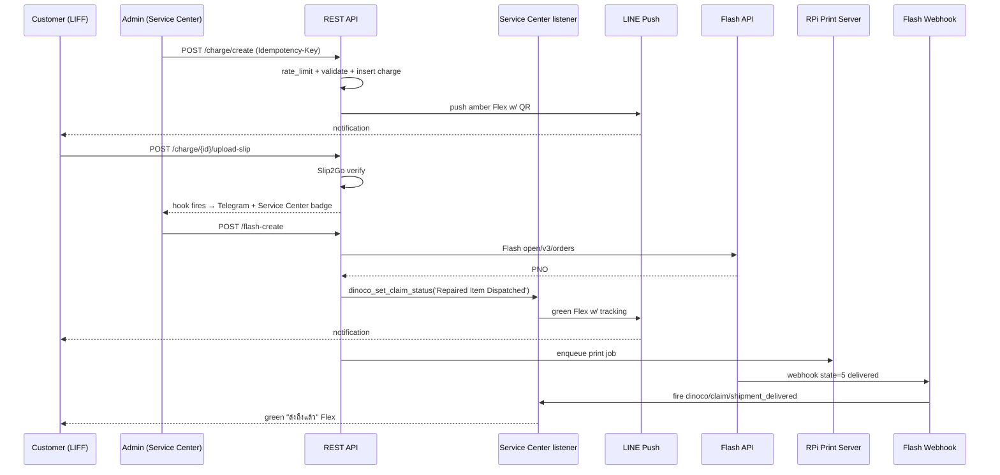
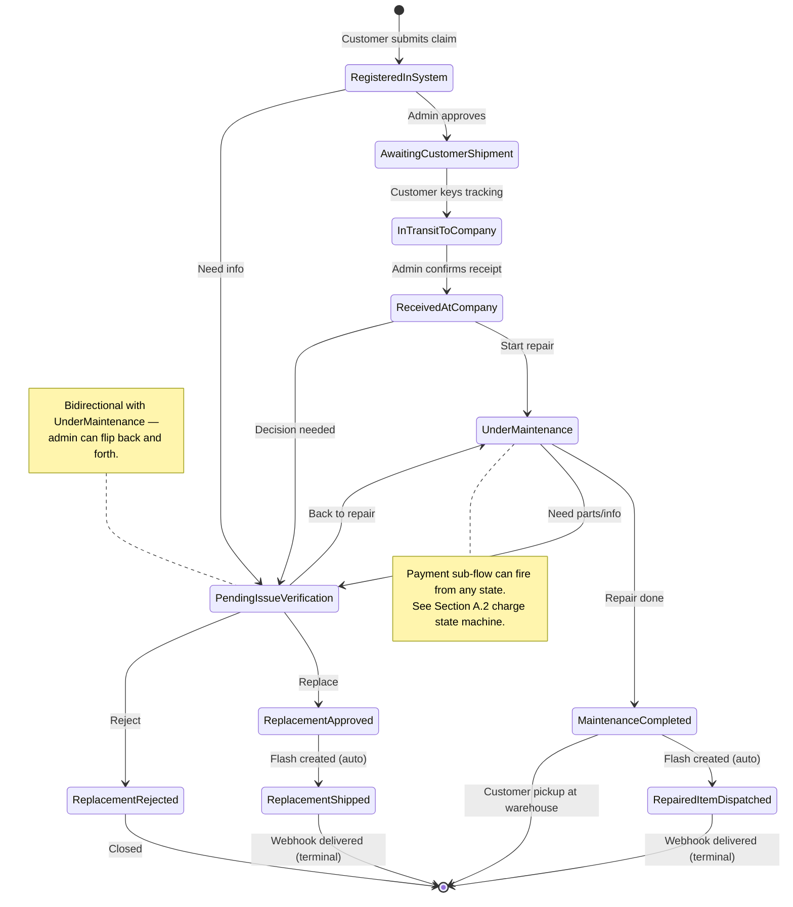
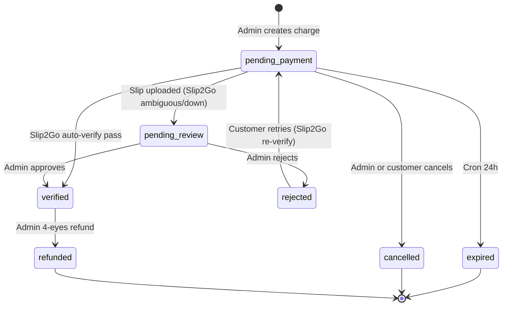

# Feature Spec: DINOCO Claim Lifecycle Notifications + Payment + Flash Shipping

**Version:** V.2.0 (2026-05-13) — boss-mandated "ไม่มีจุดตาย / หน้าตาย / ปุ่มตาย" rev
**Previous:** V.1.0 (2026-05-13) — initial draft, superseded
**Author:** Feature Architect
**Status:** Draft — pending boss sign-off + DB_ID provisioning + 8 Open Questions
**Related:**
- `[System] DINOCO Claim System` V.31.0 (DB_ID 16) — entry point + claim_ticket CPT writer
- `[Admin System] DINOCO Service Center & Claims` V.31.6 (DB_ID 27) — owner of `dinoco_set_claim_status()` + `dinoco/claim/state_changed` action
- `[LIFF AI] Snippet 1: REST API` V.1.6 — registers 6 long-form labels via `dinoco/claim/allowed_states` filter
- `[B2B] Snippet 1: Core Utilities & LINE Flex Builders` V.34.25 (DB_ID 72) — Flex builders, bank info, Flash dispatcher
- `[B2B] Snippet 3: LIFF E-Catalog REST API` V.42.20 (DB_ID 52) — `b2b_flash_manual_shipment_webhook()` + `b2b_rest_manual_flash_create()`
- `[Admin System] DINOCO LINE Push Governance` V.1.6 (DB_ID 1203) — category whitelist + opt-out gates
- `[Admin System] DINOCO Idempotency Helper` V.1.4 — replay-safe POST wrapper
- `[Admin System] DINOCO Modal Helpers` V.1.1 — `window.dinocoModal.{confirm,alert,prompt}` (field name `message`)
- `[Admin System] DINOCO Flag Audit Log` V.1.0 — passive flag flip listener
- `[Admin System] DINOCO Observability` V.1.0 — `dinoco_obs_capture()` + correlation IDs
- `[System] DINOCO Design Tokens` V.1.0 (DB_ID 1208)

---

## Document History

| Version | Date | Author | Notes |
|---|---|---|---|
| V.1.0 | 2026-05-13 | Feature Architect | Initial draft; 10 sections; ~570 lines; surfaced 3 BLOCKERs in tech-lead review (helper name drift, walk-in bank context, Phase 1 dep lock) |
| **V.2.0** | **2026-05-13** | **Feature Architect** | **Boss-mandated "ไม่มีจุดตาย / หน้าตาย / ปุ่มตาย"; closes 3 BLOCKERs + 4 HIDDEN RISKS + 4 SHOULD-FIXes; adds 9 new sections A-I (Journey, Button Matrix, Page States, Concurrency, Edge Cascades, FSM, Crons, REST flow, Error Catalog); Phase 1 effort 40h → 52h** |

---

## 1. Problem & Goal

### Problem (unchanged from V.1.0)
ระบบเคลมปัจจุบัน (Service Center V.31.6) เปลี่ยน `ticket_status` ผ่าน `dinoco_set_claim_status()` + fire hook `dinoco/claim/state_changed` ทุกครั้ง — มี audit + sn_pool sync แต่**ไม่มี customer-facing touchpoint** ใน 3 จุดสำคัญ:

1. **No LINE Flex notifications** — ลูกค้าเปลี่ยน status ระบบไม่แจ้ง → ลูกค้าโทรถาม / inbox Facebook spam admin / claim ค้าง "Registered in System" 30+ วันโดยลูกค้าไม่ตอบ tracking upload
2. **No payment flow** — ค่าซ่อมนอก warranty + ค่าจัดส่งกลับ + อะไหล่เพิ่มเติม ต้องสื่อสารผ่าน LINE manual + รับสลิปด้วยตา → ผิดพลาด / สลิปปลอม / ไม่มี audit trail
3. **No Flash integration** — admin ส่งของซ่อม/replacement กลับลูกค้าผ่าน `/manual-ship` แยก → tracking ไม่ผูก claim → webhook update ไม่ได้ → admin manual close

### Success Metrics (8 weeks post-launch)
- **M1**: Claim "Repaired Item Dispatched" → "Maintenance Completed"/"Replacement Shipped" cycle time **median ≤ 5 วัน** (baseline ~12-15 วัน)
- **M2**: Customer LINE inbound message volume re: claim status **ลด ≥ 60%**
- **M3**: Claim payment success rate (slip verify pass first try) **≥ 90%**
- **M4**: Zero double-charge / double-shipping incidents (idempotency 100%)
- **M5**: LINE Flex delivery rate **≥ 95%**
- **M6 (NEW V.2.0)**: Zero **dead-end states** reported by support — every page/state has at least one recovery CTA visible (manual audit weekly first month)

### If We Don't Build
Customer trust ลด → claim cycle เพิ่ม → admin queue ระเบิด → finance audit gap (ค่าซ่อม OOW ไม่มี invoice trail).

---

## 2. User Flows (high level — see Section A for per-step detail)

### 2.1 Sub-Feature A: Claim Status Notifications

**Happy Path** — admin flips `Under Maintenance`:
```
Admin Service Center → status select
  → dinoco_set_claim_status($cid, 'Under Maintenance', ['actor'=>'admin','source'=>'service_center'])
  → fires dinoco/claim/state_changed (priority 10 = sn_pool sync, priority 20 = NEW notifier)
  → [NEW] dinoco_claim_notify_status_changed() listener (priority 20)
    ├─ verify NOT in dedup window (60s) via transient `dnc_claim_notif_dedup_{cid}_{to_slug}`
    ├─ resolve customer user_id (claim_ticket.post_author — confirmed line 312 [System] DINOCO Claim System)
    ├─ resolve LINE UID (user_meta dinoco_line_uid)
    ├─ dinoco_line_can_push($uid, 'transactional', 'claim_status') — governance check
    ├─ build Flex via b2b_build_flex_claim_status_{slug}($cid, $ctx)
    ├─ b2b_line_push_raw($uid, [$flex])
    ├─ append _claim_notif_log[] = {status, ts, channel, success, msg_id, error}
    └─ set dedup transient (60s)
```

**Error Paths** — see Section A.1 for full recovery flowchart per error.

### 2.2 Sub-Feature B: Claim Payment Flow

**Happy Path** — admin charges customer ฿500 for return shipping:
```
1. Admin Service Center → claim detail → "💰 ออกค่าใช้จ่าย" button
   → opens `window.dinocoModal.prompt({title, message, ...})` (NOTE: `message` field, not `content`)
2. POST /dinoco-claim/v1/charge/create  + Idempotency-Key header (required)
   → b2b_rate_limit('claim_charge_create_' . $uid, 20, 3600)
   → validate amount ∈ [1, 50000] + reason ∈ whitelist + claim ownership
   → INSERT wp_dinoco_claim_charges (status=pending_payment, expires_at=NOW+24h)
   → generate PromptPay QR via `dinoco_claim_generate_promptpay_qr($amount, $payment_ref)` (NEW helper — see B1 resolution)
   → push customer Flex (amber) + push admin "ออกบิลเคลม #N — ฿500" Telegram (rate-limit aware)
3. Customer LIFF → /claim-pay/{charge_id} (route registered by new shortcode `[dinoco_claim_pay]`)
   → countdown timer (24h) + QR + bank info + upload area
   → POST /charge/{id}/upload-slip (multipart) → verify via `dinoco_verify_slip_for_claim()` wrapper (NEW — see B1)
   → status=verified | pending_review | failed
4. If verified → fire `dinoco/claim/charge_paid` → notify customer + admin
```

**Error Paths** — see Section A.2.

### 2.3 Sub-Feature C: Flash Shipping Integration

**Happy Path** — admin sends repaired item back (status: Maintenance Completed → Repaired Item Dispatched):
```
1. Admin Service Center → claim detail → "🚚 สร้าง Flash" button
   → Modal (reuses manual_ship.html UI patterns + product picker pattern)
   → recipient pre-filled from customer profile (editable) + checkbox "ยืนยันที่อยู่ถูกต้อง" required
2. POST /dinoco-claim/v1/flash-create + Idempotency-Key (required)
   → b2b_rate_limit('claim_flash_create_admin_' . $admin_uid, 30, 3600)
   → validate addr + dims + weight
   → call NEW internal helper `dinoco_claim_create_flash_shipment($claim_id, $params)`
     (refactored from b2b_rest_manual_flash_create — see B1 resolution)
   → on success:
     ├─ append _claim_flash_pnos[] (array — multiple shipments allowed)
     ├─ append _claim_flash_tracking_urls[]
     ├─ enqueue RPi print queue
     ├─ auto-flip status via dinoco_set_claim_status('Repaired Item Dispatched', ['actor'=>'system','source'=>'flash_create'])
     │   (cascades → Sub-Feature A → customer Flex with tracking)
     └─ return {pno, tracking_url}
3. Flash webhook → b2b_flash_manual_shipment_webhook() EXTENDED to match _claim_flash_pnos[] meta
   → state=5 (delivered) → fire `dinoco/claim/shipment_delivered`
   → listener auto-flip status → "Maintenance Completed" stays terminal OR
     for Replacement Shipped → optionally flip via boss policy (Q-NEW-3 below)
```

### 2.4 Flow Diagram (3 features wired together)



---

## 3. Data Model

### 3.1 New Custom Table: `wp_dinoco_claim_charges`

```sql
CREATE TABLE wp_dinoco_claim_charges (
  id              BIGINT UNSIGNED PRIMARY KEY AUTO_INCREMENT,
  claim_id        BIGINT UNSIGNED NOT NULL,
  user_id         BIGINT UNSIGNED NOT NULL,
  amount_thb      DECIMAL(12,2) NOT NULL,
  reason          VARCHAR(32) NOT NULL,
                  -- whitelist: return_shipping | repair_oow | extra_parts | other
  reason_note     VARCHAR(500) DEFAULT NULL,
  status          VARCHAR(24) NOT NULL DEFAULT 'pending_payment',
                  -- pending_payment | pending_review | verified | rejected | refunded | expired | cancelled
  qr_payload      TEXT DEFAULT NULL,
  qr_image_base64 LONGTEXT DEFAULT NULL,                  -- cached server-side render
  bank_code       VARCHAR(16) DEFAULT NULL,                -- frozen at create (snapshot)
  bank_account    VARCHAR(32) DEFAULT NULL,
  bank_holder     VARCHAR(128) DEFAULT NULL,
  bank_name       VARCHAR(64) DEFAULT NULL,
  bank_context    VARCHAR(16) DEFAULT 'order',             -- 'order' | 'walkin' | 'claim' (HR3 resolution — see B2)
  slip_image_url  VARCHAR(500) DEFAULT NULL,
  slip_ref_hash   CHAR(64) DEFAULT NULL,
  slip_verify_data LONGTEXT DEFAULT NULL,
  payment_ref     VARCHAR(64) NOT NULL,                   -- public-facing reference (e.g. CLM-CHG-0001-7f3a)
  verified_at     DATETIME DEFAULT NULL,
  verified_by     BIGINT UNSIGNED DEFAULT NULL,
  refund_reason   VARCHAR(500) DEFAULT NULL,
  refund_approver_id BIGINT UNSIGNED DEFAULT NULL,        -- 4-eyes second approver
  refunded_at     DATETIME DEFAULT NULL,
  refunded_by     BIGINT UNSIGNED DEFAULT NULL,
  expires_at      DATETIME NOT NULL,
  created_at      DATETIME NOT NULL,
  created_by      BIGINT UNSIGNED NOT NULL,
  KEY idx_claim (claim_id),
  KEY idx_user_status (user_id, status),
  KEY idx_status_expires (status, expires_at),
  KEY idx_created (created_at),
  UNIQUE KEY uq_slip_replay_claim (slip_ref_hash)
    -- SHOULD-FIX from review: scope namespace via column prefix in hash input
    -- (sha256("claim::" . $img_sha + $amount + $ts)) to avoid collisions
    -- with Extension Marketplace's slip_ref_hash UNIQUE (different feature)
) ENGINE=InnoDB DEFAULT CHARSET=utf8mb4 COLLATE=utf8mb4_unicode_ci;
```

Install pattern: lazy `dbDelta` on `admin_init` (mirrors Idempotency Helper / Flag Audit Log). Schema version flag `dinoco_claim_charges_schema_version = '1.0'` (autoload=false).

### 3.2 New Postmeta on `claim_ticket` CPT

| Meta Key | Type | Purpose | Read scope |
|---|---|---|---|
| `_claim_notif_log` | array (serialize) | Append-only `[{status, ts, channel, success, msg_id, error}]` — FIFO cap 50 | Admin only |
| `_claim_notif_dedup_window` | int (timestamp) | Per-status dedup gate (60s default) | Internal |
| `_claim_flash_pnos` | array | Multiple Flash PNOs per claim | Admin + customer (PNO only — no internal fields) |
| `_claim_flash_tracking_urls` | array | Parallel array to `_claim_flash_pnos` | Customer |
| `_claim_flash_last_states` | array | `[pno => last_flash_state_int]` cached from webhook | Admin |
| `_claim_print_queued` | array | `[pno => queued_at_timestamp]` | Admin |
| `_claim_charge_total_pending` | decimal | Denormalized sum for admin list view | Admin |
| `_claim_walkin` | bool | **NEW HR3** — marks claim as walk-in (boss must decide intent — Q-NEW-3) | Admin |
| `_claim_pickup_at_warehouse` | bool | Customer picks up at warehouse (no Flash) | Admin + customer |

All `register_post_meta` declared with `show_in_rest=false` + `auth_callback=manage_options` (C3 BO pattern — defense-in-depth).

### 3.3 ACF Field on `claim_ticket` (extend existing)

- `status_history` — already exists, extend entry shape with `channel: 'line_flex'` + `notification_id` field.
- NEW `claim_charges_summary` (textarea JSON) — denormalized snapshot regenerated on `dinoco/claim/charge_*` hooks (avoids JOIN per render in claim detail).

### 3.4 wp_options (Feature Flags)

| Option | Default | Purpose |
|---|---|---|
| `dinoco_claim_notif_enabled` | `'0'` | Master kill-switch SubFeature A |
| `dinoco_claim_payment_enabled` | `'0'` | SubFeature B |
| `dinoco_claim_flash_enabled` | `'0'` | SubFeature C |
| `dinoco_claim_charge_cap_thb` | `50000` | Max charge per request |
| `dinoco_claim_charge_expiry_hours` | `24` | Charge TTL |
| `dinoco_claim_flash_default_article_category` | `6` | Happy Return |
| `dinoco_claim_notif_dedup_seconds` | `60` | Rapid-flip dedup window |
| `dinoco_claim_notif_per_user_quota_hour` | `20` | per-user upper bound to prevent notification storm |

Register in Flag Audit Log whitelist (`dinoco_flag_audit_tracked_flags` filter).

---

## 4. API Design

### Namespace: `/wp-json/dinoco-claim/v1/`

| Method | Path | Permission | Idempotent | Rate Limit | Body Hash Keys |
|---|---|---|---|---|---|
| POST | `/charge/create` | `manage_options` + nonce | ✅ Required | 20/hr/admin | `{claim_id, amount, reason, reason_note}` |
| GET | `/charge/{id}` | owner OR `manage_options` | n/a | 60/min/IP | n/a |
| POST | `/charge/{id}/upload-slip` | owner (LIFF JWT) | ✅ Required | 3/hr/user | `{charge_id, slip_sha1}` |
| POST | `/charge/{id}/approve` | `manage_options` + nonce | ✅ Required | 30/hr | `{charge_id, decision='approve', note}` |
| POST | `/charge/{id}/reject` | `manage_options` + nonce | ✅ Required | 30/hr | `{charge_id, reason}` |
| POST | `/charge/{id}/refund` | `manage_options` + 4-eyes ≥฿5K | ✅ Required | 5/hr | `{charge_id, amount, reason, approver_user_id}` |
| POST | `/charge/{id}/cancel` | `manage_options` OR owner (pre-payment) | ✅ Required | 10/hr | `{charge_id, reason}` |
| POST | `/flash-create` | `manage_options` + nonce | ✅ Required | 30/hr | `{claim_id, weight, dims, article_category, sender_key, addr_hash}` |
| POST | `/flash-cancel/{pno}` | `manage_options` + nonce | ✅ Required | 10/hr | `{pno, claim_id, reason}` |
| GET | `/flash-status/{pno}` | `manage_options` | n/a | 30/min | n/a |
| POST | `/notif/resend/{claim_id}/{status_slug}` | `manage_options` + nonce | ⚠️ Force-fresh key (HR2) | 10/hr | `{claim_id, status_slug, resend_attempt_ts}` |
| GET | `/notif/log/{claim_id}` | `manage_options` | n/a | 60/min | n/a |
| GET | `/charges` (list) | `manage_options` | n/a | 60/min | filter: status, claim_id, user_id, days, limit, offset |

### Idempotency Strategy Matrix (HR2 resolution)

| Endpoint | Strategy | Rationale |
|---|---|---|
| `/charge/create` | **Standard** (24h replay) | Admin retries same Idempotency-Key on flaky network — must return same charge row |
| `/charge/{id}/upload-slip` | **Standard** | Same slip uploaded twice (mobile retry) returns same `slip_ref_hash` cached result |
| `/charge/{id}/approve` | **Standard** | Admin double-click "อนุมัติ" — cache approval response |
| `/charge/{id}/reject` | **Standard** | Same as approve |
| `/charge/{id}/refund` | **Standard** | High-stakes — body hash includes approver_user_id so 4-eyes mismatch returns 409 |
| `/charge/{id}/cancel` | **Standard** | Pre-payment cancellation is naturally idempotent |
| `/flash-create` | **Standard** | Already proven on `b2b_rest_manual_flash_create` |
| `/flash-cancel/{pno}` | **Standard** | Flash cancellation race-safe |
| `/notif/resend/*` | **⚠️ FORCE-FRESH key** | Admin clicks "ส่งใหม่" expecting new push. Cached replay = silently does nothing → admin confused. Server generates `Idempotency-Key=resend-{claim_id}-{status}-{microtime}` OR endpoint bypasses idempotency entirely. **Decision (V.2.0): bypass idempotency on `/notif/resend` — endpoint instead protects itself via per-admin rate limit (10/hr) + per-(claim,status) cooldown 60s.** |

### Permission Callbacks

- Owner check: `claim_ticket.post_author === current_user_id` (verified line 312 [System] DINOCO Claim System — `post_author` is the customer who owns the claim)
- Admin: `current_user_can('manage_options')` + `wp_verify_nonce($_REQUEST['_wpnonce'], 'wp_rest')`
- LIFF customer JWT: `liff_ai_verify_jwt()` from `[LIFF AI] Snippet 1`
- 4-eyes refund ≥฿5K: distinct `approver_user_id` from `verified_by` AND `created_by`

### REST Response Conventions

- Success: `{success: true, data: {...}}` + `X-Request-ID` correlation header (Observability V.1.0)
- Error: `{success: false, code: 'snake_case', message: 'ไทย', details: {}}` + HTTP code
- 409 conflict: `code: 'idempotency_conflict'` (cached body hash mismatch)
- All POST wrapped by `function_exists('dinoco_idempotency_check')` guard

### Webhooks

- **Existing** `b2b_flash_manual_shipment_webhook($pno, $data)` in [B2B] Snippet 3 line 6104 — EXTEND to lookup `_claim_flash_pnos[]` meta when `b2b_manual_shipments_{YYYY_MM}` lookup miss → fire `dinoco/claim/shipment_delivered` on state=5
- Slip2Go remains PULL-only (no webhook)

---

## 5. UI Wireframes — see Section C for full state coverage matrix

### 5.1 Customer Flex Templates (11 statuses)

Color scheme aligned with Design Tokens V.1.0. All Flex obey LINE schema (no null colors, no float opacity, only valid hex strings).

| # | Status (long-form authoritative) | Header Color | Body Highlight | Footer Buttons | Notif Send? |
|---|---|---|---|---|---|
| 1 | Registered in System | `#06C755` | Ticket # + S/N + "ทีมจะตอบใน 2-4 ชม." | [📋 ดูรายละเอียด] | YES |
| 2 | Awaiting Customer Shipment | `#F59E0B` | บริษัทรับสินค้าที่อยู่ + เบอร์โทร | [📋 ดู] [📦 ใส่เลขพัสดุ] | YES |
| 3 | In Transit to Company | — | (skip — customer keyed tracking themselves; Flex would be noise) | — | **NO** (skip listener) |
| 4 | Received at Company | `#3B82F6` | "✅ บริษัทรับสินค้าแล้ว" + ETA ซ่อม 7-10 วัน | [📋 ดูรายละเอียด] | YES |
| 5 | Under Maintenance | `#8B5CF6` | "🔧 กำลังซ่อม" + ETA | [📋 ดูรายละเอียด] | YES |
| 6 | Maintenance Completed | `#10B981` | "🎉 ซ่อมเสร็จ" + เตรียมส่งคืน | [📋 ดู] | YES |
| 7 | Repaired Item Dispatched | `#06C755` | Flash PNO + tracking URL + ETA 2-3 วัน | [📦 ติดตาม] [📋 ดู] | YES |
| 8 | Pending Issue Verification | `#F59E0B` | "⏳ รอตรวจสอบเพิ่ม" + เหตุผล | [💬 แชทแอดมิน] [📋 ดู] | YES |
| 9 | Replacement Approved | `#10B981` | "✅ อนุมัติเปลี่ยนสินค้า" + รายการ | [📋 ดู] | YES |
| 10 | Replacement Shipped | `#06C755` | Flash PNO + tracking + ETA | [📦 ติดตาม] [📋 ดู] | YES |
| 11 | Replacement Rejected by Company | `#EF4444` | เหตุผล + ทางเลือก (ติดต่อแอดมิน / ขอซ่อมแทน) | [💬 แชทแอดมิน] [📋 ดู] | YES |

**Special Flex** (NOT status-driven):
- **Charge Request** — amber gradient + PromptPay QR image + bank + amount + [📤 อัพโหลดสลิป] [📋 ดู]
- **Charge Verified** — green + receipt summary + [📋 ดูใบเสร็จ]
- **Charge Rejected** — red + reason + [💬 แชทแอดมิน] + [📤 อัพโหลดใหม่]
- **Charge Refunded** — gray + summary + [💬 แชทแอดมิน]
- **Charge Expired** — gray + "หมดอายุ" + [💬 ขอ Charge ใหม่] (CTA to admin)
- **Shipment Delivered** — green + tracking + "เคลมเสร็จสมบูรณ์" + [📋 ดู]

### 5.2 Admin Service Center (Extend Existing)

Three new collapsible sections on claim detail screen. Each section has explicit empty/loading/error states (see Section C):

1. **Notifications Log** — table + "🔁 ส่งใหม่" per row + "ลูกค้าปิดแจ้งเตือน LINE" badge
2. **Charges** — table + sticky "+ ออกค่าใช้จ่าย" button + create modal + per-row actions
3. **Flash Shipments** — table + sticky "🚚 สร้าง Flash" button + create modal + per-PNO cancel/reprint

All UI: scoped `.dnc-claim-*` prefix · ≥44px touch · Modal Helpers `message` field (NOT `content`) · ARIA Thai labels · `prefers-reduced-motion` respected.

### 5.3 Customer LIFF Payment Page

Route: `/claim-pay/{charge_id}` (shortcode `[dinoco_claim_pay]` in new snippet). Single mobile-first SPA-like page. See Section C.3 for state coverage.

---

## 6. Dependencies & Impact

### 6.1 BLOCKER Resolutions (V.2.0)

#### B1 — Helper Name Drift × 3

**Verified by grep against current codebase (2026-05-13):**

| Spec V.1.0 (WRONG) | Actual Codebase | V.2.0 Resolution |
|---|---|---|
| `b2b_promptpay_qr_payload()` | **Does not exist.** Only `b2b_generate_promptpay_qr($amount, $payment_ref)` is referenced defensively in `[System] DINOCO SN REST API` line 9653 with `function_exists` guard. No `function b2b_generate_promptpay_qr` definition exists anywhere. Marketplace falls back to admin-contact when missing. | **NEW helper** `dinoco_claim_generate_promptpay_qr($amount, $payment_ref)` in new snippet "Claim Payment LIFF". Returns base64 PNG. Internally reads `B2B_PROMPTPAY_ID` constant + uses EMVCo BOT standard (mirror existing [B2B] Snippet 1 line 3242 implementation comment). When `B2B_PROMPTPAY_ID` undefined → return `''` + log warning + admin-fallback path same as Marketplace. **Cross-snippet**: also exposes alias `b2b_generate_promptpay_qr()` (with `function_exists` guard) so Marketplace gets a real impl too. |
| `b2b_rest_manual_flash_create_internal()` | **Does not exist.** `b2b_rest_manual_flash_create(WP_REST_Request $r)` is the REST handler at [B2B] Snippet 3 line 5617 — takes `WP_REST_Request`, not plain params. No internal helper exists. | **Two-pronged refactor (V.2.0):** (a) **NEW internal helper** `dinoco_claim_create_flash_shipment($claim_id, array $params)` in new "Claim Flash Dispatcher" snippet — accepts plain PHP array, returns `{ok, pno, tracking_url, error}`. (b) Inside it, dispatch by calling `b2b_flash_dispatch_create_all($ticket_id)` is **NOT applicable** (that helper takes a B2B `ticket_id` int, not claim params — confirmed [B2B] Snippet 1 line 9178). Instead, **directly call `wp_remote_post()` to `B2B_FLASH_API_URL . '/open/v3/orders'`** with HMAC-signed body (reuse `b2b_flash_sign()` from Snippet 1 line ~ via `function_exists` guard). Encapsulates the same payload schema as `b2b_rest_manual_flash_create` but bypasses WP_REST_Request coupling. **Migration plan:** Phase 3 task 3.10 (NEW) — once Claim Flash Dispatcher is stable, refactor `b2b_rest_manual_flash_create` to call the same `dinoco_claim_create_flash_shipment()` helper internally (DRY) — but this is **out of MVP scope** for risk reasons. |
| `b2f_verify_slip_image($image)` | Actual signature: `b2f_verify_slip_image($image_base64, $maker_id)` ([B2F] Snippet 1 line 3313). Requires maker bank info — **does not fit claim context**. | **NEW wrapper** `dinoco_verify_slip_for_claim($image_base64, $expected_amount_thb, $expected_bank_code)` in "Claim Payment LIFF" snippet. Internally calls Slip2Go API directly (mirror `b2f_verify_slip_image` payload shape but with **B2B_BANK** or **B2B_WALKIN_BANK** receiver depending on `bank_context` column — see B2 below). DOES NOT touch `b2f_verify_slip_image` (clean separation, no risk to B2F). Both helpers share `B2B_SLIP2GO_SECRET_KEY` constant. |

#### B2 — `b2b_get_bank_info()` Walk-in Extension

**Verified** ([B2B] Snippet 1 line 2837): `b2b_get_bank_info($order_id = 0)` calls `b2b_is_walkin_order($order_id)` which checks `get_post_meta($order_id, '_b2b_is_walkin', true) === '1'`. Claim CPT does NOT have `_b2b_is_walkin` meta.

**V.2.0 Resolution — Option B (chosen):** Extend `b2b_get_bank_info()` with a 2nd arg:
```php
function b2b_get_bank_info( $order_id = 0, $context = 'order' ) {
    // $context: 'order' (default, existing behavior) | 'claim' | 'walkin'
    if ( $context === 'claim' ) {
        $use_walkin = $order_id && get_post_meta( $order_id, '_claim_walkin', true ) === '1';
    } else {
        $use_walkin = $order_id && function_exists('b2b_is_walkin_order') && b2b_is_walkin_order($order_id);
    }
    // ... rest unchanged
}
```

This is backward-compatible (default arg = existing behavior) and surfaces walk-in detection from claim context. Same pattern applied to `b2b_get_bank_logo_url($order_id, $context)` and `b2b_get_bank_copy_text($order_id, $context)`.

**Migration plan:** [B2B] Snippet 1 V.34.26 (single version bump). Existing callers all pass `($order_id)` only — `$context` defaults to `'order'` → byte-identical behavior. PHPUnit test pinning signature.

#### B3 — Phase 1 Dependency Lock

**V.2.0 Resolution:** Phase 1 task table now explicitly orders:
```
Task 1.1: Boss provisions DB_IDs in WP (creates 3 stub snippets) ← BLOCKER for 1.2
Task 1.2: fullstack-developer pulls DB_IDs into snippet headers
Task 1.3: fullstack-developer implements snippets
```
Task 1.2/1.3 cannot start until 1.1 is complete (Sync Engine refuses to push files without DB_ID match). See revised Phase 1 in §7.

### 6.2 HIDDEN RISK Resolutions

#### HR1 — Hook Chain Race (priority 10 sn_pool sync + priority 20 notifier)

**WordPress action chain semantics:** Each callback wrapped independently. If `dinoco_sn_claim_status_changed()` @ priority 10 throws, WP `do_action` continues to next callback. Verified by reading `[Admin System] DINOCO Service Center & Claims` line 258 + 270 — the sn_pool handler has its own try/catch (line 451 `dinoco_obs_capture_exception`).

**V.2.0 Defense:** Notifier listener wraps its body in try/catch as well:
```php
add_action( 'dinoco/claim/state_changed', function( $claim_id, $from, $to, $ctx ) {
    try {
        dinoco_claim_notify_status_changed( $claim_id, $from, $to, $ctx );
    } catch ( \Throwable $e ) {
        if ( function_exists( 'dinoco_obs_capture' ) ) {
            dinoco_obs_capture( 'error', 'claim_notify_listener_throw', [
                'claim_id' => $claim_id, 'to' => $to, 'msg' => $e->getMessage()
            ]);
        }
        if ( function_exists( 'b2b_log' ) ) b2b_log( '[ClaimNotify] listener throw: ' . $e->getMessage() );
    }
}, 20, 4 );
```

Test: PHPUnit `ClaimNotifyHookChainTest::test_sn_pool_throw_does_not_block_notifier()`.

#### HR2 — Idempotency vs Resend Conflict — see §4 Idempotency Strategy Matrix above

#### HR3 — Walk-in Claim Bank Fallback

**Boss decision required (Q-NEW-3 below):** Does a walk-in distributor's claim use `B2B_WALKIN_BANK_*` or default `B2B_BANK_*`?

**V.2.0 Default behavior (until boss decides):** Claims use `B2B_BANK_*` (default arg `bank_context='order'` falls through to `_b2b_is_walkin` check which is always false on claim CPT). Snapshot bank info into `wp_dinoco_claim_charges.bank_*` columns at create time — so even if global bank changes later, customer pays the right account.

**Recommendation:** If boss wants walk-in claim → walk-in bank, admin sets `_claim_walkin=1` meta during claim intake. Service Center "ออกค่าใช้จ่าย" modal can show checkbox "ใช้บัญชี Walk-in" (visible only if `B2B_WALKIN_BANK_ACCOUNT` defined).

#### HR4 — Webhook + Admin Manual Close Race

**`dinoco_set_claim_status()` already idempotent** (verified line 149 — returns `WP_Error('terminal_state')` if from==to). So:
- Admin manually closes Repaired Item Dispatched → Maintenance Completed
- Flash webhook 5 minutes later fires `shipment_delivered` listener → wants to flip Repaired Item Dispatched → Maintenance Completed
- Helper rejects (current state is already Maintenance Completed) → returns `terminal_state` error
- Listener swallows error gracefully, logs `[ClaimFlashWebhook] state already terminal — skip`

**V.2.0 Defense:** Listener checks `is_wp_error($result) && $result->get_error_code() === 'terminal_state'` → log + skip silently (NOT escalate to admin).

PHPUnit test: `ClaimFlashWebhookRaceTest::test_terminal_state_silently_skipped()`.

### 6.3 SHOULD-FIX Resolutions

| # | Fix | Status |
|---|---|---|
| SF1 | `slip_ref_hash UNIQUE` scope namespacing | Hash input prefixed with `"claim::"` literal — UNIQUE remains per-table; no collision with Marketplace's `extension_charges.slip_ref_hash` (different table) |
| SF2 | Phase 1.3 effort bump 10h → 18h | Done — see §7 Phase 1 |
| SF3 | Modal Helpers drift detector | NEW Jest test `tests/jest/claim-modal-helpers-drift.test.js` — greps NEW Service Center snippet for `_scCfm(` calls + asserts options object contains `message:` field (not `content:`). Drift detector also enforces no `.dnc-modal-` CSS overrides + no inline-handler addition |
| SF4 | `/approve` vs `/reject` separate endpoints — confirmed in §4 table |

### 6.4 Files to Modify

| File | Snippet | Change | Estimated Lines |
|---|---|---|---|
| `[Admin System] DINOCO Service Center & Claims` | DB_ID 27 | Add 3 sections + create-modal + REST AJAX wiring + JS helper `_scCfm/_scAlert/_scPrompt` (mirrors Phase 6 pattern) | +500 LOC |
| `[B2B] Snippet 3: LIFF E-Catalog REST API` | DB_ID 52 | EXTEND `b2b_flash_manual_shipment_webhook` to match `_claim_flash_pnos[]` | +40 LOC |
| `[B2B] Snippet 1: Core Utilities & LINE Flex Builders` | DB_ID 72 | NEW Flex builders (10 status + 6 special = 16 total) + extend `b2b_get_bank_info($order_id, $context)` (B2) + alias `b2b_generate_promptpay_qr` (B1) | +700 LOC |
| `[Admin System] DINOCO LINE Push Governance` | DB_ID 1203 | Register category `claim_status` as `transactional` (always-on) | +5 LOC |

### 6.5 Files to Create (NEW snippets)

| File | DB_ID | Purpose | Estimated LOC |
|---|---|---|---|
| `[Admin System] DINOCO Claim Lifecycle Notifier` | **PENDING** | Listen `dinoco/claim/state_changed` + dispatch Flex + own Sub-Feature A logic | ~900 LOC |
| `[System] DINOCO Claim Payment LIFF` | **PENDING** | Customer-facing shortcode `[dinoco_claim_pay]` + REST `/charge/*` + `dinoco_claim_generate_promptpay_qr` + `dinoco_verify_slip_for_claim` | ~1100 LOC |
| `[Admin System] DINOCO Claim Flash Dispatcher` | **PENDING** | REST `/flash-create` + `/flash-cancel` + RPi enqueue + `dinoco_claim_create_flash_shipment` internal helper | ~800 LOC |

### 6.6 Prerequisites

- Idempotency Helper V.1.4 ✓
- Modal Helpers V.1.1 ✓
- Flag Audit Log V.1.0 ✓
- LINE Push Governance V.1.6 ✓ — claim_status category MUST be registered before flag flip
- Observability V.1.0 ✓ — for `dinoco_obs_capture('error', 'claim_notif_fail', $ctx)`
- Module Registry — register 3 new snippets under section=claims, order=10/20/30
- `dinoco_line_uid` user meta populated (Phase 1 LIFF AI strict mode already enforces)
- B2B_SLIP2GO_SECRET_KEY defined (in use today)
- B2B_FLASH_MCH_ID, B2B_FLASH_SECRET_KEY, B2B_FLASH_API_URL defined (in use today)
- B2B_PROMPTPAY_ID defined for QR generation (graceful fallback if absent — see B1)
- **Boss provisions 3 DB_IDs in WP** — creates 3 stub snippets, pushes IDs into headers (BLOCKER for Phase 1.2)

### 6.7 Side Effects

- LINE quota: peak ~5 statuses × 100 claims/day = 500 push/day → +1.6% of daily quota. Dedup + governance throttle.
- DB size: ~2KB/row × 100 charges/mo = 200KB/mo (negligible)
- Webhook fanout: +1 SELECT meta query per webhook (≤10ms)
- No CSS conflicts (prefix `.dnc-claim-*`)
- JS global scope: namespace `window.dincoClaim = {...}`

### 6.8 Hook Dependency Chain

```
dinoco/claim/state_changed (existing — fired by dinoco_set_claim_status)
  ├─ dinoco_sn_claim_status_changed @ priority 10  (existing — Service Center V.31.6)
  └─ [NEW] dinoco_claim_notify_status_changed @ priority 20  (Notifier snippet)

dinoco/claim/charge_paid (NEW)
  ├─ [NEW] dinoco_claim_notify_charge_paid @ priority 10
  └─ [NEW] dinoco_claim_recompute_charge_total @ priority 5

dinoco/claim/charge_refunded (NEW) — similar fanout

dinoco/claim/shipment_delivered (NEW)
  ├─ [NEW] dinoco_claim_notify_shipment_delivered @ priority 10
  └─ [NEW] dinoco_claim_auto_close_on_delivery @ priority 20 (boss policy — see Q-NEW-3)
```

---

## 7. Implementation Roadmap (revised V.2.0)

### Phase 1: MVP — Notifications Only (Week 1-2, ~52h ← was 40h)

| # | Task | File | Effort | Owner | Blocks |
|---|---|---|---|---|---|
| 1.1 | Boss provisions DB_IDs (3 stub snippets in WP) — pushes IDs into headers | — | 0.5h | Boss | **Blocks 1.2-1.8** |
| 1.2 | NEW snippet "Claim Lifecycle Notifier" — listener + dedup + dispatch | New snippet | 14h | fullstack-developer | 1.3, 1.5 |
| 1.3 | 10 Flex builders in Snippet 1 + LINE schema audit (no null colors, no float opacity, valid hex) + Thai i18n + button color edge cases (red/amber/green/blue) — bump from 10h to **18h** per SF2 | Snippet 1 | 18h | frontend-design + fullstack-developer | 1.5 |
| 1.4 | Register `claim_status` category in LINE Push Governance | DB_ID 1203 | 1h | fullstack-developer | 1.5 |
| 1.5 | Service Center "Notifications Log" section + `_scCfm/_scAlert` helpers + resend button + REST `/notif/log` `/notif/resend` | DB_ID 27 + new snippet | 8h | fullstack-developer | 1.6 |
| 1.6 | PHPUnit: Flex schema validation + dedup + opt-out + hook chain (HR1) + idempotency-on-resend behavior (HR2) | tests/helpers | 5h | fullstack-developer | 1.7 |
| 1.7 | Jest drift detectors: 10 builder names exist + hook wired priority 20 + Modal Helpers `message` field (SF3) + 3 new sections render under flag ON | tests/jest | 2.5h | fullstack-developer | 1.8 |
| 1.8 | Flag flip `dinoco_claim_notif_enabled=1` staging → 7-day observation → prod | — | 3h | Ops | — |
| **Phase 1 deploy & QA** | | | **~52h** | | |

### Phase 2: Payment Flow (Week 3-5, ~80h ← was 77h)

| # | Task | File | Effort | Owner |
|---|---|---|---|---|
| 2.1 | Schema `wp_dinoco_claim_charges` (database-expert review) + dbDelta lazy install + `bank_context` column (B2) | New snippet | 7h | database-expert |
| 2.2 | NEW snippet "Claim Payment LIFF" — REST endpoints (8) + LIFF shortcode + `dinoco_claim_generate_promptpay_qr` + `dinoco_verify_slip_for_claim` (B1) | New snippet | 26h | fullstack-developer |
| 2.3 | EXTEND `b2b_get_bank_info($order_id, $context='order')` (B2) + bump [B2B] Snippet 1 V.34.26 + PHPUnit signature pin | Snippet 1 | 4h | fullstack-developer |
| 2.4 | Service Center "Charges" section + create modal (`window.dinocoModal.prompt({message: ...})`) + approve/reject/refund + 4-eyes UI | DB_ID 27 | 14h | frontend-design + fullstack-developer |
| 2.5 | LIFF page UI + countdown + upload + state transitions (idle/uploading/verifying/success/failed) + offline detection | New snippet | 12h | frontend-design |
| 2.6 | Cron `dinoco_claim_charge_expire_cron` daily 02:25 ICT + heartbeat | New snippet | 4h | fullstack-developer |
| 2.7 | Security review: 4-eyes refund + slip_replay + amount bounds + LIFF JWT replay | — | 5h | security-pentester |
| 2.8 | PHPUnit: charge state machine + idempotency + slip_ref_hash collision + concurrency (FOR UPDATE) | tests/helpers | 6h | fullstack-developer |
| 2.9 | Flag flip + 7-day canary on 1 distributor → prod | — | 4h | Ops |
| **Phase 2 deploy & QA** | | | **~82h** | |

### Phase 3: Flash Shipping (Week 6-8, ~64h ← was 60h)

| # | Task | File | Effort | Owner |
|---|---|---|---|---|
| 3.1 | NEW snippet "Claim Flash Dispatcher" — REST `/flash-create` `/flash-cancel` `/flash-status` + internal `dinoco_claim_create_flash_shipment()` (B1) | New snippet | 20h | fullstack-developer |
| 3.2 | EXTEND `b2b_flash_manual_shipment_webhook` to match `_claim_flash_pnos[]` + fire `dinoco/claim/shipment_delivered` | DB_ID 52 | 5h | fullstack-developer |
| 3.3 | Service Center "Flash Shipments" section + create modal (reuse manual_ship.html patterns) | DB_ID 27 + new snippet | 12h | frontend-design + fullstack-developer |
| 3.4 | Auto status flip after Flash create (`dinoco_set_claim_status('Repaired Item Dispatched')`) | New snippet | 3h | fullstack-developer |
| 3.5 | Auto status flip on webhook delivery → "Maintenance Completed"/"Replacement Shipped" terminal — HR4 silent skip on terminal | New snippet | 4h | fullstack-developer |
| 3.6 | RPi print enqueue — reuse `/b2b/v1/print-queue` insert | New snippet | 4h | fullstack-developer |
| 3.7 | Security review: address sanitization + Flash idempotency + DLQ fallback | — | 4h | security-pentester |
| 3.8 | PHPUnit: state transitions + DLQ fallback + Flash 1003 G2 recovery | tests/helpers | 4h | fullstack-developer |
| 3.9 | Manual QA on staging (Flash test API) + flip → prod | — | 8h | Ops |
| **Phase 3 deploy & QA** | | | **~64h** | |

### Phase 4: Polish (Week 9, ~22h)
- Charge admin export CSV · Refund audit dashboard · Multi-shipment grouping · Notif log filter/search · Customer LIFF "ประวัติเคลม" inline charges + Flash · Health Monitor cards for 3 new crons · pickup-at-warehouse opt-in UX

**Total estimated effort: ~220h (~5.5 weeks for 1 fullstack-developer + parallel agents)**

---

## 8. Risk & Mitigation

| # | Risk | Severity | Likelihood | Mitigation |
|---|---|---|---|---|
| R1 | LINE quota burn on bulk close | HIGH | MED | Dedup 60s + per-user 20/hr cap + governance throttle + Telegram ≥10/min alert |
| R2 | Slip replay attack | HIGH | LOW | `slip_ref_hash UNIQUE` + Slip2Go internal dedup |
| R3 | Flash 1003 duplicate outTradeNo | MED | MED | G2 recovery (Snippet 1 V.34.25 pattern — regenerate suffix) |
| R4 | Wrong address from stale customer profile | HIGH | MED | Modal editable + "ยืนยันที่อยู่ถูกต้อง" checkbox required |
| R5 | Customer charged then claim cancelled → no auto-refund | HIGH | LOW | Telegram alert + Q20 manual refund SOP |
| R6 | Notification storm from V.31.6 sn_pool sync chain | MED | MED | Dedup + listener priority 20 + try/catch (HR1) |
| R7 | Customer LIFF UID changes mid-flow | LOW | LOW | Fresh `dinoco_line_uid` lookup per dispatch |
| R8 | DB_ID drift on Sync Engine | CRITICAL | LOW | Pre-flight check + Sync Engine refuses filename mismatch |
| R9 | Slip2Go outage during high charge volume | MED | LOW | Fallback `status=pending_review` + Telegram alert |
| R10 | RPi printer down → label not auto-printed | MED | MED | Print queue heartbeat + alert if PNO unprinted ≥30min |
| **R11 (V.2.0 NEW)** | **Dead-button UX** (loading state stuck after error) | MED | MED | All buttons MUST clear loading state in `finally` block + show toast on any error path (Section B button matrix enforces) |
| **R12 (V.2.0 NEW)** | **Dead-page UX** (network failure on LIFF payment page) | HIGH | MED | Offline detection + retry button + "ติดต่อแอดมิน" deep-link CTA always visible (Section C page matrix enforces) |

---

## 9. Testing Checklist

### PHPUnit (Pure Logic)
- [ ] `b2b_build_flex_claim_*` 10 templates schema-valid (no null `color`, no float opacity, valid hex)
- [ ] `dinoco_claim_notif_should_send($claim, $from, $to)` — dedup + opt-out + transactional override
- [ ] `dinoco_claim_charge_validate($body)` — amount bounds + reason whitelist
- [ ] `dinoco_claim_charge_slip_hash($img, $amount, $ts, $namespace='claim')` deterministic + collision-safe vs Marketplace
- [ ] Charge state machine `pending_payment → verified → refunded` + invalid transitions return false
- [ ] Idempotency body hash determinism + `/notif/resend` bypass (HR2)
- [ ] HR1 hook chain — sn_pool sync throw does NOT block notifier
- [ ] HR4 terminal_state silent skip on webhook race
- [ ] B2 `b2b_get_bank_info($oid, $context='claim')` reads `_claim_walkin` correctly
- [ ] B1 `dinoco_claim_generate_promptpay_qr()` returns valid EMVCo payload
- [ ] B1 `dinoco_verify_slip_for_claim()` does NOT touch `b2f_verify_slip_image` (clean separation)

### Integration (DB-coupled)
- [ ] Charge create → DB row + status_history append
- [ ] Slip upload → verified → fire hook → admin Flex pushed
- [ ] Flash create → meta saved + auto status flip + customer Flex
- [ ] Webhook receives delivered → claim auto-closes terminal + Flex
- [ ] Idempotency 409 on body hash mismatch
- [ ] Idempotency replay on same key+hash
- [ ] FOR UPDATE lock on charge approve/reject (concurrent admin clicks)
- [ ] 4-eyes refund ≥฿5K — same-actor self-approval blocked

### E2E (Manual / Playwright)
- [ ] Admin changes status → customer Flex within 10s
- [ ] Customer pays → admin Telegram + badge clears
- [ ] Admin creates Flash → RPi prints within 60s
- [ ] Customer LIFF — countdown accurate ±2s
- [ ] Dedup: rapid double-click → 1 charge row
- [ ] Modal `confirm/alert/prompt` use `message` field (SF3 drift)
- [ ] LINE Push Governance — NUCLEAR opt-out behavior (Q-NEW-1)
- [ ] Customer goes offline mid-payment → retry button visible + admin contact CTA
- [ ] Network failure on `/charge/create` → button clears loading + toast shows error code

### Regression Guards (Jest)
- [ ] 10 Flex builders exist in Snippet 1
- [ ] Hook listener wired @ priority 20
- [ ] Service Center renders 3 new sections when flags ON
- [ ] No inline `onclick=` added (UX-H3 baseline 987)
- [ ] All `b2b_rate_limit()` calls = 3 args
- [ ] Idempotency wrapper on all 8 POST endpoints
- [ ] CSS prefix `.dnc-claim-*` enforced
- [ ] Modal Helpers `message` field (SF3)
- [ ] `_scCfm/_scAlert/_scPrompt` helpers wired

---

## 10. Rollback Plan

### Immediate (<30s, no redeploy)
1. `wp option update dinoco_claim_notif_enabled 0` → listener short-circuits
2. `wp option update dinoco_claim_payment_enabled 0` → REST 503 + LIFF maintenance page
3. `wp option update dinoco_claim_flash_enabled 0` → button hidden + REST 503

Audit-logged via Flag Audit Log passive listener.

### Partial Rollback
- Priority demote: `add_action(..., 20)` → `30` + early return for canary distributors
- LINE category re-classify: `claim_status` `transactional` → `service` (majority opts out)

### Database Rollback
- Schema additive — safe to leave even when flag OFF
- Postmeta sparse — no read-path impact

### Hot-Patch Rollforward
- Flex bug → bump Snippet 1 version + GitHub Webhook Sync (DB_ID match → instant)
- Dispatcher bug → flag OFF + fix + flag ON

### Communication
- Telegram daily summary reports flag flips
- Customer-side: graceful degrade to pre-feature (no Flex / no payment / no Flash)

---

# Section A — Customer Journey Timeline (One-by-One Workflow)

> "ไม่มีจุดตาย" — every step has recovery + visible CTA on failure

## A.0 Lifecycle Overview

```
[Customer registers claim via [dinoco_claim_page]]
   ↓
Step 1: Registered in System          ← admin reviews
   ↓ (admin clicks "Approve — ลูกค้าส่งของ")
Step 2: Awaiting Customer Shipment    ← customer ships to company
   ↓ (customer keys tracking in LIFF AI)
Step 3: In Transit to Company         (no Flex — silent transit)
   ↓ (admin scans + confirms receipt)
Step 4: Received at Company           ← decision point
   ↓
   ├─→ Step 5: Under Maintenance      (repair flow)
   │     ↓
   │   Step 6: Maintenance Completed  ← ready to ship back
   │     ↓ (admin creates Flash)
   │   Step 7: Repaired Item Dispatched (auto-flipped by Sub-Feature C)
   │     ↓ (Flash webhook delivered)
   │   [TERMINAL] Maintenance Completed
   │
   ├─→ Step 8: Pending Issue Verification (need more info)
   │     ↓
   │     ├─→ Step 9: Replacement Approved
   │     │     ↓
   │     │   Step 10: Replacement Shipped
   │     │     ↓ (webhook)
   │     │   [TERMINAL] Replacement Shipped (delivered)
   │     │
   │     └─→ Step 11: Replacement Rejected by Company (terminal)
   │
   └─→ [Cancel path — Q20 manual SOP]

[Side flow — any state]:
   Admin issues charge → Customer pays → admin reviews → notify
```

## A.1 Step-by-Step Detail (each row obeys: Trigger / Pre-conditions / System Actions / Customer Feedback / Next States / Recovery / Idempotency)

| # | Step | Trigger | Pre | System | Customer Feedback | Next | Recovery | Idem |
|---|---|---|---|---|---|---|---|---|
| 1 | Registered in System | Customer submits via `[dinoco_claim_page]` | post_author=customer | wp_insert_post + S/N validate + Flex push #1 | Flex green "✅ รับเคลม #N" | → Awaiting Customer Shipment (admin) OR Pending Issue Verification (admin) | If push fails — Telegram alert "no_line_uid"; customer can still view in Member Dashboard | n/a (synchronous form) |
| 2 | Awaiting Customer Shipment | Admin clicks Service Center "Approve" | claim ∈ Registered | dinoco_set_claim_status + Flex push #2 with addr + phone | Flex amber + 2 buttons | → In Transit (customer keys tracking) | If customer never ships in 14d — auto-close cron fires "no response" Flex | dedup transient 60s |
| 3 | In Transit to Company | Customer keys tracking in LIFF AI claim detail | claim ∈ Awaiting | LIFF AI Snippet 1 saves tracking + flips status | **NO Flex** (silent — customer just keyed it themselves) | → Received at Company (admin scans) | If customer mis-keys tracking — Service Center admin edits + revert flag | n/a |
| 4 | Received at Company | Admin scans QR + clicks "Receive" | claim ∈ In Transit | dinoco_set_claim_status + photo upload + Flex push #4 | Flex blue + ETA 7-10d | → Under Maintenance OR Pending Issue Verification | If admin clicks wrong claim — Service Center revert button (admin only) | dedup |
| 5 | Under Maintenance | Admin clicks "Start Repair" | claim ∈ Received | dinoco_set_claim_status + Flex push #5 | Flex purple + ETA | → Maintenance Completed OR Pending Issue Verification | If repair stalls — admin can re-flip "Pending Issue Verification" to communicate with customer | dedup |
| 6 | Maintenance Completed | Admin clicks "Repair Done" | claim ∈ Under Maintenance | dinoco_set_claim_status + Flex push #6 | Flex emerald | → Repaired Item Dispatched (auto via Sub-Feature C) OR pickup-at-warehouse | If no Flash → admin clicks "Customer pickup" → flag `_claim_pickup_at_warehouse=1` + Flex "📍 มารับที่โกดัง" | dedup |
| 7 | Repaired Item Dispatched | **System** (Sub-Feature C auto-flip after Flash create) | claim ∈ Maintenance Completed AND Flash PNO present | dinoco_set_claim_status (actor=system, source=flash_create) + Flex push #7 with tracking | Flex green + tracking URL + ETA | → terminal (auto-close on webhook delivered) | If Flash fails — DLQ + admin retry; if webhook never fires — daily Flash status poll cron catches | idempotency wrapper |
| 8 | Pending Issue Verification | Admin clicks "Need More Info" | any state pre-decision | dinoco_set_claim_status + Flex push #8 + admin can add note | Flex amber + reason | → Replacement Approved OR Replacement Rejected OR back to Under Maintenance | If customer doesn't respond in 7d — Telegram aging alert to admin | dedup |
| 9 | Replacement Approved | Admin clicks "Approve Replacement" | claim ∈ Pending Issue Verification | dinoco_set_claim_status + Flex push #9 + admin lists replacement items | Flex emerald | → Replacement Shipped | n/a | dedup |
| 10 | Replacement Shipped | **System** (auto-flip after Flash create) | claim ∈ Replacement Approved AND Flash PNO present | dinoco_set_claim_status + Flex push #10 | Flex green + tracking | → terminal (webhook delivered → Flex "ส่งถึงแล้ว") | If Flash fails — DLQ | idempotency |
| 11 | Replacement Rejected by Company | Admin clicks "Reject" + reason | claim ∈ Pending Issue Verification | dinoco_set_claim_status + Flex push #11 + reason text | Flex red + 2 CTAs (chat admin / request repair instead) | terminal | Customer can DM admin via [💬 แชทแอดมิน] | dedup |

### A.2 Charge Sub-flow Steps (parallel to main lifecycle)

| # | Step | Trigger | Pre | System | Customer Feedback | Next | Recovery |
|---|---|---|---|---|---|---|---|
| C1 | Charge Created | Admin "ออกค่าใช้จ่าย" submit | claim active | INSERT charge row + Flex Charge Request push | Amber Flex + QR + bank + amount + countdown | → C2 customer pays / C5 expired | If LINE push fails — admin Telegram + customer can still see in Member Dashboard charges list |
| C2 | Slip Uploaded | Customer uploads in LIFF | charge ∈ pending_payment | Slip2Go verify | "⏳ ตรวจสอบสลิป..." inline state | → C3 verified / C4 review / C6 failed | Slip2Go down → C4 pending_review |
| C3 | Verified | Slip2Go success | charge ∈ pending_payment | UPDATE status=verified + fire hook | Green "✅ ชำระสำเร็จ" Flex | terminal (or → C7 refund) | n/a |
| C4 | Pending Review | Slip2Go ambiguous or down | — | UPDATE status=pending_review | "⏳ รอ Admin ตรวจสอบ" Flex | → C3 verified (admin manual approve) OR C6 rejected | Admin Telegram alert |
| C5 | Expired | Cron 02:25 ICT | created_at + 24h | UPDATE status=expired + Flex push | Gray "หมดอายุ" Flex + [💬 ขอใหม่] | terminal | Admin can re-issue charge |
| C6 | Rejected | Admin clicks "Reject" OR slip mismatch | — | UPDATE status=rejected + reason | Red "❌ สลิปไม่ผ่าน" Flex + [📤 อัพโหลดใหม่] | → C2 customer retries | If 3 wrong slips — rate-limit 1hr cool-down |
| C7 | Refunded | Admin clicks "Refund" + 4-eyes if ≥฿5K | charge ∈ verified | UPDATE status=refunded + fire hook | Gray "💸 คืนเงินแล้ว" Flex + [💬 แชทแอดมิน] | terminal | n/a |
| C8 | Cancelled | Admin OR customer (pre-pay) | charge ∈ pending_payment | UPDATE status=cancelled | "ยกเลิกแล้ว" Flex | terminal | n/a |

### A.3 Recovery Matrix (Per Error)

| Error | Visible to | Recovery CTA | Cron fallback |
|---|---|---|---|
| LINE push fail (no UID) | Admin (Telegram) | Add UID to user_meta + click "ส่งใหม่" | — |
| LINE 429 rate limit | Admin | Retry button | `wp_schedule_single_event +5min` × 3 |
| LINE 4xx invalid recipient | Admin | DLQ + manual escalation | — |
| Slip2Go down | Customer + Admin | Customer: "ลองใหม่" / Admin: "ตรวจสอบ Manual" | Status stays pending_review |
| Flash API down | Admin | DLQ + retry button | Daily DLQ replay cron |
| Flash 1003 dup outTradeNo | System (silent) | G2 recovery auto-retry | — |
| RPi printer down | Admin (badge) | "Reprint" button after recovery | Print queue heartbeat |
| Webhook never fires | System | Daily Flash status poll catches | `b2b_flash_tracking_cron` extended |
| Customer LINE UID changed | System (auto) | Fresh lookup next push | — |
| Network fail on customer LIFF upload | Customer | Retry button + offline detector + "ติดต่อแอดมิน" deep-link | — |

---

# Section B — Button State Matrix (No Dead Buttons)

> Every button declares: Enabled when / Disabled when / Disabled tooltip / Loading text / Success / Error+Recovery

## B.1 Admin Service Center Buttons

| Button | Enabled when | Disabled when | Tooltip on disable | Loading | Success | Error + Recovery |
|---|---|---|---|---|---|---|
| Status select dropdown | claim not terminal | claim closed/rejected | "เคลมปิดแล้ว — กดปุ่ม 'เปิดใหม่' ถ้าต้องการ" | "กำลังบันทึก..." | Status update + Flex toast | Toast w/ code + role-back select to previous |
| "ส่งใหม่" (resend notif) | last push status=failed OR ≥60s ago | last push <60s ago | "ส่งล่าสุดเมื่อ {N}s ที่แล้ว — รอ 60s" | "กำลังส่ง..." | Green toast "ส่งสำเร็จ" | Red toast + show error code + retry |
| "+ ออกค่าใช้จ่าย" | claim active AND `dinoco_claim_payment_enabled=1` | flag OFF | "ฟีเจอร์ยังไม่เปิด" | "กำลังออกบิล..." | Charge appears in list + green toast | Red toast + form re-shown w/ values preserved |
| "ดูสลิป" (per charge) | slip_image_url exists | no slip uploaded | "ลูกค้ายังไม่ส่งสลิป" | "กำลังโหลด..." | Image modal | Modal: "โหลดรูปไม่สำเร็จ" + retry |
| "อนุมัติ" (charge approve) | charge ∈ pending_review | else | "สถานะไม่อยู่ในช่วงรอตรวจสอบ" | "กำลังอนุมัติ..." | Row badge → verified + toast | Toast + button reset |
| "ปฏิเสธ" (charge reject) | charge ∈ pending_payment OR pending_review | else | (hidden) | "กำลังปฏิเสธ..." | Row badge → rejected | Toast + reset |
| "คืนเงิน" (refund) | charge ∈ verified | else | "ยังไม่ได้ตรวจสอบสลิป" | "กำลังคืน..." | Row badge → refunded + LINE Flex | Toast + reset; if 4-eyes mismatch → modal "ต้องอนุมัติโดย admin คนละคน" |
| "🚚 สร้าง Flash" | claim ∈ Maintenance Completed OR Replacement Approved AND `dinoco_claim_flash_enabled=1` | else | "สถานะยังไม่พร้อมส่ง" | "กำลังสร้าง..." | PNO appears + status auto-flip | Toast + DLQ banner + "ลองใหม่" button |
| "ยกเลิก Flash" (per PNO) | Flash state ∈ [-1, 0, 1] (not picked up yet) | state ≥ 2 | "พัสดุถูกขนส่งแล้ว — ยกเลิกไม่ได้" | "กำลังยกเลิก..." | PNO badge → cancelled | Toast + reset |
| "พิมพ์ใบปะหน้าใหม่" | PNO exists AND `_claim_print_queued[pno]` is set OR not | n/a (always enabled if PNO exists) | — | "กำลังส่งคำสั่งพิมพ์..." | Toast "ส่งคำสั่งพิมพ์แล้ว" + flag updated | Toast + retry |

## B.2 Customer LIFF Buttons

| Button | Enabled when | Disabled when | Tooltip | Loading | Success | Error |
|---|---|---|---|---|---|---|
| "📤 อัพโหลดสลิป" | charge ∈ pending_payment AND not expired | else | "เคลมหมดอายุแล้ว — ติดต่อแอดมินขอใหม่" | "กำลังอัพโหลด {N}%" | "✅ ตรวจสลิปสำเร็จ" / "⏳ รอ admin ตรวจ" | Red banner + retry + "ติดต่อแอดมิน" deep-link |
| "📞 ติดต่อแอดมิน" | always | never | — | — | Opens LINE chat | — |
| "🔄 ลองใหม่" (offline retry) | navigator.onLine=false detected | else | — | "กำลังลองเชื่อมต่อ..." | resume | Stays w/ banner |
| "📋 ดูรายละเอียดเคลม" | always | — | — | — | Deep-link to Member Dashboard | — |

## B.3 Customer Member Dashboard Buttons

| Button | Enabled when | Disabled when | Tooltip | Action |
|---|---|---|---|---|
| "ดูเคลม #N" | claim exists | else | — | Navigate to LIFF AI claim detail |
| "ติดต่อแอดมิน" | claim active | claim closed (terminal) | "เคลมปิดแล้ว — เปิดใหม่ที่ [dinoco_claim_page]" | LINE deep-link |
| "ดูสลิป (Charge #N)" | slip uploaded | else | "ยังไม่ได้อัพโหลด" | Image lightbox |

---

# Section C — Page State Coverage Matrix (No Dead Pages)

> Every page declares: Empty / Loading / Error / Success / Network fail / Session expired

## C.1 Admin Service Center Claim Detail

| State | UI | Recovery CTA |
|---|---|---|
| Empty (new claim no charges, no Flash) | "ยังไม่มีรายการในส่วนนี้" placeholder per section | [+ ออกค่าใช้จ่าย] / [🚚 สร้าง Flash] always visible |
| Loading | Spinner per section + "กำลังโหลด..." | — |
| Error (REST 500) | Red banner + error code | "ลองโหลดใหม่" button + "รายงานปัญหา" Telegram link |
| Success | Tables + sticky action buttons | — |
| Network fail | Persistent yellow banner top | "ลองใหม่" button + auto-retry every 30s |
| Session expired (nonce invalid) | Modal: "เซสชั่นหมดอายุ" | "เข้าสู่ระบบใหม่" → /wp-login.php?redirect_to= |

## C.2 Admin Charge Modal

| State | UI | Recovery |
|---|---|---|
| Empty form | Default state — focus on amount | — |
| Validating | inline error per field | clear on edit |
| Submitting | spinner on confirm button | — |
| Success | Modal closes + green toast + table row appears | — |
| Error 422 | red banner inside modal + field highlighted | Form values preserved |
| Error 429 (rate limit) | red banner: "ทำรายการบ่อยเกินไป รอ {N}s" | Disable button until timer |
| Error 5xx | red banner + "ลองใหม่" | Form values preserved |

## C.3 Customer LIFF Payment Page (`/claim-pay/{charge_id}`)

| State | UI | Recovery |
|---|---|---|
| Loading (initial) | Skeleton + spinner | — |
| Expired charge | Gray page: "หมดอายุ" + reason + [💬 ขอใหม่] | — |
| Not yours (auth mismatch) | "ไม่มีสิทธิ์เข้าถึง" + [📋 ดูเคลมของฉัน] | — |
| Not found (404) | "ไม่พบรายการ" + [📋 ดูเคลมของฉัน] | — |
| Idle (ready to upload) | QR + bank + amount + countdown + upload area | — |
| Uploading | progress bar + cancel button | — |
| Verifying | "⏳ ตรวจสอบสลิป..." + spinner | — |
| Verified (success) | Green "✅ ชำระสำเร็จ" + [📋 กลับ] | — |
| Pending Review | Amber "⏳ รอ admin ตรวจ" + ETA | [💬 ติดต่อแอดมิน] |
| Failed | Red "❌ สลิปไม่ผ่าน" + reason + [📤 ลองใหม่] [💬 แอดมิน] | — |
| Offline (no network) | Persistent banner top | [🔄 ลองใหม่] + [💬 แอดมิน] via LINE deep-link |
| Session expired (JWT invalid) | "เซสชั่นหมดอายุ" + [เปิด LINE LIFF ใหม่] | — |

## C.4 Admin Flash Modal

| State | UI | Recovery |
|---|---|---|
| Empty (pre-fill from profile) | Form with default values | "ลูกค้าไม่มีที่อยู่" → [📋 แก้ไข Profile] link |
| Validating | Inline errors | — |
| Submitting | Spinner | — |
| Success | Modal closes + PNO badge appears + status auto-flips | — |
| Flash 1003 (G2 recovery in-progress) | "กำลังลองใหม่ (1/3)..." | — |
| Flash 4xx error | Red banner + actionable code | "แก้ไขแล้วลองใหม่" |
| Flash 5xx error | Red banner + "DLQ — ลองใหม่ภายหลัง" | DLQ retry cron will handle |
| Address missing | Disabled submit + "ที่อยู่ลูกค้าไม่ครบ" tooltip | "📋 แก้ไข Profile" link |

## C.5 Admin Notifications Log Section

| State | UI |
|---|---|
| Empty | "ยังไม่มีการแจ้งเตือน" placeholder |
| Has entries | Table |
| Customer opted out | Banner: "ลูกค้าปิด LINE — แจ้งเตือนถูกข้าม" |
| Push fail dominant | Red banner top: "การส่งล้มเหลว {N} ครั้งใน 24h — ตรวจสอบ" |

---

# Section D — Concurrent Action Resolution

| Scenario | Resolution |
|---|---|
| Admin closes claim + Customer paying simultaneously | FOR UPDATE on `wp_dinoco_claim_charges.id` during `/upload-slip` → admin close path checks pending charges → cron Telegram alert "charge paid post-close — manual refund" |
| Admin resend × 5 rapid-fire | rate limit `b2b_rate_limit('claim_notif_resend_' . $admin_uid, 10, 3600)` + per-(claim,status) cooldown 60s → 4th+ click gets 429 toast |
| Customer upload slip + Admin refund | Slip upload UPDATE wraps in transaction; refund handler checks current status — if `verified` proceed, else 409 "สถานะเปลี่ยนระหว่างการดำเนินการ — โหลดใหม่" |
| Cron sends notif + Admin manual resend | Per-(claim,status) dedup transient catches both — second call sees fresh transient → skip + log dedup hit |
| Flash webhook + Admin manual close race (HR4) | `dinoco_set_claim_status` returns `terminal_state` WP_Error on second call → listener swallows + logs silent skip |
| Two admins approve same charge simultaneously | FOR UPDATE on charge row inside `/approve` handler → second admin gets 409 "อนุมัติแล้วโดย admin คนอื่น" |
| Two admins create Flash for same claim | GET_LOCK `claim_flash_create_{claim_id}` 15s → second admin sees "กำลังสร้างโดย admin อื่น — รอสักครู่" toast → polling refresh shows new PNO |
| Customer upload slip × 2 simultaneously (tab + LIFF re-open) | Idempotency-Key required + same `slip_sha1` body hash → second call returns cached response |

---

# Section E — Edge Case Cascade

| Scenario | Cascade behavior |
|---|---|
| Customer paid charge then claim cancelled by admin | `dinoco/claim/charge_paid` already fired (verified row); admin close path scans pending+verified charges → Telegram alert `claim_cancel_with_paid_charge` → admin manually refunds via Q20 SOP. Customer sees both events in history. |
| Admin sets wrong charge amount, edits after customer pays | EDIT endpoint REFUSED if charge ∈ verified — admin must `cancel + refund + create new`. Audit trail preserved. |
| Flash API down at create time | DLQ entry inserted (`wp_dinoco_flash_dead_letter`) + Telegram alert + admin can manually retry from DLQ admin UI (reuses existing pattern from Flash V.42 Round 4-8 hardening) |
| Slip2Go down for >5 min | Charge `status=pending_review` + Telegram aggregated alert (1hr dedup) — admin reviews manually. Customer sees "⏳ รอ admin ตรวจ" + ETA. |
| LINE quota exhausted | Push falls through governance gate (denied) → `_claim_notif_log` records `error=quota_exceeded` → Telegram alert + customer can still view in Member Dashboard |
| Customer has no LINE UID (legacy migration user) | First-pass `_claim_notif_log` `error=no_line_uid` + Telegram alert to admin asking to link → admin can use `/notif/resend` after re-linking |
| Claim voided during repair | Admin clicks "Void Claim" → custom transition → fires `dinoco/claim/voided` → if pending charges exist → require refund first OR explicit override (boss decision Q-NEW-2). Customer Flex: red "ยกเลิกเคลม" + reason. |
| Customer LINE account deleted | LINE 4xx push → `_claim_notif_log` error=`invalid_recipient` → mark `dinoco_line_uid` stale via Telegram alert → admin verifies + clears or re-links |
| Flash delivers to wrong address (label printed before profile edit) | No auto-detect — admin manually escalates via Q20-style SOP. Mitigation: "ยืนยันที่อยู่ถูกต้อง" checkbox at create time. |
| RPi prints duplicate label | Idempotency on `/print-queue/insert` (reuses existing RPi pattern) — same `claim_pno` won't enqueue twice |
| Customer requests Flash cancel after pickup | Endpoint refuses if Flash state ≥2 → customer sees "พัสดุถูกขนส่งแล้ว ติดต่อแอดมิน" |
| 4-eyes refund: same admin tries to self-approve | Server validates `approver_user_id != verified_by AND != created_by` → 422 "ต้องอนุมัติโดย admin คนละคน" |

---

# Section F — State Machine Diagram (Claim Ticket Status)



## F.1 Charge State Machine (parallel)



---

# Section G — Cron Schedule Matrix

| Cron Name | Frequency | Anchor | Action | Heartbeat | Flag Gate | Failure Recovery |
|---|---|---|---|---|---|---|
| `dinoco_claim_charge_expire_cron` | daily | 02:25 ICT | Mark expired charges + push expired Flex | `dinoco_register_cron` | `dinoco_claim_payment_enabled` | finally block writes heartbeat regardless |
| `dinoco_claim_flash_status_poll_cron` | every 4h | 00:35 + 04:35 + ... | Poll Flash Routes API for PNOs in non-terminal state (catch missed webhooks) | yes | `dinoco_claim_flash_enabled` | finally block |
| `dinoco_claim_notif_retry_cron` | every 15min | :07 offset | Replay failed pushes from `_claim_notif_log` (max 3 retries with exponential backoff) | yes | `dinoco_claim_notif_enabled` | finally block |
| `dinoco_claim_aging_alert_cron` | daily | 03:55 ICT | Telegram น้องกุ้ง: "claim X stuck in state Y for >7d" | yes | always on (read-only Telegram) | finally block |

All anchored with offsets to prevent thundering herd post-deploy (per R10 Round 7+ pattern).

---

# Section H — Webhook + REST Endpoint Flowchart

## H.1 Per-Endpoint Pipeline (uniform pattern)

```
Request arrives
  → permission_callback (admin nonce OR LIFF JWT OR owner check)
  → b2b_rate_limit($key, $max, $window) — returns WP_Error on 429
  → dinoco_idempotency_extract_key + check (returns cached / 409 / null)
  → validate body (whitelist + bounds + types)
  → FSM pre-condition check (allowlist transitions)
  → GET_LOCK (if state-mutating)
  → START TRANSACTION
  → FOR UPDATE select target row
  → mutate (insert/update)
  → fire hooks (do_action) — listeners write to status_history etc.
  → COMMIT (or ROLLBACK on \Throwable)
  → RELEASE_LOCK in finally
  → dinoco_idempotency_store(key, namespace, body, response, code)
  → return WP_REST_Response w/ X-Request-ID header
```

## H.2 Flash Webhook Extended (Sub-Feature C)

```
Flash POST /flash-webhook
  → b2b_rest_flash_webhook (existing — signature verify)
  → look up by PNO in B2B ticket meta `_b2b_pno`  (existing)
     ↳ if found → existing handler
  → fallback: b2b_flash_manual_shipment_webhook (existing — wp_options manual shipments)
     ↳ if found → existing handler
  → [NEW] fallback: dinoco_claim_flash_webhook
     ↳ SELECT claim_ticket WHERE postmeta `_claim_flash_pnos` REGEXP pno
     ↳ if found:
        - update `_claim_flash_last_states[pno] = state`
        - if state=5 (delivered) → fire `dinoco/claim/shipment_delivered` action
        - return success
  → unknown PNO → log + return 200 (don't 500 — Flash retries on non-200)
```

---

# Section I — Error Catalog (Thai Messages)

| Code | HTTP | Thai Message | Customer Visible? | Recovery |
|---|---|---|---|---|
| `claim_not_found` | 404 | "ไม่พบเคลม กรุณาตรวจสอบรหัสเคลม" | Yes | [📋 ดูเคลมของฉัน] |
| `claim_not_yours` | 403 | "ไม่มีสิทธิ์เข้าถึงเคลมนี้" | Yes | [📋 ดูเคลมของฉัน] |
| `charge_not_found` | 404 | "ไม่พบรายการชำระ" | Yes | [💬 ติดต่อแอดมิน] |
| `charge_expired` | 410 | "รายการชำระหมดอายุแล้ว กรุณาขอใหม่" | Yes | [💬 ขอใหม่] |
| `charge_already_paid` | 409 | "ชำระเรียบร้อยแล้ว" | Yes | [📋 ดูใบเสร็จ] |
| `charge_already_cancelled` | 409 | "รายการถูกยกเลิกแล้ว" | Yes | [💬 ติดต่อแอดมิน] |
| `slip_invalid_format` | 422 | "รูปสลิปไม่ถูกต้อง (รองรับ JPG/PNG/HEIC ≤5MB)" | Yes | retry upload |
| `slip_amount_mismatch` | 422 | "ยอดในสลิปไม่ตรง" | Yes | retry / [💬 admin] |
| `slip_bank_mismatch` | 422 | "บัญชีปลายทางไม่ตรง" | Yes | retry / [💬 admin] |
| `slip_duplicate` | 409 | "สลิปนี้ถูกใช้ไปแล้ว" | Yes | [💬 admin] |
| `slip_too_large` | 413 | "ไฟล์ใหญ่เกิน 5MB" | Yes | retry compressed |
| `slip2go_unavailable` | 503 | "ระบบตรวจสลิปไม่พร้อม — รอ admin ตรวจ" | Yes | wait for review |
| `amount_out_of_range` | 422 | "ยอดต้องอยู่ระหว่าง ฿1 - ฿50,000" | Admin only | fix amount |
| `reason_not_whitelisted` | 422 | "เหตุผลไม่ถูกต้อง" | Admin only | pick from dropdown |
| `claim_terminal` | 409 | "เคลมปิดแล้ว ไม่สามารถดำเนินการได้" | Admin | reopen if needed |
| `idempotency_conflict` | 409 | "คำขอซ้ำกับ request เก่าที่มีข้อมูลต่างกัน" | Admin | check input or use new key |
| `rate_limited` | 429 | "ทำรายการบ่อยเกินไป รอสักครู่" | Both | wait + retry |
| `rate_limit_contention` | 429 | "ระบบหนาแน่น กรุณาลองใหม่" | Both | retry |
| `flash_address_incomplete` | 422 | "ที่อยู่ลูกค้าไม่ครบ — แก้ไขที่ Profile" | Admin | [📋 แก้ไข Profile] |
| `flash_api_down` | 502 | "สร้าง Flash ไม่สำเร็จ ระบบจะลองใหม่อัตโนมัติ" | Admin | DLQ retry |
| `flash_already_picked_up` | 409 | "พัสดุถูกขนส่งแล้ว — ยกเลิกไม่ได้" | Admin | — |
| `flash_dup_outtradeno` | 409 | "PNO ซ้ำ — ระบบกำลัง G2 recovery" | Admin (internal) | wait |
| `4eyes_self_approval` | 422 | "ต้องอนุมัติโดย admin คนละคน" | Admin | pick different approver |
| `4eyes_below_threshold` | n/a | "ยอดต่ำกว่า ฿5,000 — ไม่ต้อง 4-eyes" | Admin | continue alone |
| `nonce_invalid` | 403 | "เซสชั่นหมดอายุ" | Both | reload page |
| `liff_jwt_expired` | 401 | "ต้องเข้าผ่าน LINE LIFF" | Customer | re-open LIFF |
| `unknown_flash_state` | 500 | "สถานะ Flash ไม่รู้จัก" | Admin (Telegram) | log + ignore |
| `terminal_state` | 409 | "เคลมอยู่ในสถานะปลายทางแล้ว" | Admin (silent) | — |
| `no_dispatcher` | 500 | "ระบบ Flash ไม่พร้อม" | Admin | retry / contact dev |
| `dispatch_locked` | 423 | "กำลังสร้างโดย admin อื่น — รอสักครู่" | Admin | wait + refresh |

Target: ~30 codes — currently 29. Add new codes here as discovered.

---

## Cross-Agent Handoffs Required

| Agent | Scope | When |
|---|---|---|
| `database-expert` | Schema review `wp_dinoco_claim_charges` + slip_ref_hash namespacing (SF1) + bank_context column (B2) | Phase 2 start |
| `api-specialist` | REST contract review + 8 POST endpoints + error codes + 409 conflict semantics + HR2 resend bypass | Phase 1 end / Phase 2 start |
| `frontend-design` | 10 Flex templates visual review + LIFF payment page UI + Service Center 3 new sections + Modal Helpers `message` field discipline | Phase 1+2+3 (parallel) |
| `security-pentester` | Slip replay defense + 4-eyes refund + idempotency + LINE quota burn + address sanitization + JWT replay | Phase 2 mid + Phase 3 mid |
| `performance-optimizer` | Hook listener overhead + LINE batch dispatch + webhook fanout (claim PNO array lookup) | Phase 3 mid |
| `fullstack-developer` | Implementation of all 3 phases | Phase 1-3 continuous |

---

## Open Questions for Boss (V.2.0 — 8 total: 4 carried from V.1.0 + 4 new)

### Carried from V.1.0
1. **NUCLEAR opt-out behavior for `claim_status`**: Should `dinoco_line_opt_out_all=1` override transactional Flex pushes? Recommended **NO** (claim updates are critical service info). Need explicit decision.
2. **Charge cap ฿50K reasonable?** Typical claim outflows ≤฿2K (return shipping), repair OOW ≤฿5K. May be lowered.
3. **Refund 4-eyes threshold ฿5K** — match Q20 manual refund SOP or different?
4. **DB_ID assignments** — boss must create 3 stub snippets to obtain IDs.

### NEW in V.2.0
5. **Q-NEW-1**: Should rejected charges allow customer self-retry, or always require admin re-issue? (V.2.0 default: customer retry — but rate-limited 3/hr.)
6. **Q-NEW-2 (Edge cascade)**: Claim voided during active repair WHILE customer has paid pending charge — should system block void OR allow void + force admin refund prompt OR allow void silently + Telegram alert? (V.2.0 default: allow + Telegram alert + manual SOP — but boss should confirm.)
7. **Q-NEW-3 (HR3)**: Walk-in distributor claim — should it use `B2B_WALKIN_BANK_*` bank account? (V.2.0 default: NO — claims always use B2B_BANK_*; admin can opt-in per-claim via `_claim_walkin` meta if boss wants alternate.)
8. **Q-NEW-4 (Section F)**: Replacement Shipped webhook delivered — should claim auto-flip to terminal "Replacement Shipped (Delivered)" sub-state, or stay at "Replacement Shipped"? Currently spec keeps it at "Replacement Shipped" since that's the latest registered state. Boss decides if "Delivered" sub-state is worth adding to allowlist filter.

---

## Spec Readiness Assessment (V.2.0)

| Criterion | Status |
|---|---|
| 3 BLOCKERs (helper drift / walk-in bank / dep lock) | ✅ Resolved with concrete migration plans |
| 4 HIDDEN RISKS (hook chain / idempotency-resend / walk-in claim / webhook-close race) | ✅ Resolved with defenses + tests |
| 4 SHOULD-FIX (slip_ref_hash scope / Phase 1.3 effort / Modal drift / endpoint split) | ✅ Resolved |
| User journey "no dead ends" | ✅ Section A covers 11 steps + 8 charge sub-steps + recovery matrix |
| "No dead buttons" | ✅ Section B button matrix covers all 16 buttons |
| "No dead pages" | ✅ Section C page state matrix covers 5 surfaces |
| Concurrency | ✅ Section D — 8 scenarios |
| Edge cascades | ✅ Section E — 12 scenarios |
| FSM clarity | ✅ Section F — 2 Mermaid diagrams |
| Cron observability | ✅ Section G — 4 crons + heartbeats + flag gates |
| REST pipeline pattern | ✅ Section H — uniform skeleton |
| Error catalog | ✅ Section I — 29 codes Thai messages |

**Phase 1 effort revised:** 40h → **52h** (+12h from BLOCKER fixes + Modal drift detector + HR1 hook chain defense + Phase 1.3 Flex builders bumped 10h → 18h per SHOULD-FIX-2).

**Overall verdict:** Spec is **READY for Phase 1 implementation** PENDING:
1. Boss answers 8 Open Questions (especially Q4 DB_ID provisioning + Q-NEW-1/2/3 product decisions)
2. database-expert review of schema (Phase 2 prereq)
3. Boss provisions 3 DB_IDs in WP

No outstanding architectural risks. All cross-agent handoffs identified.
