# DINOCO S/N System — System Architecture

**Version**: 1.0
**Phase**: Phase 0 W1 Day 3-4 deliverable
**Created**: 2026-05-04
**Plan**: `~/.claude/plans/wiki-doc-sequential-lantern.md`

## Overview

ระบบ Production: Generate S/N Management แสดง integration กับ DINOCO subsystems ทั้งหมด (11+ systems) ตาม v2.6 Multi-System Integration + v2.7 Final Coverage Gaps

## System Architecture Diagram

```mermaid
graph TB
    subgraph "🆕 NEW S/N Core (6 snippets)"
        SN1["[Admin System] Production S/N Manager<br/>5+9 admin tabs"]
        SN2["[System] Warranty Activation LIFF<br/>QR scan + LINE OAuth"]
        SN3["[System] S/N REST API<br/>30+ endpoints"]
        SN4["[Admin System] Lifecycle Notifier<br/>F#1 + F#4 + F#10 crons"]
        SN5["[Admin System] Anti-Fraud Engine<br/>F#12 + F#13"]
        SN6["[Admin System] Public API Gateway<br/>F#15 partner tokens"]
    end

    subgraph "💾 Database Layer"
        DB1[("wp_dinoco_sn_pool<br/>hot path 12 cols")]
        DB2[("wp_dinoco_sn_pool_meta<br/>cold 7 cols")]
        DB3[("wp_dinoco_sn_batches")]
        DB4[("wp_dinoco_sn_audit<br/>5y retention")]
        DB5[("wp_dinoco_sn_notifications")]
        DB6[("wp_dinoco_sn_promo_codes")]
        DB7[("wp_dinoco_sn_fraud_scores")]
        DB8[("wp_dinoco_sn_stolen_log")]
        DB9[("wp_dinoco_products<br/>+3 ALTER cols")]
    end

    subgraph "🔗 Existing Systems Modified (V.31.0 bumps)"
        EX1["[System] DINOCO Gateway<br/>Unified flow Option B"]
        EX2["[System] Member Dashboard Main"]
        EX3["[System] Dashboard - Header"]
        EX4["[System] Dashboard - Assets List"]
        EX5["[System] Claim System"]
        EX6["[System] Transfer Warranty Page"]
        EX7["[Admin System] Service Center & Claims"]
        EX8["[Admin System] Manual Transfer Tool"]
        EX9["[Admin System] Manual Invoice System"]
        EX10["[Admin System] Legacy Migration Requests"]
        EX11["[Admin System] Inventory Database<br/>+sn_attach_level"]
    end

    subgraph "🤖 OpenClaw Chatbot"
        CB1["dinoco-tools.js<br/>3 tools refactor + 1 new"]
        CB2["claim-flow.js<br/>OCR validation chain"]
        CB3["telegram-gung.js<br/>cron alerts"]
        CB4[("MongoDB manual_claims<br/>migrate serial validation")]
    end

    subgraph "🌐 External Services"
        EXT1["LINE Messaging API<br/>OAuth + push Flex"]
        EXT2["Slip2Go / Google Vision<br/>OCR receipt"]
        EXT3["Flash Express<br/>label render (Legacy ship)"]
        EXT4["Payment Gateway<br/>PromptPay + LINE Pay (Phase 5)"]
    end

    subgraph "📡 MCP Bridge (32 endpoints)"
        MCP1["/sn-lookup NEW"]
        MCP2["/warranty-check extended"]
        MCP3["/claim-manual-* updated"]
    end

    subgraph "🛠 Shared Infrastructure"
        INF1["Idempotency Helper V.1.0"]
        INF2["Modal Helpers V.1.0"]
        INF3["Flag Audit Log V.1.0"]
        INF4["Observability V.1.0"]
        INF5["GDPR Data Requests V.4.0→V.4.1"]
        INF6["Action Scheduler<br/>cron via wp-cron.php external"]
    end

    %% Core S/N flows
    SN1 --> DB1
    SN1 --> DB3
    SN1 --> DB4
    SN1 --> DB7
    SN1 --> DB8
    SN2 --> DB1
    SN2 --> EXT1
    SN3 --> DB1
    SN3 --> DB2
    SN3 --> INF1
    SN4 --> DB5
    SN4 --> DB6
    SN4 --> EXT1
    SN5 --> DB7
    SN5 --> CB3
    SN6 --> DB1

    %% S/N Core depends on shared infra
    SN1 -.uses.-> INF1
    SN1 -.uses.-> INF2
    SN1 -.uses.-> INF3
    SN1 -.uses.-> INF4
    SN3 -.uses.-> INF6

    %% Existing system integrations
    EX1 --> SN3
    EX2 --> SN3
    EX3 --> SN3
    EX4 --> SN3
    EX5 --> SN3
    EX6 --> SN3
    EX7 --> SN3
    EX8 --> SN3
    EX9 --> SN3
    EX10 --> SN3
    SN3 --> DB9

    %% Chatbot integrations
    CB1 --> MCP1
    CB1 --> MCP2
    CB2 --> EXT2
    CB2 --> CB4
    CB3 --> SN5
    CB3 --> EXT1

    %% MCP bridges
    MCP1 --> SN3
    MCP2 --> SN3
    MCP3 --> EX5

    %% External
    SN2 -.LIFF.-> EXT1
    SN6 -.partners.-> EXT1
    EX10 -.ship plate.-> EXT3

    %% GDPR scope
    INF5 -.export.-> DB1
    INF5 -.export.-> DB4

    style SN1 fill:#1f2937,color:#fff
    style SN2 fill:#1f2937,color:#fff
    style SN3 fill:#1f2937,color:#fff
    style SN4 fill:#1f2937,color:#fff
    style SN5 fill:#1f2937,color:#fff
    style SN6 fill:#1f2937,color:#fff
    style DB1 fill:#fef3c7
    style DB2 fill:#fef3c7
    style DB3 fill:#fef3c7
    style DB4 fill:#fef3c7
    style DB5 fill:#fef3c7
    style DB6 fill:#fef3c7
    style DB7 fill:#fef3c7
    style DB8 fill:#fef3c7
    style DB9 fill:#fef3c7
    style EXT1 fill:#10b981,color:#fff
    style EXT2 fill:#10b981,color:#fff
    style EXT3 fill:#10b981,color:#fff
    style EXT4 fill:#10b981,color:#fff
```



## System Domain Boundaries

| Domain | Snippets | Responsibility |
|---|---|---|
| **🆕 S/N Core** | 6 NEW | สร้าง batch + รับเพลท + activate + manage + fraud + API |
| **🔗 Member-side** | 4 modified (Gateway + Dashboard×3) | ลูกค้าเห็น warranty + activate + claim |
| **🔗 Service-side** | 3 modified (Service Center + Manual Transfer + Member Transfer) | เคลม + โอน + admin manual |
| **🔗 Walk-in/Legacy** | 2 modified (Manual Invoice + Legacy Migration) | ลูกค้าไม่ผ่าน B2B order |
| **🔗 Inventory** | 1 modified (Inventory DB +sn_attach_level columns) | SKU configuration |
| **🤖 Chatbot** | 3 modified (OpenClaw modules) | AI customer support |
| **🛠 Infrastructure** | reuse 6 existing | Idempotency / Modal / Flag Audit / Observability / GDPR / Action Scheduler |
| **📡 MCP Bridge** | extend 3 endpoints | External chatbot/3rd party |
| **🌐 External** | 4 services | LINE / OCR / Flash / Payment |

## Key Integration Patterns

### Pattern 1: Customer activate (LIFF)
```
Customer scan QR → SN2 LIFF → SN3 REST /lookup → DB1 sn_pool
   → if registered: claim flow via EX5 + SN3
   → if in_pool: LINE OAuth → register → DB1 update + warranty CPT
```

### Pattern 2: Admin batch generate
```
SN1 admin tab → SN3 POST /batches (idempotency-keyed)
   → INF1 dedup check → DB3 batch row + DB1 chunked INSERT 5000/iter
   → CSV/PDF download (chunked split for >100k)
```

### Pattern 3: Cross-system claim
```
EX5 claim ticket created → SN3 /claim-sync hook → DB1 status=claimed
   → 11-status FSM mapping → DB1 status updates per claim transition
   → CB3 Telegram alert ถ้า > 7d
```

### Pattern 4: Notification cascade
```
SN4 Lifecycle Notifier cron daily 02:00 → DB5 schedule notifications
   → Send cron 15min → DB5 query scheduled → SN3 batch send via EXT1
   → DB6 promo codes generated + linked to LINE Flex CTA
```

## Service Dependencies

### Hard dependencies (must be online)
- **DB layer** — all 9 tables
- **Idempotency Helper V.1.0** — used by all POST endpoints
- **Action Scheduler** — replaces WP-Cron (DISABLE_WP_CRON=true)
- **LINE Messaging API** — customer notifications + LINE OAuth

### Soft dependencies (graceful degradation)
- **OpenClaw chatbot** — fallback to email + manual support
- **OCR services** — fallback to manual photo review
- **Payment gateway** (Phase 5) — only blocks F#8 not core
- **MCP Bridge** — internal-only fallback if external partners offline

## Deployment Topology

```
Hetzner VPS (5.223.95.236)
├─ WordPress (PHP 8.x + MySQL 8.x)
│  ├─ NEW snippets via GitHub Webhook Sync (DB_ID matching)
│  └─ wp_dinoco_sn_* tables (lazy dbDelta on admin_init)
├─ OpenClaw Agent (Node.js + Express, port 3000)
│  ├─ dinoco-tools.js (refactored 3 tools)
│  └─ claim-flow.js (OCR validation chain)
├─ MongoDB (Atlas — manual_claims migration)
└─ Cloudflare Tunnel (HTTPS terminate)

Raspberry Pi (DINOCO warehouse)
└─ Print Server (existing — no S/N integration in v2.13)

External
├─ LINE Messaging API
├─ Slip2Go / Google Vision API
├─ Flash Express API
└─ Payment gateways (Phase 5)
```

## Future Considerations

- Phase 6 LT-1 Public Dealer Portal API → adds dealer-facing layer (not in current diagram)
- Phase 6 LT-3 Multi-Tenant → splits DINOCO into multiple subsidiary instances
- Phase 6 LT-2 IoT BLE chip → bypasses QR scan flow

---

**Next**: 02-state-machine.md (unified state diagram) + 03-cross-system-lifecycle.md (swimlane)
