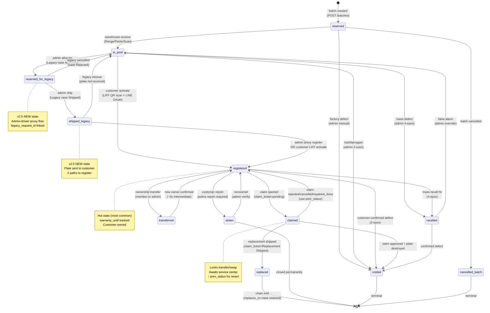

# DINOCO S/N System — Unified State Machine

**Version**: 1.0 (post v2.12 simplification + v2.5 Legacy + v2.6 Claim integration)
**Phase**: Phase 0 W1 Day 3-4 deliverable

## Source of Truth State Machine

แทนที่ ASCII state machine ใน v2.0 §2.2 — รวม v2.5 Legacy + v2.6 Claim + v2.7 Gateway + v2.12 simplification + v2.9 features (stolen/recall) เป็นตัวเดียว



## State Catalog

| State | Description | Exit conditions | Locked from |
|---|---|---|---|
| `reserved` | สร้างใน batch รอส่งโรงงาน | warehouse receive / void / batch cancel | activate, claim, transfer |
| `in_pool` | รับเข้าคลังแล้ว ผูก SKU | activate / legacy alloc / void / recall | (free) |
| `reserved_for_legacy` | จองให้ legacy case | admin ship / case reject | activate (block until shipped) |
| `shipped_legacy` | ส่งให้ลูกค้าแล้ว (Legacy path) | activate / reissue | (waiting customer) |
| `registered` | ลูกค้ากำลังใช้งาน warranty | claim / transfer / void / recall / stolen | re-register |
| `claimed` | กำลังเคลม ล็อค transfer | claim resolution → registered/replaced/voided | transfer, swap |
| `replaced` | replace ไปเพลทใหม่ (terminal) | — | (final state) |
| `transferred` | intermediate ระหว่างโอน (~5s) | new owner confirm → registered | — (transitional) |
| `voided` | ยกเลิก (terminal) | — | (final state) |
| `recalled` | เรียกคืน mass defect | recovered → registered/in_pool / void | activate, transfer, swap |
| `stolen` | ลูกค้าแจ้งหาย | recovered → registered / closed | activate, transfer, swap |
| `cancelled_batch` | batch ยกเลิกทั้งล็อต | — | (final state) |

## Transition Rules

### Customer-driven transitions (LIFF)
- `in_pool → registered` — ลูกค้า scan QR + LINE OAuth + กรอกฟอร์ม
- `shipped_legacy → registered` — ลูกค้า scan QR plate ที่ admin ส่งให้ (Legacy path)
- `registered → claimed` — ลูกค้าเปิดเคลม (อัตโนมัติ)
- `registered → stolen` — ลูกค้ารายงานหาย (police report required)
- `registered ↔ transferred → registered` — โอนเจ้าของผ่าน Member Transfer V3

### Admin-driven transitions
- `reserved → in_pool` — รับเพลทเข้าคลัง (Range/Paste/Scan modes)
- `in_pool → reserved_for_legacy` — Legacy case Approved + allocate plates
- `reserved_for_legacy → shipped_legacy` — admin กรอก tracking
- `shipped_legacy → registered` — admin proxy register (Legacy Path A)
- `claimed → replaced` — Replacement Shipped (Service Center)
- `claimed → registered` — claim rejected/cancelled/repair_done (revert via prev_status)
- `* → voided` — defect/lost (2-eyes for in_pool, 4-eyes for registered)
- `* → recalled` — mass defect recall (4-eyes always)
- `recalled → in_pool` — false alarm (admin override)

### System-driven (cron)
- `cancelled_batch` — bulk cancel batch + cascade plate states
- `transferred → registered` — auto-flip after new owner confirms (~5s window)

## Concurrency Locks

ทุก transition ใช้ pattern เดียวกัน:

```php
// ใน sn_pool atomic transition function
$wpdb->query("START TRANSACTION");
try {
    // 1. SELECT FOR UPDATE บน sn_pool row
    $row = $wpdb->get_row($wpdb->prepare(
        "SELECT * FROM {$wpdb->prefix}dinoco_sn_pool WHERE sn=%s FOR UPDATE",
        $sn
    ));

    // 2. Validate current state allows target transition
    if (!in_array($target_state, $allowed_transitions[$row->status])) {
        throw new Exception("Invalid transition: {$row->status} → {$target_state}");
    }

    // 3. Save prev_status (for revert support)
    $wpdb->update(...['prev_status' => $row->status, 'status' => $target_state, ...]);

    // 4. INSERT audit row
    $wpdb->insert($audit_table, [...]);

    $wpdb->query("COMMIT");
} catch (\Throwable $e) {
    $wpdb->query("ROLLBACK");
    dinoco_obs_capture($e, ['sn' => $sn, 'target' => $target_state]);
    throw $e;
}
```

## Critical Invariants

1. **Source of truth = customer activate** — ระบบไม่ track allocation ระหว่าง warehouse → customer (v2.2 simplification)
2. **prev_status for revert** — claim rejected → registered ใช้ snapshot ตอนเข้า claimed
3. **Lock during claim** — claimed plate ห้าม transfer/swap (data integrity)
4. **DD-3 shared leaf** — leaf อยู่ใต้ 2+ SETs ได้ — sn_pool row 1 เท่านั้นต่อ S/N
5. **Atomic chain** — replace = old.status=replaced + new.status=registered + replaces_sn metadata ใน same transaction
6. **Idempotency-Key** — every transition POST endpoint ใช้ wrapper (Round 19+ pattern)
7. **5-state stolen ≠ recalled** — stolen = customer-reported (1 plate), recalled = company-initiated (mass)

## Status to claim_ticket Mapping (v2.6 Gap A)

| claim_ticket.ticket_status | sn_pool.status | Notes |
|---|---|---|
| pending | claimed | Lock starts |
| reviewing | claimed | Continue |
| approved | claimed | Continue (admin will replace/repair) |
| in_progress (กำลังซ่อม) | claimed | Continue |
| waiting_parts | claimed | Continue |
| repairing | claimed | Continue |
| quality_check | claimed | Continue |
| completed (Repaired Item Dispatched) | registered | Repair done — revert |
| completed (Replacement Shipped) | replaced | Chain to new plate |
| rejected (Replacement Rejected) | registered | Revert via prev_status |
| cancelled (ลูกค้าถอน) | registered | Revert via prev_status |
| closed (auto 30d cron) | (sync ตาม final state) | Cron-driven |

## Audit Trail Requirement

ทุก state transition INSERT audit row ใน `wp_dinoco_sn_audit`:
- `sn` — plate
- `event_type` — `plate_received` / `plate_activated` / `plate_swapped` / `plate_voided` / etc.
- `status_from` + `status_to`
- `actor_user_id` + `approver_user_id` (ถ้า 4-eyes)
- `reason` (required สำหรับ destructive ops)
- `context_json` (FK refs, evidence, IP, UA)
- `created_at` (immutable)

Retention: 5 ปีสำหรับ sensitive_op (v2.4 fix from PDPA §17 financial), 3 ปีสำหรับ operational

---

**Next**: 03-cross-system-lifecycle.md (7-path swimlane)
