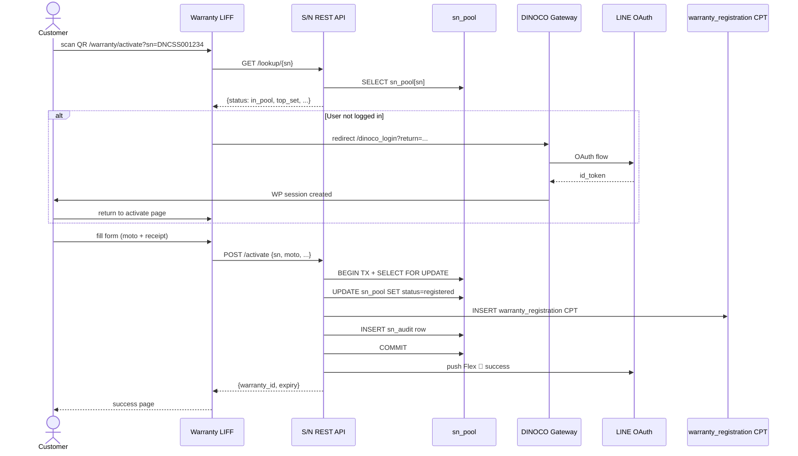
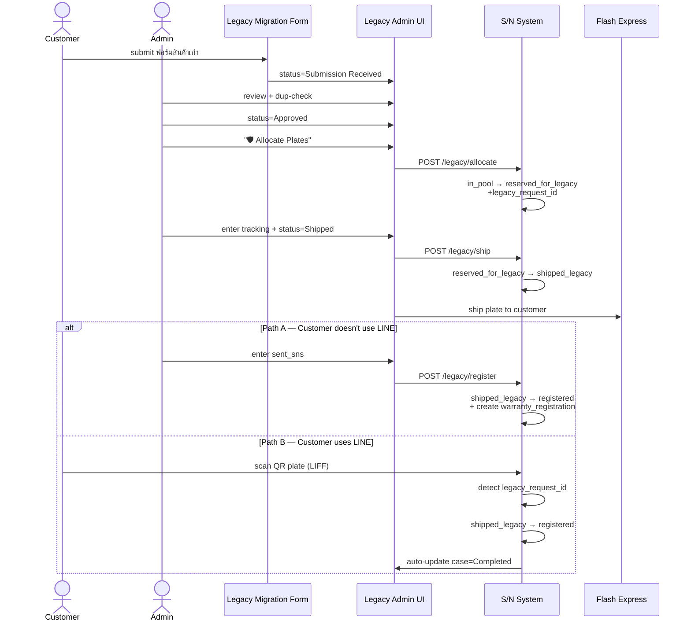
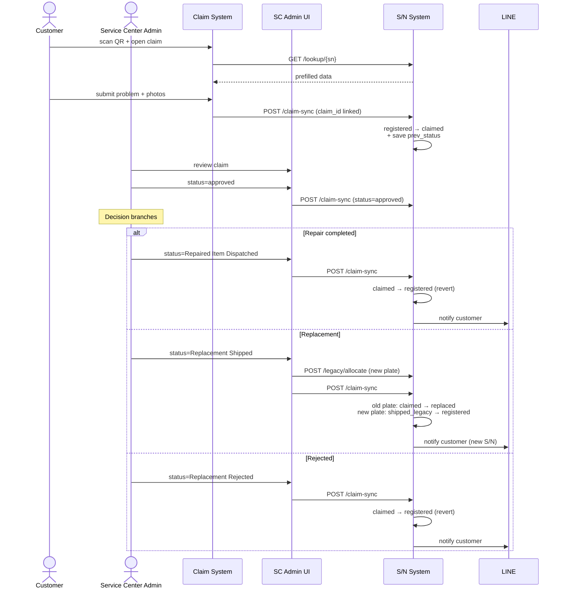
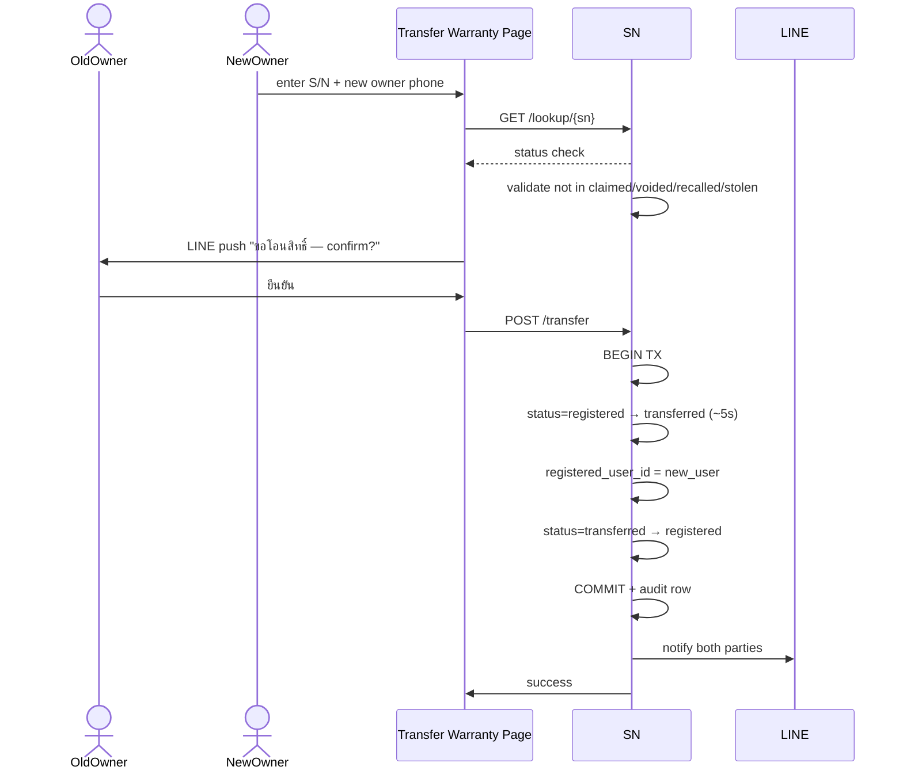
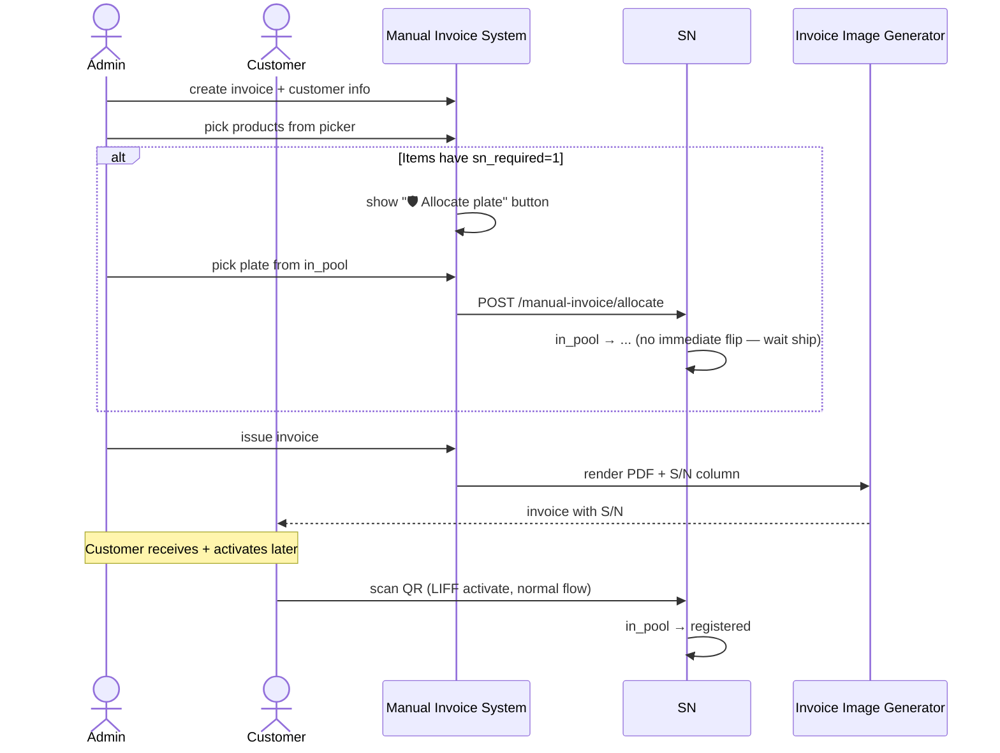
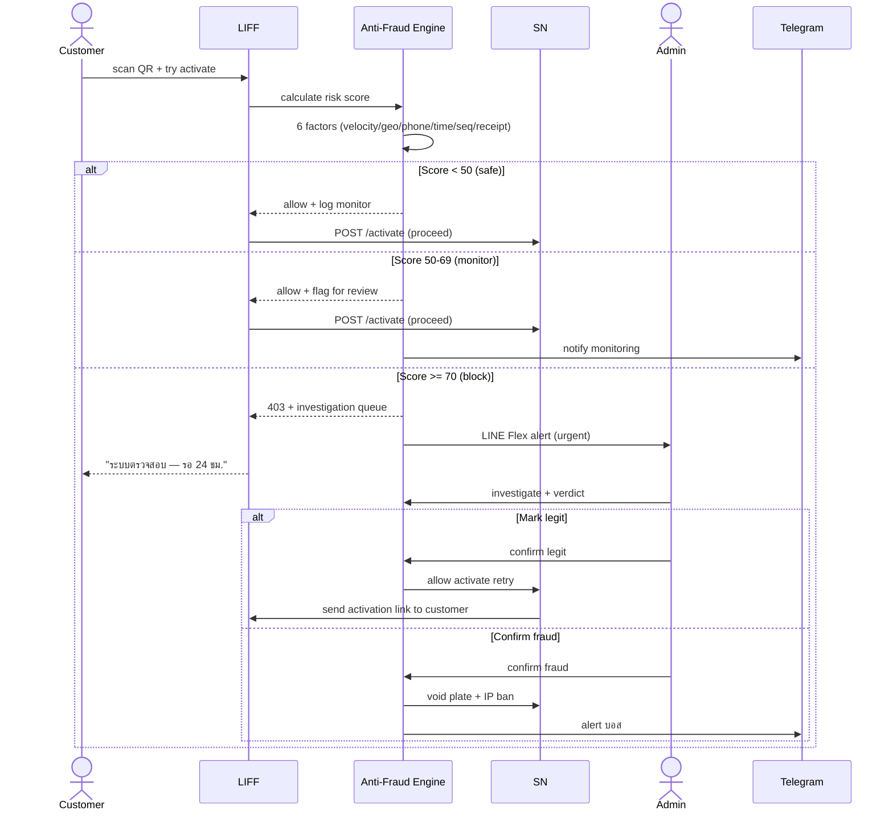
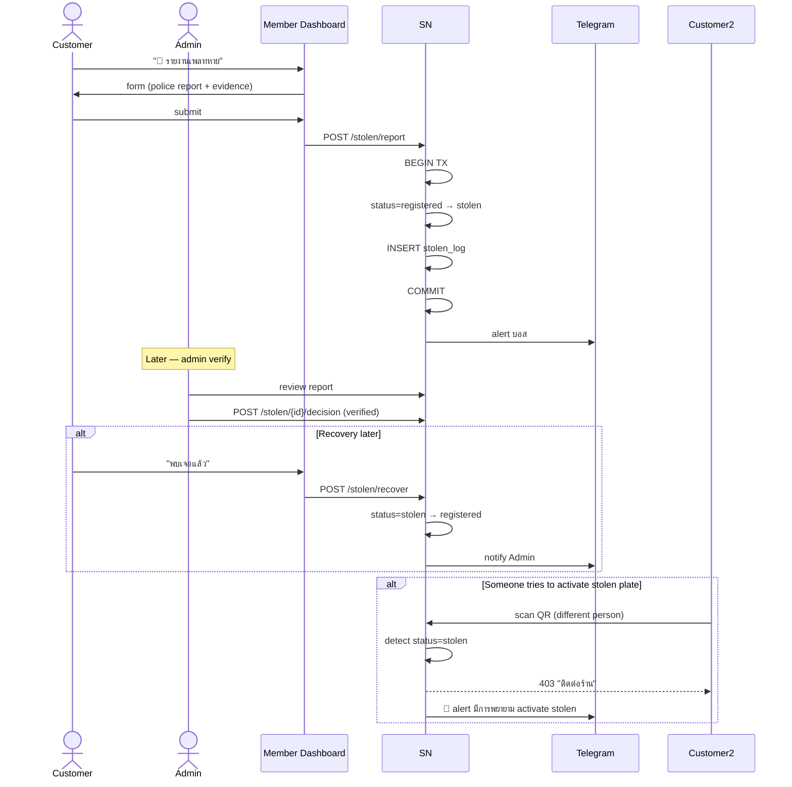
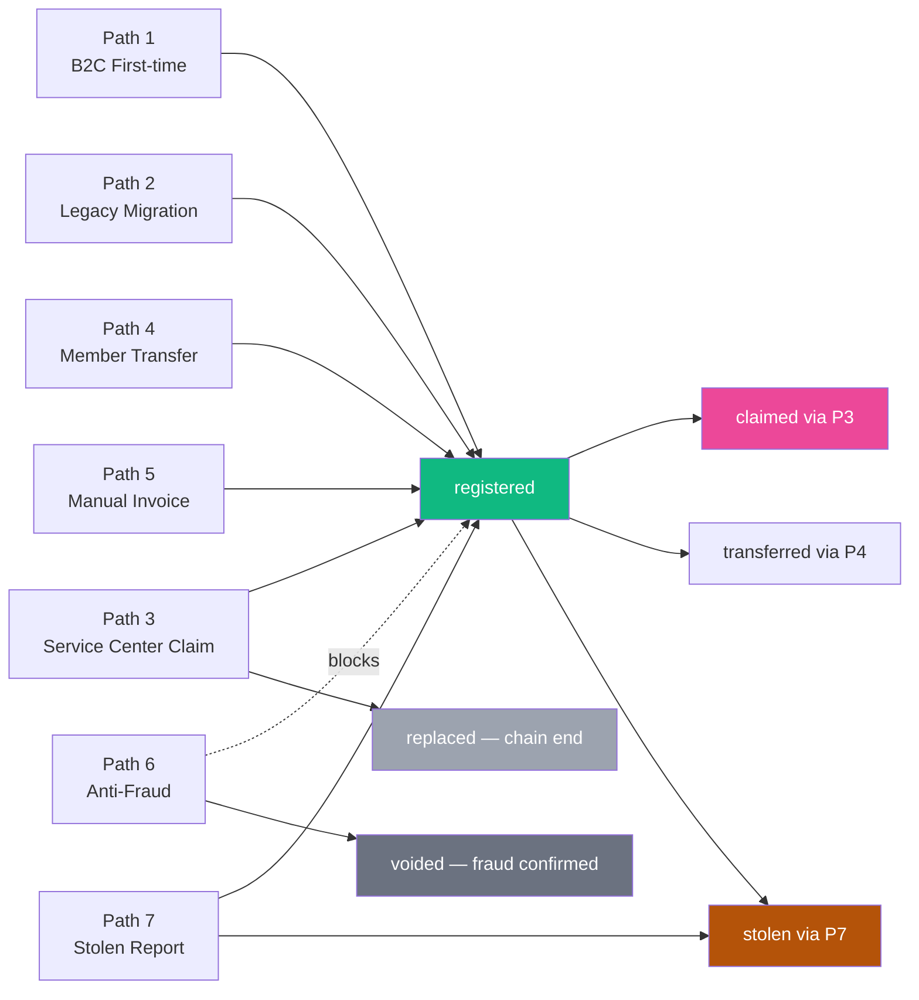

# DINOCO S/N System — Cross-System Plate Lifecycle (7-path swimlane)

**Version**: 1.0 (v2.6 Cross-System Plate Lifecycle visualization)
**Phase**: Phase 0 W1 Day 3-4 deliverable

## Purpose

Plan v2.6 §2.6 ระบุ 7 critical paths แต่เป็น text — diagram visualize ให้เห็นภาพรวม integration ทุก subsystem

## Path 1: B2C First-time Activation (Standard Path)

## Path 2: Legacy Migration (Admin-driven proxy)

## Path 3: Service Center Claim (11-status FSM)

## Path 4: Member Transfer V3 (peer-to-peer)

## Path 5: Manual Invoice Walk-in

## Path 6: Anti-Fraud Block + Investigation

## Path 7: Stolen Plate Report + Recovery

## Cross-Path Dependencies

## Critical Coordination Points

ทุก path ต้องประสานกับ:

1. **Idempotency Helper V.1.0** — POST endpoints ทุกตัว
2. **Modal Helpers V.1.0** — admin confirm dialogs
3. **Flag Audit Log V.1.0** — feature flag toggles
4. **Observability V.1.0** — error capture
5. **Action Scheduler** — cron jobs (DISABLE_WP_CRON workaround)
6. **GDPR V.4.1** — data export + anonymize on delete
7. **LINE Messaging API** — Flex push + OAuth

## Race Resolution Reference (v2.8 §2.8)

ทุก path มี race scenarios — resolution ตาม v2.8:
- Race 1: 2 customers same plate → first-come-first-serve + audit
- Race 2: Activate during shipping → 60s poll + 1hr fallback
- Race 3: Same plate scan twice → PRIMARY KEY 409
- Race 4: DD-3 shared leaf concurrent allocate → per-SKU GET_LOCK
- Race 5: Approval pending + cancel → auto-cancel approval

---

**Next**: 04-open-questions.md (Q1-Q29 boss decisions)
