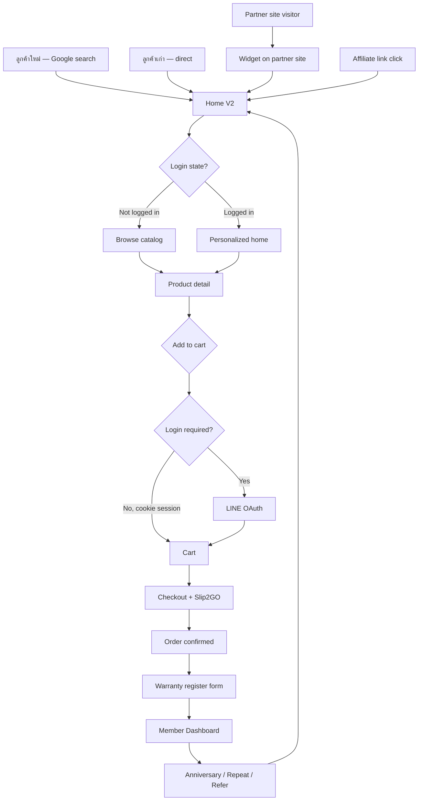
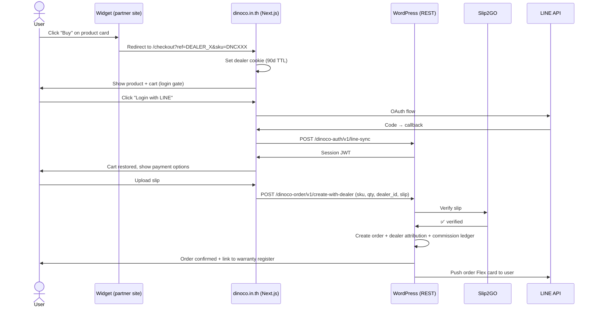
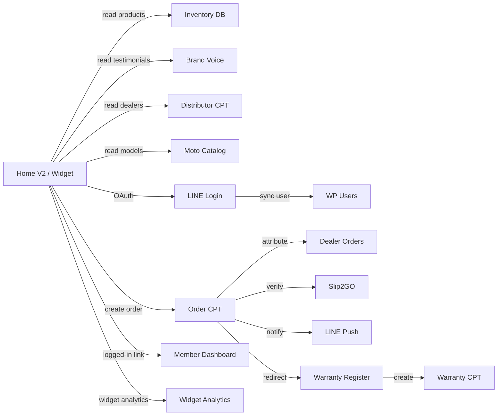
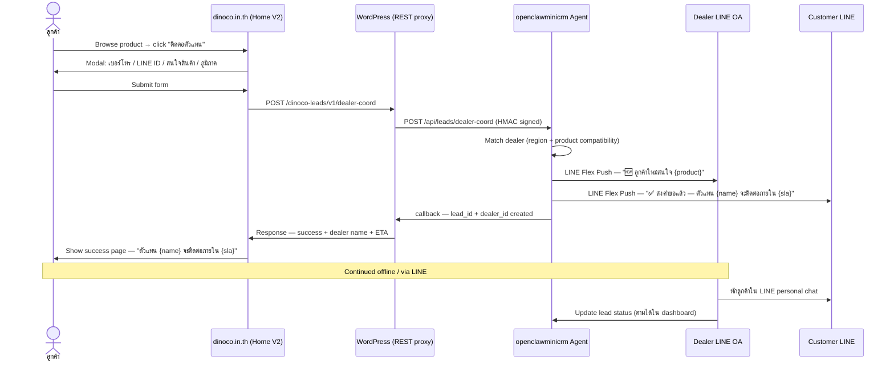

# Phase 6 LT-3 · DINOCO Home V2 + Lead-Gen Site — Mega Spec

[← Specs index](./README.md) · [← Phase 6 backlog tracker](../sn-system/34-phase6-backlog-tracker.md)

> **Status**: DESIGN SPEC · Boss-binding inputs locked (2026-05-15 + 2026-05-16 + 2026-05-18) · Awaiting final approval for phasing kickoff
> **Boss vision (2026-05-16)**: "ทำ web home dinoco.in.th ใหม่ และใช้ [Admin System] DINOCO Global Inventory Database ใช้ login ด้วย line ร่างสเปคเทพๆ มาหน่อยให้ link กับระบบทั้งหมดของ dinoco"
> **Boss pivot (2026-05-18)**: "เว็บ DINOCO.in.th จะไม่มีช่องทางให้ชำระเงิน แต่จะมีปุ่มประสานตัวแทนจำหน่าย และก็ไปใช้ระบบประสานตัวแทนจำหน่าย openclawminicrm แทน ไปส่ง flex ผ่านไลน์ติดต่อลูกค้าฯ"
> **Effort estimate (revised post-pivot)**: ~8 weeks (was 12) · ~340-400 dev hours (was 520-580) · checkout stack ตัดออกแล้ว
> **Replaces / supersedes**: `33-phase6-strategic-foundations.md` §LT-3 stub (LT-1 done, LT-2 cut, LT-3 = this doc, LT-4 TBD)
> **Cuts**: Dealer mobile dashboard (2026-05-16), all checkout/payment stack (2026-05-18 — see pivot notice below)

---

## 🔴 Pivot Notice — 2026-05-18 (READ FIRST)

หลัง boss review draft แรก → ตัดสินใจเปลี่ยน **product model** จาก "e-commerce + checkout" → "**lead-gen + dealer handoff via openclawminicrm**". การเปลี่ยนแปลงสำคัญ:

### ของเดิม (CUT — superseded)

- ❌ Cart + checkout flow
- ❌ Slip2GO payment integration
- ❌ Order creation บน dinoco.in.th
- ❌ Dealer commission ledger (full implementation)
- ❌ LINE Login เป็น hard requirement (เปลี่ยนเป็น optional สำหรับ personalization)
- ❌ widget redirect → checkout page

### ของใหม่ (NEW direction)

- ✅ ลูกค้า browse catalog บน home/product pages
- ✅ คลิก **"ติดต่อตัวแทนใกล้คุณ"** button
- ✅ Form เก็บ: เบอร์โทร / LINE ID / สนใจสินค้า / ภูมิภาค
- ✅ Submit → POST openclawminicrm `/api/leads/dealer-coord`
- ✅ openclawminicrm จับคู่ dealer (by region + product match)
- ✅ openclawminicrm ส่ง LINE Flex หา dealer + ลูกค้า (3-way coord card)
- ✅ Dealer ติดตามใน openclawminicrm dashboard
- ✅ Widget redirect → ปุ่ม "ติดต่อตัวแทน" → flow เดียวกัน

### Sections ใน spec นี้ที่ยัง valid (KEEP, อ่านได้)

- ✅ §1 Executive summary (ปรับ ROI ใหม่ — ดู revised est. ด้านบน)
- ✅ §2 User personas (ปรับ "buy flow" → "contact dealer flow")
- ✅ §3 Information architecture / sitemap (ลบ `/cart` + `/checkout` + `/order/{id}`)
- ✅ §4 Tech stack decision (Next.js ยัง valid)
- ✅ §5 LINE Login SSO architecture (downgrade เป็น optional)
- ✅ §6 Home page sections (most sections เก็บ — ตัด "Quick checkout")
- ✅ §7 E-commerce widget (rename → "Catalog widget" — ทำงานเหมือนเดิม แต่ click → contact dealer)
- ✅ §10 DB schema (ลบ dealer_orders + commission tables; เก็บ home_featured + widget_dealers + widget_analytics)
- ✅ §11 Security model
- ✅ §12 Performance + SEO targets
- ✅ §13 Subsystem integration map (เน้น openclawminicrm มากกว่า payment)

### Sections ที่ต้องอ่าน NEW (added bottom)

- ✅ **§19 NEW — Dealer Handoff Flow** (Part D) — flow detail + openclawminicrm contract + Flex templates

### Sections ที่ DEPRECATED (ข้าม)

- ❌ §8 Order Flow + Dealer Attribution (entirely cut — no checkout)
- ❌ §9.5 dinoco-order/v1/* endpoints (cut)
- ❌ §10 wp_dinoco_dealer_orders table (cut)
- ❌ §14 Phasing LT-3.4 commission system (cut — saves ~120h)

### Tracking widget integration (boss bonus 2026-05-18)

บอสไม่เลือก LT-4 ideas แต่ระบุ "ระบบต้องทำงานร่วมกับ system ใน repo ได้ทั้งหมดอย่างฉลาด ยกเว้นส่งของด้วย Flash Express" (จากข้อความรอบแรก). หมายถึง home V2 ควรมี:

- ✅ **Order tracking widget** บน home — ลูกค้ากรอกเลข ticket → ดู Flash status realtime (reuse existing webhook)
- → เพิ่มเป็น Section 6 home page sub-section ใหม่: "🚚 ติดตามพัสดุ" — connect ผ่าน `b2b_flash_tracking_cron` data ที่มีอยู่แล้ว
- → ไม่ต้อง develop tracking infra ใหม่ — แค่ frontend widget เรียก existing REST `GET /wp-json/b2b/v1/flash-tracking?ticket={id}`

---

## Table of Contents

1. [Executive Summary](#1-executive-summary)
2. [User Personas + Journey Maps](#2-user-personas--journey-maps)
3. [Information Architecture (Sitemap)](#3-information-architecture-sitemap)
4. [Tech Stack Decision](#4-tech-stack-decision)
5. [Authentication Architecture (LINE Login SSO)](#5-authentication-architecture-line-login-sso)
6. [Home Page Detailed Spec (Part A)](#6-home-page-detailed-spec-part-a)
7. [E-Commerce Widget Spec (Part B)](#7-e-commerce-widget-spec-part-b)
8. [Order Flow + Dealer Attribution](#8-order-flow--dealer-attribution)
9. [REST API Contracts](#9-rest-api-contracts)
10. [Database Schema Additions](#10-database-schema-additions)
11. [Security Model](#11-security-model)
12. [Performance + SEO Targets](#12-performance--seo-targets)
13. [Subsystem Integration Map (Part C)](#13-subsystem-integration-map-part-c)
14. [Phasing + Dev Plan (12 weeks)](#14-phasing--dev-plan-12-weeks)
15. [KPIs + Success Metrics](#15-kpis--success-metrics)
16. [Open Questions for Boss](#16-open-questions-for-boss)
17. [Risks + Mitigations](#17-risks--mitigations)
18. [Appendix — Reference Files](#18-appendix--reference-files)

---

## 1. Executive Summary

### 1.1 Vision

รื้อ `dinoco.in.th` ใหม่จากหน้า WordPress theme เดิม → **modern brand experience + revenue engine** ที่ทำ 3 อย่างพร้อมกัน:

1. **Brand showcase + lead generation** — มือถือเปิดมาเห็นแบรนด์ทันที, มี call-to-action ชัด, scrape ได้โดย Google SEO
2. **Self-serve catalog + checkout** — ลูกค้าเข้า home → browse → LINE login → buy → auto-redirect register warranty (ไม่ต้องผ่าน LINE OA)
3. **Distributor amplifier** — partner/affiliate copy embed code → ฝัง widget ในเว็บตัวเอง → ทุก click + sale ผูกกับ dealer ID → DINOCO จ่าย commission

### 1.2 ทำไมตอนนี้ (timing rationale)

| Trigger | Impact |
|---|---|
| Inventory DB matured (V.46+) — 42 REST endpoints, multi-warehouse, hierarchy 3 ระดับ, valuation, forecast | Catalog API พร้อม serve external consumer |
| LINE Login stable — `[System] LINE Callback` V.30.10 + OAuth state HMAC + WP user link via `dinoco_line_uid` | SSO infra ready |
| Member Dashboard V.32 — Card Role / LTV / Asset Cards / banner carousel | Post-login experience polished |
| MCP Bridge V.3.0 — 32 endpoints feed chatbot product info | AI-augmented browsing ready |
| Brand Voice Pool — social listening data accumulated | Testimonial source ready |
| H7+H8 cache hardening (2026-05-16) | Flag-driven feature toggles safe |

→ ระบบ backend พร้อมแล้ว, frontend ยังเป็น WordPress theme เก่า — **gap ใหญ่ที่สุดของ DINOCO ตอนนี้**

### 1.3 Out of scope (อย่าทำใน LT-3)

| Item | Why excluded |
|---|---|
| Dealer mobile dashboard | Boss cut (2026-05-16) — มี B2B portal อยู่แล้ว |
| Mobile app native (iOS/Android) | LT-4 candidate, แยก spec |
| Marketplace API ให้ Shopee/Lazada | LT-4 candidate, business case ยังไม่ชัด |
| Multi-vendor marketplace (3rd-party sellers) | นโยบาย business — DINOCO control catalog 100% |
| Real-time stock sync to widget | Phase 2 (LT-3.3+) — Phase 1 ใช้ near-real-time 5-min cache |
| AI product recommendation | LT-4 candidate (มี data จาก Brand Voice + MCP) |
| Chat support widget on home | reuse existing LINE OA button — ไม่สร้าง chat ใหม่ |

### 1.4 ROI estimate (rough)

| Source | Year 1 baseline | Year 1 target | Delta |
|---|---|---|---|
| Direct sales จาก home (estimate) | 0 (ปัจจุบัน home ไม่ขาย) | ~5% ของ total revenue | +5% |
| Dealer-attributed widget sales | 0 | ~3% ของ total revenue (10 partner active) | +3% |
| Lead capture (warranty register skip LINE OA) | ~0 → existing | +20% conversion (เพราะ no friction) | indirect ROI |
| **Total revenue lift Year 1** | — | **+8% gross revenue** | strong case |

(เลขประมาณ — ต้องทำ pilot test 3 เดือนก่อนยืนยัน)

---

## 2. User Personas + Journey Maps

### 2.1 Persona 1 — ลูกค้าใหม่ (B2C, organic search)

**Profile**: "เจ้าของมอไซค์ NX500 ที่กำลังหาอุปกรณ์ Crash Bar ลงคำว่า 'กันล้ม nx500 ดี ๆ' ใน Google"

| Stage | Action | Touch point | KPI |
|---|---|---|---|
| Awareness | Google search → click DINOCO result | Home page (SEO landing) | Organic CTR, bounce rate |
| Interest | Browse catalog → คลิก product detail | `/shop` หรือ `/product/{sku}` | Time-on-page, scroll depth |
| Consideration | Watch product video, อ่าน Brand Voice testimonials | Product page | Video play rate |
| Intent | กด "เพิ่มลงตะกร้า" → modal บอก "Login ด้วย LINE ก่อน" | LINE OAuth flow | OAuth conversion |
| Action | LINE login → auto-create WP user → กลับมา cart → checkout → จ่าย slip | Checkout + slip upload | Cart abandonment rate, slip-pass rate |
| Retention | Auto-redirect warranty register form → save S/N → start lifecycle | `/warranty/activate?sn=...` | Activation conversion |
| Advocacy | Anniversary push (F#4) → "แชร์ให้เพื่อน" → referral code | LINE Flex push | Referral activation |

**Critical UX**:
- Mobile-first: 80%+ จะเปิดบนมือถือ
- LINE Login = single tap, no password
- Cart persists across login (localStorage)
- Slip verify via Slip2GO < 30s
- Warranty form pre-fill จาก order data

---

### 2.2 Persona 2 — ลูกค้าเก่า (returning, direct visit)

**Profile**: "เพิ่งซื้อกันล้ม เปิด DINOCO อีกที จะดูว่ามีของใหม่ไหม + check warranty"

| Stage | Action | Touch point | KPI |
|---|---|---|---|
| Return | เปิด dinoco.in.th — มี cookie/LINE session | Home page (auto-detect login) | Logged-in % |
| Personalized | Home แสดง "ยินดีต้อนรับกลับ คุณXX! ผลิตภัณฑ์แนะนำสำหรับ NX500 ของคุณ" | Home (auth-aware section) | Personalized CTR |
| Dashboard quick-access | ปุ่ม "Dashboard" บน header → Member Dashboard | `/dashboard` (existing) | Click-through |
| Repeat purchase | Browse + add to cart → checkout (no login friction, session live) | `/checkout` | Repeat order conversion |

**Critical UX**:
- SSO session works across `dinoco.in.th` ↔ `/dashboard` ↔ LIFF
- Logged-in home แสดง personalized content (last viewed product, related to owned warranty)
- "Quick reorder" สำหรับ consumable items (สาย, ฟองน้ำ ฯลฯ)

---

### 2.3 Persona 3 — Dealer / Partner (B2B)

**Profile**: "ร้านค้าตัวแทน DINOCO ในต่างจังหวัด มีเว็บร้านตัวเอง อยากขายของ DINOCO โดยไม่ต้องสต็อก"

| Stage | Action | Touch point | KPI |
|---|---|---|---|
| Discovery | คลิก "ขอเป็น dealer/partner" บน home footer | `/become-a-dealer` form | Application rate |
| Approval | กรอกข้อมูลร้าน → DINOCO admin review → approve → ออก dealer_id + widget code | Email + admin tool | Approval throughput |
| Setup | ดู docs/embed.html → copy `<script>` code → paste ในเว็บร้านตัวเอง | Docs page | Setup completion rate |
| Curation | (optional) ใช้ dealer dashboard เลือก featured SKU set | `/dealer-widget-config` | Active dealer % |
| Monetization | Customer click widget → checkout บน dinoco.in.th พร้อม dealer_id → commission ลง dealer account | Commission ledger | Commission earned |

**Note**: B2B existing distributor (มี LINE group) จะได้ widget code ฟรีเพิ่มเติม เป็น optional add-on — **ไม่บังคับใช้** เพราะ flow B2B order ผ่าน LINE OA เดิมยังคงดี

---

### 2.4 Persona 4 — Affiliate / Content Creator

**Profile**: "เพจมอไซค์ใน Facebook/Instagram/YouTube มี followers 50K+ อยากแนะนำสินค้า DINOCO รับ commission"

| Stage | Action | Touch point | KPI |
|---|---|---|---|
| Sign-up | กรอกแบบฟอร์ม affiliate (auto-approve ถ้า followers > threshold) | `/affiliate-signup` | Sign-up rate |
| Link generation | Get tracked URLs: `dinoco.in.th/?ref=affiliate_xyz&sku=DNCXXX` | Affiliate dashboard | Active affiliate % |
| Content | โพสต์รีวิว → ใส่ link tracked URL | External (FB/IG/YT) | Affiliate impressions |
| Conversion | User click → land on home/product → cookie attribution → buy | DINOCO checkout | Affiliate-attributed sales |
| Payout | Monthly commission report → manual transfer (non-VAT บัญชีบุคคล) | Admin tool | Payout cycle |

**Note**: Affiliate = simpler version ของ dealer — ไม่ต้อง embed widget, แค่ใช้ tracked URLs

---

### 2.5 Persona journey diagram (Mermaid)



---

## 3. Information Architecture (Sitemap)

### 3.1 Top-level sitemap

```
dinoco.in.th/
├── /                        — Home V2 (รื้อใหม่ — เนื้อหา Section 6)
├── /shop                    — Catalog landing (filter by category + model)
│   ├── /shop/category/{slug} — Category page
│   ├── /shop/model/{slug}    — By motorcycle model (NX500, XL750, etc.)
│   └── /product/{sku}        — Product detail page
├── /cart                    — Cart page
├── /checkout                — Checkout (login gate + Slip2GO)
├── /order/{id}              — Order detail + tracking
├── /warranty
│   ├── /warranty/activate   — Activate S/N (existing — extend with order auto-fill)
│   ├── /warranty/check      — Public lookup (existing LIFF — extend to web)
│   └── /warranty/transfer   — Transfer ownership (existing)
├── /dashboard               — Member Dashboard (existing — links from home header)
├── /claim                   — Claim entry (existing)
├── /about                   — About DINOCO (brand story)
├── /dealers                 — Dealer locator (Google Maps + DB query)
├── /become-a-dealer         — Dealer/affiliate application
├── /dealer-widget-config    — Widget customization (dealer login required)
├── /affiliate-signup        — Affiliate application
├── /contact                 — Contact form + LINE OA QR
├── /blog                    — Blog/Tips (SEO content)
│   └── /blog/{slug}          — Article page
├── /privacy                 — Privacy policy (PDPA)
├── /terms                   — Terms of service
└── /widget/v1/embed.js      — Widget loader JS (CDN-served)
```

### 3.2 Header navigation (sticky, mobile + desktop)

```
┌────────────────────────────────────────────────────────────────┐
│ [DINOCO logo]  Shop ▼  About  Dealers  Blog       [🔍] [👤]   │
│                                                                │
│ (Shop ▼ dropdown)                                              │
│ ├── By Category — Crash Bar / Top Box / Rack / Accessories    │
│ ├── By Model — NX500 / XL750 / CB650 / ...                    │
│ └── Best Sellers / New Arrivals / Sale                        │
└────────────────────────────────────────────────────────────────┘
```

Mobile (≤640px) collapses Shop dropdown into bottom drawer.

`[👤]` = Account icon → if logged in → dropdown (Dashboard / Orders / Warranties / Logout). If not → "Login with LINE" button.

### 3.3 Footer

```
┌────────────────────────────────────────────────────────────────┐
│ DINOCO logo + tagline                                          │
│                                                                │
│ Shop          Support         Company        Connect          │
│ - All Products - Contact      - About        - LINE OA QR     │
│ - By Category - Warranty Check- Blog         - Facebook       │
│ - By Model    - Claim Status  - Become Dealer- Instagram      │
│ - Sale        - FAQs          - Affiliate    - YouTube        │
│                                                                │
│ ─────────────────────────────────────────────────────────────  │
│ 🛡️ Protected by PDPA    🔒 SSL Secured    💬 LINE @dinoco     │
│ © 2026 DINOCO · Privacy · Terms · Sitemap                    │
└────────────────────────────────────────────────────────────────┘
```

---

## 4. Tech Stack Decision

### 4.1 Decision matrix

| Option | Pros | Cons | Effort | Recommendation |
|---|---|---|---|---|
| **A. WordPress theme rebuild** (custom theme + ACF blocks) | Reuse WP backend 100% / no new deploy infra / SEO out-of-the-box | Slow modern UX / hard to optimize LCP / template hell | ~6 weeks | ❌ Not recommended (LT-3 vision = "modern" not "WP-bound") |
| **B. WordPress headless + Next.js (Vercel)** | Modern UX / SSR/SSG SEO / fast / easy widget bundling | New infra (Vercel) / 2 deploy targets / WP REST consumer code | ~10 weeks | ✅ **Recommended for ambition** |
| **C. WordPress + Vite + Alpine.js theme** | Single deploy / progressive enhancement / smaller learning curve | Limited PWA / not as polished UX / harder team scaling | ~7 weeks | ✅ Good fallback if Next.js too ambitious |
| **D. Astro static + WP API** | Fastest LCP / island architecture / cheap hosting | Less interactive / harder cart state mgmt / new framework | ~9 weeks | ⚠️ Consider for Phase 2 if Vercel cost issue |

### 4.2 Recommendation: Option B (Next.js headless)

**Reasoning**:
1. Boss vision = "เทพ ๆ" → modern UX = Next.js sweet spot
2. Widget bundling — Vite/esbuild bundle widget as standalone JS = same tooling as Next.js
3. SSR/SSG = SEO Google scrape ได้ + LCP < 1.5s realistic
4. Image optimization, fonts, code splitting = built-in
5. Vercel free tier covers MVP traffic, scales pay-as-you-go
6. TypeScript = catch bugs earlier vs vanilla
7. Existing team has LIFF Vite experience (`liff-src/` already in repo) — Next.js learning curve modest

**Migration safety**:
- WP stays as backend (admin + REST + Snippet code unchanged)
- New frontend at separate Vercel deploy
- DNS cutover: `dinoco.in.th` → Vercel; existing routes (`/wp-admin/`, `/wp-json/*`, `/admin-command-center/`, LIFF pages) → reverse proxy back to WP origin via Vercel config
- Rollback = DNS revert <5 min

### 4.3 Stack details (Option B chosen)

| Layer | Tech | Justification |
|---|---|---|
| Framework | Next.js 14+ (App Router) | RSC + Server Actions + ISR |
| Language | TypeScript strict | catch bugs at build |
| Styling | Tailwind CSS + CSS variables from `liff-src/b2b/catalog/tokens.css` (reuse design tokens) | consistent with existing LIFF |
| State | Zustand (cart state) + SWR (data fetching with cache) | lightweight, no Redux overhead |
| Forms | react-hook-form + zod validation | declarative, fast |
| LINE Login | Server-side OAuth in Next.js API route → set httpOnly cookie | session stored in WP via `wp_set_auth_cookie` proxy |
| Payment | Slip2GO (existing) via Server Action | reuse WP REST endpoint |
| Images | Next/Image with Cloudinary or self-hosted with `next/image` | LCP optimization |
| Analytics | Plausible (self-hostable, PDPA-friendly) or GA4 | boss decide |
| Hosting | Vercel (frontend) + existing VPS (WP backend + DB) | cheap, scalable |
| CDN | Vercel Edge Network (auto) + Cloudflare for `wp-content/uploads` | fast global |
| Widget bundle | Vite + esbuild → single ES module file deployed to `https://dinoco.in.th/widget/v1/embed.js` | tree-shakeable, ~30KB gzip target |
| i18n | next-intl (Server Components support) | th/en/zh out of box |

### 4.4 Repo structure

```
DINOCO-SYSTEM-Front-End---Back-End/      ← existing WP repo (untouched mostly)
├── [System] *                            ← existing snippets
├── [Admin System] *                      ← existing snippets
├── liff-src/                             ← existing LIFF Vite builds
├── widget-src/                           ← NEW — widget source (Vite)
│   ├── src/
│   │   ├── index.ts                      ← embed.js entry
│   │   ├── components/                   ← Product card, grid, cart icon, etc.
│   │   ├── api.ts                        ← REST client for dinoco-widget/v1/*
│   │   └── styles.css                    ← Shadow DOM scoped
│   ├── package.json
│   └── vite.config.ts
└── docs/specs/PHASE-6-LT-3-*.md          ← this file

dinoco-home-v2/                           ← NEW SEPARATE REPO (Next.js)
├── app/
│   ├── (marketing)/                      ← home, about, blog
│   │   ├── page.tsx                       ← home V2
│   │   ├── about/page.tsx
│   │   └── blog/[slug]/page.tsx
│   ├── shop/                              ← catalog
│   │   ├── page.tsx                       ← /shop landing
│   │   ├── category/[slug]/page.tsx
│   │   ├── model/[slug]/page.tsx
│   │   └── product/[sku]/page.tsx
│   ├── cart/page.tsx
│   ├── checkout/page.tsx
│   ├── order/[id]/page.tsx
│   ├── api/
│   │   ├── auth/line/callback/route.ts   ← LINE OAuth callback
│   │   ├── auth/session/route.ts          ← session check
│   │   └── proxy/[...path]/route.ts      ← reverse proxy to WP (avoid CORS)
│   └── layout.tsx
├── components/
│   ├── ui/                                ← shadcn/ui base
│   ├── product/                           ← ProductCard, etc.
│   ├── cart/                              ← Cart drawer, etc.
│   └── auth/                              ← LineLoginButton, etc.
├── lib/
│   ├── wp-api.ts                          ← WP REST client (cached)
│   ├── inventory-api.ts                   ← Inventory DB client
│   ├── line-oauth.ts                      ← LINE SDK helpers
│   └── cart-store.ts                      ← Zustand cart state
├── public/
├── messages/                              ← i18n strings (th/en/zh)
├── next.config.mjs
└── package.json
```

### 4.5 Why separate Next.js repo

- **Deploy independence** — frontend updates don't require WP code review
- **CI/CD separation** — Vercel auto-deploys Next.js repo on push to main; WP repo CI runs Jest/PHPUnit
- **Team scaling** — frontend dev can work without WP knowledge (REST contract only)
- **Rollback granular** — Vercel deploy rollback ≠ WP rollback

---

## 5. Authentication Architecture (LINE Login SSO)

### 5.1 Current state (existing infra to reuse)

- `[System] LINE Callback` V.30.10 — OAuth flow + state HMAC verify + Profile fetch + WP user create/link via `dinoco_line_uid` meta
- `[System] DINOCO Gateway` V.31.0 — entry shortcode with LINE Login button + post-login routing
- WP user creation flow: LINE login → check `dinoco_line_uid` exists → if yes → `wp_set_auth_cookie` → if no → create `wp_users` row + meta link
- Constants: `DINOCO_LINE_CHANNEL_ID`, `DINOCO_LINE_CHANNEL_SECRET`, `DINOCO_LINE_REDIRECT_URI` (wp-config.php)

### 5.2 New auth flow (Next.js frontend)

```
[User] clicks "Login with LINE" on dinoco.in.th (Next.js)
    ↓
[Next.js] POST /api/auth/line/init
    → server generates state token (HMAC of timestamp + random nonce)
    → server stores state in httpOnly cookie + redis (short TTL 5min)
    → server returns redirect URL: https://access.line.me/oauth2/v2.1/authorize?...
    ↓
[Browser] redirects to LINE OAuth consent
    ↓
[LINE] redirects back to https://dinoco.in.th/api/auth/line/callback?code=...&state=...
    ↓
[Next.js] /api/auth/line/callback route
    → verify state token (HMAC check + TTL valid)
    → exchange code for access token (LINE Token API)
    → fetch user profile (LINE Profile API)
    → forward to WP backend: POST https://dinoco.in.th/wp-json/dinoco-auth/v1/line-sync { line_uid, display_name, picture_url }
    → WP creates/updates user, returns session token (JWT signed with shared secret)
    → Next.js sets session cookie (httpOnly, SameSite=Lax, Secure, 30-day TTL)
    → redirect user back to intended page (stored in state)
```

### 5.3 New REST endpoint required on WP side

```php
// [Admin System] DINOCO Auth Bridge V.1.0 (NEW snippet)
register_rest_route( 'dinoco-auth/v1', '/line-sync', array(
    'methods'             => 'POST',
    'callback'            => 'dinoco_auth_line_sync_handler',
    'permission_callback' => 'dinoco_auth_verify_hmac_signature', // shared secret bewteen Next.js + WP
) );

// Body: { line_uid, display_name, picture_url, email? }
// Response: { user_id, session_token (signed JWT), is_new_user }
```

**Signature**: Next.js signs body with `DINOCO_NEXTJS_HMAC_SECRET` (env var); WP verifies — prevents direct call abuse.

### 5.4 Session strategy

| Token | Storage | TTL | Use |
|---|---|---|---|
| `dinoco_session` (JWT) | httpOnly cookie on `dinoco.in.th` | 30 days sliding | API auth between Next.js + WP |
| `wordpress_logged_in_*` | httpOnly cookie (set by WP) | 14 days | for `/wp-admin/`, `/admin-command-center/`, LIFF pages SSO |
| Anonymous cart | localStorage `dinoco_cart_v1` | 30 days | cart persists pre-login |

### 5.5 SSO cross-domain

ทุก subsystem ใช้ same WP session:
- `dinoco.in.th/` — Next.js reads `dinoco_session` JWT
- `dinoco.in.th/admin-command-center/` — WP reads `wordpress_logged_in_*` cookie (same domain, both cookies present)
- `dinoco.in.th/dashboard` — same
- `liff.dinoco.in.th` — separate (LIFF SDK auth)

→ ลูกค้า login บน home แล้ว → คลิก Dashboard → ไม่ต้อง login อีก

### 5.6 Logout

`POST /api/auth/logout` (Next.js) → clears both cookies + revokes JWT (blocklist in Redis TTL = 30 days)

---

## 6. Home Page Detailed Spec (Part A)

### 6.1 Above-the-fold layout (mobile-first)

```
┌──────────────────────────────────────────────┐
│ Sticky header — logo + Shop ▼ + 🔍 + 👤    │
├──────────────────────────────────────────────┤
│                                              │
│      [Hero animation/video bg]               │
│                                              │
│      DINOCO                                  │
│      อุปกรณ์มอเตอร์ไซค์คุณภาพระดับโลก         │
│      เพื่อนักขี่ทุกคน                          │
│                                              │
│      [ดูสินค้าทั้งหมด]  [เช็คประกัน]          │
│                                              │
├──────────────────────────────────────────────┤
│  ⭐ Trust bar                                │
│  ✓ ของจริง 100%   ✓ รับประกันตลอดชีพ        │
│  ✓ ส่งทั่วไทย      ✓ ตัวแทนจำหน่าย 200+ ร้าน │
└──────────────────────────────────────────────┘
```

**Hero content options** (boss pick):
- Option 1: Looping video of motorcycle with DINOCO accessories (15s loop, no sound)
- Option 2: Animated SVG illustration (lighter weight, design heavy)
- Option 3: Carousel of 5 featured product hero images

**CTA buttons**:
- Primary: "ดูสินค้าทั้งหมด" → `/shop` (green #06C755 brand)
- Secondary: "เช็คประกัน" → `/warranty/check` (white outline)

### 6.2 Section breakdown (top to bottom)

#### 6.2.1 Hero (Section 6.1) — above fold
#### 6.2.2 Featured Products carousel

```
┌──────────────────────────────────────────────┐
│ ⚡ สินค้ายอดนิยม                              │
│                                              │
│ [< prev]                          [next >]   │
│ ┌─────────┐ ┌─────────┐ ┌─────────┐         │
│ │ [img]   │ │ [img]   │ │ [img]   │         │
│ │ Crash   │ │ Top Box │ │ NX500   │         │
│ │ Bar Pro │ │ Pro 45L │ │ Rack    │         │
│ │ ฿8,800  │ │ ฿7,500  │ │ ฿5,200  │         │
│ │ [Add+]  │ │ [Add+]  │ │ [Add+]  │         │
│ └─────────┘ └─────────┘ └─────────┘         │
└──────────────────────────────────────────────┘
```

**Data source**: `GET /wp-json/dinoco-home/v1/featured` — returns 12 SKUs (admin curate via WP admin tool)

#### 6.2.3 Shop by Motorcycle Model (visual grid)

```
┌──────────────────────────────────────────────┐
│ 🏍️ เลือกสินค้าตามรุ่นมอไซค์                  │
│                                              │
│ ┌────────┐ ┌────────┐ ┌────────┐ ┌────────┐ │
│ │ NX500  │ │ XL750  │ │ CB650R │ │ MT-07  │ │
│ │ [img]  │ │ [img]  │ │ [img]  │ │ [img]  │ │
│ └────────┘ └────────┘ └────────┘ └────────┘ │
│ ┌────────┐ ┌────────┐ ┌────────┐ ┌────────┐ │
│ │ Z900   │ │ MT-09  │ │ CB500X │ │ + more │ │
│ │ [img]  │ │ [img]  │ │ [img]  │ │        │ │
│ └────────┘ └────────┘ └────────┘ └────────┘ │
└──────────────────────────────────────────────┘
```

**Data source**: `GET /wp-json/dinoco-stock/v1/moto/models` (existing endpoint)
→ click → `/shop/model/{slug}` → catalog filtered

#### 6.2.4 Brand Story

```
┌──────────────────────────────────────────────┐
│           เรื่องราว DINOCO                    │
│                                              │
│ [Founder photo]    DINOCO เกิดจาก passion    │
│                    ของคนรักมอเตอร์ไซค์...     │
│                    (2 paragraphs)            │
│                                              │
│                    [อ่านต่อ →]                │
└──────────────────────────────────────────────┘
```

#### 6.2.5 Testimonials (Brand Voice integration)

```
┌──────────────────────────────────────────────┐
│ ❤️ ลูกค้าพูดถึงเรา                            │
│                                              │
│ [photo] "ใช้ DINOCO มา 3 ปี กันล้มแม่นมาก    │
│         ล้มกี่ครั้งก็เอาอยู่!"                  │
│         — สมชาย, NX500 owner                  │
│                                              │
│ [Carousel 5 testimonials, auto-rotate 6s]    │
└──────────────────────────────────────────────┘
```

**Data source**: `GET /wp-json/dinoco-home/v1/testimonials` — top 5 rated reviews from Brand Voice DB

#### 6.2.6 Dealer Locator

```
┌──────────────────────────────────────────────┐
│ 📍 หาตัวแทนใกล้คุณ                            │
│                                              │
│ [Google Maps with pins]                      │
│                                              │
│ Or browse list ▼                             │
│ ┌──────────────────────────────────────────┐ │
│ │ ร้าน A · กรุงเทพ · 02-XXX-XXXX  [นำทาง] │ │
│ │ ร้าน B · เชียงใหม่ · 053-XXX     [นำทาง] │ │
│ │ ...                                       │ │
│ └──────────────────────────────────────────┘ │
└──────────────────────────────────────────────┘
```

**Data source**: `GET /wp-json/dinoco-home/v1/dealers/locator?lat=...&lng=...&radius=50` (new endpoint, query distributor CPT)

#### 6.2.7 Quick Warranty Check

```
┌──────────────────────────────────────────────┐
│ 🛡️ เช็คประกันด่วน                             │
│                                              │
│ กรอกหรือสแกน Serial Number (S/N) ของเพลท   │
│ DINOCO ของคุณ                                │
│                                              │
│ [_________________] [📷 สแกน] [เช็ค]         │
│                                              │
│ ตัวอย่าง: DNCSS-XXX-XXXX                     │
└──────────────────────────────────────────────┘
```

**Reuse existing**: `GET /wp-json/dinoco-sn/v1/lookup/{sn}` (already public, rate-limited, cached 60s)

#### 6.2.8 LINE OA prompt

```
┌──────────────────────────────────────────────┐
│ 💬 เชื่อมต่อกับเราใน LINE                     │
│                                              │
│ [QR code]   เพิ่ม @dinoco เป็นเพื่อน        │
│             ↓                                │
│             - ปรึกษาช่างผู้เชี่ยวชาญ           │
│             - เคลมประกัน                       │
│             - โปรโมชั่นพิเศษ                   │
│                                              │
│             [+ Add Friend]                   │
└──────────────────────────────────────────────┘
```

#### 6.2.9 Footer (Section 3.3)

### 6.3 Personalization (logged-in only)

หลัง LINE login + cookie session live, home แสดง section เพิ่ม:

```
┌──────────────────────────────────────────────┐
│ 👋 ยินดีต้อนรับกลับ คุณสมชาย!                  │
│                                              │
│ ผลิตภัณฑ์แนะนำสำหรับ NX500 ของคุณ              │
│ [grid of 4 compatible products]              │
│                                              │
│ [ดู Dashboard]  [คำสั่งซื้อล่าสุด]              │
└──────────────────────────────────────────────┘
```

**Data source**:
- User's owned warranties → motorcycle models
- `GET /wp-json/dinoco-stock/v1/stock/list?compatible_with={model}` → product list

### 6.4 Image + asset strategy

- Hero images: WebP + AVIF responsive, max 200KB
- Product thumbnails: Cloudflare R2 or Cloudinary, lazy loaded, blur-up placeholder
- Logo + UI icons: SVG inline (no HTTP overhead)
- Fonts: `Noto Sans Thai` + `Inter` via `next/font/google` (self-hosted via Next.js)

### 6.5 Animation principles

- Hero CTA buttons: subtle scale on hover (1.03×, 200ms)
- Product cards: shadow elevation on hover (`box-shadow: 0 10px 30px rgba(0,0,0,.1)`)
- Featured carousel: smooth scroll-snap (CSS only, no JS)
- Page transitions: `next/link` prefetch + view transitions API (Chrome 111+)
- Respect `prefers-reduced-motion` — disable all non-essential animations

### 6.6 Accessibility (WCAG 2.1 AA)

- Contrast ratios ≥ 4.5:1 (text) / 3:1 (UI components)
- Keyboard navigation: tab order logical, skip-to-main link
- ARIA labels on icon-only buttons
- Form labels visible (no placeholder-only)
- Focus states clear (outline 2px brand color)
- Screen reader testing with NVDA + VoiceOver
- Touch targets ≥ 44×44px

### 6.7 Content management workflow

**Editable parts** (admin via WP):
- Hero copy + CTA (ACF on home page)
- Featured products (new admin tool: `[dinoco_home_featured_admin]`)
- Brand story (WP page editor)
- Testimonials curation (Brand Voice admin)

**Static parts** (developer-managed):
- Section structure / layout
- Footer links
- About / Privacy / Terms (markdown files in repo)

---

## 7. E-Commerce Widget Spec (Part B)

### 7.1 Widget vision

Partner copies **1 line** of HTML into their website → DINOCO catalog renders automatically → click → checkout on `dinoco.in.th` (with dealer attribution preserved)

### 7.2 Embed code (what partner copies)

```html
<!-- Minimal embed -->
<script src="https://dinoco.in.th/widget/v1/embed.js"
        data-dealer-id="dealer_abc123"
        async></script>
<div id="dinoco-widget"></div>
```

**Advanced configuration** (data attributes):

```html
<script src="https://dinoco.in.th/widget/v1/embed.js"
        data-dealer-id="dealer_abc123"
        data-mode="featured"
        data-skus="DNCSETXL7500X001H,DNC4537SETGNDPRO002"
        data-limit="6"
        data-theme="light"
        data-lang="th"
        data-currency="THB"
        data-show-prices="true"
        data-target="#my-custom-mount"
        async></script>
<div id="my-custom-mount"></div>
```

### 7.3 Widget config schema

| Attribute | Type | Default | Description |
|---|---|---|---|
| `data-dealer-id` | string (required) | — | Dealer attribution ID issued by DINOCO admin |
| `data-mode` | `grid` / `featured` / `sku-set` / `search` / `category` | `featured` | Display mode |
| `data-skus` | comma-separated string | (none) | Override curation with specific SKUs (sku-set mode only) |
| `data-category` | string | (none) | Filter by category slug (category mode only) |
| `data-limit` | int 1-50 | 12 | Max products to show |
| `data-theme` | `light` / `dark` / `brand` | `light` | Color scheme |
| `data-lang` | `th` / `en` / `zh` | auto-detect | UI language |
| `data-currency` | `THB` / `USD` / `CNY` | `THB` | Display currency (display only — checkout always THB) |
| `data-show-prices` | `true` / `false` | `true` | Hide prices (for B2B partners who set own pricing) |
| `data-target` | CSS selector | `#dinoco-widget` | Mount point |
| `data-cta-label` | string | "ซื้อเลย" | Custom CTA button label |
| `data-on-click` | `redirect` / `new-tab` / `modal` | `new-tab` | Click behavior |

### 7.4 Widget architecture

**Isolation strategy**: **Shadow DOM** (preferred) or iframe fallback

| Approach | Pros | Cons | Decision |
|---|---|---|---|
| **Shadow DOM** | Lightweight, no iframe overhead, easy styling | Browser support 95%+ (still need fallback) | ✅ Primary |
| **Iframe** | 100% isolation, no CSS conflict | Heavier, awkward sizing, harder analytics | Fallback for old browsers |
| **No isolation** | Smallest bundle | Style conflicts with host page | ❌ Reject |

**Bundle**:
- Tooling: Vite + esbuild
- Output: single ES module `embed.js` (~30KB gzip target)
- No external runtime deps (vanilla JS, no React)
- Polyfills via `@web-components-polyfills` (only loaded if needed)
- CSS inlined in JS bundle (no extra HTTP request)

**Loading**:
- `async` attribute = non-blocking
- Defer rendering until DOMContentLoaded
- Skeleton placeholders while fetching

### 7.5 Widget data flow

```
[Partner site visitor lands] 
    ↓
[embed.js loads from dinoco.in.th] (async)
    ↓
[Widget reads data-* config]
    ↓
[Widget fetches config from DINOCO]
    GET /wp-json/dinoco-widget/v1/embed/{dealer_id}/config
    → returns dealer settings (commission rate, allowed SKUs, theme override)
    ↓
[Widget fetches products]
    GET /wp-json/dinoco-widget/v1/products?dealer_id=...&mode=...&skus=...&limit=...
    → returns slim product list (sku, name, price, image, category)
    ↓
[Widget renders Shadow DOM into mount point]
    ↓
[User clicks "Add to Cart" or "Buy"]
    ↓
[Widget opens dinoco.in.th in new tab/modal]
    Location: https://dinoco.in.th/checkout?ref={dealer_id}&sku={sku}&qty=1
    ↓
[DINOCO checkout flow on dinoco.in.th]
    - Sets dealer_id cookie (90-day TTL) for attribution
    - Continues to LINE login + payment
    - Order created with dealer_id meta → commission ledger
```

### 7.6 Widget UI variants

#### 7.6.1 Grid mode (default-friendly)

```
┌────────────────────────────────────────────┐
│ Powered by DINOCO                           │
│ ┌──────┐ ┌──────┐ ┌──────┐                 │
│ │ img  │ │ img  │ │ img  │                 │
│ │ name │ │ name │ │ name │                 │
│ │ ฿X,XX│ │ ฿X,XX│ │ ฿X,XX│                 │
│ │ [Buy]│ │ [Buy]│ │ [Buy]│                 │
│ └──────┘ └──────┘ └──────┘                 │
│ ┌──────┐ ┌──────┐ ┌──────┐                 │
│ │ ...  │ │ ...  │ │ ...  │                 │
│ └──────┘ └──────┘ └──────┘                 │
└────────────────────────────────────────────┘
```

#### 7.6.2 Featured mode (horizontal carousel)

```
┌────────────────────────────────────────────┐
│ ⚡ DINOCO แนะนำ                              │
│ [<] ┌──────┐ ┌──────┐ ┌──────┐ ┌──────┐ [>]│
│     │ img  │ │ img  │ │ img  │ │ img  │    │
│     │ name │ │ name │ │ name │ │ name │    │
│     │ ฿XXX │ │ ฿XXX │ │ ฿XXX │ │ ฿XXX │    │
│     │ [Buy]│ │ [Buy]│ │ [Buy]│ │ [Buy]│    │
│     └──────┘ └──────┘ └──────┘ └──────┘    │
└────────────────────────────────────────────┘
```

#### 7.6.3 Search mode (with filter bar)

```
┌────────────────────────────────────────────┐
│ ค้นหาสินค้า DINOCO                          │
│ [____________] [🔍]                         │
│ Categories: All ▼   Model: NX500 ▼          │
│                                            │
│ (grid of results)                          │
└────────────────────────────────────────────┘
```

### 7.7 Performance + UX requirements

- Bundle size: ≤ 30KB gzipped (current target)
- Time to interactive: ≤ 1s on 3G
- Skeleton loader during fetch (no layout shift)
- Lazy-load images
- Auto-retry on network failure (3x exponential backoff)
- Graceful degradation: if API down → show "DINOCO unavailable, try again later" + LINE OA link

### 7.8 Tracking + analytics

Widget sends events to `POST /wp-json/dinoco-widget/v1/track`:

| Event | Trigger | Data |
|---|---|---|
| `widget_view` | Widget rendered | dealer_id, page_url, products_shown |
| `widget_product_click` | User clicks product | dealer_id, sku, position |
| `widget_buy_click` | User clicks Buy/Add | dealer_id, sku, qty |
| `widget_load_error` | API error during fetch | dealer_id, error_code |

Stored in `wp_dinoco_widget_analytics` table for dealer dashboard reports.

### 7.9 Browser compatibility

| Browser | Version | Status |
|---|---|---|
| Chrome / Edge | 90+ | ✅ Full Shadow DOM |
| Safari | 14+ | ✅ Full Shadow DOM |
| Firefox | 88+ | ✅ Full Shadow DOM |
| iOS Safari | 14+ | ✅ |
| Android Chrome | 90+ | ✅ |
| IE 11 | — | ❌ Not supported (banner: "อัพเดท browser") |
| Legacy / fallback | (older) | Iframe fallback (heavier but works) |

### 7.10 Widget security considerations

- **Strict CSP**: widget script CSP-friendly (no eval, no inline event handlers)
- **API CORS**: `Access-Control-Allow-Origin: *` for read endpoints, restricted for write
- **Rate limit per dealer_id**: 1000 requests / hour / dealer (prevents abuse)
- **HMAC signature** (optional Phase 2): `data-signature` attribute computed by dealer server-side to prove embed authenticity
- **No PII leak**: widget never exposes customer data; checkout happens on dinoco.in.th
- **No tracking pixel without consent**: respect Do-Not-Track + cookie banner (PDPA compliance)

---

## 8. Order Flow + Dealer Attribution

### 8.1 Checkout flow (full sequence)



### 8.2 Dealer attribution rules

| Scenario | Attribution |
|---|---|
| User clicks widget, places order within 90 days | Dealer X gets commission |
| User clicks widget, then later visits dinoco.in.th direct, orders | Last-click attribution wins (90-day window) |
| User clicks 2 different dealers' widgets within 90 days | Last-click wins (newest cookie) |
| User clicks affiliate link, then dealer widget | Last-click wins |
| User already logged in with dealer_id meta (B2B distributor) | Self-order → no commission (prevent fraud) |
| Order via direct LINE OA (no web touchpoint) | No commission |

### 8.3 Commission rate (boss decision pending Q-LT-3-1)

Proposal (boss decide):
- **Flat 5%** of order subtotal — simple, predictable
- OR **Tiered**:
  - Bronze dealer (lifetime < ฿100K commission): 5%
  - Silver dealer (฿100K-500K): 7%
  - Gold dealer (฿500K+): 10%

Recommendation: Start flat 5%, evaluate after 6 months → consider tier.

### 8.4 Payout

- Monthly cycle (1st of each month for previous month)
- Manual transfer (non-VAT บัญชีบุคคล per boss decision 2026-05-15)
- Min payout ฿500 (carry over if below)
- Admin tool: `[dinoco_dealer_commission_admin]` shortcode → list pending payouts + mark as paid + export CSV

---

## 9. REST API Contracts

All endpoints under `/wp-json/` per existing convention.

### 9.1 New namespaces

| Namespace | Purpose | Endpoint count |
|---|---|---|
| `dinoco-home/v1/` | Home V2 content + dealer locator + featured products | 5 |
| `dinoco-widget/v1/` | Widget config + product fetch + analytics | 6 |
| `dinoco-auth/v1/` | LINE login sync between Next.js + WP | 3 |
| `dinoco-order/v1/` | Order create with dealer attribution | 2 |

### 9.2 dinoco-home/v1/ endpoints

#### 9.2.1 `GET /featured` — Curated featured products

**Auth**: Public (cached 5 min)

**Query**: `limit` (default 12), `category` (optional)

**Response**:
```json
{
  "products": [
    {
      "sku": "DNCSETXL7500X001H",
      "name": "Crash Bar Pro Rally XL750",
      "category": "crash_bar",
      "retail_price_thb": 8800,
      "image_url": "https://...",
      "url": "/product/DNCSETXL7500X001H",
      "stock_status": "in_stock"
    }
  ],
  "total": 12,
  "cached_at": "2026-05-16T12:00:00+07:00"
}
```

#### 9.2.2 `GET /testimonials` — Top testimonials from Brand Voice

**Auth**: Public (cached 1 hour)

**Response**: 5 entries with `quote`, `author`, `motorcycle_model`, `photo_url`

#### 9.2.3 `GET /dealers/locator` — Nearest dealers

**Auth**: Public (cached per query 10 min)

**Query**: `lat`, `lng`, `radius_km` (default 50), `limit` (default 10)

**Response**: List of dealers with `name`, `address`, `phone`, `lat`, `lng`, `distance_km`, `google_maps_url`

#### 9.2.4 `GET /motorcycle-models` — Visual grid for "Shop by Model"

**Auth**: Public (cached 1 day)

**Response**: List of models with `slug`, `name`, `image_url`

#### 9.2.5 `POST /track-quick-warranty-check` — Analytics for home widget

**Auth**: Public (rate limited 30/min/IP)

**Body**: `{ sn: "DNCSS-...", source: "home_widget" }`

→ Forwards to existing `/dinoco-sn/v1/lookup/{sn}` + logs analytics event

---

### 9.3 dinoco-widget/v1/ endpoints

#### 9.3.1 `GET /embed/{dealer_id}/config` — Dealer config + settings

**Auth**: Public (cached 5 min)

**Response**:
```json
{
  "dealer_id": "dealer_abc123",
  "dealer_name": "ร้าน ABC",
  "commission_rate_pct": 5,
  "allowed_skus": null,
  "blocked_skus": [],
  "theme_override": null,
  "active": true
}
```

If dealer disabled → 410 Gone

#### 9.3.2 `GET /products` — Widget product catalog

**Auth**: Public (cached 5 min per query)

**Query**: `dealer_id` (required), `mode`, `skus`, `category`, `limit`, `lang`

**Response**: Slim product list (sku, name, price, image, category, available)

#### 9.3.3 `POST /track` — Analytics event

**Auth**: Public (rate limited 100/min/dealer)

**Body**: `{ event: "widget_view"|"product_click"|"buy_click", dealer_id, sku?, page_url, ... }`

#### 9.3.4 `GET /dealer/{dealer_id}/analytics` — Dealer dashboard data

**Auth**: WP nonce + dealer permission

**Query**: `from`, `to`, `group_by` (day/week/month)

**Response**: Aggregated metrics (views, clicks, orders, commission)

#### 9.3.5 `POST /dealer/apply` — Dealer application

**Auth**: Public (rate limited 5/hour/IP)

**Body**: `{ name, business_name, phone, email, website_url, notes }`

→ Creates pending application in `wp_dinoco_dealer_applications`

#### 9.3.6 `POST /dealer/{id}/approve` — Admin approves application

**Auth**: `manage_options`

→ Issues dealer_id + sends email with embed code

---

### 9.4 dinoco-auth/v1/ endpoints

#### 9.4.1 `POST /line-sync` — Sync LINE user from Next.js to WP

**Auth**: HMAC signature (shared secret `DINOCO_NEXTJS_HMAC_SECRET`)

**Body**: `{ line_uid, display_name, picture_url, email? }`

**Response**: `{ user_id, session_token, is_new_user, dinoco_line_uid }`

#### 9.4.2 `GET /session/verify` — Validate session JWT

**Auth**: Bearer JWT

**Response**: `{ valid, user_id, expires_at }`

#### 9.4.3 `POST /session/logout` — Invalidate session

**Auth**: Bearer JWT

→ Adds JWT to revocation list (Redis TTL 30 days)

---

### 9.5 dinoco-order/v1/ endpoints

#### 9.5.1 `POST /create-with-dealer` — Create order with attribution

**Auth**: Session JWT (Next.js → WP)

**Idempotency**: Required header `X-Idempotency-Key`

**Body**:
```json
{
  "items": [
    { "sku": "DNCSETXL7500X001H", "qty": 1 }
  ],
  "dealer_id": "dealer_abc123",
  "affiliate_id": null,
  "shipping_address": { ... },
  "slip_image_base64": "...",
  "slip_bank": "scb",
  "phone": "0XXXXXXXXX",
  "notes": ""
}
```

**Response**: `{ order_id, total_thb, slip_status, warranty_register_url }`

#### 9.5.2 `GET /order/{id}` — Get order detail (customer-facing)

**Auth**: Session JWT, customer must own order

---

## 10. Database Schema Additions

### 10.1 New tables

#### 10.1.1 `wp_dinoco_home_featured`

```sql
CREATE TABLE wp_dinoco_home_featured (
    id BIGINT UNSIGNED AUTO_INCREMENT PRIMARY KEY,
    sku VARCHAR(64) NOT NULL COLLATE utf8mb4_bin,
    sort_order INT NOT NULL DEFAULT 0,
    active TINYINT(1) NOT NULL DEFAULT 1,
    starts_at DATETIME NULL,
    ends_at DATETIME NULL,
    created_at DATETIME NOT NULL DEFAULT CURRENT_TIMESTAMP,
    UNIQUE KEY uq_sku (sku),
    KEY idx_active_sort (active, sort_order)
) ENGINE=InnoDB DEFAULT CHARSET=utf8mb4;
```

#### 10.1.2 `wp_dinoco_widget_dealers`

```sql
CREATE TABLE wp_dinoco_widget_dealers (
    id BIGINT UNSIGNED AUTO_INCREMENT PRIMARY KEY,
    dealer_id VARCHAR(32) NOT NULL COLLATE utf8mb4_bin,
    user_id BIGINT UNSIGNED NULL,             -- link to wp_users (optional)
    business_name VARCHAR(255) NOT NULL,
    contact_name VARCHAR(128) NOT NULL,
    contact_phone VARCHAR(32) NOT NULL,
    contact_email VARCHAR(255) NOT NULL,
    website_url VARCHAR(500) NULL,
    commission_rate_pct DECIMAL(5,2) NOT NULL DEFAULT 5.00,
    allowed_skus JSON NULL,
    blocked_skus JSON NULL,
    theme_override JSON NULL,
    status ENUM('pending', 'active', 'suspended', 'terminated') NOT NULL DEFAULT 'pending',
    approved_by BIGINT UNSIGNED NULL,
    approved_at DATETIME NULL,
    created_at DATETIME NOT NULL DEFAULT CURRENT_TIMESTAMP,
    updated_at DATETIME NOT NULL DEFAULT CURRENT_TIMESTAMP ON UPDATE CURRENT_TIMESTAMP,
    UNIQUE KEY uq_dealer_id (dealer_id),
    KEY idx_status (status),
    KEY idx_user_id (user_id)
) ENGINE=InnoDB DEFAULT CHARSET=utf8mb4;
```

#### 10.1.3 `wp_dinoco_widget_analytics`

```sql
CREATE TABLE wp_dinoco_widget_analytics (
    id BIGINT UNSIGNED AUTO_INCREMENT PRIMARY KEY,
    dealer_id VARCHAR(32) NOT NULL COLLATE utf8mb4_bin,
    event_type ENUM('widget_view', 'product_click', 'buy_click', 'load_error') NOT NULL,
    sku VARCHAR(64) NULL,
    page_url VARCHAR(500) NULL,
    referrer VARCHAR(500) NULL,
    user_agent_hash CHAR(32) NULL,
    ip_hash CHAR(32) NULL,                    -- hashed for PDPA
    metadata JSON NULL,
    created_at DATETIME NOT NULL DEFAULT CURRENT_TIMESTAMP,
    KEY idx_dealer_event_time (dealer_id, event_type, created_at)
) ENGINE=InnoDB DEFAULT CHARSET=utf8mb4
PARTITION BY RANGE (UNIX_TIMESTAMP(created_at)) (
    PARTITION p202605 VALUES LESS THAN (UNIX_TIMESTAMP('2026-06-01')),
    PARTITION p202606 VALUES LESS THAN (UNIX_TIMESTAMP('2026-07-01')),
    PARTITION p_future VALUES LESS THAN MAXVALUE
);
```

**Note**: Partition by month — pruning old data simple via `ALTER TABLE ... DROP PARTITION` (12-month retention)

#### 10.1.4 `wp_dinoco_dealer_orders` (commission attribution)

```sql
CREATE TABLE wp_dinoco_dealer_orders (
    id BIGINT UNSIGNED AUTO_INCREMENT PRIMARY KEY,
    order_id BIGINT UNSIGNED NOT NULL,
    dealer_id VARCHAR(32) NOT NULL COLLATE utf8mb4_bin,
    affiliate_id VARCHAR(32) NULL COLLATE utf8mb4_bin,
    commission_rate_pct DECIMAL(5,2) NOT NULL,
    commission_amount_thb DECIMAL(12,2) NOT NULL,
    status ENUM('pending', 'paid', 'cancelled', 'reversed') NOT NULL DEFAULT 'pending',
    paid_at DATETIME NULL,
    paid_by BIGINT UNSIGNED NULL,
    paid_via_slip VARCHAR(255) NULL,
    notes TEXT NULL,
    created_at DATETIME NOT NULL DEFAULT CURRENT_TIMESTAMP,
    UNIQUE KEY uq_order (order_id),
    KEY idx_dealer_status (dealer_id, status),
    KEY idx_status_created (status, created_at)
) ENGINE=InnoDB DEFAULT CHARSET=utf8mb4;
```

#### 10.1.5 `wp_dinoco_dealer_applications`

```sql
CREATE TABLE wp_dinoco_dealer_applications (
    id BIGINT UNSIGNED AUTO_INCREMENT PRIMARY KEY,
    business_name VARCHAR(255) NOT NULL,
    contact_name VARCHAR(128) NOT NULL,
    contact_phone VARCHAR(32) NOT NULL,
    contact_email VARCHAR(255) NOT NULL,
    website_url VARCHAR(500) NULL,
    notes TEXT NULL,
    submitted_ip VARCHAR(64) NULL,
    submitted_user_agent VARCHAR(255) NULL,
    status ENUM('pending', 'approved', 'rejected') NOT NULL DEFAULT 'pending',
    reviewed_by BIGINT UNSIGNED NULL,
    reviewed_at DATETIME NULL,
    rejection_reason TEXT NULL,
    created_at DATETIME NOT NULL DEFAULT CURRENT_TIMESTAMP,
    KEY idx_status_created (status, created_at)
) ENGINE=InnoDB DEFAULT CHARSET=utf8mb4;
```

### 10.2 Migration approach

Lazy install pattern (mirror SN system):
```php
add_action( 'admin_init', function() {
    if ( get_option( 'dinoco_home_v2_schema_version' ) === '1.0' ) return;
    require_once ABSPATH . 'wp-admin/includes/upgrade.php';
    dbDelta( "CREATE TABLE wp_dinoco_home_featured ..." );
    dbDelta( "CREATE TABLE wp_dinoco_widget_dealers ..." );
    dbDelta( "CREATE TABLE wp_dinoco_widget_analytics ..." );
    dbDelta( "CREATE TABLE wp_dinoco_dealer_orders ..." );
    dbDelta( "CREATE TABLE wp_dinoco_dealer_applications ..." );
    update_option( 'dinoco_home_v2_schema_version', '1.0', false );
}, 15 );
```

### 10.3 Order meta extensions (existing CPT)

Add to `wp_postmeta` for order CPT:
- `_dinoco_dealer_id` (string)
- `_dinoco_affiliate_id` (string)
- `_dinoco_referrer_url` (string, max 500 chars)
- `_dinoco_attribution_source` (`widget` / `home` / `direct` / `affiliate_link`)
- `_dinoco_commission_record_id` (FK to `wp_dinoco_dealer_orders.id`)

---

## 11. Security Model

### 11.1 Threat model

| Threat | Mitigation |
|---|---|
| XSS in widget on partner site | Shadow DOM + strict CSP + sanitize all user-supplied strings (dealer custom labels) |
| CSRF on POST endpoints | WP nonce verify + SameSite cookies + LINE state HMAC |
| Widget abuse (scraping inventory) | Rate limit per dealer_id + per IP + watermark CSS to detect bulk scraping |
| Click fraud (fake dealer attribution) | IP + user agent fingerprint check + manual review for high-commission |
| Slip2GO replay attack | Existing idempotency-key + slip serial duplicate check |
| LINE OAuth state forgery | HMAC signature with timestamp + 5-min TTL + one-time use |
| SQL injection | `$wpdb->prepare()` enforced via Jest drift detector |
| Open redirect after login | Whitelist of redirect URLs (only `*.dinoco.in.th`) |
| Cookie hijacking | httpOnly + Secure + SameSite=Lax + short-rotation JWT |
| Bot signup (affiliate spam) | hCaptcha or Cloudflare Turnstile on apply forms |

### 11.2 PDPA compliance

- Cookie consent banner (existing — extend for analytics + tracking pixels)
- Privacy policy updated to reflect:
  - LINE OAuth data collected (line_uid, display_name, picture_url)
  - Dealer attribution cookies (90-day TTL)
  - Widget analytics events (hashed IP)
- Right to access (existing GDPR Phase 7 — extend with new tables)
- Right to delete (extend deletion logic to new tables)
- Data retention: 12 months for analytics, 5 years for orders (legal)

### 11.3 Rate limits

| Endpoint | Limit |
|---|---|
| `GET /dinoco-home/v1/*` | 60/min/IP |
| `GET /dinoco-widget/v1/embed/*/config` | 100/min/dealer |
| `GET /dinoco-widget/v1/products` | 200/min/dealer |
| `POST /dinoco-widget/v1/track` | 100/min/dealer |
| `POST /dinoco-widget/v1/dealer/apply` | 5/hour/IP |
| `POST /dinoco-auth/v1/line-sync` | 30/min/IP (HMAC-verified) |
| `POST /dinoco-order/v1/create-with-dealer` | 10/min/user (idempotency-keyed) |

---

## 12. Performance + SEO Targets

### 12.1 Performance targets (Lighthouse mobile)

| Metric | Target | Stretch |
|---|---|---|
| Performance score | ≥ 90 | ≥ 95 |
| LCP | ≤ 2.5s | ≤ 1.5s |
| FID | ≤ 100ms | ≤ 50ms |
| CLS | ≤ 0.1 | ≤ 0.05 |
| TTFB | ≤ 600ms | ≤ 300ms |
| Total bundle JS | ≤ 200KB gzipped | ≤ 150KB |
| Total CSS | ≤ 50KB gzipped | ≤ 30KB |
| Widget bundle | ≤ 30KB gzipped | ≤ 20KB |

### 12.2 SEO targets

- All `/shop/`, `/product/`, `/blog/` pages: ISR (revalidate 5min) or SSG
- Structured data:
  - `Organization` schema on home
  - `Product` schema on product pages (with `aggregateRating`)
  - `LocalBusiness` schema for dealers
  - `BreadcrumbList` everywhere
- Open Graph + Twitter Cards on all pages
- XML sitemap auto-generated (Next.js sitemap.xml route)
- `robots.txt` excludes `/checkout`, `/cart`, `/dashboard`, `/api/`
- Canonical URLs on every page
- hreflang for th/en/zh

### 12.3 Core Web Vitals optimization

| Optimization | Impact |
|---|---|
| Self-hosted fonts via `next/font` (no FOUT) | CLS |
| Lazy load below-fold images | LCP, total weight |
| Preconnect to API origin | TTFB |
| Critical CSS inlined | LCP |
| Code split per route (App Router default) | TTI |
| Use `next/image` with `priority` on hero | LCP |
| Avoid layout shifts: reserve image dimensions | CLS |

---

## 13. Subsystem Integration Map (Part C)

### 13.1 Integration matrix

| Subsystem | Touchpoint from Home V2 | Direction | Effort |
|---|---|---|---|
| **Global Inventory DB** | Product catalog read | Home → Inventory (read) | Low (existing REST) |
| **LINE Login (`[System] LINE Callback`)** | Auth flow | Home ↔ LINE (OAuth) | Medium (new endpoint) |
| **Member Dashboard** | Logged-in user link | Home → Dashboard (redirect) | Low (link only) |
| **Warranty Register** | Post-order auto-redirect | Home → Warranty (handoff) | Low |
| **Claim System** | Claim entry from header | Home → Claim (link) | Low |
| **B2B Distributor Portal** | Dealer login → B2B redirect | Home → B2B (conditional) | Medium (role detection) |
| **SN Marketplace (extension)** | Buy extension from product page | Home → Marketplace (link) | Low (existing) |
| **MCP Bridge** | AI chat widget (future) | Home → MCP (future Phase 2) | Low (existing) |
| **Brand Voice** | Testimonials on home | Home → BV (read) | Medium (new endpoint) |
| **Slip2GO** | Payment verification | Home → Slip2GO (existing wrapper) | Low |
| **Manual Invoice** | None | — | — |
| **Print/RPi** | None | — | — |
| **Flash logistics** | Post-order tracking link | Home → Flash (link) | Low |
| **B2F Maker** | None (admin-only) | — | — |
| **Service Center** | Claim entry | Home → SC (link) | Low |

### 13.2 Data flow diagram



### 13.3 Dependency on existing snippets (no changes needed for most)

| Snippet | Used by Home V2? | Changes needed? |
|---|---|---|
| `[System] DINOCO Gateway` V.31.0 | No (Home V2 has own login) | None — kept for LIFF flows |
| `[System] LINE Callback` V.30.10 | Yes (called by Next.js callback) | Add HMAC-verified `/line-sync` REST endpoint |
| `[System] DINOCO Member Dashboard Main` V.32.1 | Linked from Home | None |
| `[Admin System] DINOCO Global Inventory Database` | Yes (catalog source) | Add `dinoco-home/v1/featured` + extend list endpoint with `homepage_visible` filter |
| `[System] DINOCO Claim System` | Linked from Home | None |
| `[System] DINOCO Manual Invoice System` | No | None |
| `[B2B] Snippet 4` (LIFF catalog) | No (Home V2 has own catalog) | None — kept for LIFF |
| `[Admin System] DINOCO Brand Voice` | Yes (testimonials) | Add `dinoco-home/v1/testimonials` endpoint |
| `[System] MCP Bridge` | Future Phase 2 (AI chat) | None for LT-3 |

---

## 14. Phasing + Dev Plan (12 weeks)

### 14.1 Phase LT-3.1 — Foundation + Home V2 (4 weeks)

**Weeks 1-2: Setup + Auth + Schema**
- Create `dinoco-home-v2` Next.js repo
- Set up Vercel deploy + DNS preview env
- Implement LINE OAuth callback in Next.js
- Implement `POST /dinoco-auth/v1/line-sync` endpoint in WP (new snippet)
- DB migration: create new tables (lazy install)
- Configure Tailwind + design tokens import
- Set up i18n (th/en/zh)

**Weeks 3-4: Home page MVP**
- Implement all home sections (hero, featured, models, story, testimonials, dealer locator, warranty check, LINE OA)
- Implement `/wp-json/dinoco-home/v1/*` endpoints
- Personalization for logged-in users
- Mobile-first responsive
- Accessibility audit (WCAG 2.1 AA)
- Performance optimization (LCP target ≤ 2.5s)
- Soft launch on staging: `staging.dinoco.in.th`

**Deliverables**: Home V2 live on staging, ready for stakeholder review

**Effort**: ~160 hours

### 14.2 Phase LT-3.2 — Shop + Checkout (3 weeks)

**Weeks 5-6: Catalog + Product Pages**
- `/shop` landing with filters (category, model, price range)
- `/shop/category/{slug}` + `/shop/model/{slug}`
- `/product/{sku}` detail page with related products
- Search functionality
- Add-to-cart flow + cart drawer
- localStorage cart persistence

**Week 7: Checkout**
- `/checkout` page with login gate
- Shipping address form
- Slip2GO integration
- `POST /dinoco-order/v1/create-with-dealer`
- Dealer cookie attribution
- Order confirmation page
- LINE Push notification (existing)
- Auto-redirect to warranty register

**Deliverables**: End-to-end purchase flow working on staging

**Effort**: ~120 hours

### 14.3 Phase LT-3.3 — Widget v1 (Basic) (2 weeks)

**Week 8: Widget Foundation**
- Set up `widget-src/` Vite project
- Implement Shadow DOM rendering
- Embed code spec finalized
- `GET /wp-json/dinoco-widget/v1/embed/{dealer_id}/config`
- `GET /wp-json/dinoco-widget/v1/products`
- Grid mode UI
- Bundle size optimization (≤ 30KB gzip)

**Week 9: Dealer Application + Admin**
- `POST /dinoco-widget/v1/dealer/apply` form on `/become-a-dealer`
- Admin dashboard: `[dinoco_dealer_admin]` shortcode
- Approve/reject workflow
- Issue dealer_id + email embed code
- Sample partner site for testing (`samples/partner-site.html`)

**Deliverables**: Widget embeddable on test partner site, dealer can apply + get approved

**Effort**: ~80 hours

### 14.4 Phase LT-3.4 — Widget v2 + Commission (3 weeks)

**Weeks 10-11: Widget Advanced Modes**
- Featured carousel mode
- SKU-set mode
- Search mode
- Category mode
- Custom theming
- i18n in widget
- Analytics tracking
- Dealer dashboard (analytics + commission report)

**Week 12: Commission System**
- Order attribution (dealer cookie 90-day)
- Commission calculation on order
- `wp_dinoco_dealer_orders` write
- Admin payout tool: `[dinoco_dealer_commission_admin]`
- Monthly cron job for payout reminder
- CSV export

**Deliverables**: Full commission flow live, dealers see attribution + payout

**Effort**: ~120 hours

### 14.5 Phase LT-3.5 — Polish + Launch (final week)

**Week 13: Final Polish**
- SEO audit (Lighthouse, Search Console setup)
- Performance audit (Web Vitals)
- Accessibility audit (axe-core, manual)
- Security audit (penetration test on auth flow)
- Browser compatibility test
- Load testing (k6 or Artillery)
- Documentation (`docs/` updates)
- Customer support training
- DNS cutover plan
- Rollback plan tested

**Deliverables**: Production launch

**Effort**: ~40 hours

### 14.6 Total summary

| Phase | Weeks | Hours |
|---|---|---|
| LT-3.1 | 4 | 160 |
| LT-3.2 | 3 | 120 |
| LT-3.3 | 2 | 80 |
| LT-3.4 | 3 | 120 |
| LT-3.5 | 1 | 40 |
| **Total** | **13** | **520** |

(Add 10-15% buffer for unknowns → **~580 hours**)

---

## 15. KPIs + Success Metrics

### 15.1 Home page KPIs (track via Plausible/GA4)

| Metric | Baseline (current) | 3-month target | 6-month target |
|---|---|---|---|
| Monthly unique visitors | ~5,000 | 15,000 | 30,000 |
| Bounce rate | unknown | < 50% | < 40% |
| Avg session duration | unknown | > 2:00 | > 3:00 |
| Pages per session | unknown | > 2.5 | > 3.5 |
| LINE login conversion (visitor → logged in) | N/A | 8% | 15% |
| Add-to-cart rate (visitor → cart) | N/A | 3% | 6% |
| Conversion rate (visitor → order) | N/A | 1.5% | 3% |
| Warranty register direct rate | N/A | 60% of orders | 80% |

### 15.2 Widget KPIs

| Metric | 3-month target | 6-month target |
|---|---|---|
| # active dealers (with widget installed) | 5 | 15 |
| # widget page views/month | 1,000 | 10,000 |
| Widget click-through rate | > 3% | > 5% |
| Widget → order conversion | > 1% | > 2% |
| Dealer-attributed revenue % of total | 1% | 3% |

### 15.3 Business KPIs

| Metric | Baseline | Year 1 target |
|---|---|---|
| Revenue from web (home + widget) | ~0% | 8% of total |
| New customers from web channel | unknown | 25% of new customers |
| Customer satisfaction (NPS) | unknown | > 50 |

---

## 16. Open Questions for Boss

ตัดสินใจก่อนเริ่ม dev (ระบุใน reply กลับมา):

### Q-LT-3-1: Default language บน home
- **Option A**: Thai default (auto-detect browser → fall back th)
- **Option B**: Auto-detect first visit + remember choice
- **Recommendation**: A

### Q-LT-3-2: Featured products curation
- **Option A**: Manual admin pick (boss/admin tool)
- **Option B**: Auto top-seller (last 30 days)
- **Option C**: Hybrid — manual pick top 6, auto fill rest 6
- **Recommendation**: C

### Q-LT-3-3: Widget licensing model
- **Option A**: ฟรีให้ทุกคน (no approval gate, instant embed code)
- **Option B**: เฉพาะ approved dealers (manual review)
- **Option C**: Free tier (limited features) + paid tier (custom theme, more SKUs)
- **Recommendation**: B (manual review for quality control + brand protection)

### Q-LT-3-4: Dealer commission rate
- **Option A**: Flat 5%
- **Option B**: Tiered (Bronze 5% / Silver 7% / Gold 10%)
- **Recommendation**: A initially, evaluate after 6 months

### Q-LT-3-5: New tech stack — Next.js OK?
- Boss preference matters (team can learn, but commitment needed)
- **Recommendation**: Yes (Option B in §4.2)

### Q-LT-3-6: Domain strategy
- **Option A**: ใช้ `dinoco.in.th` เดิม (Next.js takes over root)
- **Option B**: `shop.dinoco.in.th` แยก (WP keeps root)
- **Option C**: `www.dinoco.in.th` (Next.js) + `dinoco.in.th` (WP redirect)
- **Recommendation**: A (cleanest UX, single brand domain)

### Q-LT-3-7: Affiliate program scope
- Include affiliate program in LT-3 scope? Or defer to LT-4?
- **Recommendation**: Defer (focus on dealer widget first, affiliate adds complexity)

### Q-LT-3-8: Featured product admin tool location
- **Option A**: New snippet `[Admin System] DINOCO Home Featured Admin`
- **Option B**: Extend `[Admin System] DINOCO Global Inventory Database` with "Featured on Home" toggle per product
- **Recommendation**: B (single place to manage all product attributes)

### Q-LT-3-9: Cookie consent banner
- Strict mode (require accept before any cookie) or implied consent?
- **Recommendation**: Strict (PDPA-aligned, future-proof for EU)

### Q-LT-3-10: Analytics platform
- **Option A**: Plausible self-hosted (PDPA-friendly, no cookie, simple)
- **Option B**: Google Analytics 4 (richer features, cookie consent required)
- **Option C**: Both (Plausible primary + GA4 for ads attribution)
- **Recommendation**: A (Plausible) for simplicity + privacy

---

## 17. Risks + Mitigations

### 17.1 Technical risks

| Risk | Likelihood | Impact | Mitigation |
|---|---|---|---|
| Next.js learning curve slows team | Medium | High | Pair programming with React-experienced contractor for first 4 weeks |
| LINE OAuth rate limit hit at scale | Low | High | Implement caching of profile data, retry with exponential backoff |
| Widget XSS attack via dealer custom labels | Low | Critical | Strict input sanitization + CSP + Shadow DOM isolation + auto-disable suspicious dealers |
| Vercel cost spike unexpected | Medium | Medium | Monitor usage weekly, set spending alerts, migrate to self-host if > ฿X/month |
| WordPress REST API performance degrades under load | Medium | High | Add Redis cache layer for frequently-read endpoints, CDN for assets |
| DNS cutover causes downtime | Low | High | Test cutover on weekend, have rollback DNS record ready (TTL 60s pre-cutover) |
| WP plugin updates break Next.js consumer | Medium | Medium | Lock plugin versions, test on staging before prod, contract tests in CI |
| Browser compatibility issues with Shadow DOM | Low | Medium | Iframe fallback for legacy browsers |

### 17.2 Business risks

| Risk | Likelihood | Impact | Mitigation |
|---|---|---|---|
| Few dealers adopt widget | Medium | Medium | Onboarding webinar, financial incentive for early adopters, success stories case study |
| Cannibalization of B2B order channel | Low | Low | Position widget as complementary (consumer-facing) vs B2B (distributor-facing) |
| Commission fraud (dealer self-clicks) | Medium | Medium | IP + device fingerprint check, manual review of high-commission orders, suspension policy |
| Brand dilution (dealers misrepresent) | Medium | High | Manual review of dealer applications, brand guidelines doc, terminate violators |
| Customer confusion (multiple checkout paths) | Low | Medium | Unified checkout UX across web + LINE OA + LIFF; clear comms |

### 17.3 Compliance risks

| Risk | Likelihood | Impact | Mitigation |
|---|---|---|---|
| PDPA violation (cookie without consent) | Medium | High | Strict consent banner, audit cookies quarterly, document data flows |
| GDPR cross-border issues (EU users) | Low | Medium | Geo-detect EU, show stricter banner, honor data subject requests via GDPR Phase 7 |
| Tax obligations new (e-commerce VAT) | Medium | High | Boss decision non-VAT บัญชีบุคคล — stay below threshold; consult accountant before scaling |
| Consumer protection (return policy) | Low | Medium | Clear return policy on terms page, 7-day return window standard |

---

## 18. Appendix — Reference Files

### 18.1 Existing files this spec references

| File | Purpose |
|---|---|
| `CLAUDE.md` | Project overview, snippet inventory, REST namespaces |
| `[System] LINE Callback` | Existing LINE OAuth handler (extend with HMAC sync endpoint) |
| `[System] DINOCO Gateway` | Existing entry-point shortcode (kept for LIFF, not used by Home V2) |
| `[System] DINOCO Member Dashboard Main` | Linked from Home V2 header |
| `[Admin System] DINOCO Global Inventory Database` | Product catalog source (extend with `homepage_visible` + curation tool) |
| `[Admin System] DINOCO Brand Voice` | Testimonials source |
| `liff-src/b2b/catalog/tokens.css` | Reuse design tokens for consistency |
| `docs/sn-system/33-phase6-strategic-foundations.md` | Phase 6 LT items overview |
| `docs/sn-system/34-phase6-backlog-tracker.md` | Phase 6 progress tracking (update LT-3 status after this spec) |
| `docs/sn-system/35-boss-final-decisions-2026-05-15.md` | non-VAT บัญชีบุคคล decision |

### 18.2 New files this spec proposes to create

| File | Type | Purpose |
|---|---|---|
| `widget-src/` | Source dir | Vite project for widget bundle |
| `dinoco-home-v2/` | Separate repo | Next.js frontend |
| `[Admin System] DINOCO Auth Bridge` | WP snippet (new) | `dinoco-auth/v1/*` REST endpoints |
| `[Admin System] DINOCO Home V2 API` | WP snippet (new) | `dinoco-home/v1/*` REST endpoints |
| `[Admin System] DINOCO Widget API` | WP snippet (new) | `dinoco-widget/v1/*` REST endpoints |
| `[Admin System] DINOCO Order V2 API` | WP snippet (new) | `dinoco-order/v1/*` REST endpoints |
| `[Admin System] DINOCO Dealer Admin` | WP snippet (new) | `[dinoco_dealer_admin]` shortcode for application review |
| `[Admin System] DINOCO Dealer Commission Admin` | WP snippet (new) | `[dinoco_dealer_commission_admin]` shortcode for payout |
| `[Admin System] DINOCO Home Featured Admin` | WP snippet (optional, if Q-LT-3-8 = Option A) | Featured product curation UI |
| `docs/specs/widget-embed-guide-for-partners.md` | Doc | Partner onboarding doc (how to embed) |
| `docs/runbooks/HOME-V2-DEPLOY.md` | Doc | Deploy + DNS cutover + rollback runbook |

### 18.3 Glossary

| Term | Definition |
|---|---|
| **Home V2** | New homepage at `dinoco.in.th` (Next.js, this spec) |
| **Widget** | Embeddable e-commerce snippet for partner sites |
| **Dealer** | Partner site owner who embeds widget for commission |
| **Affiliate** | Content creator with tracked URLs for commission |
| **Distributor** | Existing DINOCO B2B partner (with LINE group) — different from dealer/affiliate |
| **Attribution cookie** | 90-day cookie set on first dealer/affiliate touch |
| **Commission ledger** | `wp_dinoco_dealer_orders` table tracking dealer earnings |
| **SSO** | Single sign-on (LINE Login session shared across dinoco.in.th subdomains) |
| **ISR** | Incremental Static Regeneration (Next.js — re-render page on schedule) |
| **SSG** | Static Site Generation (Next.js — pre-render at build time) |
| **SSR** | Server-Side Rendering (Next.js — render on each request) |

---

## End of Spec

**Next steps after boss approval**:
1. Boss reviews + answers Q-LT-3-1 through Q-LT-3-10
2. Create separate Next.js repo + Vercel project
3. Kick off LT-3.1 (Foundation + Auth + Home MVP)
4. Update `docs/sn-system/34-phase6-backlog-tracker.md` with LT-3 status

**Sign-off**:
- Boss approval: __________________ Date: __________
- Tech lead review: __________________ Date: __________

---

## 19. NEW — Dealer Handoff Flow (Part D — boss pivot 2026-05-18)

Section นี้แทน §8 (Order Flow) ของ original spec. flow ใหม่ = lead-gen + dealer handoff ผ่าน openclawminicrm (ไม่มี checkout/payment)

### 19.1 Flow overview



### 19.2 Contact form spec (modal บน dinoco.in.th)

**Triggers**: ปุ่ม "ติดต่อตัวแทน" บน home + product detail + widget catalog cards

**Form fields**:

| Field | Type | Required | Validation |
|---|---|---|---|
| `customer_name` | text | ✅ | 2-100 chars Thai/Eng |
| `phone` | tel | ✅ | Thai mobile pattern `^0[0-9]{9}$` |
| `line_id` | text | optional | 1-50 chars (no @) |
| `region` | select | ✅ | dropdown 77 จังหวัด + "ไม่ระบุ" |
| `interested_sku` | hidden | auto-filled | จาก product page context (or null = general inquiry) |
| `interested_category` | hidden | auto-filled | จาก browsing context |
| `motorcycle_model` | select | optional | dropdown from moto catalog |
| `notes` | textarea | optional | 0-500 chars |
| `consent_pdpa` | checkbox | ✅ | "ยอมรับให้ DINOCO + ตัวแทนติดต่อกลับ" |

**No login required** — open contact (lead-gen friendly)

**LINE Login optional benefit**: ถ้า logged in → auto-fill name + phone + skip CAPTCHA (trust signal)

### 19.3 New REST endpoint — `POST /wp-json/dinoco-leads/v1/dealer-coord`

**Auth**: Public (rate-limited 5/hour/IP + 20/day/IP)

**Body**:
```json
{
  "customer_name": "สมชาย",
  "phone": "0812345678",
  "line_id": "somchai_line",
  "region": "bangkok",
  "interested_sku": "DNCSETXL7500X001H",
  "motorcycle_model": "XL750",
  "notes": "อยากดูของจริงก่อน",
  "consent_pdpa": true,
  "source": "home_button" | "product_page" | "widget" | "tracking_page"
}
```

**Response (202 Accepted)**:
```json
{
  "success": true,
  "lead_id": "LEAD-2026-05-18-XXXX",
  "dealer": {
    "name": "ร้าน ABC",
    "region_match_quality": "exact",
    "estimated_response_time_hours": 2,
    "line_oa_url": "https://lin.ee/dinoco_abc"
  },
  "message": "ส่งคำขอเรียบร้อย ตัวแทน ABC จะติดต่อภายใน 2 ชม."
}
```

**Errors**:
- `400 invalid_phone` — phone format ผิด
- `400 missing_consent` — consent_pdpa ไม่ใช่ true
- `429 rate_limited` — เกิน 5/hr หรือ 20/day
- `503 no_dealer_match` — ไม่มี dealer ใน region → fallback "ทีม DINOCO จะติดต่อโดยตรง"
- `502 openclaw_unreachable` — agent down → queue retry + admin alert

### 19.4 openclawminicrm contract — `POST /api/leads/dealer-coord`

**Auth**: HMAC signature (shared secret `LIFF_AI_AGENT_KEY` reused)

**Body** (from WP):
```json
{
  "source_app": "dinoco_home_v2",
  "lead_payload": { ...same as customer form... },
  "wp_user_id": null,
  "timestamp": "2026-05-18T14:30:00+07:00"
}
```

**Response** (synchronous, but actual LINE push fires async):
```json
{
  "lead_id": "LEAD-...",
  "dealer_matched": {
    "dealer_id": "D001",
    "name": "...",
    "region": "...",
    "products_carried": ["DNCSETXL...", ...],
    "response_sla_hours": 2
  },
  "line_pushes_scheduled": [
    { "target": "dealer_oa", "status": "queued" },
    { "target": "customer_line", "status": "skipped_no_line_id" }
  ]
}
```

**Dealer matching algorithm** (in openclawminicrm):
1. Filter dealers by region (exact match → fallback nearby provinces)
2. Filter by `products_carried` overlap with `interested_sku`/`interested_category`
3. Sort by: (a) recent activity, (b) response SLA history, (c) load balance (least leads this week)
4. Tie-breaker: random
5. ถ้าไม่มี match → return `no_dealer_match` → WP falls back to DINOCO direct contact

### 19.5 LINE Flex templates

**Dealer Flex (received by dealer LINE OA)**:

```
┌─────────────────────────────┐
│ 🆕 ลูกค้าใหม่สนใจสินค้า     │ (header dark navy)
├─────────────────────────────┤
│ 👤 สมชาย                    │
│ 📱 081-234-5678             │
│ 💬 LINE: somchai_line       │
│ 📍 กรุงเทพ                  │
│ 🏍️ XL750                    │
│                             │
│ สนใจ: Crash Bar Pro Rally   │
│ "อยากดูของจริงก่อน"           │
│                             │
│ ⏰ ส่งเมื่อ 14:30            │
├─────────────────────────────┤
│ [📞 โทร] [💬 ทัก LINE]      │
│ [✅ รับเคส] [⏭️ ส่งต่อ]      │
└─────────────────────────────┘
```

**Customer Flex (received by customer LINE — only ถ้ามี line_id หรือ logged in)**:

```
┌─────────────────────────────┐
│ ✅ ส่งคำขอเรียบร้อย          │ (header green)
├─────────────────────────────┤
│ ขอบคุณ สมชาย!               │
│                             │
│ ตัวแทน ABC ในกรุงเทพ        │
│ จะติดต่อกลับภายใน 2 ชม.     │
│                             │
│ 📦 Crash Bar Pro Rally      │
│                             │
│ ถ้าไม่ได้รับการติดต่อ        │
│ ทักทาง LINE DINOCO          │
├─────────────────────────────┤
│ [💬 ทัก LINE DINOCO]        │
└─────────────────────────────┘
```

### 19.6 Lead status flow (in openclawminicrm)

States:
- `new` — เพิ่งสร้าง, dealer ยังไม่ accept
- `accepted` — dealer กดรับเคส
- `contacted` — dealer ทักลูกค้าแล้ว
- `negotiating` — กำลังคุย/ส่งราคา
- `closed_won` — ลูกค้าสั่งซื้อ
- `closed_lost` — ไม่สั่ง / ติดต่อไม่ได้
- `reassigned` — dealer ส่งต่อให้อีก dealer
- `escalated` — ลูกค้า complaint → ทีม DINOCO รับช่วง

Dealer dashboard ใน openclawminicrm มีอยู่แล้ว — เพิ่ม source filter `dinoco_home_v2` เพื่อแยก stats

### 19.7 Tracking widget integration (boss bonus 2026-05-18)

NEW home section "🚚 ติดตามพัสดุของฉัน":

```
┌────────────────────────────────────────────┐
│ 🚚 ติดตามพัสดุ                              │
│                                            │
│ กรอกเลขที่คำสั่งซื้อหรือ Tracking PNO       │
│                                            │
│ [_____________________] [ติดตาม]            │
│                                            │
│ ตัวอย่าง: ORD-12345 หรือ TH-FLE-PNO-XXX    │
└────────────────────────────────────────────┘
```

**Backend**: ใช้ existing REST `GET /wp-json/b2b/v1/flash-tracking?ticket={id}` หรือ `GET /wp-json/b2b/v1/flash-tracking?pno={pno}` (B2B Snippet 5 V.32+) — ไม่ต้องสร้าง infra ใหม่

**Response**:
- Status timeline (created → picked_up → in_transit → out_for_delivery → delivered)
- Last update timestamp + location
- Estimated delivery

**Permission**: Public (tracking info ไม่ sensitive — Flash standard) — แต่ rate limit 30/min/IP

### 19.8 Effort revised

| Phase | Original (with checkout) | Revised (lead-gen) | Savings |
|---|---|---|---|
| LT-3.1 Foundation + Home | 160h | 160h | 0 |
| LT-3.2 Catalog + Checkout | 120h | 60h (catalog only, no checkout) | -60h |
| LT-3.3 Widget v1 | 80h | 80h | 0 |
| LT-3.4 Widget v2 + Commission | 120h | 40h (widget v2, no commission) | -80h |
| LT-3.5 Polish | 40h | 40h | 0 |
| **NEW LT-3.6 Dealer Handoff** | — | 60h | +60h |
| **Total** | 520h | **440h** | **-80h** |

**Net**: ~80h less than original (no payment stack to build/maintain)

### 19.9 What openclawminicrm needs (already exists vs new)

Existing in openclawminicrm:
- ✅ Lead/dealer database (Dealer Management V.2.0)
- ✅ LINE Flex push helpers
- ✅ Lead pipeline FSM (V.2.0 — 17 statuses)
- ✅ Dealer dashboard
- ✅ Telegram notifications (น้องกุ้ง)

NEW for LT-3 handoff:
- 🆕 `POST /api/leads/dealer-coord` endpoint (REST contract above)
- 🆕 Dealer matching algorithm (region + product carry)
- 🆕 Lead source = `dinoco_home_v2` (extends existing source enum)
- 🆕 2 Flex templates (dealer + customer)

Effort openclaw-side: ~20-30h (vs WP-side ~30-40h for handoff REST + form UI + analytics)

### 19.10 PDPA + privacy

- Form ต้องมี `consent_pdpa` checkbox + link to privacy policy
- Lead data จะถูกเก็บใน openclawminicrm DB + เป็น subject to PDPA Phase 7 export/delete flow
- Dealer ที่ได้รับ Flex ต้องไม่ forward customer info → enforce via dealer T&C (admin บังคับ sign on dealer onboarding)
- Lead data retention: 1 ปี หลัง closed_won/lost → auto-archive (boss decide ก่อน implement)

---

## End of Spec (Updated 2026-05-18)

**Action items**:

1. Boss approve pivot direction (lead-gen vs e-commerce) → ✅ confirmed 2026-05-18
2. Update `docs/sn-system/34-phase6-backlog-tracker.md` — LT-3 status = SPEC v2 (pivoted)
3. Coordinate with openclawminicrm dev to add `/api/leads/dealer-coord` endpoint + dealer matching algorithm
4. Boss decides timing: เริ่ม LT-3.1 เมื่อไหร่ + budget allocation
5. ตัดสินใจ Q-LT-3-1..Q-LT-3-10 (open questions §16) — หรือ boss บอก "ใช้ default" จะ proceed ทันที
